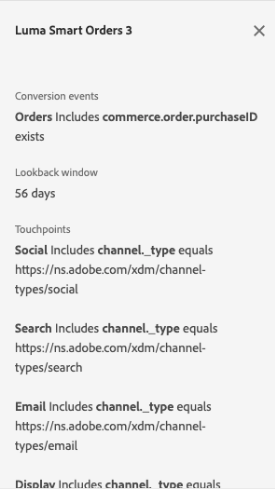

# Guia da interface do usuário do Attribution AI

O Attribution AI, como parte dos Serviços inteligentes, é um serviço de atribuição de vários canais e algoritmos que calcula a influência e o impacto incremental das interações com o cliente em relação aos resultados especificados. Com o Attribution AI, os profissionais de marketing podem medir e otimizar os gastos com marketing e publicidade, entendendo o impacto de cada interação individual com o cliente em cada fase das viagens do cliente.

Este documento é um guia para interagir com o Attribution AI na interface do usuário dos Serviços inteligentes.

## Criar uma instância

No [!DNL Adobe Experience Platform] UI, selecione **[!UICONTROL Serviços]** no painel de navegação esquerdo. O **[!UICONTROL Serviços]** é exibido e exibe os serviços Adobe inteligentes disponíveis. No contêiner do Attribution AI, selecione **[!UICONTROL Abrir]**.

The Attribution AI service page appears. This page lists service instances of Attribution AI and displays information about them, including the name of the instance, conversion events, how often the instance is run, and the status of the last update.

You can find the **[!UICONTROL Total conversion events scored]** metric located in the bottom-right side of the **[!UICONTROL Create instance]** container. Essa métrica rastreia o número total de eventos de conversão pontuados por Attribution AI no ano civil atual, incluindo todos os ambientes sandbox e quaisquer instâncias de serviço excluídas.

As instâncias de serviço podem ser editadas, clonadas e excluídas usando os controles no lado direito da interface do usuário. Para exibir esses controles, selecione uma instância do **[!UICONTROL Instâncias do serviço]**. Os controles contêm as seguintes informações:

- **[!UICONTROL Editar]**: Selecionar **[!UICONTROL Editar]** permite modificar uma instância de serviço existente. É possível editar o nome, a descrição, o status e a frequência de pontuação da instância.
- **[!UICONTROL Clonar]**: Selecionar **[!UICONTROL Clonar]** copia a instância de serviço selecionada. Em seguida, você pode modificar o workflow para fazer pequenos ajustes e renomeá-lo como uma nova instância.
- **[!UICONTROL Excluir]**: Você pode excluir uma instância de serviço, incluindo quaisquer execuções históricas.
- **[!UICONTROL Fonte de dados]**: Um link para o conjunto de dados que está sendo usado. Se mais de um conjunto de dados estiver sendo usado pelo Attribution AI, &quot;Vários&quot; seguido pelo número de conjuntos de dados será exibido. Ao selecionar o hiperlink, a janela de visualização dos conjuntos de dados é exibida.
- **[!UICONTROL Detalhes da última execução]**: Isso só é exibido quando uma execução falha. Informações sobre por que a execução falhou, como códigos de erro, são exibidas aqui.

- **[!UICONTROL Eventos de conversão]**: Uma visão geral rápida dos eventos de conversão configurados para esta instância.
- **[!UICONTROL Janela de pesquisa]**: O período definido, indicando quantos dias antes dos pontos de contato do evento de conversão foram incluídos.
- **[!UICONTROL Pontos de contato]**: Uma lista de todos os pontos de contato definidos ao criar essa instância.

Selecionar **[!UICONTROL Criar instância]** para começar.

Em seguida, a página de configuração do Attribution AI é exibida, onde você pode fornecer um nome e uma descrição opcional para a instância de serviço.

## Selecionar dados {#select-data}

<!-- https://www.adobe.com/go/aai-select-data -->

Por design, o Attribution AI pode usar os dados do Adobe Analytics, do evento de experiência e do evento de experiência do consumidor para calcular as pontuações de atribuição. Ao selecionar um conjunto de dados, somente os que são compatíveis com o Attribution AI são listados. Para selecionar um conjunto de dados, selecione o (**+**) ao lado do nome do conjunto de dados ou marque a caixa de seleção para adicionar vários conjuntos de dados ao mesmo tempo. Você também pode usar a opção de pesquisa para encontrar rapidamente os conjuntos de dados em que está interessado.

Depois de selecionar os conjuntos de dados que deseja usar, selecione o **[!UICONTROL Adicionar]** para adicionar os conjuntos de dados ao painel de visualização do conjunto de dados.

Seleção do ícone de informações  ao lado de um conjunto de dados, o abre o provedor de visualização do conjunto de dados.

A visualização do conjunto de dados contém dados como a hora da última atualização, o schema de origem e uma pré-visualização das dez primeiras colunas.

### Integridade do conjunto de dados {#dataset-completeness}

<!-- https://www.adobe.com/go/aai-dataset-completeness -->

Na visualização do conjunto de dados, há um valor percentual de integridade do conjunto de dados. Esse valor fornece um instantâneo rápido de quantas colunas do conjunto de dados estão vazias/nulas. Se um conjunto de dados contiver muitos valores ausentes e esses valores forem capturados em outro lugar, é altamente recomendável incluir o conjunto de dados que contém os valores ausentes.

>[!NOTE]
>
>A integridade do conjunto de dados é calculada usando a janela de treinamento máxima para Attribution AI (um ano). Isso significa que os dados com mais de um ano não são considerados ao exibir o valor de integridade do conjunto de dados.

### Selecionar uma identidade {#identity}

Agora é possível unir vários conjuntos de dados uns aos outros com base no mapa de identidade (campo ). Você deve selecionar um tipo de identidade (também conhecido como &quot;namespace de identidade&quot;) e um valor de identidade dentro desse namespace. Se você atribuiu mais de um campo como uma identidade dentro do esquema sob o mesmo namespace, todos os valores de identidade atribuídos serão exibidos na lista suspensa de identidade anexada pelo namespace, como `EMAIL (personalEmail.address)` ou `EMAIL (workEmail.address)`.

>[!IMPORTANT]
>
>The same identity type (namespace) must be used for every dataset you select. Uma marca de seleção verde aparece ao lado do tipo de identidade na coluna de identidade, indicando que os conjuntos de dados são compatíveis. For example, when using the Phone namespace and `mobilePhone.number` as the identifier, all identifiers for the remaining datasets must contain and use the Phone namespace.

To select an identity, select the underlined value located in the identity column. A opção selecionar um provedor de identidade é exibida.

Caso haja mais de uma identidade disponível em um namespace, selecione o campo de identidade correto para o caso de uso. Por exemplo, duas identidades de email estão disponíveis no namespace de email, um email comercial e pessoal. Dependendo do caso de uso, é mais provável que um email pessoal seja preenchido e seja mais útil em previsões individuais. This means you would select `EMAIL (personalEmail.address)` as your identity.

>[!NOTE]
>
> Se não existir nenhum tipo de identidade válido (namespace) para um conjunto de dados, você deverá definir uma identidade primária e atribuí-la a um namespace de identidade usando a variável [editor de esquema](../../xdm/schema/composition.md#identity). Para saber mais sobre namespaces e identidades, visite o [Namespaces do serviço de identidade](../../identity-service/namespaces.md) documentação.

## Mapeamento de canais de mídia e campos de campanha {#aai-mapping}

<!-- https://www.adobe.com/go/aai-mapping -->

Depois de concluir a seleção e adição de conjuntos de dados, a variável **Mapa** a etapa de configuração é exibida. O Attribution AI exige que você mapeie o campo Canal de mídia para cada conjunto de dados selecionado na etapa anterior. Isso ocorre porque, sem o mapeamento do canal de mídia entre conjuntos de dados, os insights derivados do Attribution AI podem não ser exibidos apropriadamente, dificultando a interpretação da página de insights. Embora somente o Canal de mídia seja necessário, é altamente recomendável mapear alguns dos campos opcionais, como ação de mídia, nome da campanha, grupo de campanha e tag de campanha. Isso permite que o Attribution AI forneça insights mais claros e resultados ideais.

## Definição de eventos {#define-events}

<!-- https://www.adobe.com/go/aai-define-events -->

Há três tipos diferentes de dados de entrada usados para definir eventos:

- **Eventos de conversão:** Objetivos de negócios que identificam o impacto das atividades de marketing, como pedidos de comércio eletrônico, compras na loja e visitas ao site.
- **Janela de pesquisa:** Fornece um período que indica quantos dias antes dos pontos de contato do evento de conversão devem ser incluídos.
- **Pontos de contato:** eventos de marketing de recipients, individuais e ou de cookies usados para avaliar o impacto numérico ou baseado na receita das conversões.

### Definir eventos de conversão {#define-conversion-events}

In order to define a conversion event, you need to give the event a name and select the event type by selecting the dataset and field from the **Select a dataset and field** dropdown menu.

Once an event is selected, a new dropdown appears to its right. A segunda lista suspensa é usada para fornecer mais contexto ao evento por meio do uso de operações . Para este evento de conversão, a operação padrão *existe* é usada.

>[!NOTE]
>
>Uma string abaixo de sua *nome da conversão* é atualizada à medida que você define seu evento.

Em seguida, é possível selecionar um conjunto de dados combinado que é gerado ao combinar todos os conjuntos de dados de entrada na etapa anterior. Como alternativa, você pode selecionar uma coluna com base em conjuntos de dados individuais na **Selecionar um conjunto de dados e um campo** menu suspenso.

O **[!UICONTROL Adicionar evento]** e **[!UICONTROL Adicionar grupo]** são usados para definir ainda mais sua conversão. Dependendo da conversão que você estiver definindo, talvez seja necessário usar a variável **[!UICONTROL Adicionar evento]** e **[!UICONTROL Adicionar grupo]** botões para fornecer mais contexto.

Selecionar **[!UICONTROL Adicionar evento]** O cria campos adicionais que podem ser preenchidos usando o mesmo método descrito acima. Isso adiciona uma instrução AND à definição da string abaixo do nome da conversão. Selecione o **x** para remover um evento que foi adicionado.

Selecionar **[!UICONTROL Adicionar grupo]** O oferece a opção de criar campos adicionais separados do original. Com a adição de grupos, um azul *E* é exibido. Selecionar **E** O fornece uma opção para alterar o parâmetro para conter &quot;Ou&quot;. &quot;Ou&quot; é usado para definir vários caminhos de conversão bem-sucedidos. &quot;And&quot; estende o caminho de conversão para incluir condições adicionais.

Se precisar de mais de uma conversão, selecione **Adicionar conversão** para criar um novo cartão de conversão. Você pode repetir o processo acima para definir várias conversões.

### Definir janela de pesquisa {#lookback-window}

Após terminar de definir sua conversão, você precisa confirmar sua janela de lookback. Usando as teclas de seta ou selecionando o valor padrão (56), especifique quantos dias antes do evento de conversão você deseja incluir pontos de contato. Os pontos de contato são definidos na próxima etapa.

### Definir pontos de contato

A definição de pontos de contato segue um fluxo de trabalho semelhante a [definição de conversões](#define-conversion-events). Inicialmente, é necessário nomear seu ponto de contato e selecionar um valor de ponto de contato do *Inserir Nome do Campo* menu suspenso. Depois de selecionado, a lista suspensa do operador aparece com o valor padrão &quot;exists&quot;. Selecione a lista suspensa para exibir uma lista de operadores.

Para o objetivo deste ponto de contato, selecione **igual**.

Depois que um operador para um ponto de contato é selecionado, *Inserir Valor do Campo* é disponibilizada. Os valores suspensos para *Inserir Valor do Campo* preencha com base no operador e no valor do ponto de contato selecionado anteriormente. If a value does not populate in the dropdown, you can type that value in manually. Select the dropdown and select **CLICK**.

>[!NOTE]
>
>The operators &quot;exists&quot; and &quot;not exists&quot; do not have field values associated with them.

O **Adicionar evento** e **Adicionar grupo** botões são usados para definir ainda mais o ponto de contato. Due to the complex nature surrounding touchpoints, it is not uncommon to have multiple events and groups for a single touchpoint.

Quando selecionado, **Adicionar evento** permite a adição de campos adicionais. select the **x** to remove an event that has been added.

Selecting **Add group** gives you the option to create additional fields separate from the original. Com a adição de grupos, um azul *E* é exibido. Select **And** to change the parameter, the new parameter &quot;Or&quot; is used to define multiple successful paths. Este ponto de contato específico tem apenas um caminho bem-sucedido, portanto, &quot;Ou&quot; não é necessário.

>[!NOTE]
>
>Use a string em *Nome do ponto de contato* para obter uma visão geral rápida do seu ponto de contato. Observe que a string corresponde ao nome do ponto de contato.

You can add additional touchpoints by selecting **Add touchpoint** and repeating the process above.

Once you have finished defining all necessary touchpoints, scroll up and select **Next** in the top-right corner to proceed to the final step.

## Configuração avançada de treinamento e pontuação

A página final no Attribution AI é a variável **[!UICONTROL Avançado]** página usada para configurar treinamento e pontuação.

### Agendar treinamento

Usar o *Agendar*, você pode selecionar o dia e a hora da semana em que deseja que a pontuação ocorra.

Selecione a lista suspensa em *Frequência de pontuação* para selecionar entre pontuação diária, semanal e mensal. Em seguida, selecione os dias da semana em que deseja que a pontuação ocorra. Vários dias podem ser selecionados. Selecionar o mesmo dia novamente desmarca a seleção.

Para alterar a hora do dia em que deseja que a pontuação ocorra, selecione o ícone do relógio. Na nova sobreposição exibida, insira a hora do dia em que deseja que a pontuação ocorra. Selecione fora da sobreposição para fechá-la.

>[!NOTE]
>
>Pode levar até 24 horas para que cada processo de pontuação seja concluído.

### Colunas adicionais do conjunto de dados de pontuação (opcional)

By default, a score dataset is created for each service instance in a standard schema. Você pode optar por adicionar colunas adicionais com base nas configurações de Evento de conversão e Pontos de contato à saída do conjunto de dados de pontuação. Comece selecionando colunas do seu conjunto de dados de entrada, você pode arrastá-las e soltá-las para alterar a ordem, mantendo o botão esquerdo do mouse pressionado sobre o ícone do hambúrguer.

### Region-based modeling (optional) {#region-based-modeling-optional}

Os comportamentos dos seus clientes podem diferir significativamente por país e região geográfica. Para empresas globais, usar modelos baseados em país ou em região pode aumentar a precisão da atribuição. Cada região adicionada cria um novo modelo com os dados dessa região.

Para definir uma nova região, comece selecionando **[!UICONTROL Adicionar região]**. No contêiner exibido, forneça um nome para a região. Somente um valor (&quot;placeContext.geo.countryCode&quot;) é preenchido a partir da variável **[!UICONTROL Inserir Nome do Campo]** lista suspensa. Selecione este valor.

Em seguida, selecione um operador.

Por fim, digite o código do país na variável **[!UICONTROL Inserir Valor do Campo]** lista suspensa.

>[!NOTE]
>
>Os códigos de país têm dois caracteres. Uma lista completa pode ser encontrada aqui [ISO 3166-1 alfa-2](https://datahub.io/core/country-list).

### Janela de treinamento {#training-window}

Para garantir que você obtenha o modelo mais preciso possível, é importante treinar o modelo com dados históricos que representem sua empresa. Por padrão, o modelo é treinado usando 2 trimestres (6 meses) de dados de eventos de conversão. Selecione a lista suspensa para alterar o padrão. Você pode optar por treinar com um ou quatro trimestres dos dados (de 3 a 12 meses).

>[!NOTE]
>
>Uma janela de treinamento mais curta é mais sensível às tendências recentes, enquanto uma janela de treinamento mais longa cria um modelo mais robusto e é menos sensível às tendências recentes.

Depois de selecionar sua janela de treinamento, selecione **[!UICONTROL Concluir]** no canto superior direito. Permita que os dados sejam processados por algum tempo. Uma vez concluída, uma caixa de diálogo de instância é exibida, confirmando que a configuração da instância foi concluída. Selecionar **[!UICONTROL Ok]** para ser redirecionado para o **[!UICONTROL Instâncias do serviço]** onde você pode ver a instância do serviço.

## Próximas etapas

Ao seguir este tutorial, você criou com êxito uma instância de serviço no Attribution AI. Quando a instância terminar de pontuar (aguarde até 24 horas), você estará pronto para [insights do discover Attribution AI](./discover-insights.md). Além disso, se desejar baixar os resultados da pontuação, visite a [download de pontuações](./download-scores.md) documentação.

## Recursos adicionais

The following video outlines an end-to-end workflow for creating a new instance in Attribution AI.

>[!VIDEO](https://video.tv.adobe.com/v/32668?learn=on&quality=12)
