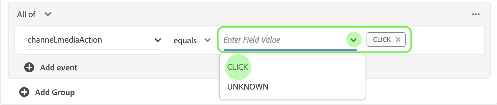

# Guia do usuário do Attribution AI

Attribution AI, como parte dos Serviços inteligentes, é um serviço de atribuição de vários canais, algorítmico, que calcula a influência e o impacto incremental das interações do cliente em relação aos resultados especificados. Com o Attribution AI, os profissionais de marketing podem medir e otimizar os gastos com marketing e publicidade, entendendo o impacto de cada interação individual do cliente em cada fase das viagens do cliente.

Este documento serve como um guia para interagir com o Attribution AI na interface do usuário do Intelligent Services.

## Criar uma instância

Na [!DNL Adobe Experience Platform] interface do usuário, clique em **Serviços** na navegação à esquerda. O navegador *Serviços* é exibido e exibe os serviços inteligentes Adobe disponíveis. No container para Attribution AI, clique em **Abrir**.

A página de serviço do Attribution AI é exibida. Esta página lista as instâncias de serviço do Attribution AI e exibe informações sobre elas, incluindo o nome da instância, os eventos de conversão, a frequência de execução da instância e o status da última atualização. Clique em **Criar instância** para começar.

Em seguida, a página de configuração do Attribution AI é exibida, onde você pode fornecer informações básicas e especificar um conjunto de dados para a instância.

### Nomeie a instância

Em Informações ** básicas, forneça um nome e uma descrição opcional para a sua instância de serviço.

### Selecionar um conjunto de dados

Depois de preencher as informações básicas, clique na lista suspensa **Selecionar conjunto de dados** para selecionar seu conjunto de dados. O conjunto de dados é usado para treinar o modelo e pontuar os dados subsequentes que ele produz. Ao selecionar um conjunto de dados no seletor suspenso, somente os que são compatíveis com o Attribution AI e estão em conformidade com o schema do Experience Data Model (XDM) são listados. Depois que um conjunto de dados for escolhido, clique em **Avançar** no canto superior direito para prosseguir para a página de definição de eventos.

## Definindo eventos

Há três tipos diferentes de dados de entrada usados para definir eventos:

- **eventos de conversão:** Objetivos de negócios que identificam o impacto das atividades de marketing, como pedidos de comércio eletrônico, compras na loja e visitas ao site.
- **Janela de pesquisa:** Fornece um período que indica quantos dias antes dos pontos de contato do evento de conversão devem ser incluídos.
- **Pontos de contato:** eventos de marketing com nível de recipient, indivíduo ou cookie usados para avaliar o impacto numérico ou baseado em receita das conversões.

### Definir eventos de conversão {#define-conversion-events}

Para definir um evento de conversão, é necessário dar um nome ao evento e selecioná-lo clicando no menu suspenso **Inserir nome** do campo.

Quando um evento é selecionado, uma nova lista suspensa é exibida à direita. O segundo menu suspenso é usado para fornecer mais contexto ao seu evento por meio do uso de operações. Para esse evento de conversão, a operação padrão *existe* é usada.

>[!NOTE]
>
>Uma string sob seu nome *de* conversão é atualizada conforme você define seu evento.

Os botões *Adicionar evento* e *Adicionar grupo* são usados para definir ainda mais sua conversão. Dependendo da conversão que você estiver definindo, talvez seja necessário usar os botões *Adicionar evento* e *Adicionar grupo* para fornecer mais contexto.

Clicar em **Adicionar evento** cria campos adicionais que podem ser preenchidos usando o mesmo método descrito acima. Isso adiciona uma instrução *AND* à definição da string abaixo do nome *da* conversão. Clique no **x** para remover um evento que foi adicionado.

Clicar em **Adicionar grupo** dá a opção de criar campos adicionais separados do original. Com a adição de grupos, um botão azul *E* é exibido. Clicar em **E** oferece uma opção para alterar o parâmetro para conter &quot;Ou&quot;. &quot;Ou&quot; é usado para definir vários caminhos de conversão bem-sucedidos. &quot;E&quot; estende o caminho de conversão para incluir condições adicionais.

Se você precisar de mais de uma conversão, clique em **Adicionar conversão** para criar um novo cartão de conversão. Você pode repetir o processo acima para definir várias conversões.

### Definir janela de pesquisa

Depois de terminar de definir a conversão, é necessário confirmar a janela de pesquisa. Usando as teclas de seta ou clicando no valor padrão (56), especifique quantos dias antes do evento de conversão você deseja incluir pontos de contato. Os pontos de contato são definidos na próxima etapa.

### Definir pontos de contato

A definição de pontos de contato segue um fluxo de trabalho semelhante à [definição de conversões](#define-conversion-events). Inicialmente, é necessário nomear seu ponto de contato e selecionar um valor de ponto de contato no menu suspenso *Inserir nome* do campo. Depois de selecionado, a lista suspensa operador é exibida com o valor padrão &quot;existe&quot;. Clique na lista suspensa para exibir uma lista de operadores.

Para a finalidade desse ponto de contato, selecione **igual**.

Quando um operador para um ponto de contato é selecionado, *Inserir valor* do campo é disponibilizado. Os valores suspensos para *Inserir valor* do campo são preenchidos com base no operador e no valor do ponto de contato selecionado anteriormente. Se um valor não for preenchido na lista suspensa, você poderá digitar esse valor manualmente. Clique na lista suspensa e selecione **CLIQUE**.

>[!NOTE]
>
>Os operadores &quot;existe&quot; e &quot;não existe&quot; não têm valores de campo associados a eles.

Os botões *Adicionar evento* e *Adicionar grupo* são usados para definir ainda mais seu ponto de contato. Devido à natureza complexa que envolve pontos de contato, não é incomum ter vários eventos e grupos para um único ponto de contato.

Quando clicado, **Adicionar evento** permite que campos adicionais sejam adicionados. Clique no **x** para remover um evento que foi adicionado.

Clicar em **Adicionar grupo** oferece a opção de criar campos adicionais separados do original. Com a adição de grupos, um botão azul *E* é exibido. Clique em **E** para alterar o parâmetro, o novo parâmetro &quot;Ou&quot; é usado para definir vários caminhos bem-sucedidos. Este ponto de contato específico tem apenas um caminho bem-sucedido, portanto &quot;Ou&quot; não é necessário.

>[!NOTE]
>
>Use a string em Nome *do ponto de* contato para obter uma visão geral rápida do ponto de contato. Observe que a string corresponde ao nome do ponto de contato.

Você pode adicionar outros pontos de contato clicando em **Adicionar ponto de contato** e repetindo o processo acima.

Quando terminar de definir todos os pontos de contato necessários, role para cima e clique em **Avançar** no canto superior direito para prosseguir para a etapa final.

## Configuração avançada de treinamento e pontuação

A página final no Attribution AI é a página *Avançado* usada para configurar treinamento e pontuação.

### Agendar treinamento

Usando o *Agendamento*, você pode selecionar um dia e hora da semana em que deseja que a pontuação ocorra.

Clique na lista suspensa em Frequência *de* pontuação para selecionar entre pontuação diária, semanal e mensal. Em seguida, selecione os dias da semana em que deseja que a pontuação ocorra. Vários dias podem ser selecionados. Clique em um dia pela segunda vez para desmarcá-lo.

Para alterar a hora do dia em que deseja que a pontuação ocorra, clique no ícone do relógio. Na nova sobreposição exibida, digite a hora do dia em que deseja que a pontuação ocorra. Clique fora da sobreposição para fechá-la.

>[!NOTE]
>
>Pode levar até 24 horas para que cada processo de pontuação seja concluído.

### Modelagem com base na região (opcional) {#region-based-modeling-optional}

Os comportamentos de seus clientes podem diferir significativamente por país e região geográfica. Para empresas globais, o uso de modelos baseados em país ou em região pode aumentar a precisão da atribuição. Cada região adicionada cria um novo modelo com os dados dessa região.

Para definir uma nova região, start clicando em **Adicionar região**. No container exibido, forneça um nome para a região. Somente um valor (&quot;placeContext.geo.countryCode&quot;) é preenchido na lista suspensa *Inserir nome* do campo. Selecione este valor.

Em seguida, selecione um operador.

Por fim, digite o código do país na lista suspensa *Inserir valor* do campo.

>[!NOTE]
>
>Os códigos de país têm dois caracteres. Uma lista completa pode ser encontrada aqui [ISO 3166-1 alfa-2](https://datahub.io/core/country-list).

### Janela de treinamento

Para garantir que você obtenha o modelo mais preciso possível, é importante treinar seu modelo com dados históricos que representem sua empresa. Por padrão, o modelo é treinado com 2 trimestres (6 meses) de dados. Selecione a lista suspensa para alterar o padrão. Você pode optar por treinar com um a quatro trimestres de dados (de 3 a 12 meses).

>[!NOTE]
>
>Uma janela de treinamento mais curta é mais sensível às tendências recentes, enquanto uma janela de treinamento mais longa cria um modelo mais robusto e é menos sensível às tendências recentes.

Depois de selecionar sua janela de treinamento, clique em **Concluir** no canto superior direito. Aguarde até que os dados sejam processados. Após a conclusão, uma caixa de diálogo pop-up será exibida confirmando que a configuração da instância foi concluída. Clique em **Ok** para ser redirecionado para a página de instâncias *de* serviço onde você pode ver sua instância de serviço.

## Próximas etapas

Ao seguir este tutorial, você criou com êxito uma instância de serviço no Attribution AI. Quando a instância terminar de marcar (aguarde até 24 horas), você estará pronto para [descobrir insights](./discover-insights.md)do Attribution AI. Além disso, se desejar baixar os resultados da pontuação, visite a documentação de [download das pontuações](./download-scores.md) brutas.

## Recursos adicionais

O vídeo a seguir descreve um fluxo de trabalho completo para a criação de uma nova instância no Attribution AI.

>[!VIDEO](https://video.tv.adobe.com/v/32668?learn=on&quality=12)