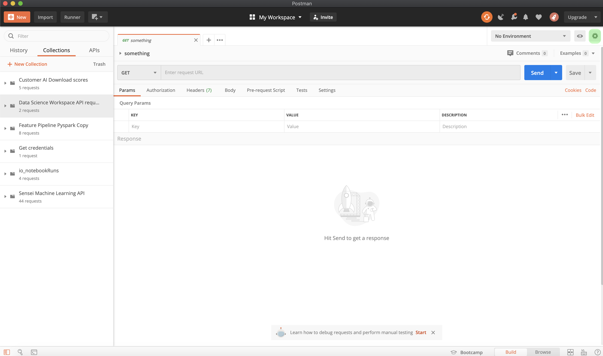

# Introdução ao AI de conteúdo e comércio

>[!NOTE]
>
>A API de conteúdo e comércio está em beta. A documentação está sujeita a alterações.

[!DNL Content and Commerce AI] utiliza APIs da Adobe I/O. Para fazer chamadas para as APIs da Adobe I/O e a integração do console de E/S, você deve primeiro concluir o [tutorial de autenticação](https://www.adobe.com/go/platform-api-authentication-en).

No entanto, quando você chega à etapa **Adicionar API**, a API está localizada em Experience Cloud em vez de Adobe Experience Platform, como mostrado na seguinte captura de tela:

A conclusão do tutorial de autenticação fornece os valores para cada um dos cabeçalhos necessários em todas as chamadas à API do Adobe I/O, como mostrado abaixo:

- `Authorization: Bearer {ACCESS_TOKEN}`
- `x-api-key: {API_KEY}`
- `x-gw-ims-org-id: {IMS_ORG}`

## Criar um ambiente Postman (opcional)

Depois de configurar seu projeto e a API no Console do desenvolvedor do Adobe, você tem a opção de baixar um arquivo de ambiente para o Postman. Em **[!UICONTROL APIs]** no painel esquerdo do seu projeto, selecione **[!UICONTROL AI de conteúdo e comércio]**. Uma nova guia é aberta, contendo um cartão rotulado como &quot;[!DNL Try it out]&quot;. Selecione **Baixar para Postman** para baixar um arquivo JSON usado para configurar seu ambiente postman.

Depois de baixar o arquivo, abra o Postman e selecione o ícone **engrenagem** no canto superior direito para abrir a caixa de diálogo **gerenciar ambientes**.

Em seguida, selecione **Importar** na caixa de diálogo **Gerenciar ambientes**.

Você é redirecionado e é solicitado a selecionar um arquivo de ambiente do computador. Selecione o arquivo JSON que você baixou anteriormente e selecione **Abrir** para carregar o ambiente.

Você é redirecionado para a guia *Gerenciar ambientes* com um novo nome de ambiente preenchido. Selecione o nome do ambiente a ser visualização e edite as variáveis disponíveis no Postman. Você ainda precisa preencher manualmente `JWT_TOKEN` e `ACCESS_TOKEN`. Esses valores devem ter sido obtidos ao concluir o tutorial de autenticação .

Após a conclusão, suas variáveis devem se parecer com a captura de tela abaixo. Selecione **Atualizar** para concluir a configuração do ambiente.

Agora você pode selecionar seu ambiente no menu suspenso no canto superior direito e preencher automaticamente quaisquer valores salvos. Basta reeditar os valores a qualquer momento para atualizar todas as suas chamadas de API.

Para obter mais informações sobre como trabalhar com APIs da Adobe I/O usando o Postman, consulte a publicação Média em [usando o Postman para autenticação JWT no Adobe I/O](https://medium.com/adobetech/using-postman-for-jwt-authentication-on-adobe-i-o-7573428ffe7f).

## Lendo chamadas de exemplo da API

Este guia fornece exemplos de chamadas de API para demonstrar como formatar suas solicitações. Isso inclui caminhos, cabeçalhos necessários e cargas de solicitação formatadas corretamente. O JSON de amostra retornado em respostas de API também é fornecido. Para obter informações sobre as convenções usadas na documentação para chamadas de API de amostra, consulte a seção em [como ler chamadas de API de exemplo](../../landing/troubleshooting.md) no guia de solução de problemas do Experience Platform.

## Próximas etapas {#next-steps}

Depois de ter todas as suas credenciais, você estará pronto para configurar um funcionário personalizado para [!DNL Content and Commerce AI]. Os documentos a seguir ajudam a entender a estrutura de extensibilidade e a configuração do ambiente.

Para saber mais sobre a Estrutura de extensibilidade, leia a introdução [ao documento extensibility](https://docs.adobe.com/content/help/en/asset-compute/using/extend/understand-extensibility.html). Este documento descreve os pré-requisitos e os requisitos de provisionamento.

Para saber mais sobre como configurar um ambiente para [!DNL Content and Commerce AI], start lendo o guia para [configurar um ambiente de desenvolvedor](https://docs.adobe.com/content/help/en/asset-compute/using/extend/setup-environment.html). Este documento fornece instruções de configuração que permitem que você se desenvolva para o Serviço de Asset computes.