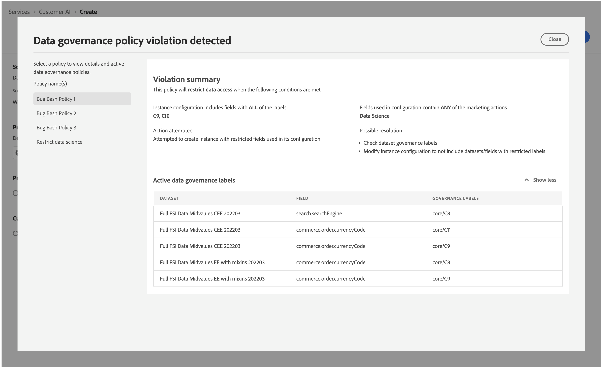

# Políticas de governança

Após concluir o fluxo de trabalho para criar um modelo e enviar a configuração dele, a variável [aplicação de políticas](/help/data-governance/enforcement/auto-enforcement.md) verifica se há violações. Se ocorrer uma violação de política, será exibido um popover indicando que uma ou mais políticas foram violadas. Isso garante que suas operações de dados e ações de marketing na Platform estejam em conformidade com as políticas de uso de dados.

.

O popover fornece informações específicas sobre a violação. Você pode resolver essas violações por meio de configurações de política e outras medidas que não estejam diretamente relacionadas ao fluxo de trabalho de configuração. Por exemplo, você pode alterar os rótulos para que determinados campos possam ser usados para fins de ciência de dados. Como alternativa, você também pode modificar a própria configuração do modelo para que ela não use nada com um rótulo. Consulte a documentação para saber mais sobre como configurar [políticas](/help/data-governance/policies/overview.md).