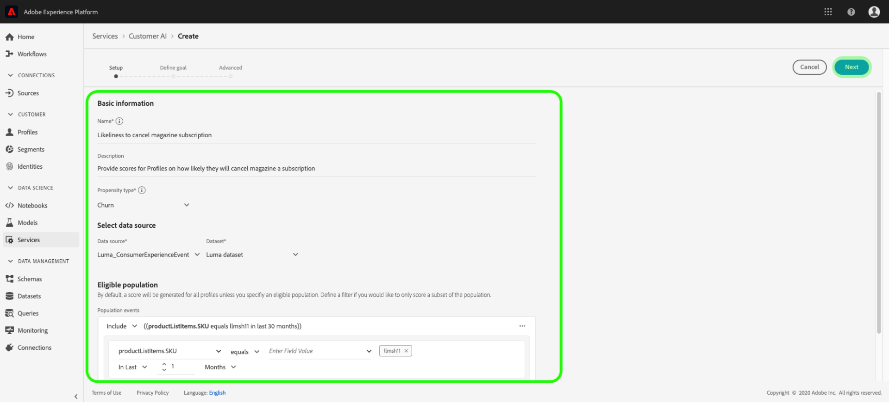

# Guia do usuário da IA do cliente

A IA do cliente, como parte dos Serviços inteligentes, permite que você gere pontuações de propensão personalizadas sem precisar se preocupar com o aprendizado da máquina.

Este guia aborda as etapas para trabalhar com a IA do cliente. As etapas são fornecidas para os seguintes tópicos:

* [Configurar uma instância](#configure-an-instance)
* [Criar segmentos de clientes com pontuações previstas](#create-customer-segments-with-predicted-scores)

Além disso, o apêndice deste tutorial fornece informações sobre a [saída da IA](#customer-ai-output-data)do cliente.

## Configurar uma instância

Os Serviços inteligentes fornecem IA do cliente como um serviço Adobe Sensei simples de usar que pode ser configurado para diferentes casos de uso. As seções a seguir fornecem etapas para configurar uma instância da API do cliente.

### Configurar sua instância

Na interface do usuário da plataforma, clique em **Serviços** no painel de navegação esquerdo. O navegador **Serviços** é exibido e exibe todos os serviços disponíveis à sua disposição. No container para API do cliente, clique em **Abrir**.

A tela *Customer AI* (AI do cliente) exibe todas as instâncias existentes do Customer AI. Clique em **Criar instância**.

O fluxo de trabalho de criação da instância é exibido, começando na etapa *Configuração* .

Abaixo estão informações importantes sobre valores que devem ser fornecidos à instância com:

* O nome da instância será usado em todos os locais onde a pontuação da AI do cliente for exibida. Assim, os nomes devem descrever o que as pontuações de previsão representam, por exemplo, &quot;Probabilidade de cancelar a subscrição de revistas&quot;.

* O tipo de propensão determina a intenção da pontuação e da polaridade da métrica. Você pode escolher **Churn** ou **Conversion**. Consulte a nota em [um resumo](./discover-insights.md#scoring-summary) de pontuação no documento de insights de descoberta para obter mais informações sobre como o tipo de propensão afeta sua instância.

* A fonte de dados é o local onde os dados estão localizados. Conjunto de dados é o conjunto de dados de entrada usado para prever pontuações. Por padrão, a IA do cliente usa os dados do Evento da experiência do consumidor para calcular as pontuações de propensão. Ao selecionar um conjunto de dados no seletor suspenso, somente os que são compatíveis com a IA do cliente são listados.

* Por padrão, as pontuações de propensão são geradas para todos os perfis, a menos que uma população qualificada seja especificada. Você pode especificar uma população qualificada definindo condições para incluir ou excluir perfis com base em eventos.

Forneça os valores necessários e clique em **Avançar**.

### Definir uma meta

A etapa *Definir meta* é exibida e fornece um ambiente interativo para que você defina visualmente uma meta. Uma meta é composta de um ou mais eventos, nos quais cada ocorrência de evento é baseada na condição que contém. O objetivo de uma instância da API do cliente é determinar a probabilidade de atingir sua meta dentro de um determinado intervalo de tempo.

Clique em **Inserir nome** do campo e selecione um campo na lista suspensa. Clique na segunda entrada e selecione uma cláusula para a condição do evento, em seguida, forneça o valor do público alvo para concluir o evento. eventos adicionais podem ser configurados clicando em **Adicionar evento**. Por fim, conclua a meta aplicando um período de previsão em número de dias e clique em **Avançar**.

### Configurar um agendamento *(opcional)*

A etapa *avançada* é exibida. Esta etapa opcional permite configurar uma programação para automatizar execuções de previsão, definir exclusões de previsão para filtrar determinados eventos ou clicar em **Concluir** se nada for necessário.

Configure um agendamento de pontuação configurando a Frequência *de* Pontuação. As execuções de previsão automatizadas podem ser programadas para serem executadas semanalmente ou mensalmente.

Abaixo da configuração da programação, você pode definir exclusões de previsão para impedir que eventos que atendem a determinadas condições sejam avaliados ao gerar pontuações. Este recurso pode ser usado para filtrar entradas de dados irrelevantes.

Para excluir determinados eventos, clique em **Adicionar exclusão** e defina o evento da mesma forma que a meta é definida. Para remover uma exclusão, clique nas elipses (**...**) na parte superior direita do container do evento e clique em **Remover Container**.

Exclua eventos conforme necessário e clique em **Concluir** para criar a instância.

Se a instância for criada com êxito, uma execução de previsão será acionada imediatamente e as execuções subsequentes serão executadas de acordo com a programação definida.

>[!NOTE] Dependendo do tamanho dos dados de entrada, as execuções de previsão podem levar até 24 horas para serem concluídas.

Ao seguir esta seção, você configurou uma instância do AI do cliente e uma execução de previsão foi executada. Após a conclusão bem-sucedida da execução, insights pontuados preenchem automaticamente perfis com pontuações previstas. Aguarde até 24 horas antes de continuar com a próxima seção deste tutorial.

## Criar segmentos de clientes com pontuações previstas

Quando uma execução de previsão é concluída, as pontuações de propensão previstas são automaticamente consumidas pelos Perfis. Enriquecendo Perfis com pontuações de AI do cliente permite que a criação de segmentos do cliente localize audiências com base em suas pontuações de propensão. Esta seção fornece etapas para a criação de segmentos usando o Construtor de segmentos. Para obter um tutorial mais robusto sobre a criação de segmentos, consulte o guia [do usuário do Construtor de](../../segmentation/tutorials/create-a-segment.md)segmentos.

>[!IMPORTANT] Para utilizar esse método, o Perfil do cliente em tempo real precisa estar habilitado para o conjunto de dados.

Na interface do usuário da plataforma, clique em **Segmentos** no painel de navegação esquerdo e clique em **Criar segmento**.

O Construtor *de segmentos* é exibido. Na coluna *Campos* à esquerda e na guia *Atributos* , clique na pasta chamada Perfil **individual** XDM e clique na pasta com a namespace de sua organização. A pasta chamada AI **do** cliente contém os resultados de execuções de previsão e são nomeados após a instância à qual as pontuações pertencem. Clique em uma pasta de instância para acessar os resultados da instância desejada.

Localizado no centro do Construtor de segmentos, arraste e solte o atributo **Pontuação** na tela *do construtor de* regras para definir uma regra.

Na coluna de propriedades *do* segmento à direita, forneça um nome para o segmento.

Acima da coluna *Campos* à esquerda, clique no ícone de **engrenagem** e selecione uma política **de** mesclagem. Click **Save** to create the segment.

## Próximas etapas

Ao seguir este tutorial, você configurou com êxito uma instância da AI do cliente, gerou pontuações de propensão e encontrou audiências com base em suas pontuações de propensão usando o Construtor de segmentos. Agora você pode público alvo suas audiências ativando-as para destinos. Consulte a visão geral [de](https://docs.adobe.com/content/help/en/experience-platform/rtcdp/destinations/destinations-overview.html) destinos para obter mais informações.

## Apêndice

A seção a seguir fornece informações adicionais sobre a saída da IA do cliente.

### Dados de saída da IA do cliente

A IA do cliente gera vários atributos para perfis individuais considerados elegíveis. Esses valores são consumidos pelo Perfil do cliente em tempo real, que pode ser usado para criar e definir segmentos. A tabela abaixo descreve os vários atributos encontrados na saída da IA do cliente:

| Atributo | Descrição |
| ----- | ----------- |
| Pontuação | A probabilidade relativa de um cliente atingir a meta prevista dentro do intervalo de tempo definido. Este valor não deve ser considerado como uma percentagem de probabilidade, mas sim a probabilidade de um indivíduo em comparação com a população global. Essa pontuação varia de 0 a 100. |
| Probabilidade | Este atributo é a real probabilidade de um perfil alcançar a meta prevista dentro do intervalo de tempo definido. Ao comparar resultados em diferentes metas, é recomendável considerar a probabilidade em relação ao percentil ou à pontuação. A probabilidade deve ser sempre utilizada para determinar a probabilidade média na população elegível, uma vez que a probabilidade tende a estar no lado inferior para eventos que não ocorrem com frequência. Valores para o intervalo de probabilidade entre 0 e 1. |
| Percentil | Esse valor fornece informações relacionadas ao desempenho de um perfil em relação a outros perfis com pontuação semelhante. Por exemplo, um perfil com uma classificação de percentil de 99 para churn indica que ele está com um risco maior de churning em comparação com 99% de todos os outros perfis que foram pontuados. Os percentis variam de 1 a 100. |
| Tipo de propensão | O tipo de propensão selecionado. |
| Data da pontuação | A data em que a pontuação ocorreu. |
| Fatores influentes | Motivos previstos para o motivo pelo qual um perfil é susceptível de converter ou gerar uma taxa. Os fatores são constituídos pelos seguintes atributos:<ul><li>Código: O atributo perfil ou comportamental que influencia positivamente a pontuação prevista de um perfil. </li><li>Valor: O valor do perfil ou do atributo comportamental.</li><li>Importância: Indica o peso do perfil ou do atributo comportamental na pontuação prevista (baixa, média, alta)</li></ul> |