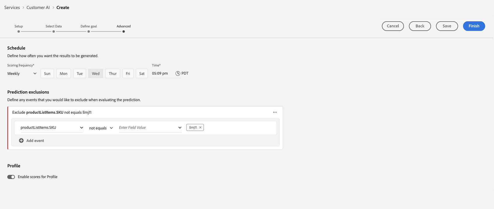

# Configurar uma instância da IA do cliente

A IA do cliente, como parte dos Serviços de IA/ML, permite gerar pontuações de propensão personalizadas sem precisar se preocupar com o aprendizado de máquina.

Os Serviços de IA/ML fornecem IA do cliente como um serviço da Adobe Sensei simples de usar que pode ser configurado para casos de uso diferentes. As seções a seguir fornecem etapas para configurar uma instância da IA do cliente.

## Criar uma instância {#set-up-your-instance}

Na interface do usuário da Platform, selecione **[!UICONTROL Serviços]** no painel de navegação esquerdo. A variável **[!UICONTROL Serviços]** e exibe todos os serviços disponíveis à sua disposição. No contêiner da IA do cliente, selecione **[!UICONTROL Abertura]**.

A variável **IA do cliente** A interface do usuário é exibida e mostra todas as instâncias de serviço.

- Você pode encontrar o **[!UICONTROL Total de perfis pontuados]** localizada no lado inferior direito da variável **[!UICONTROL Criar instância]** recipiente. Essa métrica rastreia o número total de perfis pontuados pela IA do cliente no ano civil atual, incluindo todos os ambientes de sandbox e todas as instâncias de serviço excluídas.

As instâncias de serviço podem ser editadas, clonadas e excluídas usando os controles no lado direito da interface. Para exibir esses controles, selecione uma instância em seu **[!UICONTROL Instâncias de serviço]**. Os controles contêm o seguinte:

- **[!UICONTROL Editar]**: Seleção **[!UICONTROL Editar]** permite modificar uma instância de serviço existente. É possível editar o nome, a descrição e a frequência de pontuação da instância.
- **[!UICONTROL Clonar]**: Seleção **[!UICONTROL Clonar]** copia a configuração da instância de serviço selecionada no momento. Em seguida, você pode modificar o fluxo de trabalho para fazer pequenos ajustes e renomeá-lo como uma nova instância.
- **[!UICONTROL Excluir]**: é possível excluir uma instância de serviço, incluindo quaisquer execuções históricas. O conjunto de dados de saída correspondente será excluído da Platform. No entanto, as pontuações que foram sincronizadas com o Perfil do cliente em tempo real não são excluídas.
- **[!UICONTROL Fonte de dados]**: um link para o conjunto de dados usado por essa instância. Se vários conjuntos de dados estiverem sendo usados, selecionar o texto do hiperlink abrirá o popover de visualização do conjunto de dados.
- **[!UICONTROL Detalhes da última execução]**: exibido somente quando uma execução falha. As informações sobre por que a execução falhou, como códigos de erro, são exibidas aqui.
- **[!UICONTROL Definição de pontuação]**: uma visão geral rápida da meta configurada para essa instância.

Para criar uma nova instância, selecione **[!UICONTROL Criar instância]**.

## Configurar

O workflow de criação da instância é exibido, começando no **[!UICONTROL Configurar]** etapa.

Abaixo estão informações importantes sobre valores que você deve fornecer à instância com:

- **[!UICONTROL Nome]:** O nome da instância é usado em todos os locais em que as pontuações da IA do cliente são exibidas. Portanto, os nomes devem descrever o que as pontuações de previsão representam. Por exemplo, &quot;Probabilidade de cancelamento da assinatura de uma revista&quot;.

- **[!UICONTROL Descrição]:** Uma descrição indicando o que você está tentando prever.

- **[!UICONTROL Tipo de propensão]:** O tipo de propensão determina a intenção da pontuação e a polaridade da métrica. Você pode escolher **[!UICONTROL Churn]** ou **[!UICONTROL Conversão]**. Consulte a nota em [resumo de pontuação](./discover-insights.md#scoring-summary) no documento descoberta de insights para obter mais informações sobre como o tipo de propensão afeta sua instância.

Forneça os valores necessários e selecione **[!UICONTROL Próxima]** para continuar.

## Selecionar dados {#select-data}

Por design, a IA do cliente usa Adobe Analytics, Adobe Audience Manager, Eventos de experiência em geral e dados de Eventos de experiência do consumidor para calcular as pontuações de propensão. Ao selecionar um conjunto de dados, somente os compatíveis com a IA do cliente são listados. Para selecionar um conjunto de dados, selecione o (**+**) ao lado do nome do conjunto de dados ou marque a caixa de seleção para adicionar vários conjuntos de dados de uma só vez. Use a opção de pesquisa para encontrar rapidamente os conjuntos de dados em que você está interessado.

Após selecionar os conjuntos de dados que deseja usar, selecione a variável **[!UICONTROL Adicionar]** botão para adicionar os conjuntos de dados ao painel de visualização do conjunto de dados.

Selecionar o ícone de informações  ao lado do conjunto de dados, abre o popover visualização do conjunto de dados.

A visualização do conjunto de dados contém dados como o tempo da última atualização, o esquema de origem e uma visualização das primeiras dez colunas.

Selecionar **[!UICONTROL Salvar]** para salvar os rascunhos à medida que se movem pelo fluxo de trabalho. Você também pode salvar configurações de modelo de rascunho e ir para a próxima etapa do fluxo de trabalho. Uso **[!UICONTROL Salvar e continuar]** para criar e salvar rascunhos durante as configurações do modelo. O recurso permite criar e salvar rascunhos da configuração do modelo e é particularmente útil quando é necessário definir muitos campos no fluxo de trabalho de configuração.

### Integridade do conjunto de dados {#dataset-completeness}

Há um valor percentual de integridade do conjunto de dados na visualização do conjunto de dados. Esse valor fornece um instantâneo rápido de quantas colunas em seu conjunto de dados estão vazias/nulas. Se um conjunto de dados contiver muitos valores ausentes e esses valores forem capturados em outro lugar, é altamente recomendável incluir o conjunto de dados que contém os valores ausentes. Neste exemplo, a ID de pessoa está vazia, no entanto, a ID de pessoa é capturada em um conjunto de dados separado que pode ser incluído.

>[!NOTE]
>
>A integridade do conjunto de dados é calculada usando a janela máxima de treinamento para a IA do cliente (um ano). Isso significa que os dados com mais de um ano não são considerados ao exibir o valor de integridade do conjunto de dados.

### Selecionar uma identidade {#identity}

Agora é possível unir vários conjuntos de dados uns aos outros com base no mapa de identidade (campo). Você deve selecionar um tipo de identidade (também conhecido como &quot;namespace de identidade&quot;) e um valor de identidade dentro desse namespace. Se você tiver atribuído mais de um campo como uma identidade no esquema no mesmo namespace, todos os valores de identidade atribuídos serão exibidos na lista suspensa de identidades anexada ao namespace, como `EMAIL (personalEmail.address)` ou `EMAIL (workEmail.address)`.

[selecionar o mesmo namespace](../images/user-guide/cai-identity-map.png)

>[!IMPORTANT]
>
>O mesmo tipo de identidade (namespace) deve ser usado para cada conjunto de dados selecionado. Uma marca de seleção verde é exibida ao lado do tipo de identidade na coluna identidade, indicando que os conjuntos de dados são compatíveis. Por exemplo, ao usar o namespace do telefone e `mobilePhone.number` como o identificador, todos os identificadores dos conjuntos de dados restantes devem conter e usar o namespace do telefone.

Para selecionar uma identidade, selecione o valor sublinhado localizado na coluna de identidade. O popover Selecionar uma identidade é exibido.

<!--  -->
[selecionar o mesmo namespace](../images/user-guide/cai-identity-namespace.png)

Caso haja mais de uma identidade disponível em um namespace, selecione o campo de identidade correto para seu caso de uso. Por exemplo, duas identidades de email estão disponíveis no namespace de email: um email comercial e pessoal. Dependendo do caso de uso, um email pessoal tem mais probabilidade de ser preenchido e ser mais útil em previsões individuais. Isso significa que `EMAIL (personalEmail.address)` será selecionada como a identidade.

>[!NOTE]
>
> Se não existir um tipo de identidade (namespace) válido para um conjunto de dados, você deverá definir uma identidade primária e atribuí-la a um namespace de identidade usando o [editor de esquema](../../../xdm/schema/composition.md#identity). Para saber mais sobre namespaces e identidades, visite o [Namespaces do serviço de identidade](../../../identity-service/features/namespaces.md) documentação.

## Definir meta {#define-a-goal}

<!-- https://www.adobe.com/go/cai-define-a-goal -->

A variável **[!UICONTROL Definir meta]** A etapa é exibida e fornece um ambiente interativo para que você defina visualmente uma meta de previsão. Uma meta é composta por um ou mais eventos, em que a ocorrência de cada evento é baseada na condição que mantém. O objetivo de uma instância da IA do cliente é determinar a probabilidade de atingir sua meta em um determinado período de tempo.

Para criar uma meta, selecione **[!UICONTROL Inserir nome do campo]** e seguido por um campo na lista suspensa. Selecione a segunda entrada, uma cláusula para a condição do evento e, opcionalmente, forneça o valor de destino para concluir o evento. Eventos adicionais podem ser configurados selecionando **[!UICONTROL Adicionar evento]**. Por último, conclua a meta aplicando um período de previsão em número de dias e, em seguida, selecione **[!UICONTROL Próxima]**.

<!--  -->

### Ocorrerá e não ocorrerá

Ao definir sua meta, é possível selecionar **[!UICONTROL Ocorrerá]** ou **[!UICONTROL Não ocorrerá]**. Selecionar **[!UICONTROL Ocorrerá]** significa que as condições do evento definidas precisam ser atendidas para que os dados do evento de um cliente sejam incluídos na interface do insights.

Por exemplo, se você deseja configurar um aplicativo para prever se um cliente fará uma compra, é possível selecionar **[!UICONTROL Ocorrerá]** seguido por **[!UICONTROL Todos de]** e insira **commerce.purchases.id** (ou um campo semelhante) e **[!UICONTROL existe]** como operador.

<!--  -->

No entanto, pode haver casos em que você esteja interessado em prever se algum evento não ocorrerá em um determinado período. Para configurar uma meta com esta opção, selecione **[!UICONTROL Não ocorrerá]** na lista suspensa de nível superior.

Por exemplo, se você estiver interessado em prever quais clientes se tornam menos engajados e não visitar a página de logon da conta no mês seguinte. Selecionar **[!UICONTROL Não ocorrerá]** seguido por **[!UICONTROL Todos de]** e insira **web.webInteraction.URL** (ou um campo semelhante) e **[!UICONTROL igual a]** como operador com **account-login** como o valor.

### Todos os e qualquer um de

Em alguns casos, você pode querer prever se uma combinação de eventos ocorrerá e, em outros casos, pode querer prever a ocorrência de qualquer evento de um conjunto predefinido. Para prever se um cliente terá uma combinação de eventos, selecione a variável **[!UICONTROL Todos de]** no menu suspenso de segundo nível na guia **[!UICONTROL Definir objetivo]** página.

Por exemplo, você pode querer prever se um cliente compra um produto específico. Essa meta de previsão é definida por duas condições: uma `commerce.order.purchaseID` **existe** e a variável `productListItems.SKU` **igual a** algum valor específico.

Para prever se um cliente terá algum evento de um determinado conjunto, você pode usar o **[!UICONTROL Qualquer um de]** opção.

Por exemplo, você pode querer prever se um cliente visita um determinado URL ou uma página da Web com um nome específico. Essa meta de previsão é definida por duas condições: `web.webPageDetails.URL` **começa com** um valor específico e `web.webPageDetails.name` **começa com** um valor específico.

### População elegível *(opcional)*

Por padrão, as pontuações de propensão são geradas para todos os perfis, a menos que uma população qualificada seja especificada. Você pode especificar uma população elegível definindo condições para incluir ou excluir perfis com base em eventos.

### Eventos personalizados (*opcional*) {#custom-events}

Se você tiver informações adicionais além das [campos de evento padrão](../data-requirements.md#standard-events) usada pela IA do cliente para gerar pontuações de propensão, uma opção de eventos personalizados é fornecida. Usar essa opção permite adicionar outros eventos que você considera influentes, o que pode melhorar a qualidade do seu modelo e ajudar a fornecer resultados mais precisos. Se o conjunto de dados selecionado incluir eventos personalizados definidos no esquema, você poderá adicioná-los à sua instância.

>[!NOTE]
>
> Para obter uma explicação detalhada sobre como os eventos personalizados afetam os resultados de pontuação da IA do cliente, visite o [Exemplo de evento personalizado](#custom-event) seção.

Para adicionar um evento personalizado, selecione **[!UICONTROL Adicionar evento personalizado]**. Em seguida, insira um nome de evento personalizado e mapeie-o para o campo de evento no esquema. Os nomes de eventos personalizados são exibidos no lugar do valor dos campos ao observar fatores influentes e outros insights. Isso significa que o nome do evento personalizado será usado em vez da ID/valor do evento. Para obter mais informações sobre como os eventos personalizados são exibidos, consulte a [seção exemplo de evento personalizado](#custom-event). Esses eventos personalizados adicionais são usados pela IA do cliente para melhorar a qualidade do seu modelo e fornecer resultados mais precisos.

Em seguida, selecione o operador que deseja usar no menu suspenso de operadores disponíveis. Somente os operadores compatíveis com o evento são listados.

Por fim, insira os valores do campo se o operador selecionado exigir um. Neste exemplo, só precisamos ver se existe uma reserva de hotel ou restaurante. No entanto, se quisermos ser mais exatos, podemos usar o operador equals e inserir um valor exato no prompt de valor.

Após a conclusão, selecione **[!UICONTROL Próxima]** no canto superior direito para continuar.

### Atributos de perfil personalizados (*opcional*)

Você pode definir campos importantes do conjunto de dados do Perfil (com carimbos de data e hora) em seus dados, além dos campos [campos de evento padrão](../data-requirements.md#standard-events) usado pela IA do cliente para gerar pontuações de propensão. Usar essa opção permite adicionar outros atributos de perfil que você considera influentes, o que pode melhorar a qualidade do seu modelo e fornecer resultados mais precisos. Além disso, adicionar atributos de perfil personalizados permite que a IA do cliente mostre melhor como perfis específicos terminaram em um intervalo de propensão.

>[!NOTE]
>
>A adição de um atributo de perfil personalizado segue o mesmo fluxo de trabalho que a adição de um evento personalizado. Semelhante aos eventos personalizados, os atributos de perfil personalizados afetam a pontuação do modelo da mesma forma. Para obter uma explicação detalhada, visite o [Exemplo de evento personalizado](#custom-event) seção.

#### Selecione atributos de perfil na exportação de instantâneos do perfil

Você também pode optar por incluir atributos de perfil na exportação diária do instantâneo do Perfil. Esses atributos são sincronizados com a exportação de instantâneos do Perfil e exibem o valor disponível mais recentemente. Eles são exibidos automaticamente e não exigem que um conjunto de dados seja selecionado na etapa de configuração.

>[!WARNING]
>
> Não selecione um atributo de perfil que tenha sido atualizado como resultado da meta de previsão ou que esteja altamente correlacionado a ela. Isso resulta em vazamento de dados e ajuste excessivo do modelo. Por exemplo, `total_purchases_in_the_last_3_months` é um atributo que prevê a conversão de compras.

### Adicionar um exemplo de evento personalizado {#custom-event}

No exemplo a seguir, um evento personalizado e um atributo de perfil são adicionados a uma instância da IA do cliente. O objetivo da instância da IA do cliente é prever a probabilidade de um cliente comprar outro produto da Luma nos próximos 60 dias. Normalmente, os dados do produto são vinculados a uma SKU do produto. Nesse caso, o SKU é `prd1013`. Depois que o modelo de IA do cliente é treinado/pontuado, esse SKU pode ser vinculado a um evento e exibido como um fator influente para um intervalo de propensão.

A IA do cliente aplica automaticamente a geração de recursos como &quot;Dias desde&quot; ou &quot;Contagens de&quot; em relação a eventos personalizados, como **Assistir a compra**. Se esse evento for considerado um fator influente sobre por que os clientes têm alta, média ou baixa propensão, a IA do cliente o exibe como `Days since prd1013 purchase` ou `Count of prd1013 purchase`. Ao criar esse evento como um evento personalizado, você pode dar ao evento um novo nome, tornando os resultados muito mais fáceis de ler. Por exemplo, `Days since Watch purchase`. Além disso, a IA do cliente usa esse evento em seu treinamento e pontuação, mesmo que o evento não seja um evento padrão. Isso significa que é possível adicionar vários eventos que você acha que podem ser influentes e personalizar ainda mais seu modelo, incluindo dados como reservas, registros de visitantes e outros eventos. Adicionar esses pontos de dados aumenta ainda mais a precisão do modelo de IA do cliente.

## Definir opções

A etapa Definir opções permite configurar um agendamento para automatizar execuções de previsão, definir exclusões de previsão para filtrar determinados eventos e alternar **[!UICONTROL Perfil]** ligado/desligado.

### Configurar um agendamento *(opcional)* {#configure-a-schedule}

Para configurar uma programação de pontuação, comece configurando o **[!UICONTROL Frequência da pontuação]**. As execuções de previsão automatizadas podem ser programadas para serem executadas semanal ou mensalmente.

### Exclusões de previsão *(opcional)*

Se o conjunto de dados continha colunas adicionadas como dados de teste, é possível adicionar essa coluna ou evento a uma lista de exclusão selecionando **[!UICONTROL Adicionar exclusão]** em seguida, insira o campo que deseja excluir. Isso impede que os eventos que atendem a determinadas condições sejam avaliados ao gerar pontuações. Esse recurso pode ser usado para filtrar entradas ou promoções de dados irrelevantes.

Para excluir um evento, selecione **[!UICONTROL Adicionar exclusão]** e definir o evento. Para remover uma exclusão, selecione as reticências (**[!UICONTROL ..]**) na parte superior direita do contêiner de evento e selecione **[!UICONTROL Remover contêiner]**.

### Alternar perfil

A opção de Perfil permite que a IA do cliente exporte os resultados da pontuação para o Perfil do cliente em tempo real. Desativar essa alternância impede que os resultados da pontuação dos modelos sejam adicionados ao Perfil. Os resultados da pontuação da IA do cliente ainda estão disponíveis com esse recurso desativado.

Ao usar a IA do cliente pela primeira vez, é possível desativar esse recurso até que você esteja satisfeito com os resultados de saída do modelo. Isso impede que você faça upload de vários conjuntos de dados de pontuação para seus Perfis de cliente enquanto ajusta o modelo. Depois de terminar de calibrar o modelo, você pode cloná-lo usando o [opção de clonagem](#set-up-your-instance) do **Instâncias de serviço** página. Isso permite criar uma cópia do modelo e alternar o perfil no.

Depois de definir o agendamento de pontuação, incluir exclusões de previsão e alternar o perfil onde deseja que esteja, selecione **[!UICONTROL Concluir]** no canto superior direito para criar a instância da IA do cliente.

Se a instância for criada com sucesso, uma execução de previsão será acionada imediatamente e as execuções subsequentes serão executadas de acordo com o agendamento definido.

>[!NOTE]
>
>Dependendo do tamanho dos dados de entrada, as execuções de previsão podem levar até 24 horas para serem concluídas.

Ao seguir esta seção, você configurou uma instância da IA do cliente e executou uma execução de previsão. Após a conclusão bem-sucedida da execução, os insights pontuados preenchem automaticamente os perfis com pontuações previstas se a alternância do perfil estiver habilitada. Aguarde até 24 horas antes de prosseguir para a próxima seção deste tutorial.

## Próximas etapas {#next-steps}

Ao seguir este tutorial, você configurou com êxito uma instância da IA do cliente e gerou pontuações de propensão. Agora você pode optar por usar o Construtor de segmentos para [criar segmentos de clientes com pontuações previstas](./create-segment.md) ou [descubra insights com a IA do cliente](./discover-insights.md).

## Recursos adicionais

O vídeo a seguir foi projetado para oferecer suporte à sua compreensão do fluxo de trabalho de configuração da IA do cliente. Além disso, são fornecidas práticas recomendadas e exemplos de casos de uso.

>[!IMPORTANT]
>
> O vídeo a seguir está desatualizado. Para obter as informações mais atualizadas, consulte a documentação.

>[!VIDEO](https://video.tv.adobe.com/v/32665?learn=on&quality=12)

<!-- comment -->
