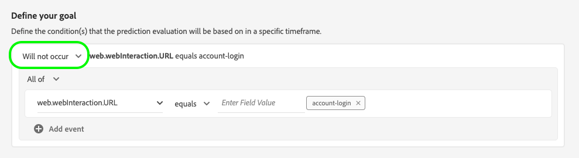

# Configurar uma instância do Customer AI

O Customer AI, como parte dos Serviços inteligentes, permite gerar pontuações de propensão personalizadas sem se preocupar com o aprendizado de máquina.

Os Serviços inteligentes fornecem a API do cliente como um serviço de Adobe Sensei simples de usar que pode ser configurado para diferentes casos de uso. As seções a seguir fornecem etapas para configurar uma instância do Customer AI.

## Configurar a instância {#set-up-your-instance}

Na interface do usuário da plataforma, selecione **[!UICONTROL Serviços]** no painel de navegação esquerdo. O **[!UICONTROL Serviços]** é exibido e exibe todos os serviços disponíveis à sua disposição. No contêiner do Customer AI, selecione **[!UICONTROL Abrir]**.

O **Customer AI** A interface do usuário é exibida e exibe todas as instâncias de serviço.

- Você pode encontrar a variável **[!UICONTROL Total de perfis pontuados]** localizada no lado inferior direito da **[!UICONTROL Criar instância]** contêiner. Essa métrica rastreia o número total de perfis pontuados pelo Customer AI para o ano civil atual, incluindo todos os ambientes sandbox e quaisquer instâncias de serviço excluídas.

As instâncias de serviço podem ser editadas, clonadas e excluídas usando os controles no lado direito da interface do usuário. Para exibir esses controles, selecione uma instância do **[!UICONTROL Instâncias do serviço]**. Os controles contêm o seguinte:

- **[!UICONTROL Editar]**: Selecionar **[!UICONTROL Editar]** permite modificar uma instância de serviço existente. É possível editar o nome, a descrição e a frequência de pontuação da instância.
- **[!UICONTROL Clonar]**: Selecionar **[!UICONTROL Clonar]** copia a configuração da instância de serviço atualmente selecionada. Em seguida, você pode modificar o workflow para fazer pequenos ajustes e renomeá-lo como uma nova instância.
- **[!UICONTROL Excluir]**: Você pode excluir uma instância de serviço, incluindo quaisquer execuções históricas.
- **[!UICONTROL Fonte de dados]**: Um link para o conjunto de dados usado por esta instância. Se vários conjuntos de dados estiverem sendo usados, selecionar o texto do hiperlink abrirá o provedor de visualização do conjunto de dados.
- **[!UICONTROL Detalhes da última execução]**: Isso só é exibido quando uma execução falha. Informações sobre por que a execução falhou, como códigos de erro, são exibidas aqui.
- **[!UICONTROL Definição de pontuação]**: Uma visão geral rápida da meta que você configurou para esta instância.

Para criar uma nova instância, selecione **[!UICONTROL Criar instância]**.

## Configuração

O fluxo de trabalho de criação da instância é exibido, começando no **[!UICONTROL Configuração]** etapa.

Abaixo estão informações importantes sobre valores que você deve fornecer à instância com:

- **[!UICONTROL Nome]:** O nome da instância é usado em todos os lugares onde as pontuações do Customer AI são exibidas. Portanto, os nomes devem descrever o que as pontuações de previsão representam. Por exemplo, &quot;Probabilidade de cancelar a assinatura de uma revista&quot;.

- **[!UICONTROL Descrição]:** Uma descrição que indica o que você está tentando prever.

- **[!UICONTROL Tipo de propensão]:** O tipo de propensão determina a intenção da pontuação e da polaridade da métrica. Você pode escolher **[!UICONTROL Churn]** ou **[!UICONTROL Conversão]**. Veja a nota em [resumo da pontuação](./discover-insights.md#scoring-summary) no documento de insights de descoberta para obter mais informações sobre como o tipo de propensão afeta sua instância.

Forneça os valores necessários e selecione **[!UICONTROL Próximo]** para continuar.

## Selecionar dados {#select-data}

Por design, o Customer AI usa os dados Adobe Analytics, Adobe Audience Manager, Experience Event e Consumer Experience Event para calcular as pontuações de propensão. Ao selecionar um conjunto de dados, somente os que são compatíveis com a API do cliente serão listados. Para selecionar um conjunto de dados, selecione o (**+**) ao lado do nome do conjunto de dados ou marque a caixa de seleção para adicionar vários conjuntos de dados ao mesmo tempo. Use a opção de pesquisa para encontrar rapidamente os conjuntos de dados em que você está interessado.

Depois de selecionar os conjuntos de dados que deseja usar, selecione o **[!UICONTROL Adicionar]** para adicionar os conjuntos de dados ao painel de visualização do conjunto de dados.

Seleção do ícone de informações  ao lado do conjunto de dados, o abre o provedor de visualização do conjunto de dados.

A visualização do conjunto de dados contém dados como a hora da última atualização, o schema de origem e uma pré-visualização das dez primeiras colunas.

### Integridade do conjunto de dados {#dataset-completeness}

Há um valor percentual de integridade do conjunto de dados na visualização do conjunto de dados. Esse valor fornece um instantâneo rápido de quantas colunas do conjunto de dados estão vazias/nulas. Se um conjunto de dados contiver muitos valores ausentes e esses valores forem capturados em outro lugar, é altamente recomendável incluir o conjunto de dados que contém os valores ausentes. Neste exemplo, a ID de pessoa está vazia, no entanto, a ID de pessoa é capturada em um conjunto de dados separado que pode ser incluído.

>[!NOTE]
>
>A integridade do conjunto de dados é calculada usando a janela de treinamento máximo para a API do cliente (um ano). Isso significa que os dados com mais de um ano não são considerados ao exibir o valor de integridade do conjunto de dados.
<!-- training dataset completness needs to change -->

### Selecionar uma identidade {#identity}

Para que vários conjuntos de dados se associem entre si, você deve selecionar um tipo de identidade (também conhecido como &quot;namespace de identidade&quot;) e um valor de identidade dentro desse namespace. Se você atribuiu mais de um campo como uma identidade dentro do esquema sob o mesmo namespace, todos os valores de identidade atribuídos serão exibidos na lista suspensa de identidade anexada pelo namespace, como `EMAIL (personalEmail.address)` ou `EMAIL (workEmail.address)`.

>[!IMPORTANT]
>
>O mesmo tipo de identidade (namespace) deve ser usado para cada conjunto de dados selecionado. Uma marca de seleção verde aparece ao lado do tipo de identidade na coluna de identidade, indicando que os conjuntos de dados são compatíveis. Por exemplo, ao usar o namespace de Telefone e `mobilePhone.number` como o identificador, todos os identificadores dos conjuntos de dados restantes devem conter e usar o namespace Phone .

Para selecionar uma identidade, selecione o valor sublinhado localizado na coluna de identidade. A opção selecionar um provedor de identidade é exibida.

Caso haja mais de uma identidade disponível em um namespace, selecione o campo de identidade correto para o caso de uso. Por exemplo, duas identidades de email estão disponíveis no namespace de email, um email comercial e pessoal. Dependendo do caso de uso, é mais provável que um email pessoal seja preenchido e seja mais útil em previsões individuais. Isso significa que `EMAIL (personalEmail.address)` seria selecionada como a identidade.

>[!NOTE]
>
> Se não existir nenhum tipo de identidade válido (namespace) para um conjunto de dados, você deverá definir uma identidade primária e atribuí-la a um namespace de identidade usando a variável [editor de esquema](../../../xdm/schema/composition.md#identity). Para saber mais sobre namespaces e identidades, visite o [Namespaces do serviço de identidade](../../../identity-service/namespaces.md) documentação.

## Definir uma meta {#define-a-goal}

<!-- https://www.adobe.com/go/cai-define-a-goal -->

O **[!UICONTROL Definir meta]** é exibida e fornece um ambiente interativo para você definir visualmente uma meta de previsão. Um objetivo é composto por um ou mais eventos, em que a ocorrência de cada evento se baseia na condição que ele contém. O objetivo de uma instância do Customer AI é determinar a probabilidade de atingir sua meta em um determinado período.

Para criar uma meta, selecione **[!UICONTROL Inserir Nome do Campo]** e seguido por um campo da lista suspensa. Selecione a segunda entrada, uma cláusula para a condição do evento e, opcionalmente, forneça o valor do target para concluir o evento. Eventos adicionais podem ser configurados selecionando **[!UICONTROL Adicionar evento]**. Por fim, complete a meta aplicando um período de previsão em número de dias e selecione **[!UICONTROL Próximo]**.

### Ocorrerá e não ocorrerá

Ao definir sua meta, você tem a opção de selecionar **[!UICONTROL Ocorrerá]** ou **[!UICONTROL Não ocorrerá]**. Selecionar **[!UICONTROL Ocorrerá]** significa que as condições do evento definidas precisam ser cumpridas para que os dados de evento de um cliente sejam incluídos na interface do usuário do insights.

Por exemplo, se você deseja configurar um aplicativo para prever se um cliente fará uma compra, você pode selecionar **[!UICONTROL Ocorrerá]** seguida de **[!UICONTROL Todos os]** e então insira **commerce.purchase.id** (ou um campo semelhante) e **[!UICONTROL existe]** como operador.

No entanto, pode haver casos em que você esteja interessado em prever se algum evento não acontecerá em um determinado período. Para configurar uma meta com essa opção, selecione **[!UICONTROL Não ocorrerá]** na lista suspensa de nível superior.

Por exemplo, se você estiver interessado em prever quais clientes se tornam menos envolvidos e não visitar sua página de logon de conta no próximo mês. Selecionar **[!UICONTROL Não ocorrerá]** seguida de **[!UICONTROL Todos os]** e então insira **web.webInteraction.URL** (ou um campo semelhante) e **[!UICONTROL igual]** como operador com **account-login** como o valor.

### Todos e qualquer um de

Em alguns casos, você pode desejar prever se uma combinação de eventos ocorrerá e, em outros casos, pode prever a ocorrência de qualquer evento a partir de um conjunto predefinido. Para prever se um cliente terá uma combinação de eventos, selecione o **[!UICONTROL Todos os]** na lista suspensa de segundo nível na **[!UICONTROL Definir meta]** página.

Por exemplo, você pode querer prever se um cliente compra um produto específico. Essa meta de previsão é definida por duas condições: a `commerce.order.purchaseID` **existe** e `productListItems.SKU` **igual** algum valor específico.

Para prever se um cliente terá algum evento de um determinado conjunto, você poderá usar o **[!UICONTROL Qualquer um dos]** opção.

Por exemplo, você pode querer prever se um cliente visita um determinado URL ou uma página da Web com um nome específico. Essa meta de previsão é definida por duas condições: `web.webPageDetails.URL` **começa com** um valor específico e `web.webPageDetails.name` **começa com** um valor específico.

### População elegível *(opcional)*

Por padrão, as pontuações de propensão são geradas para todos os perfis, a menos que uma população qualificada seja especificada. Você pode especificar uma população elegível definindo condições para incluir ou excluir perfis com base em eventos.

### Eventos personalizados (*opcional*) {#custom-events}

Se você tiver informações adicionais além do [campos de evento padrão](../input-output.md#standard-events) usada pelo Customer AI para gerar pontuações de propensão, uma opção de eventos personalizados é fornecida. Usar essa opção permite adicionar eventos adicionais que você considera influentes, o que pode melhorar a qualidade do modelo e ajudar a fornecer resultados mais precisos. Se o conjunto de dados selecionado incluir eventos personalizados definidos no esquema, é possível adicioná-los à instância.

Para adicionar um evento personalizado, selecione **[!UICONTROL Adicionar evento personalizado]**. Em seguida, insira um nome de evento personalizado e o mapeie para o campo de evento no esquema . Os nomes de evento personalizados são exibidos no lugar do valor dos campos, ao analisar fatores influentes e outros insights. Isso significa que a ID do usuário, a ID da reserva, as informações do dispositivo e outros valores personalizados são listados com o nome do evento personalizado, em vez da ID/valor do evento. Esses eventos personalizados adicionais são usados pela API do cliente para melhorar a qualidade do modelo e fornecer resultados mais precisos.

Em seguida, selecione o operador que deseja usar no menu suspenso operadores disponíveis. Somente operadores compatíveis com o evento são listados.

Por fim, insira os valores do campo se o operador selecionado exigir um. Neste exemplo, precisamos apenas ver se existe uma reserva de hotel ou restaurante. No entanto, se quisermos ser mais exatos, poderemos usar o operador equals e inserir um valor exato no prompt de valor.

Depois de concluir, selecione **[!UICONTROL Próximo]** no canto superior direito para continuar.

### Atributos de perfil personalizados (*opcional*)

Você pode definir campos importantes do conjunto de dados do Perfil (com carimbos de data e hora) nos seus dados, além do [campos de evento padrão](../input-output.md#standard-events) usada pela Customer AI para gerar pontuações de propensão. Usar essa opção permite adicionar atributos de perfil adicionais que você considera influentes, o que pode melhorar a qualidade do modelo e fornecer resultados mais precisos. Além disso, a adição de atributos de perfil personalizados permite que o Customer AI demonstre melhor como perfis específicos acabaram em um bucket de propensão.

>[!NOTE]
>
>A adição de um atributo de perfil personalizado segue o mesmo fluxo de trabalho da adição de um evento personalizado.

### Configurar um agendamento *(opcional)* {#configure-a-schedule}

O **[!UICONTROL Avançado]** será exibida. Essa etapa opcional permite configurar um agendamento para automatizar execuções de previsão, definir exclusões de previsão para filtrar determinados eventos ou selecionar **[!UICONTROL Concluir]** se nada for necessário.

Configure um agendamento de pontuação configurando o **[!UICONTROL Frequência de pontuação]**. As execuções de previsão automatizada podem ser programadas para serem executadas semanalmente ou mensalmente.

### Exclusões de previsão

Se o conjunto de dados continha colunas adicionadas como dados de teste, é possível adicionar essa coluna ou evento a uma lista de exclusão ao selecionar **Adicionar exclusão** seguido por inserir o campo que deseja excluir. Isso impede que os eventos que atendem a determinadas condições sejam avaliados ao gerar pontuações. Esse recurso pode ser usado para filtrar entradas de dados irrelevantes ou determinadas promoções.

Para excluir um evento, selecione **[!UICONTROL Adicionar exclusão]** e defina o evento. Para remover uma exclusão, selecione as reticências (**[!UICONTROL ...]**) na parte superior direita do contêiner de evento, em seguida, selecione **[!UICONTROL Remover contêiner]**.

### Ativar/desativar perfil

A opção Profile permite que o Customer AI exporte os resultados da pontuação para o Real-time Customer Profile. Desativar essa alternância impede que os resultados da pontuação de modelos sejam adicionados ao Perfil. Os resultados da pontuação do Customer AI ainda estão disponíveis com esse recurso desativado.

Ao usar o Customer AI pela primeira vez, você deve desativar esse recurso até estar satisfeito com os resultados de saída do modelo. Isso evita que você carregue vários conjuntos de dados de pontuação no Perfil do cliente em tempo real e ajuste o modelo.

Depois de ter seu agendamento de pontuação definido, exclusões de previsão incluídas e o perfil alternar onde deseja que esteja, selecione **[!UICONTROL Concluir]** no canto superior direito para criar a instância do Customer AI.

Se a instância for criada com êxito, uma execução de previsão será imediatamente acionada e as execuções subsequentes serão executadas de acordo com sua programação definida.

>[!NOTE]
>
>Dependendo do tamanho dos dados de entrada, as execuções de previsão podem levar até 24 horas para serem concluídas.

Ao seguir esta seção, você configurou uma instância do Customer AI e executou uma execução de previsão. Após a conclusão bem-sucedida da execução, os insights pontuados preenchem automaticamente os perfis com pontuações previstas se a alternância de perfil estiver ativada. Aguarde até 24 horas antes de continuar para a próxima seção deste tutorial.

## Próximas etapas {#next-steps}

Ao seguir este tutorial, você configurou com sucesso uma instância do Customer AI e gerou pontuações de propensão. Agora é possível optar por usar o Construtor de segmentos para [criar segmentos de clientes com pontuações previstas](./create-segment.md) ou [descubra insights com a Customer AI](./discover-insights.md).

## Recursos adicionais

O vídeo a seguir foi criado para oferecer suporte à compreensão do fluxo de trabalho de configuração do Customer AI. Além disso, práticas recomendadas e exemplos de casos de uso são fornecidos.

>[!IMPORTANT]
>
> O vídeo a seguir está desatualizado. Para obter as informações mais atualizadas, consulte a documentação.

>[!VIDEO](https://video.tv.adobe.com/v/32665?learn=on&quality=12)
