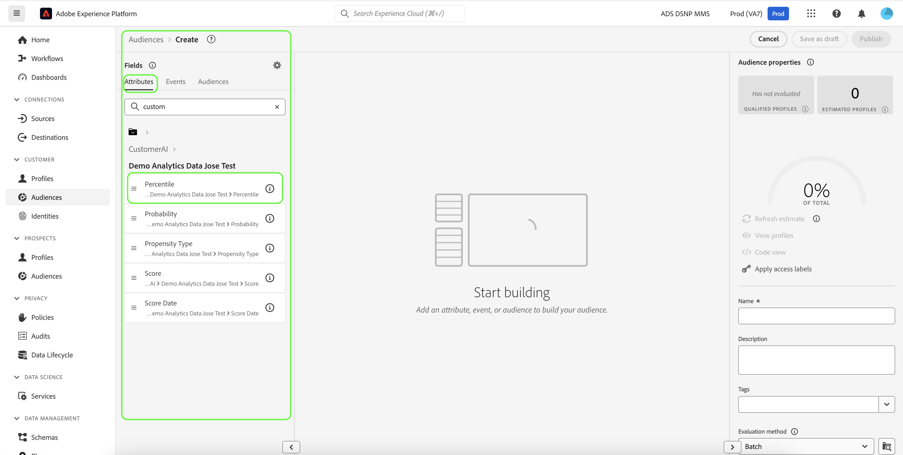

# Criar segmentos de clientes com pontuações previstas

Quando uma execução de previsão é concluída, as pontuações de propensão previstas são automaticamente consumidas pelos Perfis. Enriquecer perfis com pontuações do Customer AI permite que a criação de segmentos de clientes encontre públicos com base em suas pontuações de propensão. Esta seção fornece etapas para a criação de segmentos usando o Construtor de segmentos. Para obter um tutorial mais robusto sobre a criação de segmentos, consulte o [Guia do usuário do Construtor de segmentos](../../../segmentation/ui/segment-builder.md).

>[!IMPORTANT]
>
>Para utilizar esse método, o Perfil do cliente em tempo real precisa ser ativado para o conjunto de dados.

Na interface do usuário da plataforma, clique em **[!UICONTROL Segments]** na navegação à esquerda e, em seguida, clique em **[!UICONTROL Create segment]**.

O **Construtor de segmentos** é exibido. Na coluna **[!UICONTROL Fields]** à esquerda e na guia **[!UICONTROL Attributes]** , clique na pasta chamada **[!UICONTROL XDM Individual Profile]** e, em seguida, clique na pasta com o namespace da sua organização. A pasta chamada **[!UICONTROL Customer AI]** contém os resultados de execuções de previsão e são nomeadas após a instância à qual as pontuações pertencem. Clique em uma pasta de instância para acessar os resultados da instância desejada.

Localizado no centro do Construtor de segmentos, arraste e solte o atributo **[!UICONTROL Score]** na tela do construtor de regras *para definir uma regra.*

Na coluna *Segment properties* à direita, forneça um nome para o segmento.

Acima da coluna *Campos* à esquerda, clique no ícone **engrenagem** e selecione uma *Mesclar política* no menu suspenso. Clique em **[!UICONTROL Save]** para criar o segmento.

## Próximas etapas

Ao seguir este tutorial, você encontrou públicos-alvo com base em suas pontuações de propensão usando o Construtor de segmento. Agora é possível direcionar seus públicos-alvo ativando-os para destinos. Consulte a [visão geral de destinos](../../../destinations/home.md) para obter mais informações.
