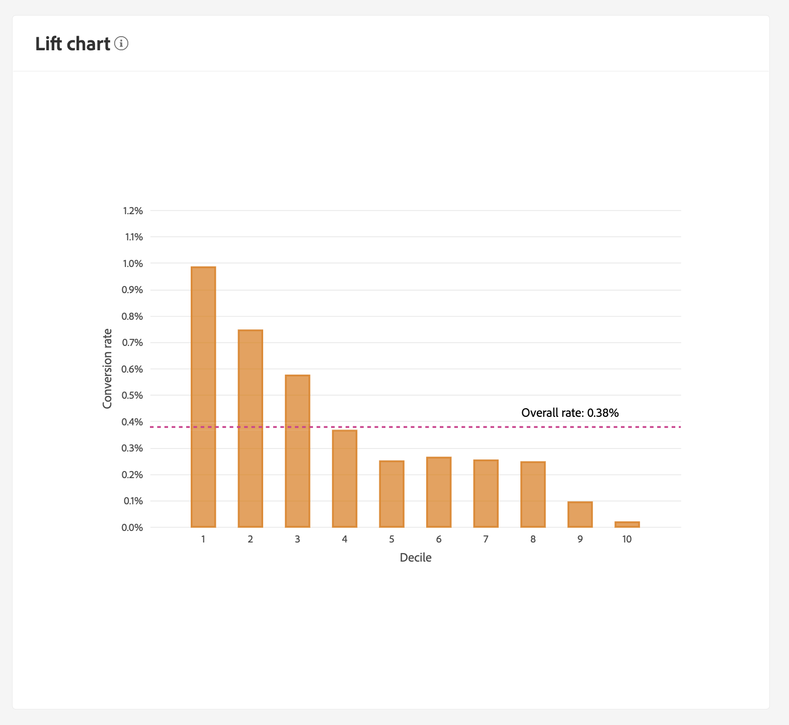

# Descubra insights com a IA do cliente

A IA do cliente, como parte dos Serviços inteligentes, fornece aos profissionais de marketing o poder de aproveitar a Adobe Sensei para antecipar qual será a próxima ação dos clientes. o Customer AI é usado para gerar pontuações de propensão personalizadas, como churn e conversão para perfis individuais em escala. Isso é feito sem precisar transformar as necessidades de negócios em um problema de aprendizado de máquina, escolhendo um algoritmo, treinamento ou implantação.

Este documento serve como um guia para interagir com insights da instância do serviço na interface do usuário da IA do cliente dos Serviços inteligentes.

## Introdução

Para utilizar insights para a IA do cliente, é necessário ter uma instância de serviço com um status de execução bem-sucedida disponível. Para criar uma nova instância de serviço, visite [Configurando uma instância da IA do cliente](./configure.md). Se você criou recentemente uma instância de serviço e ela ainda está sendo treinada e pontuada, aguarde 24 horas para que ela seja concluída.

## Visão geral da instância de serviço

Na interface do usuário do [!DNL Adobe Experience Platform], selecione **[!UICONTROL Serviços]** na navegação à esquerda. O navegador *Serviços* é exibido e exibe os Serviços Inteligentes disponíveis. No contêiner da IA do cliente, selecione **[!UICONTROL Abrir]**.

A página Serviço de IA do cliente é exibida. Esta página lista instâncias de serviço da IA do cliente e exibe informações sobre elas, incluindo o nome da instância, o tipo de propensão, a frequência com que a instância é executada e o status da última atualização.

>[!NOTE]
>
>Somente as instâncias de serviço que concluíram execuções de pontuação bem-sucedidas têm insights.

Selecione um nome de instância de serviço para começar.

Em seguida, a página de insights para essa instância de serviço é exibida com a opção de selecionar **[!UICONTROL Últimas pontuações]** ou **[!UICONTROL Resumo do desempenho]**. A guia padrão **[!UICONTROL Últimas pontuações]** fornece visualizações dos dados. As visualizações e o que você pode fazer com os dados são explicados com mais detalhes neste guia.

A guia **[!UICONTROL Resumo de desempenho]** mostra as taxas de conversão ou churn real para cada classe de propensão. Para saber mais, consulte a seção sobre [métricas de resumo de desempenho](#performance-metrics).

## Detalhes da instância do serviço

Há duas maneiras de exibir detalhes da instância do serviço: no painel ou na instância do serviço.

### Painel da instância de serviço

Para exibir uma visão geral dos detalhes da instância de serviço no painel, selecione um container de instância de serviço, evitando o hiperlink anexado ao nome. Isso abre um painel direito que fornece detalhes adicionais. Os controles contêm o seguinte:

- **[!UICONTROL Editar]**: selecionar **[!UICONTROL Editar]** permite modificar uma instância de serviço existente. É possível editar o nome, a descrição e a frequência de pontuação da instância.
- **[!UICONTROL Clonar]**: selecionar **[!UICONTROL Clonar]** copia a configuração da instância de serviço selecionada no momento. Em seguida, você pode modificar o fluxo de trabalho para fazer pequenos ajustes e renomeá-lo como uma nova instância.
- **[!UICONTROL Excluir]**: é possível excluir uma instância de serviço, incluindo todas as execuções históricas.
- **[!UICONTROL Fonte de dados]**: um link para o conjunto de dados usado por esta instância.
- **[!UICONTROL Frequência de Execução]**: com que frequência uma execução de pontuação ocorre e quando.
- **[!UICONTROL Definição de pontuação]**: uma visão geral rápida da meta que você configurou para esta instância.

>[!NOTE]
>
>Caso uma execução de pontuação falhe, uma mensagem de erro será fornecida. A mensagem de erro está listada em **Detalhes da última execução** no painel direito, que só é visível para execuções com falha.

### Mostrar lista suspensa de mais insights

A segunda maneira de exibir detalhes adicionais de uma instância de serviço está localizada na página de insights. Selecione **[!UICONTROL Mostrar mais]** no canto superior direito para preencher uma lista suspensa. Os detalhes são listados, como a definição da pontuação, quando ela foi criada, o tipo de propensão e os conjuntos de dados usados. Para obter mais informações sobre as propriedades listadas, visite [Configurando uma instância da IA do cliente](./configure.md).

### Popover de visualização do conjunto de dados da IA do cliente

Se mais de um conjunto de dados for usado pela IA do cliente, será fornecido um hiperlink rotulado como **[!UICONTROL Vários]** seguido do número de conjuntos de dados entre colchetes `()`.

Selecionar o link de vários conjuntos de dados abre o popover Visualização do conjunto de dados da IA do cliente. Cada cor na visualização representa um conjunto de dados, conforme mostrado pela chave de cor à esquerda das colunas do conjunto de dados. Neste exemplo, você pode ver que apenas **Conjunto de Dados 1** contém a coluna `PROP1`.

### Editar uma instância

Para editar uma instância, selecione **[!UICONTROL Editar]** na navegação superior direita.

A caixa de diálogo de edição é exibida, permitindo editar o nome, a descrição, o status e a frequência de pontuação da instância. Para confirmar as alterações e fechar a caixa de diálogo, selecione **[!UICONTROL Salvar]** no canto inferior direito.

### Mais ações

O botão **[!UICONTROL Mais ações]** está localizado na navegação superior direita, ao lado de **[!UICONTROL Editar]**. Selecionar **[!UICONTROL Mais ações]** abre uma lista suspensa que permite selecionar uma das seguintes operações:

- **[!UICONTROL Clone]**: selecionar **[!UICONTROL Clone]** copia a configuração da instância do serviço. Em seguida, você pode modificar o fluxo de trabalho para fazer pequenos ajustes e renomeá-lo como uma nova instância.
- **[!UICONTROL Excluir]**: exclui a instância.
- **[!UICONTROL Pontuações de acesso]**: selecionar **[!UICONTROL Pontuações de acesso]** abre uma caixa de diálogo fornecendo um link para o tutorial [pontuações de download da IA do cliente](./download-scores.md). A caixa de diálogo também fornece a ID do conjunto de dados necessária para fazer chamadas de API.
- **[!UICONTROL Exibir histórico de execuções]**: uma caixa de diálogo contendo uma lista de todas as execuções de pontuação associadas à instância do serviço é exibida.

## Resumo da pontuação {#scoring-summary}

O resumo de pontuação exibe o número total de perfis pontuados e os categoriza em compartimentos que contêm alta, média e baixa propensão. Os intervalos de propensão são determinados com base no intervalo de pontuação, baixo é menor que 24, médio é 25 a 74 e alto é acima de 74. Cada bloco tem uma cor correspondente à legenda.

>[!NOTE]
>
>Se for uma pontuação de propensão de conversão, as pontuações mais altas serão exibidas em verde e as pontuações mais baixas em vermelho. Se você estiver prevendo a propensão de churn, ela será invertida, as pontuações mais altas estarão em vermelho e as pontuações mais baixas em verde. O intervalo médio permanece amarelo, independentemente do tipo de propensão escolhido.

Você pode passar o mouse sobre qualquer cor no anel para ver informações adicionais, como uma porcentagem e o número total de perfis que pertencem a um bloco.

## Distribuição de pontuações

O cartão **[!UICONTROL Distribution of Scores]** fornece um resumo visual da população com base na pontuação. As cores que você vê no cartão [!UICONTROL Distribuição de pontuações] representam o tipo de pontuação de propensão gerada. Passar o mouse sobre qualquer uma das distribuições de pontuação fornece a contagem exata que pertence a essa distribuição.

## Fatores influentes

Para cada intervalo de pontuação, é gerado um cartão que mostra os 10 principais fatores influentes para esse intervalo. Os fatores influentes fornecem detalhes adicionais sobre por que seus clientes pertencem a vários intervalos de pontuação.

### Detalhamentos influentes de fator

Passar o mouse sobre qualquer um dos principais fatores influentes detalha ainda mais os dados. Você recebe uma visão geral de por que determinados perfis pertencem a um intervalo de propensão. Dependendo do fator, você pode receber valores numéricos, categóricos ou booleanos. O exemplo abaixo exibe valores categóricos por região.

Além disso, usando detalhamentos, você pode comparar um fator de distribuição se ele ocorrer em dois ou mais buckets de propensão e criar segmentos mais específicos com esses valores. O exemplo a seguir ilustra o primeiro caso de uso:

Você pode ver que os perfis com baixa propensão à conversão têm menos probabilidade de ter feito uma visita recente às páginas da Web adobe.com. O fator &quot;Dias desde a última visita da Web&quot; tem somente 8% de cobertura em comparação a 26% em perfis de propensão médios. Usando esses números, você pode comparar a distribuição em cada período para o fator. Essas informações podem ser usadas para inferir que a recenticidade na visita da Web não é tão influente no intervalo de baixa propensão, como é no intervalo de média propensão.

### Criar um segmento

Selecionar o botão **[!UICONTROL Criar segmento]** em qualquer um dos grupos para baixa, média e alta propensão redireciona você para o construtor de segmentos.

>[!NOTE]
>
>O botão **[!UICONTROL Criar segmento]** só estará disponível se o Perfil de cliente em tempo real estiver habilitado para o conjunto de dados. Para obter mais informações sobre como habilitar o Perfil do cliente em tempo real, visite a [Visão geral do Perfil do cliente em tempo real](../../../rtcdp/overview.md).

O construtor de segmentos é usado para definir um segmento. Ao selecionar **[!UICONTROL Criar segmento]** na página de Insights, a IA do cliente adiciona automaticamente as informações dos grupos selecionados ao segmento. Para concluir a criação do segmento, basta preencher os contêineres **Nome** e **Descrição**, localizados no painel direito da interface do usuário do construtor de segmentos. Depois de dar um nome e uma descrição ao segmento, selecione **[!UICONTROL Salvar]** no canto superior direito.

>[!NOTE]
>
>Como as pontuações de propensão são gravadas no perfil individual, elas ficam disponíveis no Construtor de segmentos como qualquer outro atributo de perfil. Ao navegar até o construtor de segmentos para criar novos segmentos, você pode ver todas as várias pontuações de propensão em seu namespace Customer AI.

Para exibir seu novo segmento na interface do usuário do Experience Platform, selecione **[!UICONTROL Segmentos]** na navegação à esquerda. A página **[!UICONTROL Procurar]** é exibida e mostra todos os segmentos disponíveis.

## Desempenho histórico {#historical-performance}

A guia **[!UICONTROL Resumo de desempenho]** mostra as taxas de conversão ou churn real, separadas em cada um dos intervalos de propensão pontuados pela IA do cliente.

Inicialmente, apenas as taxas esperadas (linhas pontilhadas) são exibidas. As taxas esperadas são exibidas quando uma execução de pontuação não ocorreu e os dados ainda não estão disponíveis. No entanto, depois que uma janela de resultado passar, a taxa esperada é substituída por uma taxa real (linha sólida).

Passar o mouse sobre as linhas exibe a data e a taxa real/esperada desse dia nesse período.

Você pode filtrar o período para as taxas esperadas e reais que estão sendo exibidas. Selecione o **ícone de calendário** e selecione um novo intervalo de datas. Os resultados em cada um dos intervalos são atualizados para exibir dentro do novo intervalo de datas.

### Taxas de execução de pontuação individual

A metade inferior da guia **[!UICONTROL Resumo do desempenho]** exibe os resultados de cada execução de pontuação individual. Selecione a data suspensa no canto superior direito para exibir resultados para uma execução de pontuação diferente.

Dependendo de se você estiver prevendo churn ou conversão, o gráfico [!UICONTROL Distribuição de pontuações] exibe a distribuição de perfis churn/convertidos e sem churn/não convertidos em cada incremento.

## Avaliação do modelo {#model-evaluation}

Além de rastrear os resultados previstos e reais ao longo do tempo na guia Desempenho histórico, os profissionais de marketing têm ainda mais transparência sobre a qualidade do modelo com a guia Avaliação do modelo. Você pode usar os gráficos de aumento e ganhos para determinar as diferenças no uso de um modelo preditivo versus direcionamento aleatório. Além disso, você pode determinar quantos resultados positivos seriam capturados em cada corte de pontuação. Isso é útil para segmentação e para alinhar o retorno do investimento com ações de marketing.

### Levantar gráfico

O gráfico de elevação mede a melhoria do uso de um modelo preditivo em vez de direcionamento aleatório.

Os indicadores do modelo de alta qualidade incluem:

- Valores de elevação altos nos primeiros decis. Isso significa que o modelo é bom para identificar os usuários com maior propensão a realizar a ação de interesse.
- Valores de elevação decrescentes. Isso significa que os clientes com pontuações mais altas têm mais probabilidade de realizar a ação de interesse do que as pessoas com pontuações mais baixas.

### Gráfico de ganhos

O gráfico de ganhos cumulativos mede a porcentagem de resultados positivos capturados ao direcionar pontuações acima de um determinado limite. Depois de classificar os clientes por pontuação de propensão de alta para baixa, a população é dividida em decis: 10 grupos de tamanho igual. Um modelo perfeito capturaria todos os resultados positivos nos decis de maior pontuação. Um método de direcionamento aleatório de linha de base captura resultados positivos proporcionalmente ao tamanho do grupo. Direcionar 30% dos usuários capturaria 30% dos resultados.

Os indicadores do modelo de alta qualidade incluem:

- Os ganhos cumulativos se aproximam 100% rapidamente.
- A curva de ganhos cumulativos do modelo está mais próxima do canto superior esquerdo do gráfico.
- O gráfico de ganhos cumulativos pode ser usado para determinar os limites de pontuação para segmentação e direcionamento. Por exemplo, se o modelo capturar 70% dos resultados positivos nos primeiros 2 decis de pontuação, espera-se que direcionar usuários com pontuação percentual > 80 capture aproximadamente 70% dos resultados positivos.

### AUC (Área abaixo da curva)

A AUC reflete a força da relação entre a classificação por pontuação e a ocorrência do objetivo previsto. Uma **AUC** de 0,5 significa que o modelo não é melhor do que uma estimativa aleatória. Uma **AUC** de 1 significa que o modelo pode prever perfeitamente quem executará a ação relevante.

## Próximas etapas

Este documento descreveu os insights fornecidos por uma instância do serviço de IA do cliente. Agora você pode seguir para o tutorial em [baixando pontuações na IA do cliente](./download-scores.md) ou navegar pelos outros guias do [Adobe Intelligent Services](../../home.md) oferecidos.

## Recursos adicionais

O vídeo a seguir descreve como usar a IA do cliente para ver a saída dos modelos e fatores influentes.

>[!VIDEO](https://video.tv.adobe.com/v/32666?learn=on&quality=12)
