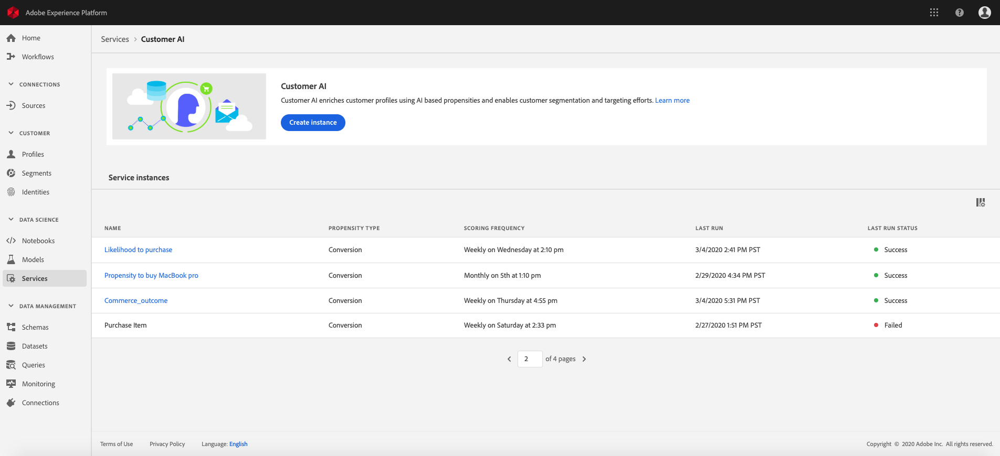
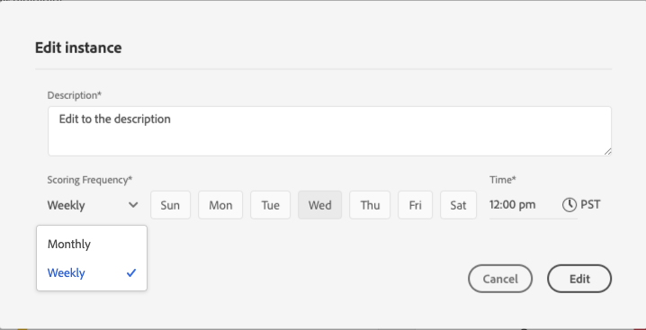
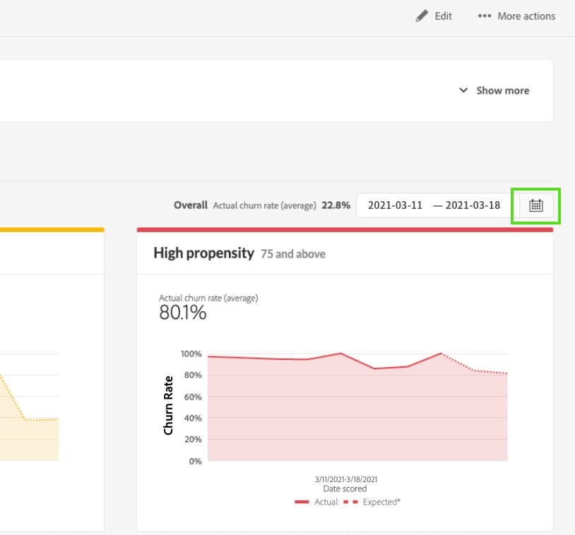
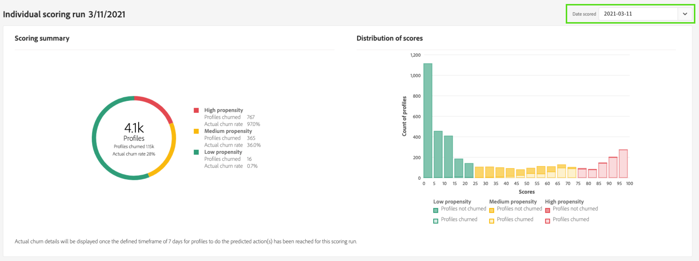

# Descubra insights com o Customer AI

O Customer AI, como parte dos Serviços inteligentes, fornece aos profissionais de marketing o poder de aproveitar o Adobe Sensei para antecipar a próxima ação dos clientes. o Customer AI é usado para gerar pontuações de propensão personalizadas, como churn e conversão para perfis individuais em escala. Isso é feito sem precisar transformar as necessidades de negócios em um problema de aprendizado de máquina, escolher um algoritmo, treinamento ou implantação.

Este documento é um guia para interagir com insights da instância de serviço na interface do usuário da API do cliente de Serviços inteligentes.

## Introdução

Para utilizar insights para o Customer AI, você precisa ter uma instância de serviço com um status de execução bem-sucedida disponível. Para criar uma nova instância de serviço, visite [Configuração de uma instância do Customer AI](./configure.md). Se você criou recentemente uma instância de serviço e ela ainda está treinando e pontuando, aguarde 24 horas para que ela termine de ser executada.

## Visão geral da instância de serviço

No [!DNL Adobe Experience Platform] UI, selecione **[!UICONTROL Serviços]** no painel de navegação esquerdo. O *Serviços* O navegador é exibido e exibe os Serviços inteligentes disponíveis. No contêiner do Customer AI, selecione **[!UICONTROL Abrir]**.

A página Serviço de IA do cliente é exibida. Esta página lista as instâncias de serviço do Customer AI e exibe informações sobre elas, incluindo o nome da instância, o tipo de propensão, a frequência de execução da instância e o status da última atualização.

>[!NOTE]
>
>Somente as instâncias de serviço que concluíram execuções de pontuação bem-sucedidas têm insights.

Selecione um nome de instância de serviço para começar.

Em seguida, a página de insights para essa instância de serviço aparece com a opção de selecionar **[!UICONTROL Pontuações mais recentes]** ou **[!UICONTROL Resumo de desempenho]**. A guia padrão **[!UICONTROL Pontuações mais recentes]** O fornece visualizações de seus dados. As visualizações e o que você pode fazer com os dados são explicadas com mais detalhes neste guia.

O **[!UICONTROL Resumo de desempenho]** mostra as taxas de churn ou conversão reais para cada bucket de propensão. Para saber mais, consulte a seção em [métricas de resumo do desempenho](#performance-metrics).

## Detalhes da instância de serviço

Há duas maneiras de exibir os detalhes da instância do serviço: no painel ou na instância do serviço.

### Painel da instância de serviço

Para exibir uma visão geral dos detalhes da instância de serviço no painel, selecione um contêiner de instância de serviço, evitando o hiperlink anexado ao nome. Isso abre um painel à direita que fornece detalhes adicionais. Os controles contêm o seguinte:

- **[!UICONTROL Editar]**: Selecionar **[!UICONTROL Editar]** permite modificar uma instância de serviço existente. É possível editar o nome, a descrição e a frequência de pontuação da instância.
- **[!UICONTROL Clonar]**: Selecionar **[!UICONTROL Clonar]** copia a configuração da instância de serviço atualmente selecionada. Em seguida, você pode modificar o workflow para fazer pequenos ajustes e renomeá-lo como uma nova instância.
- **[!UICONTROL Excluir]**: Você pode excluir uma instância de serviço, incluindo quaisquer execuções históricas.
- **[!UICONTROL Fonte de dados]**: Um link para o conjunto de dados usado por esta instância.
- **[!UICONTROL Executar frequência]**: Com que frequência uma execução de pontuação ocorre e quando.
- **[!UICONTROL Definição de pontuação]**: Uma visão geral rápida da meta que você configurou para esta instância.

>[!NOTE]
>
>Caso ocorra uma falha na execução da pontuação, uma mensagem de erro é fornecida. A mensagem de erro está listada em **Detalhes da última execução** no painel direito, que está visível apenas para executar com falha.

### Mostrar mais insights

A segunda maneira de exibir detalhes adicionais de uma instância de serviço está localizada na página insights . Selecionar **[!UICONTROL Mostrar mais]** no canto superior direito para preencher uma lista suspensa. Os detalhes são listados, como a definição da pontuação, quando foi criada, o tipo de propensão e os conjuntos de dados usados. Para obter mais informações sobre qualquer uma das propriedades listadas, visite [Configuração de uma instância do Customer AI](./configure.md).

### Fornecedor de visualização do conjunto de dados do Customer AI

Se mais de um conjunto de dados for usado pelo Customer AI, um hiperlink rotulado como **[!UICONTROL Vários]** seguido pelo número de conjuntos de dados entre parênteses `()` é fornecida.

Selecionar o link de vários conjuntos de dados abre o provedor de visualização do conjunto de dados do Customer AI. Cada cor na visualização representa um conjunto de dados, conforme mostrado pela chave de cor à esquerda das colunas do conjunto de dados. Neste exemplo, você pode ver que somente **Conjunto de dados 1** contém a variável `PROP1` coluna.

### Editar uma instância

Para editar uma instância, selecione **[!UICONTROL Editar]** no canto superior direito da navegação.

A caixa de diálogo Editar é exibida, permitindo editar o nome, a descrição, o status e a frequência de pontuação da instância. Para confirmar as alterações e fechar a caixa de diálogo, selecione **[!UICONTROL Salvar]** no canto inferior direito.

### Mais ações

O **[!UICONTROL Mais ações]** está localizado na navegação superior direita ao lado de **[!UICONTROL Editar]**. Selecionar **[!UICONTROL Mais ações]** abre uma lista suspensa que permite selecionar uma das seguintes operações:

- **[!UICONTROL Clonar]**: Selecionar **[!UICONTROL Clonar]** copia a configuração da instância de serviço. Em seguida, você pode modificar o workflow para fazer pequenos ajustes e renomeá-lo como uma nova instância.
- **[!UICONTROL Excluir]**: Exclui a instância.
- **[!UICONTROL Pontuações de acesso]**: Selecionar **[!UICONTROL Pontuações de acesso]** abre uma caixa de diálogo que fornece um link para a [download de pontuações para o Customer AI](./download-scores.md) tutorial, a caixa de diálogo também fornece a ID do conjunto de dados necessária para fazer chamadas de API.
- **[!UICONTROL Exibir histórico de execução]**: Uma caixa de diálogo contendo uma lista de todas as execuções de pontuação associadas à instância do serviço é exibida.

## Resumo da pontuação {#scoring-summary}

O resumo de pontuação exibe o número total de perfis pontuados e os categoriza em compartimentos que contêm alta, média e baixa propensão. Os buckets de propensão são determinados com base no intervalo de pontuação, baixo é menor que 24, médio é 25 a 74 e alto é acima de 74. Cada bucket tem uma cor correspondente à legenda.

>[!NOTE]
>
>Se for uma pontuação de propensão de conversão, as pontuações altas serão exibidas em verde e as pontuações baixas em vermelho. Se você está prevendo propensão de churn que é invertida, as pontuações altas estão em vermelho e as pontuações baixas são verdes. O bucket médio permanece amarelo, independentemente do tipo de propensão escolhido.

Você pode passar o mouse sobre qualquer cor do anel para exibir informações adicionais, como uma porcentagem e o número total de perfis pertencentes a um compartimento.

## Distribuição de pontuações

O **[!UICONTROL Distribuição de pontuações]** O cartão fornece um resumo visual da população com base na pontuação. As cores que você vê no [!UICONTROL Distribuição de pontuações] representa o tipo de pontuação de propensão gerada. Passar o mouse sobre qualquer distribuição de pontuação fornece a contagem exata pertencente a essa distribuição.

## Fatores influentes

Para cada grupo de pontuação, é gerado um cartão que mostra os 10 principais fatores influentes para esse grupo. Os fatores influentes fornecem detalhes adicionais sobre por que seus clientes pertencem a vários compartimentos de pontuação.

### Detalhamentos por fatores influentes

Passar o mouse sobre qualquer um dos principais fatores influentes detalha ainda mais os dados. Você recebe uma visão geral sobre por que determinados perfis pertencem a um bucket de propensão. Dependendo do fator, você pode receber valores numéricos, categóricos ou booleanos. O exemplo abaixo exibe valores categóricos por região.

Além disso, usando detalhamentos, é possível comparar um fator de distribuição se ele ocorrer em dois ou mais compartimentos de propensão e criar segmentos mais específicos com esses valores. O exemplo a seguir ilustra o primeiro caso de uso:

Você pode ver que os perfis com baixa propensão à conversão têm menos probabilidade de ter feito uma visita recente às páginas da Web do adobe.com. O fator &quot;Dias desde a última visita à web&quot; tem apenas 8% de cobertura em comparação a 26% em perfis de propensão média. Com esses números, você pode comparar a distribuição em cada grupo do fator. Essas informações podem ser usadas para inferir que o recenticidade no webvisit não é tão influente no bucket de baixa propensão, pois está no bucket de média propensão.

### Criar um segmento

Selecionar o **[!UICONTROL Criar segmento]** em qualquer um dos compartimentos para baixa, média e alta propensão redireciona você para o construtor de segmentos.

>[!NOTE]
>
>O **[!UICONTROL Criar segmento]** só estará disponível se o Perfil do cliente em tempo real estiver ativado para o conjunto de dados. Para obter mais informações sobre como ativar o Perfil do cliente em tempo real, visite o [Visão geral do perfil do cliente em tempo real](../../../rtcdp/overview.md).

O construtor de segmentos é usado para definir um segmento. Ao selecionar **[!UICONTROL Criar segmento]** na página Insights , o Customer AI adiciona automaticamente as informações dos buckets selecionados ao segmento. Para concluir a criação do segmento, preencha o **Nome** e **Descrição** contêineres localizados no painel direito da interface do usuário do construtor de segmentos. Depois de dar um nome e uma descrição ao segmento, selecione **[!UICONTROL Salvar]** no canto superior direito.

>[!NOTE]
>
>Como as pontuações de propensão são gravadas no perfil individual, elas estão disponíveis no Construtor de segmentos, como qualquer outro atributo de perfil. Ao navegar até o construtor de segmentos para criar novos segmentos, você pode ver todas as pontuações de propensão em seu namespace, Customer AI.

Para exibir seu novo segmento na interface do usuário da plataforma, selecione **[!UICONTROL Segmentos]** no painel de navegação esquerdo. O **[!UICONTROL Procurar]** é exibida e exibe todos os segmentos disponíveis.

## Métricas de resumo de desempenho {#performance-metrics}

O **[!UICONTROL Resumo de desempenho]** mostra as taxas de churn ou conversão reais, separadas em cada um dos buckets de propensão classificados pelo Customer AI.

Inicialmente, somente as taxas esperadas (linhas pontilhadas) são exibidas. As taxas esperadas são exibidas quando uma execução de pontuação não ocorreu e os dados ainda não estão disponíveis. No entanto, uma vez que uma janela de resultados tenha passado, a taxa esperada é substituída por uma taxa real (linha sólida).

Passar o mouse sobre as linhas exibe a data e a taxa real/esperada para o dia nesse período.

Você pode filtrar o período para as taxas esperadas e reais que estão sendo exibidas. Selecione o **ícone do calendário** em seguida, selecione um novo intervalo de datas. Os resultados em cada um dos compartimentos são atualizados para serem exibidos no novo intervalo de datas.

### Taxas de execução de pontuação individuais

A metade inferior do **[!UICONTROL Resumo de desempenho]** exibe os resultados de cada execução de pontuação individual. Selecione a data suspensa no canto superior direito para exibir os resultados de uma execução de pontuação diferente.

Dependendo de se você estiver prevendo churn ou conversão, a variável [!UICONTROL Distribuição de pontuações] O gráfico exibe a distribuição de perfis encurtados/convertidos e não encurtados/não convertidos em cada incremento.

## Próximas etapas

Este documento destacou os insights fornecidos por uma instância de serviço do Customer AI. Agora você pode continuar para o tutorial em [download de pontuações no Customer AI](./download-scores.md) ou navegue pelo outro [Serviços inteligentes do Adobe](../../home.md) guias oferecidos.

## Recursos adicionais

O vídeo a seguir descreve como usar o Customer AI para ver a saída dos modelos e fatores influentes.

>[!VIDEO](https://video.tv.adobe.com/v/32666?learn=on&quality=12)
