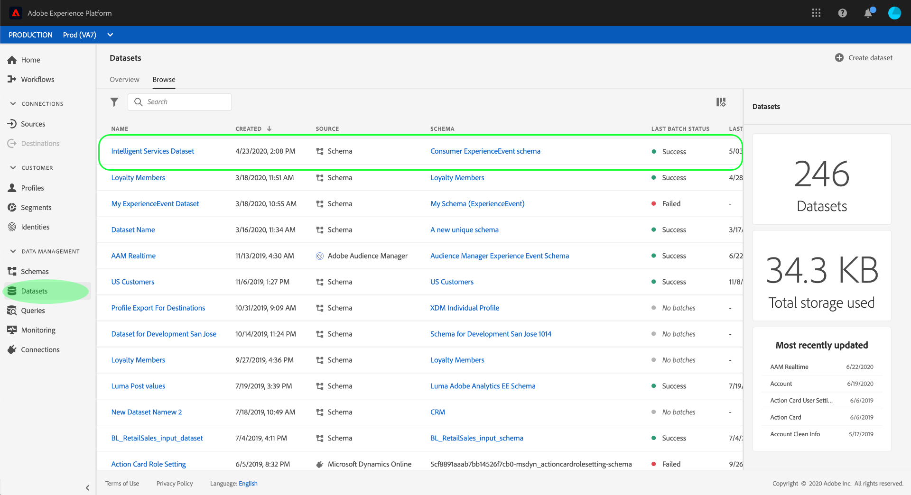

# Preparar dados para usar em [!DNL Intelligent Services]

Para que [!DNL Intelligent Services] descubra insights de seus dados de eventos de marketing, os dados devem ser semanticamente enriquecidos e mantidos em uma estrutura padrão. [!DNL Intelligent Services] utilize os esquemas  [!DNL Experience Data Model] (XDM) para fazer isso. Especificamente, todos os conjuntos de dados que são usados em [!DNL Intelligent Services] devem estar em conformidade com o esquema XDM Consumer ExperienceEvent (CEE).

Este documento fornece orientação geral sobre como mapear os dados de eventos de marketing de vários canais para esse esquema, destacando informações sobre campos importantes no esquema para ajudar a determinar como mapear os dados de maneira eficaz para sua estrutura.

## Resumo do workflow

O processo de preparação varia dependendo se os dados são armazenados no Adobe Experience Platform ou externamente. Esta seção resume as etapas necessárias, tendo em conta qualquer um dos cenários.

### Preparação de dados externos

Se os dados forem armazenados fora de [!DNL Experience Platform], siga as etapas abaixo:

1. Entre em contato com os Serviços de consultoria do Adobe para solicitar credenciais de acesso para um contêiner dedicado do Armazenamento Azure Blob.
1. Usando suas credenciais de acesso, faça upload de seus dados para o contêiner de Blob.
1. Trabalhe com os Serviços de consultoria do Adobe para obter seus dados mapeados para o [schema ExperienceEvent do consumidor](#cee-schema) e assimilados em [!DNL Intelligent Services].

### [!DNL Experience Platform] preparação de dados

Se os dados já estiverem armazenados em [!DNL Platform], siga as etapas abaixo:

1. Revise a estrutura do [Consumer ExperienceEvent schema](#cee-schema) e determine se os dados podem ser mapeados para seus campos.
1. Entre em contato com os Serviços de consultoria do Adobe para ajudar a mapear seus dados para o esquema e assimilá-los em [!DNL Intelligent Services] ou [siga as etapas deste guia](#mapping) se desejar mapear os dados por conta própria.

## Noções básicas sobre o esquema CEE {#cee-schema}

O schema Consumer ExperienceEvent descreve o comportamento de um indivíduo, pois está relacionado a eventos de marketing digital (Web ou dispositivos móveis), bem como a atividades de comércio online ou offline. O uso desse schema é necessário para [!DNL Intelligent Services] devido a seus campos semanticamente bem definidos (colunas), evitando quaisquer nomes desconhecidos que deixariam os dados menos claros.

O esquema CEE, como todos os esquemas XDM ExperienceEvent, captura o estado baseado em séries de tempo do sistema quando um evento (ou conjunto de eventos) ocorreu, incluindo o ponto no tempo e a identidade do assunto envolvido. Os Eventos de experiência são registros de fatos do que aconteceu e, portanto, são imutáveis e representam o que aconteceu sem agregação ou interpretação.

[!DNL Intelligent Services] utilize vários campos principais dentro desse esquema para gerar insights de seus dados de eventos de marketing, todos eles podem ser encontrados no nível raiz e expandidos para mostrar seus subcampos necessários.


Como todos os esquemas XDM, a mesclagem CEE é extensível. Em outras palavras, campos adicionais podem ser adicionados à mesclagem CEE e diferentes variações podem ser incluídas em vários schemas, se necessário.

Um exemplo completo do mixin pode ser encontrado no [repositório XDM público](https://github.com/adobe/xdm/blob/797cf4930d5a80799a095256302675b1362c9a15/docs/reference/context/experienceevent-consumer.schema.md). Além disso, você pode visualizar e copiar o seguinte [arquivo JSON](https://github.com/AdobeDocs/experience-platform.en/blob/master/help/intelligent-services/assets/CEE_XDM_sample_rows.json) para obter um exemplo de como os dados podem ser estruturados para estar em conformidade com o esquema CEE. Consulte ambos os exemplos enquanto aprende sobre os campos principais descritos na seção abaixo, para determinar como você pode mapear seus próprios dados para o esquema.

## Campos principais

Há vários campos principais no mixin CEE que devem ser utilizados para que [!DNL Intelligent Services] gere insights úteis. Esta seção descreve o caso de uso e os dados esperados para esses campos e fornece links para a documentação de referência para mais exemplos.

### Campos obrigatórios

Embora o uso de todos os campos principais seja altamente recomendado, há dois campos que são **necessários** para que [!DNL Intelligent Services] funcione:

* [Um campo de identidade primário](#identity)
* [xdm:timestamp](#timestamp)
* [xdm:channel](#channel)  (obrigatório somente para Attribution AI)

#### Identidade primária {#identity}

Um dos campos no esquema deve ser definido como um campo de identidade primário, o que permite que [!DNL Intelligent Services] vincule cada instância dos dados da série de tempo a uma pessoa individual.

Você deve determinar o melhor campo a ser usado como uma identidade primária com base na fonte e na natureza de seus dados. Um campo de identidade deve incluir um **namespace de identidade** que indica o tipo de dados de identidade que o campo espera como um valor. Alguns valores válidos de namespace incluem:

* &quot;email&quot;
* &quot;Telefone&quot;
* &quot;mcid&quot; (para Adobe Audience Manager IDs)
* &quot;aaid&quot; (para Adobe Analytics IDs)

Se não tiver certeza de qual campo você deve usar como identidade primária, entre em contato com os Serviços de consultoria da Adobe para determinar a melhor solução. Se uma identidade primária não estiver definida, o aplicativo Serviço inteligente usará o seguinte comportamento padrão:

| Padrão | Attribution AI | Customer AI |
| --- | --- | --- |
| Coluna de identidade | `endUserIDs._experience.aaid.id` | `endUserIDs._experience.mcid.id` |
| Namespace | AAID | ECID |

Para definir uma identidade primária, navegue até o esquema da guia **[!UICONTROL Schemas]** e selecione o hiperlink do nome do esquema para abrir o **[!DNL Schema Editor]**.


Em seguida, navegue até o campo que deseja como uma identidade primária e selecione-o. O menu **[!UICONTROL Field properties]** é aberto para esse campo.


No menu **[!UICONTROL Field properties]**, role para baixo até encontrar a caixa de seleção **[!UICONTROL Identity]**. Depois de marcar a caixa , a opção para definir a identidade selecionada como **[!UICONTROL Primary identity]** é exibida. Selecione essa caixa também.


Em seguida, você deve fornecer um **[!UICONTROL Identity namespace]** da lista de namespaces predefinidos na lista suspensa. Neste exemplo, o espaço de nome ECID é selecionado desde que uma Adobe Audience Manager ID `mcid.id` esteja sendo usada. Selecione **[!UICONTROL Apply]** para confirmar as atualizações e selecione **[!UICONTROL Save]** no canto superior direito para salvar as alterações no esquema.


#### xdm:timestamp {#timestamp}

Este campo representa a data e hora em que o evento ocorreu. Esse valor deve ser fornecido como uma string, de acordo com o padrão ISO 8601.

#### xdm:channel {#channel}

>[!NOTE]
>
>Este campo é obrigatório somente ao usar o Attribution AI.

Este campo representa o canal de marketing relacionado ao ExperienceEvent. O campo inclui informações sobre o tipo de canal, o tipo de mídia e o tipo de local.


**Exemplo de schema**

```json
{
  "@id": "https://ns.adobe.com/xdm/channels/facebook-feed",
  "@type": "https://ns.adobe.com/xdm/channel-types/social",
  "xdm:mediaType": "earned",
  "xdm:mediaAction": "clicks"
}
```

Para obter informações completas sobre cada um dos subcampos necessários para `xdm:channel`, consulte a especificação [experience channel schema](https://github.com/adobe/xdm/blob/797cf4930d5a80799a095256302675b1362c9a15/docs/reference/channels/channel.schema.md). Para alguns exemplos de mapeamentos, consulte a tabela [abaixo](#example-channels).

#### Exemplo de mapeamentos de canal {#example-channels}

A tabela a seguir fornece alguns exemplos de canais de marketing mapeados para o schema `xdm:channel` :

| Canal | `@type` | `mediaType` | `mediaAction` |
| --- | --- | --- | --- |
| Pesquisa paga | https:/<span>/ns.adobe.com/xdm/channel-types/search | pago | clicks |
| Social - Marketing | https:/<span>/ns.adobe.com/xdm/channel-types/social | ganho | cliques |
| Exibir | https:/<span>/ns.adobe.com/xdm/channel-types/display | pago | cliques |
| Email | https:/<span>/ns.adobe.com/xdm/channel-types/email | pago | cliques |
| Referenciador interno | https:/<span>/ns.adobe.com/xdm/channel-types/direct | possuído | cliques |
| Exibir ViewThrough | https:/<span>/ns.adobe.com/xdm/channel-types/display | pago | impressões |
| Redirecionamento do código QR | https:/<span>/ns.adobe.com/xdm/channel-types/direct | possuído | cliques |
| Dispositivo móvel | https:/<span>/ns.adobe.com/xdm/channel-types/mobile | possuído | cliques |

### Campos recomendados

O restante dos campos principais são descritos nesta seção. Embora esses campos não sejam necessariamente necessários para que [!DNL Intelligent Services] funcione, é altamente recomendável usar o máximo deles possível para obter insights mais ricos.

#### xdm:productListItems

Este campo é uma matriz de itens que representam produtos selecionados por um cliente, incluindo o SKU do produto, nome, preço e quantidade.


**Exemplo de schema**

```json
[
  {
    "xdm:SKU": "1002352692",
    "xdm:name": "24-Watt 8-Light Chrome Integrated LED Bath Light",
    "xdm:currencyCode": "USD",
    "xdm:quantity": 1,
    "xdm:priceTotal": 159.45
  },
  {
    "xdm:SKU": "3398033623",
    "xdm:name": "16ft RGB LED Strips",
    "xdm:currencyCode": "USD",
    "xdm:quantity": 1,
    "xdm:priceTotal": 79.99
  }
]
```

Para obter informações completas sobre cada um dos subcampos necessários para `xdm:productListItems`, consulte a especificação [commerce details schema](https://github.com/adobe/xdm/blob/797cf4930d5a80799a095256302675b1362c9a15/docs/reference/context/experienceevent-commerce.schema.md) .

#### xdm:commerce

Este campo contém informações específicas de comércio sobre o ExperienceEvent, incluindo o número do pedido de compra e as informações de pagamento.


**Exemplo de schema**

```json
{
    "xdm:order": {
      "xdm:purchaseID": "a8g784hjq1mnp3",
      "xdm:purchaseOrderNumber": "123456",
      "xdm:payments": [
        {
          "xdm:transactionID": "transactid-a111",
          "xdm:paymentAmount": 59,
          "xdm:paymentType": "credit_card",
          "xdm:currencyCode": "USD"
        },
        {
          "xdm:transactionId": "transactid-a222",
          "xdm:paymentAmount": 100,
          "xdm:paymentType": "gift_card",
          "xdm:currencyCode": "USD"
        }
      ],
      "xdm:currencyCode": "USD",
      "xdm:priceTotal": 159
    },
    "xdm:purchases": {
      "xdm:value": 1
    }
  }
```

Para obter informações completas sobre cada um dos subcampos necessários para `xdm:commerce`, consulte a especificação [commerce details schema](https://github.com/adobe/xdm/blob/797cf4930d5a80799a095256302675b1362c9a15/docs/reference/context/experienceevent-commerce.schema.md) .

#### xdm:web

Este campo representa detalhes da Web relacionados ao ExperienceEvent, como a interação, detalhes da página e referenciador.


**Exemplo de schema**

```json
{
  "xdm:webPageDetails": {
    "xdm:siteSection": "Shopping Cart",
    "xdm:server": "example.com",
    "xdm:name": "Purchase Confirmation",
    "xdm:URL": "https://www.example.com/orderConf",
    "xdm:errorPage": false,
    "xdm:homePage": false,
    "xdm:pageViews": {
      "xdm:value": 1
    }
  },
  "xdm:webReferrer": {
    "xdm:URL": "https://www.example.com/checkout",
    "xdm:referrerType": "internal"
  }
}
```

Para obter informações completas sobre cada um dos subcampos necessários para `xdm:productListItems`, consulte a especificação [Detalhes da Web do ExperienceEvent](https://github.com/adobe/xdm/blob/797cf4930d5a80799a095256302675b1362c9a15/docs/reference/context/experienceevent-web.schema.md) .

#### xdm:marketing

Este campo contém informações relacionadas às atividades de marketing que estão ativas com o ponto de contato.


**Exemplo de schema**

```json
{
  "xdm:trackingCode": "marketingcampaign111",
  "xdm:campaignGroup": "50%_DISCOUNT",
  "xdm:campaignName": "50%_DISCOUNT_USA"
}
```

Para obter informações completas sobre cada um dos subcampos necessários para `xdm:productListItems`, consulte a especificação [marketing schema](https://github.com/adobe/xdm/blob/797cf4930d5a80799a095256302675b1362c9a15/docs/reference/context/marketing.schema.md) .

## Mapeamento e assimilação de dados {#mapping}

Depois de determinar se os dados dos eventos de marketing podem ser mapeados para o esquema CEE, a próxima etapa é determinar quais dados você deve trazer para [!DNL Intelligent Services]. Todos os dados históricos usados em [!DNL Intelligent Services] devem estar dentro da janela de tempo mínima de quatro meses de dados, mais o número de dias planejado como um período de lookback.

Depois de decidir o intervalo de dados que deseja enviar, entre em contato com os Serviços de consultoria da Adobe para ajudar a mapear seus dados para o esquema e assimilá-los no serviço.

Se você tiver uma assinatura [!DNL Adobe Experience Platform] e quiser mapear e assimilar os dados por conta própria, siga as etapas descritas na seção abaixo.

### Uso do Adobe Experience Platform

>[!NOTE]
>
>As etapas abaixo exigem uma assinatura do Experience Platform. Se você não tiver acesso à Platform, pule para a seção [próximas etapas](#next-steps).

Esta seção descreve o fluxo de trabalho para mapear e assimilar dados no Experience Platform para uso em [!DNL Intelligent Services], incluindo links para tutoriais para etapas detalhadas.

#### Criar um esquema CEE e um conjunto de dados

Quando estiver pronto para começar a preparar seus dados para assimilação, a primeira etapa é criar um novo esquema XDM que emprega a mesclagem CEE. Os seguintes tutoriais abordam o processo de criação de um novo schema na interface do usuário ou na API:

* [Criar um esquema na interface do usuário](../xdm/tutorials/create-schema-ui.md)
* [Criar um esquema na API](../xdm/tutorials/create-schema-api.md)

>[!IMPORTANT]
>
>Os tutoriais acima seguem um workflow genérico para criar um schema. Ao escolher uma classe para o esquema, você deve usar a classe **XDM ExperienceEvent**. Depois que essa classe tiver sido escolhida, você poderá adicionar o mixin CEE ao schema.

Após adicionar o mixin CEE ao schema, é possível adicionar outras combinações, conforme necessário, para campos adicionais em seus dados.

Depois de criar e salvar o esquema, você pode criar um novo conjunto de dados com base nesse esquema. Os seguintes tutoriais abordam o processo de criação de um novo conjunto de dados na interface do usuário ou na API:

* [Criar um conjunto de dados na interface do usuário](../catalog/datasets/user-guide.md#create)  (siga o fluxo de trabalho para usar um esquema existente)
* [Criar um conjunto de dados na API](../catalog/datasets/create.md)

Depois que o conjunto de dados é criado, você pode encontrá-lo na interface do usuário da plataforma no espaço de trabalho **[!UICONTROL Datasets]** .



#### Adicionar campos de identidade ao conjunto de dados

Se estiver trazendo dados de [!DNL Adobe Audience Manager], [!DNL Adobe Analytics] ou outra fonte externa, você terá a opção de definir um campo de esquema como um campo de identidade. Para definir um campo de esquema como um campo de identidade, visualize a seção sobre como definir campos de identidade dentro do [tutorial da interface do usuário](../xdm/tutorials/create-schema-ui.md#identity-field) ou [tutorial da API](../xdm/tutorials/create-schema-api.md#define-an-identity-descriptor) para criar um esquema.

Se estiver assimilando dados de um arquivo CSV local, você pode avançar para a próxima seção em [mapear e assimilar dados](#ingest).

#### Mapear e assimilar dados {#ingest}

Depois de criar um esquema CEE e um conjunto de dados, você pode começar a mapear as tabelas de dados para o esquema e assimilar esses dados na plataforma. Consulte o tutorial em [mapping um arquivo CSV para um esquema XDM](../ingestion/tutorials/map-a-csv-file.md) para obter etapas sobre como executar isso na interface do usuário. Você pode usar o seguinte [arquivo JSON de amostra](https://github.com/AdobeDocs/experience-platform.en/blob/master/help/intelligent-services/assets/CEE_XDM_sample_rows.json) para testar o processo de assimilação antes de usar seus próprios dados.

Depois que um conjunto de dados é preenchido, o mesmo conjunto de dados pode ser usado para assimilar arquivos de dados adicionais.

Se os dados forem armazenados em um aplicativo de terceiros suportado, você também poderá optar por criar um [conector de origem](../sources/home.md) para assimilar os dados de eventos de marketing em [!DNL Platform] em tempo real.

## Próximas etapas {#next-steps}

Este documento forneceu orientação geral sobre como preparar seus dados para uso em [!DNL Intelligent Services]. Se precisar de consultoria adicional com base no seu caso de uso, entre em contato com o Suporte da Adobe Consulting.

Depois de preencher com êxito um conjunto de dados com os dados de experiência do cliente, você pode usar [!DNL Intelligent Services] para gerar insights. Consulte os seguintes documentos para começar:

* [Visão geral do Attribution AI](./attribution-ai/overview.md)
* [Visão geral do Customer AI](./customer-ai/overview.md)
