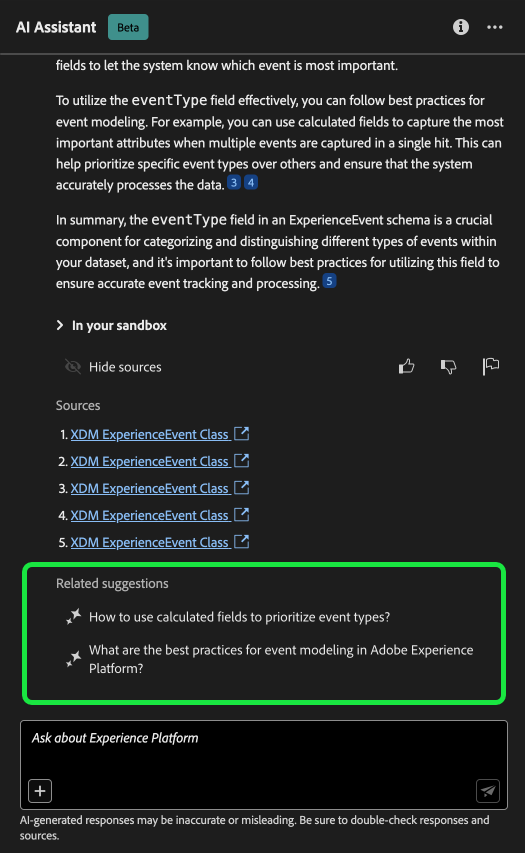
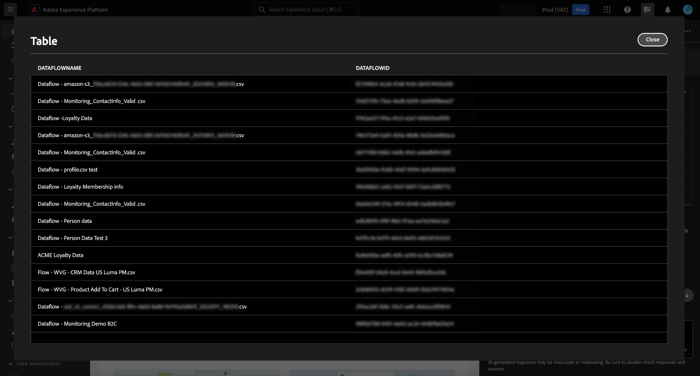

# Assistente de IA para o Adobe Experience Platform

>[!NOTE]
>
>O Assistente de IA para Adobe Experience Platform está atualmente na versão beta. O recurso e a documentação estão sujeitos a alterações.

O Assistente de IA é um recurso da interface do usuário que você pode usar para navegar e entender os conceitos do Adobe Experience Platform e do Real-time Customer Data Platform e as informações de uso sobre seus objetos.

Você pode consultar o Assistente de IA para obter informações como:

* Orientação sobre como executar tarefas relacionadas a dados e públicos.
* Status e métricas dos objetos de dados existentes em sua organização.
* Exemplos de casos de uso e nuances para entender melhor seus objetos de dados, incluindo atributos, públicos, fluxos de dados, conjuntos de dados, destinos, esquemas e fontes.

Leia o guia abaixo para saber como você pode usar o Assistente de IA para navegar e entender seus fluxos de trabalho do Experience Platform e do Real-Time CDP.

>[!BEGINSHADEBOX]

**Como funciona o Assistente de IA?**

O Assistente de IA responde às perguntas enviadas consultando um banco de dados e, em seguida, traduzindo os dados do banco de dados em uma resposta legível.

Essa representação interna de dados subjacentes também é conhecida como Gráfico de conhecimento - uma Web abrangente de conceitos, dados e metadados para uma determinada resposta.

O Gráfico de conhecimento consiste em subgráficos que são referenciados sempre que as consultas são enviadas:

* Dados de uso do cliente.
* Dados de uso do cliente em vários meta-armazenamentos.
* Documentação do Experience League.

Há duas classes de perguntas a serem consideradas antes de consultar o Assistente de IA:

* **Questões de Conceito**: As perguntas conceituais são sobre conceitos de Adobe relacionados a dados ou públicos. Alguns exemplos de questões de conceito incluem:
   * Qual é a diferença entre a segmentação em lote e por transmissão?
   * Existem modelos de dados do setor e como usá-los?
   * Para que o Real-Time CDP é melhor usado?
* **Perguntas sobre uso**: perguntas sobre o uso são sobre os objetos de dados dentro da organização. Alguns exemplos de perguntas de uso incluem:
   * Quantos conjuntos de dados eu tenho?
   * Quantos atributos de esquema nunca foram usados?
   * Quais públicos-alvo foram ativados?

>[!ENDSHADEBOX]

## Objetivos que você pode alcançar com o AI Assistant {#objectives}

Você pode usar o Assistente de IA para objetivos como:

| Objetivo | Descrição | Exemplo |
| --- | --- | --- |
| Conceitos de aprendizado e fluxos de trabalho contínuos | <ul><li>Como usuário iniciante, você pode usar o AI Assistant para aprender conceitos do Real-Time CDP e do Adobe Journey Optimizer e integrar-se a produtos e recursos com os quais não está familiarizado.</li><li>Como um usuário experiente, você pode usar o AI Assistant para resolver um caso de borda que pode estar bloqueando seu fluxo de trabalho. | <ul><li>Como configurar um painel no Jornada Analytics?</li><li>Conte-me alguns casos de uso para o Real-Time CDP.</li></ul> |
| Solução de problemas | Use o Assistente de IA para saber como depurar erros básicos que você pode encontrar no fluxo de trabalho. | <ul><li>O que faz esse erro {ERROR_MESSAGE} quer dizer?</li><li>Por que não consigo excluir o público-alvo chamado &quot;Luma: Público-alvo de email&quot;?</li></ul> |
| Higiene da sandbox | Use o Assistente de IA para identificar objetos duplicados ou não utilizados, para que você possa manter sua sandbox com eficiência. | <ul><li>Você pode me mostrar públicos semelhantes?</li><li>Há esquemas que não tenham um conjunto de dados associado?</li></ul> |
| Análise de valor | Use o Assistente de IA para identificar os objetos de dados mais usados e avaliar os indicadores de desempenho ou encontrar os objetos de dados mais valiosos. | <ul><li>Quantos perfis estão em nossa definição de segmento &quot;Luma: Público-alvo de email&quot;?</li><li>Quando os públicos-alvo foram ativados para o destino do Experience Cloud Audiences?</li></ul> |
| Pesquisa | Use o AI Assistant para encontrar objetos de Experience Platform compatíveis, como públicos-alvo, conjuntos de dados, destinos, esquemas e fontes. | <ul><li>Liste os públicos-alvo que contêm &quot;Luma&quot; no nome que foram criados no último trimestre.</li><li>Quais atributos estão no esquema XDM &quot;Luma: Ações personalizadas&quot;?</li></ul> |
| Análise de impacto | Use o Assistente do AI para identificar objetos de dados que foram usados em determinados workflows para que você possa avaliar o impacto de quaisquer alterações. | <ul><li>Quais públicos-alvo usam `homeAddress.city` no esquema &quot;Luma: PersonProfiles&quot;?</li><li>Quais conjuntos de dados são os `consents.marketing.push.val` atributo de perfil armazenado em?</li></ul> |

## Acessar o assistente de IA na interface do usuário do Experience Platform

Para iniciar o Assistente de IA, selecione o **[!UICONTROL Ícone do Assistente de IA]** no cabeçalho superior da interface do Experience Platform.

A interface do Assistente de IA é exibida, fornecendo imediatamente informações para começar. Você pode usar as opções fornecidas em [!UICONTROL Ideias para começar] para responder a perguntas e comandos como:

* [!UICONTROL Quais dos meus públicos-alvo são ativados?]
* [!UICONTROL O que é um esquema?]
* [!UICONTROL Conte-me alguns casos de uso comuns do Real-Time CDP]

## Guia da interface do assistente de IA

>[!NOTE]
>
>O fluxo de trabalho a seguir é um exemplo que usa o processo de criação de esquema do evento de experiência para ilustrar como você pode usar o Assistente de IA ao usar a interface do usuário do Experience Platform.

Considere um caso de uso em que você esteja criando uma **Esquema de evento de troca de dispositivo**. Durante o processo de criação do schema de evento de experiência, você encontra o `eventType` campo. &quot;Nesse ponto, você tem a opção de sair do workflow e consultar a [noções básicas de uma composição de esquema](../xdm/schema/composition.md) ou você pode usar o AI Assistant para recuperar respostas para suas perguntas e encontrar recursos adicionais por meio dos links de documentação recomendados pelo AI Assistant.&quot;

Para começar, digite sua pergunta na caixa de texto fornecida. No exemplo abaixo, o Assistente de IA recebe a pergunta: &quot;**O que é o campo eventType em um esquema ExperienceEvent?**&quot;

O Assistente de IA consulta sua base de conhecimento e calcula uma resposta. Após alguns minutos, o Assistente de IA retorna uma resposta e sugestões relacionadas que você pode usar como prompts de acompanhamento.

Depois de receber uma resposta do Assistente de IA, você pode selecionar entre várias opções para decidir como deseja continuar.

### Recursos do Assistente de IA {#features}

Esta seção descreve os diferentes recursos do Assistente de IA que você pode usar durante os fluxos de trabalho no Experience Platform.

<!-- 
### Save your query {#save-your-query}

+++Select to view an example of how to save a query

To save your query, select the bookmark icon beside your question.

To access your saved queries, select the bookmark icon below the input box, then select the query you would like to run.

+++ -->

### Exibir dados em sua sandbox {#view-data-in-your-sandbox}

Dependendo da sua consulta, o Assistente de IA fornece informações adicionais relacionadas aos dados da sandbox. Para exibir como a resposta à sua consulta se aplica à sandbox específica, selecione **[!UICONTROL Em sua sandbox].**

Ao visualizar dados pertencentes à sua sandbox, o Assistente de IA pode fornecer links diretos para páginas específicas da interface do usuário que exibem seus dados consultados.

+++Selecione para exibir o exemplo

Neste exemplo, o Assistente de IA retorna informações adicionais sobre os esquemas XDM existentes na sandbox, incluindo a contagem total e os cinco campos mais usados.

+++

### Exibir citações {#view-citations}

Você pode verificar as respostas retornadas pelo Assistente de IA revisando as citações disponíveis em cada resposta.

+++Selecione para exibir um exemplo de como exibir fontes

Para exibir citações e validar a resposta do Assistente de IA, selecione **[!UICONTROL Mostrar fontes]**.

O Assistente de IA atualiza a interface e fornece links para a documentação que corroboram a resposta inicial. Além disso, quando as citações são ativadas, o Assistente de IA atualiza a resposta para incluir notas de rodapé a fim de indicar as partes específicas da resposta que fazem referência à documentação fornecida.

Você também pode usar as consultas fornecidas pelo Assistente de IA em **[!UICONTROL Sugestões relacionadas]** para explorar mais tópicos relacionados à sua consulta original.

+++

### Dados e visualização de uso {#usage-data-and-visualization}

Você deve estar em uma sandbox ativa para que o Assistente de IA responda suficientemente a uma pergunta sobre seus dados de uso.

+++Selecione para exibir um exemplo de perguntas de dados de uso e visualização de dados

No exemplo abaixo, o Assistente de IA é solicitado a fazer a seguinte consulta: **&quot;Mostrar os fluxos de dados criados usando a origem do Amazon S3&quot;** O, Assistente de IA, responde com uma tabela listando seus fluxos de dados e as IDs correspondentes. Para exibir toda a tabela de dados, selecione o ícone de expansão na parte superior direita.

Uma exibição expandida da tabela é exibida, fornecendo uma lista mais abrangente de fluxos de dados com base nos parâmetros da sua consulta.

Quando solicitado com uma pergunta sobre dados de uso, o Assistente de IA fornece uma explicação de como ele calculou a resposta. No exemplo abaixo, o Assistente de IA descreve as etapas executadas para identificar os fluxos de dados criados usando o [!DNL Amazon S3] origem.

Você também pode fornecer filtros e modificações às suas consultas e instruir o Assistente de IA a renderizar suas descobertas com base nos filtros incluídos. Por exemplo, você pode solicitar que o Assistente de IA mostre uma tendência da contagem de definições de segmento na ordem de sua data de criação, remover definições de segmento com total de perfis zero e usar nomes de meses em vez de números inteiros ao exibir os dados.

+++

### Usar preenchimento automático {#use-auto-complete}

Você pode usar a função de preenchimento automático para receber uma lista de objetos de dados que existem na sandbox. As recomendações de preenchimento automático estão disponíveis para os seguintes domínios: públicos-alvo, esquemas, conjuntos de dados, fontes e destinos.

+++Selecione para exibir um exemplo de preenchimento automático

Você pode usar o preenchimento automático incluindo o símbolo de mais (**`+`**) na sua query. Como alternativa, você também pode selecionar o sinal de mais (**`+`**) localizado na parte inferior da caixa de entrada de texto. Uma janela é exibida com uma lista de objetos de dados recomendados da sandbox.

+++

### Usar voltas múltiplas {#use-multi-turn}

Você pode usar os recursos de várias rodadas do Assistente de IA para ter uma conversa mais natural durante sua experiência. O Assistente de IA pode responder perguntas de acompanhamento, fornecidas. contexto pode ser deduzido de uma interação anterior.

+++Selecione para exibir um exemplo de curva múltipla

No exemplo abaixo, o Assistente de IA é solicitado primeiro a fornecer o número total de fluxos de dados e, em seguida, é solicitado a listar os 10 fluxos de dados mais recentes.

+++

## Fornecer feedback {#feedback}

Você pode fornecer feedback sobre sua experiência com o Assistente de IA usando as opções fornecidas com a resposta.

Para fornecer feedback, selecione polegares para cima, polegares para baixo ou um sinalizador depois de receber uma resposta do Assistente de IA e, em seguida, insira seu feedback na caixa de texto fornecida.

+++Selecione para exibir mais exemplos

>[!BEGINTABS]

>[!TAB Polegar para cima]

Selecione o ícone de miniatura para fornecer feedback sobre o que aconteceu de bom com a sua experiência com o Assistente de IA.

>[!TAB Polegar para baixo]

Selecione o ícone com miniaturas para fornecer feedback sobre o que pode ser melhorado com base na sua experiência com o Assistente de IA. Durante essa etapa, você também pode fornecer comentários específicos sobre a sua experiência. O feedback fornecido nos comentários é revisado diariamente.

>[!TAB Sinalizador]

Selecione o ícone de sinalizador para fornecer mais relatórios sobre a experiência usando o Assistente de IA.

>[!ENDTABS]

+++

## Documentação {#documentation}

Atualmente, o índice de documentação abrange o Adobe Experience Platform (Real-Time CDP e Públicos-alvo). O índice é atualizado periodicamente.

O modelo de recuperação de documentação é treinado em Experience Platform (Real-Time CDP e Audiences). Perguntas fora do escopo do Adobe Experience Platform, como, perguntas sobre outros produtos de Adobe como o Adobe Target e o Creative Cloud suite não podem ser respondidas.

## Dados de uso {#usage-date}

Você também pode fazer perguntas ao Assistente de IA sobre seus dados de uso nos seguintes domínios:

* Atributos
* Públicos-alvo
* Fluxos de dados
* Conjuntos de dados
* Destinos _(Perguntas sobre contas e algumas perguntas sobre fluxo de dados não podem ser respondidas no momento.)_
* Esquemas _(Perguntas relacionadas a grupos de campos não podem ser respondidas neste momento.)_
* Origens _(Perguntas relacionadas a contas não podem ser respondidas neste momento.)_

Para consultas de dados de uso, as respostas podem não refletir o estado atual da interface do usuário. Os dados que apóiam essas perguntas são atualizados uma vez a cada 24 horas. Por exemplo, as alterações que os usuários fazem no Real-Time CDP durante o dia são sincronizadas com os armazenamentos de dados à noite e, em seguida, ficam disponíveis para perguntas do usuário de manhã. Além disso, será necessário fazer logon em uma sandbox para pesquisar sobre dados específicos relacionados a objetos como públicos, esquemas, conjuntos de dados, atributos e destinos.

### Exemplo de perguntas sobre dados de uso {#example-usage-data-questions}

+++Selecione para ver uma lista de exemplos de perguntas sobre dados de uso

Leia a tabela abaixo para obter exemplos de perguntas sobre dados de uso e seus respectivos casos de uso:

| Tipo de pergunta | Caso de uso | Exemplos |
| --- | --- | --- | 
| Linhagem de dados | Rastrear o uso de um ou vários objetos em outros objetos Experience Platform | <ul><li>Quais conjuntos de dados usam o esquema &quot;ACME schema&quot;?</li><li>Quantos conjuntos de dados foram assimilados usando o mesmo esquema?</li><li>Quais conjuntos de dados foram usados nos públicos ativados?</li><li>Liste os esquemas que têm atributos usados em públicos ativados.</li><li>Mostre os públicos que são ativados para &quot;ACME Destinations&quot; e têm mais de 1000 perfis.</li><li>Mostre os atributos usados nos públicos ativados que foram modificados após janeiro de 2023.</li><li>Quais são os conjuntos de dados assimilados pela fonte &quot;ACME Amazon S3&quot;?</li><li>Quais fluxos de dados estão associados ao &quot;Fluxo de dados de fidelidade do ACME&quot;?</li><li>Liste os esquemas relacionados a públicos ativados e que foram criados nos últimos 1 ano.</li></ul> |
| Distribuição e agregações | Perguntas baseadas em resumo sobre o uso do objeto Experience Platform | <ul><li>Qual é a porcentagem de públicos ativados?</li><li>Quantos campos são usados na segmentação?</li><li>Quais públicos-alvo são ativados para o maior número de destinos?</li><li>Listar públicos duplicados.</li><li>Mostre-me os públicos ativados para &quot;ACME Destinations&quot; e classifique-os por tamanho de perfil.</li><li>Qual é a porcentagem dos públicos-alvo que não foram ativados, mas têm mais de 100 perfis. Mostre-me os nomes deles.</li><li>Listar os 3 conectores de origem que assimilam dados nos meus conjuntos de dados.</li><li>Liste os 5 principais atributos usados em públicos ativados com base em sua ocorrência.</li></ul> |
| Pesquisa de objeto | Recupere ou acesse um objeto Experience Platform ou suas propriedades. | <ul><li>Quais conjuntos de dados não têm nenhum esquema associado a eles</li><li>Listar os atributos usados para o &quot;Público-alvo da ACME&quot;?</li><li>Forneça a lista de esquemas que estão habilitados para perfil, mas que não foram modificados desde sua criação.</li><li>Quais públicos-alvo foram modificados na semana passada?</li><li>Liste os públicos-alvo que têm as mesmas definições de segmento, juntamente com a data de criação.</li><li>Quais conjuntos de dados são ativados por perfil e também incluem quantos públicos-alvo foram criados de cada conjunto de dados.</li><li>Quais contas de origem estão associadas ao conjunto de dados XYZ?</li><li>Mostre-me a definição de segmento e a data de modificação de &quot;Público-alvo da ACME&quot;.</li></ul> |
| Comparação de objetos | Identifique públicos-alvo duplicados. | <ul><li>Com base na definição de segmento, liste os públicos-alvo que são duplicados.</li><li>Quais públicos-alvo duplicados são ativados para &quot;Destinos ACME&quot;.</li></ul> |

+++

## Formular suas perguntas {#phrasing-your-questions}

Você deve enviar suas perguntas ao Assistente de IA com clareza e contexto para obter uma resposta o mais precisa possível. Consulte a seguinte lista de dicas para obter orientação sobre como fazer uma pergunta clara com contexto:

* Apresente sua tarefa e/ou pergunta de maneira concisa.
* Evite linguagem ambígua ou sintaxe excessivamente complexa para facilitar a compreensão.
* Forneça contexto relevante em relação à sua tarefa e/ou pergunta, pois o contexto pode ajudar o Assistente de IA a gerar respostas mais relevantes.

Leia a tabela abaixo para obter mais orientações sobre as práticas recomendadas a serem seguidas ao fazer perguntas ao Assistente de IA:

| Fazer | Exemplo |
| --- | --- |
| <ul><li>Seja específico sobre o objeto ou as informações que deseja recuperar ou analisar.</li><li>Tente colocar os nomes dos objetos de dados entre aspas. Se você souber apenas uma parte do nome do objeto, também poderá especificá-lo na pergunta.</li><li>Uso [preenchimento automático do objeto](./ui-guide.md#use-auto-complete) para ajudar o Assistente de IA a entender melhor o contexto da consulta.</li></ul> | <ul><li>Quais conjuntos de dados usam o esquema &quot;Luma - Fidelidade&quot;?</li><li>Mostre-me os segmentos ativados que têm &quot;Luma&quot; em seus nomes. Classificá-los por contagem de perfis.</li></ul> |
| <ul><li>Evite ambiguidades e use linguagem clara</li><li>Use terminologia precisa para garantir mais clareza em seu query.</li><li>Ao fazer perguntas sobre o Adobe Experience Platform, tente usar a terminologia específica do Experience Platform para melhorar a relevância das respostas.</li></ul> | <ul><li>Quantos perfis eu tenho em &quot;ACME Audience&quot;.</li><li>Mostre-me os 5 principais atributos XDM usados em públicos ativados.</li></ul> |
| <ul><li>Forneça contexto ou especifique um critério para filtrar os resultados.</li><li>Use um critério de filtro nas perguntas para limitar o volume de dados na resposta.</li></ul> | <ul><li>Mostre-me públicos que não foram ativados e foram criados há mais de 6 meses e que nunca foram modificados.</li><li>Mostre-me públicos ativados para &quot;ACME Destination&quot; e têm mais de 10000 perfis.</li></ul> |

{style="table-layout:auto"}

| Não | Exemplo |
| --- | --- |
| Use uma linguagem vaga ou ambígua. | <ul><li>Forneça-me informações sobre conjuntos de dados.</li><li>Quantos usuários eu tenho em &quot;ACME Audience&quot;?</li><li>Mostrar segmentos.</li><li>Listar atributos.</li></ul> |
| Faça solicitações incompletas. | &quot;Luma - Conjunto de dados de fidelidade&quot; |
| Assumir conhecimento sem contexto. | <ul><li>Públicos nos últimos 6 meses.</li><li>Criar uma consulta para mim.</li></ul> |
| Formular consultas muito complexas. | Fornecer uma análise abrangente da linhagem de dados em todos os objetos e suas dependências. |
| Omitir critérios ou parâmetros. | Mostre-me conjuntos de dados. |

{style="table-layout:auto"}

## Informações adicionais {#additional-information}

Consulte esta seção para obter informações adicionais sobre o Assistente de IA para o Experience Platform.

### Avisos e limitações {#caveats-and-limitations}

A seção a seguir descreve as limitações e limitações atuais a serem consideradas ao usar o Assistente de IA.

#### Conversa pequena limitada

Você pode iniciar uma pequena conversa com o Assistente de IA, mas essa capacidade é limitada no momento.

#### Perguntas sobre recursos

O Assistente de IA pode dar uma impressão imprecisa do que pode fazer. Ele pode responder incorretamente aos seguintes tipos de perguntas:

| Exemplo de pergunta | Observação |
| --- | --- |
| &quot;Você pode responder perguntas sobre {ENTITY}?&quot; | Desde que o Assistente de IA possa encontrar uma única página fazendo referência a uma determinada entidade em seu índice, ele responderá sim. |
| &quot;Você sabe **x** idioma?&quot; | Atualmente, o Assistente de IA só oferece suporte ao inglês, mas pode responder &quot;sim&quot;, pois o modelo subjacente é compatível. |
| &quot;Você pode fazer...?&quot; | O Assistente de IA pode responder sim, mesmo que não possa. |

## Perguntas frequentes {#faq}

Veja a seguir uma lista de respostas para perguntas frequentes sobre o Assistente de IA.

### As informações do Assistente de IA são fornecidas em tempo real?

Os dados apresentados nas respostas do Assistente de IA são atualizados diariamente. Isso significa que os dados em respostas podem ser até 24 horas mais antigos do que os dados que você pode ver na interface do usuário do Experience Platform, no momento da resposta.

### A quais aplicativos do Adobe o Assistente de IA oferece suporte?

O Assistente de IA oferece suporte a perguntas de conceito do Adobe Experience Platform, Real-time Customer Data Platform e Adobe Journey Optimizer. Para perguntas sobre o uso de dados, no momento, o Assistente de IA é compatível apenas com objetos de dados do Real-Time CDP.

### Quais são os recursos do Assistente de IA?

O Assistente de IA pode abordar consultas de conceito de Adobe e responder perguntas relacionadas ao uso de objetos Experience Platform. (Por exemplo, &quot;Quantos públicos-alvo são ativados?&quot;).

### O Assistente de IA pode fornecer informações sobre dados de perfil?

Não. O Assistente de IA não tem acesso aos dados no nível do perfil.

### Minhas informações pessoais serão usadas nos dados de treinamento do Assistente de IA?

O Assistente de IA não usa informações pessoais para fins de treinamento. Não forneça nenhuma informação pessoal sobre você (incluindo seu nome ou informações de contato) ou qualquer outra pessoa ao Assistente de IA.