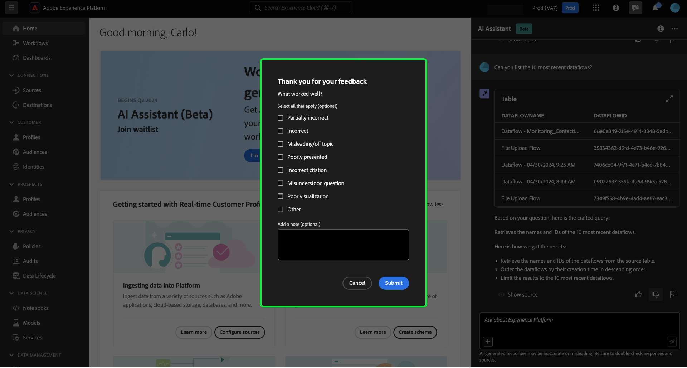

# Assistente de IA para o Adobe Experience Platform

>[!NOTE]
>
> O Assistente de IA para Adobe Experience Platform está atualmente em Alpha. O recurso e a documentação estão sujeitos a alterações.

O Assistente de IA é um recurso da interface do usuário que você pode usar para navegar e entender os conceitos do Adobe Experience Platform e do Real-time Customer Data Platform e as informações de uso sobre seus objetos.

Você pode consultar o Assistente de IA para obter informações como:

* Orientação sobre como executar tarefas relacionadas a dados e públicos.
* Status e métricas dos objetos de dados existentes em sua organização.
* Exemplos de casos de uso e nuances para entender melhor seus objetos de dados, incluindo atributos, públicos, fluxos de dados, conjuntos de dados, destinos, esquemas e fontes.

Leia o guia abaixo para saber como você pode usar o Assistente de IA para navegar e entender seus fluxos de trabalho do Experience Platform e do Real-Time CDP.

>[!BEGINSHADEBOX]

**Como funciona o Assistente de IA?**

O Assistente de IA responde às perguntas enviadas consultando um banco de dados e, em seguida, traduzindo os dados do banco de dados em uma resposta legível.

Essa representação interna de dados subjacentes também é conhecida como Gráfico de conhecimento - uma Web abrangente de conceitos, dados e metadados para uma determinada resposta.

O Gráfico de conhecimento consiste em subgráficos que são referenciados sempre que as consultas são enviadas:

* Dados de uso do cliente.
* Dados de uso do cliente em vários meta-armazenamentos.
* Documentação do Experience League.

Há duas classes de perguntas a serem consideradas antes de consultar o Assistente de IA:

* **Questões de Conceito**: As perguntas conceituais são sobre conceitos de Adobe relacionados a dados ou públicos. Alguns exemplos de questões de conceito incluem:
   * Qual é a diferença entre a segmentação em lote e por transmissão?
   * Existem modelos de dados do setor e como usá-los?
   * Para que o Real-Time CDP é melhor usado?
* **Perguntas sobre uso**: perguntas sobre o uso são sobre os objetos de dados dentro da organização. Alguns exemplos de perguntas de uso incluem:
   * Quantos conjuntos de dados eu tenho?
   * Quantos atributos de esquema nunca foram usados?
   * Quais públicos-alvo foram ativados?

>[!ENDSHADEBOX]

## Objetivos que você pode alcançar com o AI Assistant

Você pode usar o Assistente de IA para objetivos como:

| Objetivo | Descrição | Exemplo |
| --- | --- | --- |
| Conceitos de aprendizado e fluxos de trabalho contínuos | <ul><li>Como usuário iniciante, você pode usar o AI Assistant para aprender conceitos do Real-Time CDP e do Adobe Journey Optimizer e integrar-se a produtos e recursos com os quais não está familiarizado.</li><li>Como um usuário experiente, você pode usar o AI Assistant para resolver um caso de borda que pode estar bloqueando seu fluxo de trabalho. | <ul><li>Como configurar um painel no Jornada Analytics?</li><li>Conte-me alguns casos de uso para o Real-Time CDP.</li></ul> |
| Solução de problemas | Use o Assistente de IA para saber como depurar erros básicos que você pode encontrar no fluxo de trabalho. | <ul><li>O que faz esse erro {ERROR_MESSAGE} quer dizer?</li><li>Por que não consigo excluir o público-alvo chamado &quot;Luma: Público-alvo de email&quot;?</li></ul> |
| Higiene da sandbox | Use o Assistente de IA para identificar objetos duplicados ou não utilizados, para que você possa manter sua sandbox com eficiência. | <ul><li>Você pode me mostrar públicos semelhantes?</li><li>Há esquemas que não tenham um conjunto de dados associado?</li></ul> |
| Análise de valor | Use o Assistente de IA para identificar os objetos de dados mais usados e avaliar os indicadores de desempenho ou encontrar os objetos de dados mais valiosos. | <ul><li>Quantos perfis estão em nossa definição de segmento &quot;Luma: Público-alvo de email&quot;?</li><li>Quando os públicos-alvo foram ativados para o destino do Experience Cloud Audiences?</li></ul> |
| Pesquisa | Use o AI Assistant para encontrar objetos de Experience Platform compatíveis, como públicos-alvo, conjuntos de dados, destinos, esquemas e fontes. | <ul><li>Liste os públicos-alvo que contêm &quot;Luma&quot; no nome que foram criados no último trimestre.</li><li>Quais atributos estão no esquema XDM &quot;Luma: Ações personalizadas&quot;?</li></ul> |
| Análise de impacto | Use o Assistente do AI para identificar objetos de dados que foram usados em determinados workflows para que você possa avaliar o impacto de quaisquer alterações. | <ul><li>Quais públicos-alvo usam `homeAddress.city` no esquema &quot;Luma: PersonProfiles&quot;?</li><li>Quais conjuntos de dados são os `consents.marketing.push.val` atributo de perfil armazenado em?</li></ul> |

## Acessar o assistente de IA na interface do usuário do Experience Platform

Para iniciar o Assistente de IA, selecione o **[!UICONTROL Ícone do Assistente de IA]** no cabeçalho superior da interface do Experience Platform.

A interface do Assistente de IA é exibida, fornecendo imediatamente informações para começar. Você pode usar as opções fornecidas em [!UICONTROL Ideias para começar] para responder a perguntas e comandos como:

* [!UICONTROL Quais dos meus públicos-alvo são ativados?]
* [!UICONTROL O que é um esquema?]
* [!UICONTROL Conte-me alguns casos de uso comuns do Real-Time CDP]

Para interagir com o AI Assistant, use a caixa de entrada para digitar suas consultas ou comandos. Você também pode usar o (**`+`**) para utilizar a função de preenchimento automático e o ícone de marcador para acessar suas consultas e comandos marcados.

## Exemplo de caso de uso: usar o AI Assistant para acelerar seu processo de criação de esquema

>[!NOTE]
>
>O fluxo de trabalho a seguir é um exemplo que usa o processo de criação de esquema do evento de experiência para ilustrar como você pode usar o Assistente de IA ao usar a interface do usuário do Experience Platform.

Considere um caso de uso em que você esteja criando uma **Esquema de evento de troca de dispositivo**. Durante o processo de criação do schema de evento de experiência, você encontra o `eventType` campo. &quot;Nesse ponto, você tem a opção de sair do workflow e consultar a [noções básicas de uma composição de esquema](../xdm/schema/composition.md) ou você pode usar o AI Assistant para recuperar respostas para suas perguntas e encontrar recursos adicionais por meio dos links de documentação recomendados pelo AI Assistant.&quot;

Para começar, digite sua pergunta na caixa de texto fornecida. No exemplo abaixo, o Assistente de IA recebe a pergunta: &quot;**O que é o campo eventType em um esquema ExperienceEvent?**&quot;

O Assistente de IA consulta sua base de conhecimento e calcula uma resposta. Após alguns minutos, o Assistente de IA retorna uma resposta e sugestões relacionadas que você pode usar como prompts de acompanhamento.

Depois de receber uma resposta do Assistente de IA, você pode selecionar entre várias opções para decidir como deseja continuar.

### Salve sua consulta {#save-your-query}

+++Selecione para exibir um exemplo de como salvar uma consulta

Para salvar a consulta, selecione o ícone de marcador ao lado da pergunta.

Para acessar as consultas salvas, selecione o ícone de marcador abaixo da caixa de entrada e selecione a consulta que deseja executar.

+++

### Exibir dados em sua sandbox {#view-data-in-your-sandbox}

+++Selecione para exibir o exemplo

Dependendo da sua consulta, o Assistente de IA fornece informações adicionais relacionadas aos dados da sandbox. Para exibir como a resposta à sua consulta se aplica à sandbox, selecione **[!UICONTROL Em sua sandbox].**

Durante essa etapa, o Assistente de IA pode fornecer links diretos para as páginas da interface do usuário de determinados objetos em questão. No exemplo abaixo, o Assistente de IA fornece links diretos para o [!UICONTROL Esquemas] e [!UICONTROL Segmentos] Páginas de interface do usuário.

+++

### Verificar a resposta {#verify-the-response}

+++Selecione para exibir um exemplo de como exibir fontes

Para exibir citações e validar a resposta do Assistente de IA, selecione **[!UICONTROL Mostrar fontes]**. O Assistente de IA fornece links para a documentação que confirma sua resposta. Você também pode usar as consultas fornecidas pelo Assistente de IA em [!UICONTROL Sugestões relacionadas] para explorar mais tópicos relacionados à sua consulta original.

+++

### Uso e visualização de dados {#data-usage-and-visualization}

+++Selecione para exibir um exemplo de perguntas de uso de dados e visualização de dados

Para que o Assistente de IA responda a uma consulta sobre o uso de dados em sua organização, você deve estar em uma sandbox ativa.

No exemplo abaixo, o Assistente de IA é fornecido com a seguinte consulta: **&quot;Mostre-me definições de segmento com mais de 1000 perfis e inclua o status de ativação.&quot;** O Assistente de IA responde com um gráfico que visualiza os dados de segmento e perfil.

Você pode passar o mouse sobre uma barra individual para visualizar dados específicos. Você também pode selecionar o ícone de expansão para obter uma exibição maior do gráfico.

Uma exibição expandida da visualização é exibida. É possível usar a modal expandida para inspecionar ainda mais os dados, além de ser especialmente útil quando a visualização retorna com um grande número de colunas.

Quando solicitado com uma pergunta sobre o uso de dados, o Assistente de IA fornece uma explicação de como ele calculou a resposta. No exemplo abaixo, o Assistente de IA descreve as etapas executadas para exibir definições de segmento com mais de 1000 perfis e seus respectivos status de ativação.

Você também pode fornecer filtros e modificações às suas consultas e instruir o Assistente de IA a renderizar suas descobertas com base nos filtros incluídos. Por exemplo, você pode pedir ao Assistente de IA para mostrar uma tendência das definições de segmento de contagem na ordem de sua data de criação, remover definições de segmento com zero total de perfis e usar nomes de meses em vez de números inteiros ao exibir os dados.

+++

### Usar preenchimento automático {#use-auto-complete}

+++Selecione para exibir um exemplo de preenchimento automático

Você pode usar a função de preenchimento automático para receber uma lista de objetos de dados que existem na sandbox. As recomendações de preenchimento automático estão disponíveis para os seguintes domínios: públicos-alvo, esquemas, conjuntos de dados, fontes e destinos.

Você pode usar o preenchimento automático incluindo o símbolo de mais (**`+`**) na sua query. Como alternativa, você também pode selecionar o sinal de mais (**`+`**) localizado na parte inferior da caixa de entrada de texto. Uma janela é exibida com uma lista de objetos de dados recomendados da sandbox.

Em seguida, selecione o objeto de dados que deseja consultar para concluir a pergunta e, em seguida, envie a pergunta.

+++

### Usar voltas múltiplas {#use-multi-turn}

+++Selecione para exibir um exemplo de curva múltipla

Você pode usar os recursos de várias rodadas do Assistente de IA para ter uma conversa mais natural durante sua experiência. O Assistente de IA pode responder perguntas de acompanhamento, fornecidas. contexto pode ser deduzido de uma interação anterior.

No exemplo abaixo, o Assistente de IA é solicitado a fornecer o número total de fluxos de dados na organização atual.

Em seguida, o Assistente de IA recebe outra solicitação de acompanhamento. Desta vez, o Assistente de IA responde listando os fluxos de dados que existem atualmente em sua organização.

+++

## Documentação {#documentation}

Atualmente, o índice de documentação abrange o Adobe Experience Platform (Real-Time CDP e Públicos-alvo). O índice é atualizado periodicamente.

O modelo de recuperação de documentação é treinado em Experience Platform (Real-Time CDP e Audiences). Perguntas fora do escopo do Adobe Experience Platform, como, perguntas sobre outros produtos de Adobe como o Adobe Target e o Creative Cloud suite não podem ser respondidas.

## Uso de dados {#data-usage}

Você também pode fazer perguntas ao Assistente de IA sobre o uso de dados nos seguintes domínios:

* Atributos
* Públicos-alvo
* Fluxos de dados
* Conjuntos de dados
* Destinos _(Perguntas sobre contas e algumas perguntas sobre fluxo de dados não podem ser respondidas no momento.)_
* Esquemas _(Perguntas relacionadas a grupos de campos não podem ser respondidas neste momento.)_
* Origens _(Perguntas relacionadas a contas não podem ser respondidas neste momento.)_

Para consultas de dados de uso, as respostas podem não refletir o estado atual da interface do usuário. Os dados que apóiam essas perguntas são atualizados uma vez a cada 24 horas. Por exemplo, as alterações que os usuários fazem no Real-Time CDP durante o dia são sincronizadas com os armazenamentos de dados à noite e, em seguida, ficam disponíveis para perguntas do usuário de manhã. Talvez seja necessário formatar as perguntas como: &quot;Quando foi o público-alvo com o título {TITLE} criado?&quot; em vez de, &quot;Quando foi o {TITLE} público criado?&quot;

Você precisará fazer logon em uma sandbox para consultar sobre dados específicos relacionados a objetos como públicos, esquemas, conjuntos de dados, atributos e destinos.

### Exemplo de perguntas de uso de dados {#example-data-usage-questions}

+++Selecione para ver uma lista de perguntas de exemplo sobre uso de dados

| Tipo de pergunta | Descrição | Exemplos |
| --- | --- | --- | 
| Linhagem de dados | Rastrear o uso de um ou vários objetos em outros objetos Experience Platform | <ul><li>Quais conjuntos de dados usam {SCHEMA_NAME} esquema?</li><li>Quantos conjuntos de dados foram assimilados usando o mesmo esquema?</li><li>Quais conjuntos de dados foram usados nos públicos ativados?</li><li>Liste os esquemas que têm atributos usados em públicos ativados.</li><li>Mostre-me os públicos que estão ativados para {DESTINATION_ACCOUNT_NAME} e têm mais de 1000 perfis.</li><li>Mostre os atributos usados nos públicos ativados que foram modificados após janeiro de 2023.</li><li>Quais são os conjuntos de dados assimilados via {SOURCE_NAME}?</li><li>A quais fluxos de dados estão associados {DATAFLOW_NAME}</li><li>Liste os esquemas relacionados a públicos ativados e que foram criados nos últimos 1 ano.</li></ul> |
| Distribuição e agregações | Perguntas baseadas em resumo sobre o uso do objeto Experience Platform | <ul><li>Qual é a porcentagem de públicos ativados?</li><li>Quantos campos são usados na segmentação?</li><li>Quais públicos-alvo são ativados para o maior número de destinos?</li><li>Listar públicos duplicados.</li><li>Mostrar os públicos ativados para {DESTINATION_ACCOUNT_NAME} e classificá-los por tamanho de perfil.</li><li>Qual é a porcentagem dos públicos-alvo que não foram ativados, mas têm mais de 100 perfis. Mostre-me os nomes deles.</li><li>Listar os 3 conectores de origem que assimilam dados nos meus conjuntos de dados.</li><li>Liste os 5 principais atributos usados em públicos ativados com base em sua ocorrência.</li></ul> |
| Pesquisa de objeto | Recupere ou acesse um objeto Experience Platform ou suas propriedades. | <ul><li>Quais conjuntos de dados não têm nenhum esquema associado a eles</li><li>Listar os atributos usados para {AUDIENCE_NAME}?</li><li>Forneça a lista de esquemas que estão habilitados para perfil, mas que não foram modificados desde sua criação.</li><li>Quais públicos-alvo foram modificados na semana passada?</li><li>Liste os públicos-alvo que têm as mesmas definições de segmento, juntamente com a data de criação.</li><li>Quais conjuntos de dados são ativados por perfil e também incluem quantos públicos-alvo foram criados de cada conjunto de dados.</li><li>Quais contas de origem estão associadas ao conjunto de dados XYZ?</li><li>Mostrar a definição do segmento e a data de modificação de {AUDIENCE_NAME}.</li></ul> |

+++

## Fornecer feedback {#feedback}

>[!BEGINSHADEBOX]

**Seu feedback é solicitado**

Durante esse estágio de Alpha, você é convidado a fornecer feedback sobre as respostas recebidas do Assistente de IA. Todas as respostas e comentários enviados são revisados para continuar a melhorar a experiência do Assistente de IA.

Para fornecer feedback, selecione polegares para cima ou para baixo depois de receber uma resposta do Assistente de IA e, em seguida, insira seu feedback na caixa de texto fornecida. Em seguida, selecione **[!UICONTROL Enviar feedback]** para enviar.

>[!ENDSHADEBOX]

+++Fornecer feedback

>[!BEGINTABS]

>[!TAB Polegar para cima]

Selecione o ícone de miniatura para fornecer feedback sobre o que aconteceu de bom com a sua experiência com o Assistente de IA.

>[!TAB Polegar para baixo]

Selecione o ícone com miniaturas para fornecer feedback sobre o que pode ser melhorado com base na sua experiência com o Assistente de IA. Durante essa etapa, você também pode fornecer comentários específicos sobre a sua experiência. O feedback fornecido nos comentários é revisado diariamente.

>[!TAB Sinalizador]

Selecione o ícone de sinalizador para fornecer mais relatórios sobre a experiência usando o Assistente de IA.

>[!ENDTABS]

+++

## Informações adicionais {#additional-information}

Consulte esta seção para obter informações adicionais sobre o Assistente de IA para o Experience Platform.

### Avisos e limitações {#caveats-and-limitations}

A seção a seguir descreve as limitações e limitações atuais a serem consideradas ao usar o Assistente de IA.

#### Conversa pequena limitada

Você pode iniciar uma pequena conversa com o Assistente de IA, mas essa capacidade é limitada no momento.

#### Perguntas sobre recursos

O Assistente de IA pode dar uma impressão imprecisa do que pode fazer. Ele pode responder incorretamente aos seguintes tipos de perguntas:

| Exemplo de pergunta | Observação |
| --- | --- |
| &quot;Você pode responder perguntas sobre {ENTITY}?&quot; | Desde que o Assistente de IA possa encontrar uma única página fazendo referência a uma determinada entidade em seu índice, ele responderá sim. |
| &quot;Você sabe **x** idioma?&quot; | Atualmente, o Assistente de IA só oferece suporte ao inglês, mas pode responder &quot;sim&quot;, pois o modelo subjacente é compatível. |
| &quot;Você pode fazer...?&quot; | O Assistente de IA pode responder sim, mesmo que não possa. |

### Dicas {#tips}

A seção a seguir descreve algumas dicas e soluções alternativas a serem consideradas ao usar o Assistente de IA.

#### As perguntas podem ser respondidas com a fonte de informações errada

Há casos em que sua pergunta sobre os dados de uso pode resultar em uma resposta com base na documentação. Isso ocorre porque o Assistente de IA pode rotear incorretamente sua pergunta para a fonte de informações errada. Você pode evitar isso ao:

* Reformular sua pergunta para usar uma linguagem mais SQL
* Explicitamente chamando a fonte de informações a ser usada.

Leia a tabela abaixo para ver exemplos:

| Pergunta inválida | Boa pergunta | Notas |
| --- | --- | --- |
| Qual é o meu maior público-alvo? | Qual é o meu maior público-alvo? Uso de dados. | Informe explicitamente ao Assistente de IA que você deseja que a resposta seja baseada em dados. |
| Qual é o meu maior público-alvo? | Liste meu maior público. | Há casos em que uma pergunta &quot;o que...&quot; pode ser confundida com uma pergunta baseada em documentação. Usar um comando como &quot;lista&quot; é um indicador mais forte de que você está fazendo uma pergunta com dados em contexto. |
| Quantos conjuntos de dados eu tenho? | Contar meus conjuntos de dados. | A pergunta original funciona para públicos-alvo, mas pode não funcionar com conjuntos de dados. |
