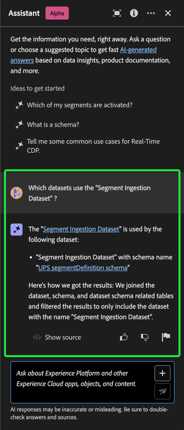

# Assistente para Adobe Experience Platform

>[!NOTE]
>
>O assistente para Adobe Experience Platform está atualmente em Alpha. O recurso e a documentação estão sujeitos a alterações.

O Assistente para Adobe Experience Platform é um recurso de interface do usuário que você pode usar para navegar e entender os conceitos de Experience Platform e Real-time Customer Data Platform, além de informações de uso sobre seus objetos.

Você pode consultar o Assistente para obter informações como:

* Orientação sobre como executar tarefas relacionadas a dados e públicos.
* Status e métricas dos objetos de dados existentes em sua organização.
* Exemplos de casos de uso e nuances para entender melhor seus objetos de dados, incluindo atributos, conjuntos de dados, destinos, esquemas, segmentos e fontes.

Este documento fornece informações sobre como acessar e usar o Assistente para fazer perguntas e receber respostas sobre os conceitos do Experience Platform e do Real-Time CDP.

>[!BEGINSHADEBOX]

**Como funciona o Assistente?**

O Assistente responde às perguntas enviadas consultando um banco de dados e convertendo os dados do banco de dados em uma resposta legível.

Essa representação interna de dados subjacentes também é conhecida como Gráfico de conhecimento - uma Web abrangente de conceitos, dados e metadados para uma determinada resposta.

O Gráfico de conhecimento consiste em subgráficos que são referenciados sempre que as consultas são enviadas:

* Dados de uso do cliente.
* Dados de uso do cliente em vários meta-armazenamentos.
* Documentação do Experience League.

Há duas classes de perguntas a serem consideradas antes de consultar o Assistente:

* **Questões de Conceito**: As perguntas conceituais são sobre conceitos de Adobe relacionados a dados ou públicos. Alguns exemplos de questões de conceito incluem:
   * Qual é a diferença entre a segmentação em lote e por transmissão?
   * Existem modelos de dados do setor e como usá-los?
   * Para que o Real-Time CDP é melhor usado?
* **Perguntas sobre uso**: perguntas sobre o uso são sobre os objetos de dados dentro da organização. Alguns exemplos de perguntas de uso incluem:
   * Quantos conjuntos de dados eu tenho?
   * Quantos atributos de esquema nunca foram usados?
   * Quais segmentos foram ativados?

>[!ENDSHADEBOX]

## Assistente de acesso para Experience Platform na interface do usuário

Você pode acessar o Assistente na navegação de cabeçalho na interface do usuário do Experience Platform.

Selecione o **[!UICONTROL Ícone do assistente]** no cabeçalho para iniciar o painel Assistente.

<!-- +++Use immersive mode

To use [!DNL Immersive mode] select the focus icon in the header navigation of the Assistant.

A dedicated pop-up interface for Assistant appears at the center of your screen.

+++

From here, you can input your question in the text box and query Assistant for concepts regarding data or audiences. You can also ask questions about your data objects to better understand how you can use them for your respective use case.  -->

### Exemplo de caso de uso: usar o assistente para acelerar o processo de criação de esquema {#example-use-case}

>[!NOTE]
>
>O exemplo de fluxo de trabalho a seguir usa o processo de criação de esquema ExperienceEvent para ilustrar como você pode usar o Assistente ao usar a interface do Experience Platform.

Considere um caso de uso em que você esteja criando uma **Esquema de evento de troca de dispositivo**. Durante o processo de criação do schema ExperienceEvent, você encontra o `eventType` campo. Nesse ponto, é possível sair do workflow e consultar a documentação no [noções básicas de uma composição de esquema](../xdm/schema/composition.md), ou você pode usar o Assistente para recuperar respostas imediatas para suas perguntas.

Para começar, digite sua pergunta na caixa de texto fornecida. No exemplo abaixo, o Assistente recebe a pergunta: &quot;**O que é o campo eventType em um esquema ExperienceEvent?**&quot;

O assistente então consulta sua base de conhecimento e calcula uma resposta. Após alguns instantes, o Assistente retornará uma resposta e sugestões relacionadas que você poderá usar como prompts de acompanhamento.

Uma determinada resposta fornece hiperlinks para quaisquer entidades referenciadas. No exemplo abaixo, selecione **[!UICONTROL Esquemas]** para exibir uma lista dos esquemas referenciados, ou **[!UICONTROL Segmentos]** para exibir uma lista de segmentos referenciados.

O Assistente fornece uma maneira de validar sua resposta ao exibir sua origem. Links para a documentação são fornecidos para perguntas de conceito, enquanto perguntas sobre o uso de dados podem ser verificadas com uma consulta SQL que demonstra como a resposta foi calculada.

### Pergunta de acompanhamento {#follow-up-question}

+++Selecione para exibir um exemplo de pergunta de acompanhamento

Você pode saber mais sobre um tópico específico fazendo uma pergunta complementar. No próximo exemplo, o Assistente é perguntado como o eventType pode ser usado na segmentação.

+++

### Pergunta de uso de dados {#data-usage-question}

+++Selecione para exibir um exemplo de pergunta de uso de dados

Você também pode fazer perguntas ao assistente sobre o uso de dados. Ao perguntar sobre o uso de dados, você deve estar em uma sandbox ativa para que o assistente responda à sua consulta.

Para respostas que envolvem informações de uso de dados, o Assistente fornece links para entidades em questão. Além disso, o Assistente fornece uma explicação sobre como ele calculou sua resposta.

+++

### Várias voltas {#multi-turn}

+++Selecione para exibir um exemplo de curva múltipla

Você pode usar os recursos de várias rodadas do Assistant para ter uma conversa mais natural durante sua experiência. O assistente é capaz de responder a perguntas de acompanhamento, pois o contexto pode ser inferido de uma interação anterior.

No exemplo abaixo, o Assistente é solicitado a listar os segmentos existentes na organização, como um acompanhamento de uma consulta anterior sobre o número total de segmentos.

Em seguida, o Assistente recebe outra solicitação de acompanhamento. Desta vez, o Assistente responde listando os segmentos existentes ordenados por seus respectivos tamanhos.

+++

### Usar preenchimento automático {#use-auto-complete}

+++Selecione para exibir um exemplo de preenchimento automático

Você pode usar a função de preenchimento automático para receber uma lista de objetos de dados que existem na sandbox. As recomendações de preenchimento automático estão disponíveis para os seguintes domínios: segmentos, esquemas, conjuntos de dados, fontes e destinos.

Para usar o preenchimento automático, insira um símbolo de mais (**`+`**) como parte da sua pergunta. Como alternativa, você também pode selecionar o símbolo de adição (**`+`**) na caixa de entrada de texto. Em seguida, uma janela é exibida com uma lista de objetos de dados recomendados que existem em sua sandbox.

Em seguida, selecione o objeto de dados que deseja consultar para concluir a pergunta e, em seguida, envie a pergunta.

+++

## Escopo {#scope}

O assistente pode responder a perguntas sobre os conceitos do Real-Time CDP e do Experience Platform, bem como sobre o uso de dados específico da sua conta de usuário. O assistente também pode inferir o contexto com base na página da interface do usuário em que você está. Ele pode identificar:

* A conta de usuário que você está usando.
* A organização à qual você pertence.
* A página que você está visualizando na tela.
* O recurso (incluindo o tipo e a ID) que você está visualizando na tela.
* Como você está no processo de um determinado fluxo de trabalho de Experience Platform ou Real-Time CDP, o Assistente pode deduzir sua intenção.

### Documentação {#documentation}

Atualmente, o índice de documentação abrange o Adobe Experience Platform (Real-Time CDP e Públicos-alvo). O índice é atualizado periodicamente.

O modelo de recuperação de documentação é treinado em Experience Platform (Real-Time CDP e Audiences). Perguntas fora do escopo do Adobe Experience Platform, como, perguntas sobre outros produtos de Adobe como o Adobe Target e o Creative Cloud suite não podem ser respondidas.

### Uso de dados {#data-usage}

Você também pode fazer perguntas ao assistente sobre o uso de dados nos seguintes domínios:

* Atributos
* Conjuntos de dados
* Destinos _(Perguntas sobre contas e algumas perguntas sobre fluxo de dados não podem ser respondidas no momento.)_
* Esquemas _(Perguntas relacionadas a grupos de campos não podem ser respondidas neste momento.)_
* Segmentos
* Fontes _(Perguntas relacionadas a contas não podem ser respondidas neste momento.)_

Para consultas de dados de uso, as respostas podem não refletir o estado atual da interface do usuário. Os dados que apóiam essas perguntas são atualizados uma vez a cada 24 horas. Por exemplo, as alterações que os usuários fazem no Real-Time CDP durante o dia são sincronizadas com os armazenamentos de dados à noite e, em seguida, ficam disponíveis para perguntas do usuário de manhã. Talvez seja necessário formatar as perguntas como: &quot;Quando foi o segmento com o título {TITLE} criado?&quot; em vez de, &quot;Quando foi o {TITLE} segmento criado?&quot;

Você precisará fazer logon em uma sandbox para consultar sobre dados específicos relacionados a objetos como esquemas, conjuntos de dados, atributos, destinos e segmentos.

### Exemplo de perguntas de uso de dados {#example-data-usage-questions}

+++Selecione para ver uma lista de perguntas de exemplo sobre uso de dados

| Tipo de pergunta | Descrição | Exemplos |
| --- | --- | --- | 
| Linhagem de dados | Rastrear o uso de um ou vários objetos em outros objetos Experience Platform | <ul><li>Quais conjuntos de dados usam {SCHEMA_NAME} esquema?</li><li>Quantos conjuntos de dados foram assimilados usando o mesmo esquema?</li><li>Quais conjuntos de dados foram usados nos segmentos ativados?</li><li>Liste os esquemas que têm atributos usados em segmentos ativados.</li><li>Mostrar os segmentos que estão ativados para {DESTINATION_ACCOUNT_NAME} e têm mais de 1000 perfis.</li><li>Mostrar os atributos usados nos segmentos ativados que foram modificados após janeiro de 2023.</li><li>Quais são os conjuntos de dados assimilados via {SOURCE_NAME}?</li><li>A quais fluxos de dados estão associados {DATAFLOW_NAME}</li><li>Liste os esquemas relacionados a segmentos ativados e que foram criados nos últimos 1 ano.</li></ul> |
| Distribuição e agregações | Perguntas baseadas em resumo sobre o uso do objeto Experience Platform | <ul><li>Qual é a porcentagem de segmentos ativados?</li><li>Quantos campos são usados na segmentação?</li><li>Quais segmentos são ativados para o maior número de destinos?</li><li>Listar segmentos duplicados.</li><li>Mostrar os segmentos ativados para {DESTINATION_ACCOUNT_NAME} e classificá-los por tamanho de perfil.</li><li>Qual é a porcentagem dos segmentos que não foram ativados, mas têm mais de 100 perfis. Mostre-me os nomes deles.</li><li>Listar os 3 conectores de origem que assimilam dados nos meus conjuntos de dados.</li><li>Liste os 5 principais atributos usados em segmentos ativados com base em sua ocorrência.</li></ul> |
| Pesquisa de objeto | Recupere ou acesse um objeto Experience Platform ou suas propriedades. | <ul><li>Quais conjuntos de dados não têm nenhum esquema associado a eles</li><li>Listar os atributos usados para {SEGMENT_NAME}?</li><li>Forneça a lista de esquemas que estão habilitados para perfil, mas que não foram modificados desde sua criação.</li><li>Quais segmentos foram modificados na última semana?</li><li>Liste os segmentos que têm as mesmas definições de segmento junto com sua data de criação.</li><li>Quais conjuntos de dados são ativados por perfil e também incluem quantos segmentos foram criados de cada conjunto de dados.</li><li>Quais contas de origem estão associadas ao conjunto de dados XYZ?</li><li>Mostrar a definição do segmento e a data de modificação de {SEGMENT_NAME}.</li></ul> |

+++

## Verificar a resposta {#verify-the-response}

Você pode verificar a resposta que o Assistente retorna usando várias maneiras diferentes.

### Citações para a documentação {#citations}

Com cada resposta, o Assistente fornece citações que você pode consultar para verificação ou mais informações.

Selecionar **[!UICONTROL Mostrar origem]** para obter uma lista de links para a documentação que o assistente menciona para calcular sua resposta. Ao selecionar um link para a documentação referenciada, você é levado para a seção relevante dessa página específica, com as informações específicas destacadas.

## Fornecer feedback {#feedback}

>[!BEGINSHADEBOX]

**Seu feedback é solicitado**

Durante esse estágio de Alpha, você é convidado a fornecer feedback sobre as respostas recebidas do Assistente. Todas as respostas e comentários enviados são revisados para continuar a melhorar a experiência do Assistente.

Para fornecer feedback, selecione polegares para cima ou para baixo depois de receber uma resposta do assistente e, em seguida, insira seu feedback na caixa de texto fornecida. Em seguida, selecione **[!UICONTROL Enviar feedback]** para enviar.

>[!ENDSHADEBOX]

+++Fornecer feedback

>[!BEGINTABS]

>[!TAB Polegar para cima]

Selecione o ícone de miniaturas para fornecer feedback sobre o que deu certo com sua experiência com o Assistente.

>[!TAB Polegar para baixo]

Selecione o ícone com miniaturas para fornecer feedback sobre o que pode ser melhorado com base na sua experiência com o Assistente. Durante essa etapa, você também pode fornecer comentários específicos sobre a sua experiência. O feedback fornecido nos comentários é revisado diariamente.

>[!TAB Sinalizador]

Selecione o ícone de sinalizador para fornecer mais relatórios sobre a sua experiência usando o Assistente.

>[!ENDTABS]

+++

## Informações adicionais {#additional-information}

Consulte esta seção para obter informações adicionais sobre o Assistente de Experience Platform.

### Avisos e limitações {#caveats-and-limitations}

A seção a seguir descreve as limitações e limitações atuais a serem consideradas ao usar o Assistente.
<!-- 
#### Conversational experience

You must consider several nuances regarding the conversational experience when querying the Assistant.

>[!NOTE]
>
>These limitations are temporary and are being improved upon throughout the course of the alpha.

>[!BEGINTABS]

>[!TAB Unable to infer context from prior discussion]

The Assistant currently cannot reference prior discussions as context for a given question. See the table below for examples:

| Ambiguous question | Clear question | Note |
| --- | --- | --- |
| <ul><li>First question: "What is a segment?"</li><li>Follow up question: "Are there different types of them?"</li></ul>| <ul><li>First question: "What is a segment?"</li><li>Follow up question: "Are there different types of **segments**?"</li></ul> | The Assistant cannot infer what "them" means. |
| <ul><li>First question: "What is a segment?"</li><li>Follow up question: "Can you elaborate more?"</li></ul> | <ul><li>First question: "What is a segment?"</li><li>Follow up question: "Explain what a segment is in depth"</li></ul> | The Assistant cannot intelligently reference documentation based on "more". |
| <ul><li>First question: "What is a segment?"</li><li>Follow up question: "Can you give me an example of one?"</li></ul> | <ul><li>First question: "What is a segment?"</li><li>Follow up question: "Can you give me an example of a segment?"</li></ul> | The Assistant cannot infer what you want an example of.|
| <ul><li>First question: "What is a batch segment?"</li><li>Follow up question: "How does it compare to a streaming segment?"</li></ul> | <ul><li>First question: "What is a batch segment?"</li><li>Follow up question: "Can you compare a streaming segment to a batch segment?"</li></ul> | The Assistant cannot infer what "it" is referring to and thus cannot compare the streaming segment. |
| <ul><li>First question: "How many segments do I have?"</li><li>Follow up question: "How many of them use Facebook as a destination?"</li></ul> | <ul><li>First question: "How many segments do I have?"</li><li>Follow up question: "How many of the segments that I have are using Facebook as a destination?"</li></ul> | The Assistant is cannot infer what "them" is referring to. |

{style="table-layout:auto"}

>[!TAB Unable to infer context from a page]

When asking the Assistant about a particular element of the Experience Platform UI page that you are on, you must clearly define the specific element within your question. 

| Ambiguous question | Clear question | Note |
| --- | --- | --- |
| "What does this do?" | "What does {PAGE_NAME} do? | The Assistant cannot infer what "this" is referring to. You must provide the specific page element that you are querying about. |
| "Why won't it save?" | "Why can't I save a new sandbox called {NAME}?" | The Assistant cannot infer what "it" is referring to and cannot know that you are having issues with an entity. |

{style="table-layout:auto"}

Furthermore, the Assistant can only answer questions regarding error messages, given that the error is documented in Experience League.

>[!TAB Ambiguity]

You must phrase your questions clearly and scope them within a product, application, or domain, as the Assistant currently cannot disambiguate questions.

| Ambiguous question | Clear question | Note |
| --- | --- | --- |
| "How do I create a filter? | How do I create a filter in Profile Query Language? | You must specify the feature that which you are filtering for because a variety of Experience Platform features support filtering. |
| "How do I get started? | How do I get started using destinations? | You must provide clarity on your goals and use case because overly broad concepts may result in generic or unnecessarily specific answers. |

{style="table-layout:auto"}

>[!ENDTABS] -->

#### Conversa pequena limitada

Você pode iniciar uma pequena conversa com o assistente, mas essa capacidade é atualmente limitada.

#### Perguntas sobre recursos

O assistente pode dar uma impressão imprecisa do que ele pode fazer. Ele pode responder incorretamente aos seguintes tipos de perguntas:

| Exemplo de pergunta | Observação |
| --- | --- |
| &quot;Você pode responder perguntas sobre {ENTITY}?&quot; | Se o Assistente conseguir encontrar uma única página fazendo referência a uma determinada entidade em seu índice, ele responderá sim. |
| &quot;Você sabe **x** idioma?&quot; | Atualmente, o Assistente só oferece suporte ao inglês, mas pode responder &quot;sim&quot;, pois o modelo subjacente é compatível com ele. |
| &quot;Você pode fazer...?&quot; | O assistente pode responder sim, mesmo que não possa. |

### Dicas {#tips}

A seção a seguir descreve algumas dicas e soluções alternativas a serem consideradas ao usar o Assistente.

#### As perguntas podem ser respondidas com a fonte de informações errada

Há casos em que sua pergunta sobre os dados de uso pode resultar em uma resposta com base na documentação. Isso ocorre porque o Assistente pode rotear incorretamente sua pergunta para a fonte de informações errada. Você pode evitar isso ao:

* Reformular sua pergunta para usar uma linguagem mais SQL
* Explicitamente chamando a fonte de informações a ser usada.

Leia a tabela abaixo para ver exemplos:

| Pergunta inválida | Boa pergunta | Notas |
| --- | --- | --- |
| Qual é meu maior segmento? | Qual é meu maior segmento? Uso de dados. | Informe explicitamente ao Assistente que você deseja que a resposta seja baseada em dados. |
| Qual é meu maior segmento? | Listar meu maior segmento. | Há casos em que uma pergunta &quot;o que...&quot; pode ser confundida com uma pergunta baseada em documentação. Usar um comando como &quot;lista&quot; é um indicador mais forte de que você está fazendo uma pergunta com dados em contexto. |
| Quantos conjuntos de dados eu tenho? | Contar meus conjuntos de dados. | A pergunta original funciona para segmentos, mas pode não funcionar com conjuntos de dados. |
