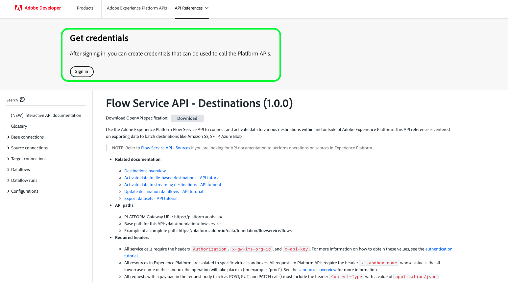

# Autenticar e acessar APIs da Experience Platform

Este documento fornece um tutorial passo a passo para obter acesso a uma conta de desenvolvedor do Adobe Experience Platform para fazer chamadas para APIs do Experience Platform. Ao final deste tutorial, você terá gerado ou coletado as seguintes credenciais que são necessárias como cabeçalhos em todas as chamadas de API do Experience Platform:

* `{ACCESS_TOKEN}`
* `{API_KEY}`
* `{ORG_ID}`

>[!TIP]
>
>Além das três credenciais acima, muitas APIs do Experience Platform também exigem que um `{SANDBOX_NAME}` válido seja fornecido como um cabeçalho. Consulte a [visão geral das sandboxes](../sandboxes/home.md) para obter mais informações sobre sandboxes e a documentação do [ponto de extremidade de gerenciamento de sandbox](/help/sandboxes/api/sandboxes.md#list) para obter informações sobre como listar as sandboxes disponíveis para sua organização.

Para manter a segurança de seus aplicativos e usuários, todas as solicitações para APIs do Experience Platform devem ser autenticadas e autorizadas usando padrões como o OAuth.

Este tutorial aborda como coletar as credenciais necessárias para autenticar chamadas de API do Experience Platform, conforme descrito no fluxograma abaixo. Você pode coletar a maioria das credenciais necessárias na configuração inicial única. No entanto, o token de acesso deve ser atualizado a cada 24 horas.


## Pré-requisitos {#prerequisites}

Para fazer chamadas com êxito para as APIs do Experience Platform, você deve ter o seguinte:

* Uma organização com acesso ao Adobe Experience Platform.
* Um administrador do Admin Console que pode adicioná-lo como desenvolvedor e usuário para um perfil de produto.
* Um administrador de sistema do Experience Platform que pode conceder a você os controles de acesso baseados em atributos necessários para executar operações de leitura ou gravação em diferentes partes do Experience Platform por meio de APIs.

Você também deve ter uma Adobe ID para concluir este tutorial. Se você não tiver uma Adobe ID, poderá criar uma usando as seguintes etapas:

1. Ir para [Adobe Developer Console](https://console.adobe.io).
2. Selecione **[!UICONTROL Criar uma nova conta]**.
3. Conclua o processo de inscrição.

## Obter acesso de desenvolvedor e usuário para o Experience Platform {#gain-developer-user-access}

Antes de criar integrações no Adobe Developer Console, sua conta deve ter permissões de desenvolvedor e usuário para um perfil de produto do Experience Platform no Adobe Admin Console.

### Obter acesso de desenvolvedor {#gain-developer-access}

Entre em contato com um administrador do Admin Console em sua organização para adicioná-lo como desenvolvedor a um perfil de produto do Experience Platform. Consulte a documentação do Admin Console para obter instruções específicas sobre como [gerenciar o acesso de desenvolvedor para perfis de produtos](https://helpx.adobe.com/br/enterprise/admin-guide.html/enterprise/using/manage-developers.ug.html).

Depois de atribuído como desenvolvedor, você pode começar a criar integrações no [Adobe Developer Console](https://www.adobe.com/go/devs_console_ui). Essas integrações são um pipeline de aplicativos e serviços externos para APIs do Adobe.

### Obter acesso do usuário {#gain-user-access}

O administrador do Admin Console também deve adicioná-lo como usuário ao mesmo perfil de produto. Com o acesso do usuário, é possível ver na interface do usuário o resultado das operações de API executadas.

Consulte o manual sobre [gerenciamento de grupos de usuários no Admin Console](https://helpx.adobe.com/enterprise/admin-guide.html/enterprise/using/user-groups.ug.html) para obter mais informações.

## Gerar uma chave de API (ID do cliente) e uma ID da organização {#generate-credentials}

>[!NOTE]
>
>Se você estiver seguindo este documento a partir do [guia de API do Privacy Service](../privacy-service/api/getting-started.md), poderá retornar a esse guia para gerar as credenciais de acesso exclusivas do [!DNL Privacy Service].

Depois de receber acesso de desenvolvedor e usuário ao Experience Platform por meio do Admin Console, a próxima etapa é gerar suas credenciais do `{ORG_ID}` e do `{API_KEY}` no Adobe Developer Console. Essas credenciais só precisam ser geradas uma vez e podem ser reutilizadas em chamadas futuras da API do Experience Platform.

>[!TIP]
>
>Em vez de acessar o Developer Console, você pode obter todas as credenciais de autenticação necessárias para trabalhar com as APIs do Experience Platform diretamente das páginas de documentação de referência da API. [Leia mais](#get-credentials-functionality) sobre a funcionalidade.

### Adicionar o Experience Platform a um projeto {#add-platform-to-project}

Acesse o [Adobe Developer Console](https://www.adobe.com/go/devs_console_ui) e faça logon com seu Adobe ID. Em seguida, siga as etapas descritas no tutorial sobre [criação de um projeto vazio](https://developer.adobe.com/developer-console/docs/guides/projects/projects-empty/) na documentação do Adobe Developer Console.

Depois de criar um novo projeto, selecione **[!UICONTROL Adicionar API]** na tela **[!UICONTROL Visão geral do projeto]**.

>[!TIP]
>
>Se você tiver sido provisionado para várias organizações, use o seletor de organizações no canto superior direito da interface para garantir que está na organização necessária.


A tela **[!UICONTROL Adicionar uma API]** é exibida. Selecione o ícone de produto do **[!UICONTROL Adobe Experience Platform]** e escolha **[!UICONTROL API do Experience Platform]** antes de selecionar **[!UICONTROL Próximo]**.


>[!TIP]
>
>Selecione a opção **[!UICONTROL Exibir documentos]** para navegar em uma janela de navegador separada até a [documentação de referência da API do Experience Platform](https://developer.adobe.com/experience-platform-apis/) completa.

### Selecione o tipo de autenticação de [!UICONTROL Servidor para Servidor do OAuth] {#select-oauth-server-to-server}

Em seguida, selecione o tipo de autenticação **[!UICONTROL OAuth Server-to-Server]** para gerar tokens de acesso e acessar a API do Experience Platform. Dê à sua credencial um nome significativo no campo de texto **[!UICONTROL Nome da credencial]** antes de selecionar **[!UICONTROL Próximo]**.

>[!IMPORTANT]
>
>O método **[!UICONTROL OAuth Server-to-Server]** é o único método de geração de token com suporte no futuro. O método **[!UICONTROL Conta de Serviço (JWT)]** anteriormente aceito está obsoleto e não pode ser selecionado para novas integrações. Embora as integrações existentes que usam o método de autenticação JWT continuem a funcionar até 30 de junho de 2025, a Adobe recomenda que você migre as integrações existentes para o novo método [!UICONTROL OAuth Server-to-Server] antes dessa data. Obtenha mais informações na seção [!BADGE Obsoleto]{type=negative} [Gerar um JSON Web Token (JWT)](#jwt).


### Selecione os perfis de produto para sua integração {#select-product-profiles}

Na tela **[!UICONTROL Configurar API]**, selecione **[!UICONTROL AEP-Default-All-Users]** juntamente com quaisquer perfis de produto adicionais aos quais você deseja obter acesso.

>[!IMPORTANT]
>
>Para obter acesso a determinados recursos no Experience Platform, você também precisa de um administrador do sistema para conceder as permissões de controle de acesso baseadas em atributos necessárias. Leia mais na seção [Obtenha as permissões de controle de acesso baseadas em atributos necessárias](#get-abac-permissions).


Selecione **[!UICONTROL Salvar API configurada]** quando estiver pronto.

Uma apresentação das etapas descritas acima para configurar uma integração com a API do Experience Platform também está disponível no tutorial em vídeo abaixo:

>[!VIDEO](https://video.tv.adobe.com/v/28832/?learn=on)

### Coletar credenciais {#gather-credentials}

Depois que a API for adicionada ao projeto, a página **[!UICONTROL Servidor para servidor do OAuth]** do projeto exibirá as seguintes credenciais, necessárias em todas as chamadas às APIs do Experience Platform:


* `{API_KEY}` ([!UICONTROL ID do Cliente])
* `{ORG_ID}` ([!UICONTROL ID da Organização])

<!--


<!--

In addition to the above credentials, you also need the generated **[!UICONTROL Client Secret]** for a future step. Select **[!UICONTROL Retrieve client secret]** to reveal the value, and then copy it for later use.


-->

## Gerar um token de acesso {#generate-access-token}

A próxima etapa é gerar uma credencial `{ACCESS_TOKEN}` para uso em chamadas de API do Experience Platform. Diferentemente dos valores de `{API_KEY}` e `{ORG_ID}`, um novo token deve ser gerado a cada 24 horas para continuar usando as APIs do Experience Platform. Selecione **[!UICONTROL Gerar token de acesso]** que produz seu token de acesso, conforme mostrado abaixo.


>[!TIP]
>
>Você também pode usar um ambiente e uma coleção do Postman para gerar tokens de acesso. Para obter mais informações, leia a seção sobre [como usar o Postman para autenticar e testar chamadas de API](#use-postman).

## Criar e recuperar credenciais de autenticação diretamente na documentação de referência da API {#get-credentials-functionality}

A partir da versão de novembro de 2024 do Experience Platform, você poderá obter credenciais para usar as APIs do Experience Platform diretamente das páginas de referência da API, sem precisar acessar o [!UICONTROL Developer Console]. Veja o exemplo abaixo na [página API de Serviço de Fluxo - Destinos](https://developer.adobe.com/experience-platform-apis/references/destinations/).



Para obter credenciais para chamar as APIs do Experience Platform, navegue até qualquer página de referência da API do Experience Platform e selecione **[!UICONTROL Entrar]** na parte superior da página. Entre com sua **[!UICONTROL Conta Pessoal]** ou **[!UICONTROL Conta da Empresa ou Escola]**.

Depois de entrar, selecione **[!UICONTROL Criar nova credencial]** para criar um novo conjunto de credenciais para acessar as APIs do Experience Platform.


Em seguida, use o seletor suspenso para abrir a janela de credenciais, gerar um token de acesso e obter a chave de API e a ID da organização. Copie as credenciais nos blocos [**[!UICONTROL Experimente]**](/help/release-notes/2024/may-2024.md#interactive-api-documentation) nas páginas de referência da API para começar a trabalhar com as APIs do Experience Platform.


>[!TIP]
>
>O bloco de credenciais do topo da página permanece exibido enquanto você navega entre páginas de endpoint diferentes na documentação de referência da API do Experience Platform.

## [!BADGE Obsoleto]{type=negative} Gerar um JSON Web Token (JWT) {#jwt}

>[!WARNING]
>
>O método JWT para gerar tokens de acesso foi descontinuado. Todas as novas integrações devem ser criadas usando o [método de autenticação Servidor para Servidor do OAuth](#select-oauth-server-to-server). A Adobe também exige que você migre suas integrações existentes para o método OAuth até 30 de junho de 2025 para que suas integrações continuem funcionando. Leia a seguinte documentação importante:
> 
> * [Guia de migração para seus aplicativos do JWT para o OAuth](https://developer.adobe.com/developer-console/docs/guides/authentication/ServerToServerAuthentication/migration/)
> * [Guia de implementação para aplicativos novos e antigos com OAuth](https://developer.adobe.com/developer-console/docs/guides/authentication/ServerToServerAuthentication/implementation/)
> * [Vantagens de usar o método de credenciais OAuth de servidor para servidor](https://developer.adobe.com/developer-console/docs/guides/authentication/ServerToServerAuthentication/migration/#why-oauth-server-to-server-credentials)

+++ Exibir informações obsoletas

A próxima etapa é gerar um JSON Web Token (JWT) com base nas credenciais da conta. Esse valor é usado para gerar a credencial `{ACCESS_TOKEN}` para uso em chamadas de API do Experience Platform, que devem ser geradas novamente a cada 24 horas.

>[!IMPORTANT]
>
>Para os fins deste tutorial, as etapas abaixo descrevem como gerar um JWT no Developer Console. No entanto, esse método de geração só deve ser usado para fins de teste e avaliação.
>
>Para uso regular, o JWT deve ser gerado automaticamente. Para obter mais informações sobre como gerar JWTs de forma programática, consulte o [guia de autenticação da conta de serviço](https://www.adobe.io/developer-console/docs/guides/authentication/JWT/) no Adobe Developer.

Selecione **[!UICONTROL Conta de Serviço (JWT)]** na navegação à esquerda e **[!UICONTROL Gerar JWT]**.


Na caixa de texto fornecida em **[!UICONTROL Gerar JWT personalizada]**, cole o conteúdo da chave privada gerada anteriormente ao adicionar a API do Experience Platform à sua conta de serviço. Em seguida, selecione **[!UICONTROL Gerar token]**.


A página é atualizada para mostrar o JWT gerado, juntamente com um comando cURL de amostra que permite gerar um token de acesso. Para os fins deste tutorial, selecione **[!UICONTROL Copiar]** ao lado de **[!UICONTROL JWT Gerado]** para copiar o token para a área de transferência.


**Gerar um token de acesso**

Depois de gerar um JWT, você pode usá-lo em uma chamada de API para gerar o `{ACCESS_TOKEN}`. Diferentemente dos valores de `{API_KEY}` e `{ORG_ID}`, um novo token deve ser gerado a cada 24 horas para continuar usando as APIs do Experience Platform.

**Solicitação**

A solicitação a seguir gera um novo `{ACCESS_TOKEN}` com base nas credenciais fornecidas na carga. Este ponto de extremidade só aceita dados de formulário como sua carga, e portanto deve receber um cabeçalho `Content-Type` de `multipart/form-data`.

```shell
curl -X POST https://ims-na1.adobelogin.com/ims/exchange/jwt \
  -H 'Content-Type: multipart/form-data' \
  -F 'client_id={API_KEY}' \
  -F 'client_secret={SECRET}' \
  -F 'jwt_token={JWT}'
```

| Propriedade | Descrição |
| --- | --- |
| `{API_KEY}` | O `{API_KEY}` ([!UICONTROL ID do Cliente]) que você recuperou em uma [etapa anterior](#api-ims-secret). |
| `{SECRET}` | O segredo do cliente que você recuperou em uma [etapa anterior](#api-ims-secret). |
| `{JWT}` | O JWT gerado em uma [etapa anterior](#jwt). |

>[!NOTE]
>
>Você pode usar a mesma chave de API, segredo do cliente e JWT para gerar um novo token de acesso para cada sessão. Isso permite automatizar a geração de token de acesso em seus aplicativos.

**Resposta**

```json
{
  "token_type": "bearer",
  "access_token": "{ACCESS_TOKEN}",
  "expires_in": 86399992
}
```

| Propriedade | Descrição |
| --- | --- |
| `token_type` | O tipo de token que está sendo retornado. Para tokens de acesso, esse valor é sempre `bearer`. |
| `access_token` | O `{ACCESS_TOKEN}` gerado. Este valor, prefixado com a palavra `Bearer`, é necessário como o cabeçalho `Authentication` para todas as chamadas de API do Experience Platform. |
| `expires_in` | O número de milissegundos restantes até que o token de acesso expire. Quando esse valor atingir 0, um novo token de acesso deverá ser gerado para continuar usando as APIs do Experience Platform. |

+++

## Testar credenciais de acesso {#test-credentials}

Depois de coletar todas as três credenciais necessárias - token de acesso, chave de API e ID da organização - , você pode tentar fazer a seguinte chamada de API. Esta chamada lista todas as classes padrão [!DNL Experience Data Model] (XDM) disponíveis para sua organização. Importe e execute a chamada no [Postman](#use-postman).

>[!BEGINSHADEBOX]

**Solicitação**

```SHELL
curl -X GET https://platform.adobe.io/data/foundation/schemaregistry/global/classes \
  -H 'Accept: application/vnd.adobe.xed-id+json' \
  -H 'Authorization: Bearer {{ACCESS_TOKEN}}' \
  -H 'x-api-key: {{API_KEY}}' \
  -H 'x-gw-ims-org-id: {{ORG_ID}}'
```

**Resposta**

Se sua resposta for semelhante à mostrada abaixo, suas credenciais serão válidas e estarão funcionando. (Esta resposta foi truncada por questões de espaço.)

```JSON
{
  "results": [
    {
        "title": "XDM ExperienceEvent",
        "$id": "https://ns.adobe.com/xdm/context/experienceevent",
        "meta:altId": "_xdm.context.experienceevent",
        "version": "1"
    },
    {
        "title": "XDM Individual Profile",
        "$id": "https://ns.adobe.com/xdm/context/profile",
        "meta:altId": "_xdm.context.profile",
        "version": "1"
    }
  ]
}
```

>[!ENDSHADEBOX]

>[!IMPORTANT]
>
>Embora a chamada acima seja suficiente para testar suas credenciais de acesso, esteja ciente de que você não poderá acessar ou modificar vários recursos sem ter as permissões certas de controle de acesso baseado em atributos. Leia mais na seção **Obter as permissões de controle de acesso baseadas em atributos** necessárias abaixo.

## Obter as permissões necessárias de controle de acesso baseado em atributos {#get-abac-permissions}

Para acessar ou modificar vários recursos no Experience Platform, você deve ter as permissões de controle de acesso apropriadas. Os administradores do sistema podem conceder a você as [permissões necessárias](/help/access-control/ui/permissions.md). Obtenha mais informações na seção sobre [gerenciamento de credenciais de API para uma função](/help/access-control/abac/ui/permissions.md#manage-api-credentials-for-role).

Informações detalhadas sobre como um administrador do sistema pode conceder as permissões necessárias para acessar os recursos do Experience Platform por meio da API também estão disponíveis no tutorial em vídeo abaixo:

>[!VIDEO](https://video.tv.adobe.com/v/28832/?learn=on&t=159)

## Usar o Postman para autenticar e testar chamadas de API {#use-postman}

O [Postman](https://www.postman.com/) é uma ferramenta popular que permite aos desenvolvedores explorar e testar as APIs RESTful. Você pode usar coleções e ambientes do Experience Platform Postman para acelerar seu trabalho com as APIs do Experience Platform. Leia mais sobre o [uso do Postman no Experience Platform](/help/landing/postman.md) e introdução às coleções e ambientes.

Informações detalhadas sobre o uso do Postman com coleções e ambientes do Experience Platform também estão disponíveis nos tutoriais em vídeo abaixo:

**Baixe e importe um ambiente do Postman para usar com as APIs do Experience Platform**

>[!VIDEO](https://video.tv.adobe.com/v/28832/?learn=on&t=106)

**Usar uma coleção do Postman para gerar tokens de acesso**

Baixe a [coleção do Identity Management Service Postman](https://github.com/adobe/experience-platform-postman-samples/tree/master/apis/ims) e assista ao vídeo abaixo para saber como gerar tokens de acesso.

>[!VIDEO](https://video.tv.adobe.com/v/29698/?learn=on)

**Baixe coleções do Postman da API do Experience Platform e interaja com as APIs**

>[!VIDEO](https://video.tv.adobe.com/v/29704/?learn=on)

<!--
This [Medium post](https://medium.com/adobetech/using-postman-for-jwt-authentication-on-adobe-i-o-7573428ffe7f) describes how you can set up Postman to automatically perform JWT authentication and use it to consume Experience Platform APIs.
-->

## Administradores do sistema: conceder ao desenvolvedor e ao controle de acesso à API com permissões do Experience Platform {#grant-developer-and-api-access-control}

Antes de criar integrações no Adobe Developer Console, sua conta deve ter permissões de desenvolvedor e usuário para um perfil de produto do Experience Platform.

>[!NOTE]
>
>Somente administradores do sistema têm a capacidade de exibir e gerenciar credenciais de API nas Permissões.

### Adicionar desenvolvedores ao perfil do produto {#add-developers-to-product-profile}

Navegue até a [Admin Console](https://adminconsole.adobe.com/) e entre com sua Adobe ID.

Selecione **[!UICONTROL Produtos]** na barra de navegação e selecione **[!UICONTROL Adobe Experience Platform]** na lista de produtos.


Na guia **[!UICONTROL Perfis de Produto]**, selecione **[!UICONTROL AEP-Padrão-Todos-Usuários]**. Como alternativa, use a barra de pesquisa para pesquisar o perfil de produto inserindo o nome.


Selecione a guia **[!UICONTROL Desenvolvedores]** e selecione **[!UICONTROL Adicionar desenvolvedor]**.


A caixa de diálogo **[!UICONTROL Adicionar desenvolvedores]** é exibida. Insira o **[!UICONTROL email ou nome de usuário]** do desenvolvedor. Um [!UICONTROL email ou nome de usuário] válido exibe os detalhes do desenvolvedor. Selecione **[!UICONTROL Salvar]**.


O desenvolvedor foi adicionado com sucesso e aparece na guia **[!UICONTROL Desenvolvedores]**.


### Atribuir credenciais de API a uma função

>[!NOTE]
>
> Somente um administrador do sistema pode atribuir APIs a funções na interface do usuário do Experience Platform.

Para usar e executar operações nas APIs do Experience Platform, um administrador do sistema precisa adicionar as credenciais da API, além de um conjunto de permissões fornecido pela função. Obtenha mais informações na seção sobre [gerenciamento de credenciais de API para uma função](../access-control/abac/ui/permissions.md#manage-api-credentials-for-a-role).

Uma apresentação das etapas descritas acima para adicionar desenvolvedores a perfis de produtos e atribuir APIs a funções também está disponível no tutorial em vídeo abaixo:

>[!VIDEO](https://video.tv.adobe.com/v/3426407/?learn=on)

## Recursos adicionais {#additional-resources}

Consulte os recursos adicionais vinculados abaixo para obter mais ajuda sobre como começar a usar as APIs do Experience Platform

* [Autenticar e acessar APIs do Experience Platform](https://experienceleague.adobe.com/docs/platform-learn/tutorials/platform-api-authentication.html?lang=pt-BR): página de tutoriais em vídeo
* [Coleção Postman do Identity Management Service](https://github.com/adobe/experience-platform-postman-samples/tree/master/apis/ims) para gerar tokens de acesso
* [Coleções de API Postman do Experience Platform](https://github.com/adobe/experience-platform-postman-samples/tree/master/apis/experience-platform)

## Próximas etapas {#next-steps}

Ao ler este documento, você reuniu e testou com êxito suas credenciais de acesso para APIs do Experience Platform. Agora você pode seguir as chamadas de API de exemplo fornecidas na [documentação](../landing/documentation/overview.md).

Além dos valores de autenticação coletados neste tutorial, muitas APIs do Experience Platform também exigem que uma `{SANDBOX_NAME}` válida seja fornecida como um cabeçalho. Consulte a [visão geral das sandboxes](../sandboxes/home.md) para obter mais informações.
