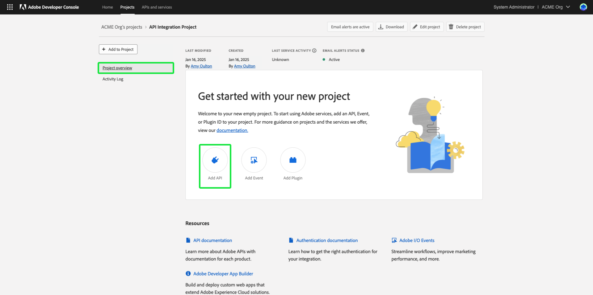

# Autenticar e acessar APIs da Experience Platform

Este documento fornece um tutorial passo a passo para obter acesso a uma conta de desenvolvedor do Adobe Experience Platform para fazer chamadas para APIs Experience Platform. No final deste tutorial, você terá gerado ou coletado as seguintes credenciais que são necessárias como cabeçalhos em todas as chamadas de API da plataforma:

* `{ACCESS_TOKEN}`
* `{API_KEY}`
* `{ORG_ID}`

>[!TIP]
>
>Além das três credenciais acima, muitas APIs da Platform também exigem uma `{SANDBOX_NAME}` a ser fornecido como um cabeçalho. Consulte a [visão geral das sandboxes](../sandboxes/home.md) para obter mais informações sobre sandboxes e a [ponto de acesso de gerenciamento de sandbox](/help/sandboxes/api/sandboxes.md#list) documentação para obter informações sobre como listar as sandboxes disponíveis para sua organização.

Para manter a segurança de seus aplicativos e usuários, todas as solicitações para APIs Experience Platform devem ser autenticadas e autorizadas usando padrões como o OAuth.

Este tutorial aborda como coletar as credenciais necessárias para autenticar chamadas de API da plataforma, conforme descrito no fluxograma abaixo. Você pode coletar a maioria das credenciais necessárias na configuração inicial única. No entanto, o token de acesso deve ser atualizado a cada 24 horas.


## Pré-requisitos {#prerequisites}

Para fazer chamadas com êxito para APIs Experience Platform, você deve ter o seguinte:

* Uma organização com acesso ao Adobe Experience Platform.
* Um administrador de Admin Console que pode adicioná-lo como desenvolvedor e usuário para um perfil de produto.
* Um administrador de sistema do Experience Platform que pode conceder a você os controles de acesso baseados em atributos necessários para executar operações de leitura ou gravação em diferentes partes do Experience Platform por meio de APIs.

Você também deve ter uma Adobe ID para concluir este tutorial. Se você não tiver uma Adobe ID, poderá criar uma usando as seguintes etapas:

1. Ir para [Console do Adobe Developer](https://console.adobe.io).
2. Selecionar **[!UICONTROL Criar uma nova conta]**.
3. Conclua o processo de inscrição.

## Obter acesso de desenvolvedor e usuário para o Experience Platform {#gain-developer-user-access}

Antes de criar integrações no Console do Adobe Developer, sua conta deve ter permissões de desenvolvedor e usuário para um perfil de produto do Experience Platform no Adobe Admin Console.

### Obter acesso de desenvolvedor {#gain-developer-access}

Entre em contato com um [!DNL Admin Console] administrador na organização para adicioná-lo como desenvolvedor a um perfil de produto Experience Platform usando o [[!DNL Admin Console]](https://adminconsole.adobe.com/). Consulte a [!DNL Admin Console] para obter instruções específicas sobre como [gerenciar o acesso de desenvolvedor para perfis de produtos](https://helpx.adobe.com/enterprise/admin-guide.html/enterprise/using/manage-developers.ug.html).

Depois de atribuído como desenvolvedor, você pode começar a criar integrações no [Console do Adobe Developer](https://www.adobe.com/go/devs_console_ui). Essas integrações são um pipeline de aplicativos e serviços externos para APIs Adobe.

### Obter acesso do usuário {#gain-user-access}

Seu [!DNL Admin Console] O administrador também deve adicioná-lo como usuário ao mesmo perfil de produto. Com o acesso do usuário, é possível ver na interface do usuário o resultado das operações de API executadas.

Consulte o guia sobre [gerenciamento de grupos de usuários no [!DNL Admin Console]](https://helpx.adobe.com/enterprise/admin-guide.html/enterprise/using/user-groups.ug.html) para obter mais informações.

## Gerar uma chave de API (ID do cliente) e uma ID da organização {#generate-credentials}

>[!NOTE]
>
>Se você estiver seguindo este documento do [Guia da API do Privacy Service](../privacy-service/api/getting-started.md), agora você pode retornar a esse guia para gerar as credenciais de acesso exclusivas para [!DNL Privacy Service].

Depois de receber acesso de desenvolvedor e usuário à Platform por meio do [!DNL Admin Console], a próxima etapa é gerar o `{ORG_ID}` e `{API_KEY}` credenciais no Console do Adobe Developer. Essas credenciais só precisam ser geradas uma vez e podem ser reutilizadas em chamadas futuras da API da plataforma.

### Adicionar Experience Platform a um projeto {#add-platform-to-project}

Acesse o [Adobe Developer Console](https://www.adobe.com/go/devs_console_ui) e faça logon com seu Adobe ID. Em seguida, siga as etapas descritas no tutorial em [criação de um projeto vazio](https://developer.adobe.com/developer-console/docs/guides/projects/projects-empty/) na documentação do Console do Adobe Developer.

Depois de criar um novo projeto, selecione **[!UICONTROL Adicionar API]** no **[!UICONTROL Visão geral do projeto]** tela.

>[!TIP]
>
>Se você tiver sido provisionado para várias organizações, use o seletor de organizações no canto superior direito da interface para garantir que está na organização necessária.



A tela **[!UICONTROL Adicionar uma API]** é exibida. Selecione o ícone de produto do Adobe Experience Platform e escolha **[!UICONTROL API EXPERIENCE PLATFORM]** antes de selecionar **[!UICONTROL Próxima]**.


>[!TIP]
>
>Selecione o **[!UICONTROL Exibir documentos]** opção para navegar em uma janela de navegador separada até a conclusão [Documentação de referência da API do Experience Platform](https://developer.adobe.com/experience-platform-apis/).

### Selecione o [!UICONTROL Servidor OAuth para servidor] tipo de autenticação {#select-oauth-server-to-server}

Em seguida, selecione o [!UICONTROL Servidor OAuth para servidor] tipo de autenticação para gerar tokens de acesso e acessar a API Experience Platform.

>[!IMPORTANT]
>
>A variável **[!UICONTROL Servidor OAuth para servidor]** Este é o único método de geração de token compatível a partir de agora. O compatível anteriormente **[!UICONTROL Conta de serviço (JWT)]** O método está obsoleto e não pode ser selecionado para novas integrações. Embora as integrações existentes que usam o método de autenticação JWT continuem a funcionar até 1º de janeiro de 2025, a Adobe recomenda que você migre as integrações existentes para o novo [!UICONTROL Servidor OAuth para servidor] antes dessa data. Obter mais informações na seção [!BADGE Obsoleto]{type=negative}[Gerar um JSON Web Token (JWT)](#jwt).


### Selecione os perfis de produto para sua integração {#select-product-profiles}

No **[!UICONTROL Configurar API]** , selecione **[!UICONTROL AEP-Padrão-Todos-Usuários]**.

<!--
Your integration's service account will gain access to granular features through the product profiles selected here.

-->

>[!IMPORTANT]
>
Para obter acesso a determinados recursos na Platform, você também precisa de um administrador do sistema para conceder as permissões de controle de acesso baseadas em atributos necessárias. Leia mais na seção [Obter as permissões necessárias de controle de acesso baseado em atributos](#get-abac-permissions).


Selecionar **[!UICONTROL Salvar API configurada]** quando estiver pronto.

Uma apresentação das etapas descritas acima para configurar uma integração com a API de Experience Platform também está disponível no tutorial em vídeo abaixo:

>[!VIDEO](https://video.tv.adobe.com/v/28832/?learn=on)

### Coletar credenciais {#gather-credentials}

Depois que a API for adicionada ao projeto, o **[!UICONTROL API EXPERIENCE PLATFORM]** A página do projeto exibe as seguintes credenciais que são necessárias em todas as chamadas para as APIs Experience Platform:


* `{API_KEY}` ([!UICONTROL ID do cliente])
* `{ORG_ID}` ([!UICONTROL ID da organização])

<!--


<!--

In addition to the above credentials, you also need the generated **[!UICONTROL Client Secret]** for a future step. Select **[!UICONTROL Retrieve client secret]** to reveal the value, and then copy it for later use.


-->

## Gerar um token de acesso {#generate-access-token}

A próxima etapa é gerar um `{ACCESS_TOKEN}` credencial para uso em chamadas de API da plataforma. Ao contrário dos valores de `{API_KEY}` e `{ORG_ID}`, um novo token deve ser gerado a cada 24 horas para continuar usando as APIs da plataforma. Selecionar **[!UICONTROL Gerar token de acesso]**, conforme mostrado abaixo.


>[!TIP]
>
Você também pode usar um ambiente e uma coleção do Postman para gerar tokens de acesso. Para obter mais informações, leia a seção sobre [uso do Postman para autenticar e testar chamadas de API](#use-postman).

## [!BADGE Obsoleto]{type=negativo} Gerar um JSON Web Token (JWT) {#jwt}

>[!WARNING]
>
O método JWT para gerar tokens de acesso foi descontinuado. Todas as novas integrações devem ser criadas usando o [Método de autenticação de servidor para servidor OAuth](#select-oauth-server-to-server). O Adobe também exige que você migre suas integrações existentes para o método OAuth até 1º de janeiro de 2025 para que suas integrações continuem funcionando. Leia a seguinte documentação importante:
> 
* [Guia de migração para seus aplicativos do JWT para o OAuth](https://developer.adobe.com/developer-console/docs/guides/authentication/ServerToServerAuthentication/migration/)
* [Guia de implementação para aplicativos novos e antigos com o OAuth](https://developer.adobe.com/developer-console/docs/guides/authentication/ServerToServerAuthentication/implementation/)
* [Vantagens de usar o método de credenciais OAuth de servidor para servidor](https://developer.adobe.com/developer-console/docs/guides/authentication/ServerToServerAuthentication/migration/#why-oauth-server-to-server-credentials)

+++ Exibir informações obsoletas

A próxima etapa é gerar um JSON Web Token (JWT) com base nas credenciais da conta. Esse valor é usado para gerar o `{ACCESS_TOKEN}` credencial para uso em chamadas de API da plataforma, que devem ser geradas novamente a cada 24 horas.

>[!IMPORTANT]
>
Para os fins deste tutorial, as etapas abaixo descrevem como gerar um JWT no Console do desenvolvedor. No entanto, esse método de geração só deve ser usado para fins de teste e avaliação.
>
Para uso regular, o JWT deve ser gerado automaticamente. Para obter mais informações sobre como gerar JWTs programaticamente, consulte [guia de autenticação da conta de serviço](https://www.adobe.io/developer-console/docs/guides/authentication/JWT/) no Adobe Developer.

Selecionar **[!UICONTROL Conta de serviço (JWT)]** na navegação à esquerda, selecione **[!UICONTROL Gerar JWT]**.


Na caixa de texto fornecida em **[!UICONTROL Gerar JWT personalizado]**, cole o conteúdo da chave privada gerada anteriormente ao adicionar a API da plataforma à sua conta de serviço. Em seguida, selecione **[!UICONTROL Gerar token]**.


A página é atualizada para mostrar o JWT gerado, juntamente com um comando cURL de amostra que permite gerar um token de acesso. Para os fins deste tutorial, selecione **[!UICONTROL Copiar]** ao lado de **[!UICONTROL JWT gerado]** para copiar o token para a área de transferência.


**Gerar um token de acesso**

Depois de gerar um JWT, você pode usá-lo em uma chamada de API para gerar `{ACCESS_TOKEN}`. Ao contrário dos valores de `{API_KEY}` e `{ORG_ID}`, um novo token deve ser gerado a cada 24 horas para continuar usando as APIs da plataforma.

**Solicitação**

A solicitação a seguir gera um novo `{ACCESS_TOKEN}` com base nas credenciais fornecidas na carga. Esse endpoint só aceita dados de formulário como sua carga, portanto, deve receber um `Content-Type` cabeçalho de `multipart/form-data`.

```shell
curl -X POST https://ims-na1.adobelogin.com/ims/exchange/jwt \
  -H 'Content-Type: multipart/form-data' \
  -F 'client_id={API_KEY}' \
  -F 'client_secret={SECRET}' \
  -F 'jwt_token={JWT}'
```

| Propriedade | Descrição |
| --- | --- |
| `{API_KEY}` | A variável `{API_KEY}` ([!UICONTROL ID do cliente]) que você recuperou em um [etapa anterior](#api-ims-secret). |
| `{SECRET}` | O segredo do cliente que você recuperou em um [etapa anterior](#api-ims-secret). |
| `{JWT}` | O JWT gerado em um [etapa anterior](#jwt). |

>[!NOTE]
>
Você pode usar a mesma chave de API, segredo do cliente e JWT para gerar um novo token de acesso para cada sessão. Isso permite automatizar a geração de token de acesso em seus aplicativos.

**Resposta**

```json
{
  "token_type": "bearer",
  "access_token": "{ACCESS_TOKEN}",
  "expires_in": 86399992
}
```

| Propriedade | Descrição |
| --- | --- |
| `token_type` | O tipo of token sendo retornado. Para tokens de acesso, esse valor é sempre `bearer`. |
| `access_token` | O gerado `{ACCESS_TOKEN}`. Este valor, com prefixo da palavra `Bearer`, é obrigatório como a `Authentication` para todas as chamadas de API da plataforma. |
| `expires_in` | O número de milissegundos restantes até que o token de acesso expire. Quando esse valor atingir 0, um novo token de acesso deverá ser gerado para continuar usando as APIs da plataforma. |

+++

## Testar credenciais de acesso {#test-credentials}

Depois de coletar todas as três credenciais necessárias - token de acesso, chave de API e ID da organização - , você pode tentar fazer a seguinte chamada de API. Essa chamada lista todas as chamadas padrão [!DNL Experience Data Model] Classes do (XDM) disponíveis para sua organização. Importar e executar a chamada no [Postman](#use-postman).

>[!BEGINSHADEBOX]

**Solicitação**

```SHELL
curl -X GET https://platform.adobe.io/data/foundation/schemaregistry/global/classes \
  -H 'Accept: application/vnd.adobe.xed-id+json' \
  -H 'Authorization: Bearer {{ACCESS_TOKEN}}' \
  -H 'x-api-key: {{API_KEY}}' \
  -H 'x-gw-ims-org-id: {{ORG_ID}}'
```

**Resposta**

Se sua resposta for semelhante à mostrada abaixo, suas credenciais serão válidas e estarão funcionando. (Esta resposta foi truncada por questões de espaço.)

```JSON
{
  "results": [
    {
        "title": "XDM ExperienceEvent",
        "$id": "https://ns.adobe.com/xdm/context/experienceevent",
        "meta:altId": "_xdm.context.experienceevent",
        "version": "1"
    },
    {
        "title": "XDM Individual Profile",
        "$id": "https://ns.adobe.com/xdm/context/profile",
        "meta:altId": "_xdm.context.profile",
        "version": "1"
    }
  ]
}
```

>[!ENDSHADEBOX]

>[!IMPORTANT]
>
Embora a chamada acima seja suficiente para testar suas credenciais de acesso, esteja ciente de que você não poderá acessar ou modificar vários recursos sem ter as permissões certas de controle de acesso baseado em atributos. Leia mais na seção **Obter as permissões necessárias de controle de acesso baseado em atributos** abaixo.

## Obter as permissões necessárias de controle de acesso baseado em atributos {#get-abac-permissions}

Para acessar ou modificar vários recursos no Experience Platform, você deve ter as permissões de controle de acesso apropriadas. Os administradores do sistema podem conceder a você o [permissões necessárias](/help/access-control/ui/permissions.md). Obtenha mais informações na seção sobre [gerenciando credenciais de API para uma função](/help/access-control/abac/ui/permissions.md#manage-api-credentials-for-role).

Informações detalhadas sobre como um administrador do sistema pode conceder as permissões necessárias para acessar os recursos da plataforma por meio da API também estão disponíveis no tutorial em vídeo abaixo:

>[!VIDEO](https://video.tv.adobe.com/v/28832/?learn=on&t=159)

## Usar o Postman para autenticar e testar chamadas de API {#use-postman}

[Postman](https://www.postman.com/) O é uma ferramenta popular que permite aos desenvolvedores explorar e testar as APIs RESTful. Você pode usar coleções e ambientes do Experience Platform Postman para acelerar seu trabalho com APIs de Experience Platform. Leia mais sobre [uso do Postman no Experience Platform](/help/landing/postman.md) e introdução a coleções e ambientes.

Informações detalhadas sobre o uso do Postman com coleções e ambientes de Experience Platform também estão disponíveis nos tutoriais em vídeo abaixo:

**Baixar e importar um ambiente Postman para usar com APIs Experience Platform**

>[!VIDEO](https://video.tv.adobe.com/v/28832/?learn=on&t=106)

**Usar uma coleção do Postman para gerar tokens de acesso**

Baixe o [Coleção Identity Management Service Postman](https://github.com/adobe/experience-platform-postman-samples/tree/master/apis/ims) e assista ao vídeo abaixo para saber como gerar tokens de acesso.

>[!VIDEO](https://video.tv.adobe.com/v/29698/?learn=on)

**Baixe coleções do Postman da API de Experience Platform e interaja com as APIs**

>[!VIDEO](https://video.tv.adobe.com/v/29704/?learn=on)

<!--
This [Medium post](https://medium.com/adobetech/using-postman-for-jwt-authentication-on-adobe-i-o-7573428ffe7f) describes how you can set up Postman to automatically perform JWT authentication and use it to consume Platform APIs.
-->

## Administradores do sistema: conceder controle de acesso a desenvolvedores e API com permissões de Experience Platform {#grant-developer-and-api-access-control}

>[!NOTE]
>
Somente administradores do sistema têm a capacidade de exibir e gerenciar credenciais de API nas Permissões.

Antes de criar integrações no Console do Adobe Developer, sua conta deve ter permissões de desenvolvedor e usuário para um perfil de produto do Experience Platform no Adobe Admin Console.

### Adicionar desenvolvedores ao perfil do produto {#add-developers-to-product-profile}

Ir para [[!DNL Admin Console]](https://adminconsole.adobe.com/) e faça logon com sua Adobe ID.

Selecionar **[!UICONTROL Produtos]** e selecione **[!UICONTROL Adobe Experience Platform]** da lista de produtos.


No **[!UICONTROL Perfis de produto]** selecione **[!UICONTROL AEP-Padrão-Todos-Usuários]**. Como alternativa, use a barra de pesquisa para pesquisar o perfil de produto inserindo o nome.


Selecione o **[!UICONTROL Desenvolvedores]** e selecione **[!UICONTROL Adicionar desenvolvedor]**.


Insira o nome do desenvolvedor **[!UICONTROL Email ou nome de usuário]**. Um válido [!UICONTROL Email ou nome de usuário] exibirá os detalhes do desenvolvedor. Selecione **[!UICONTROL Salvar]**.


O desenvolvedor foi adicionado com sucesso e aparece no [!UICONTROL Desenvolvedores] guia.


<!--

Commenting out this part since it duplicates information from the section Add Experience Platform to a project

### Set up an API

A developer can add and configure an API within a project in the Adobe Developer Console.

Select your project, then select **[!UICONTROL Add API]**.


In the **[!UICONTROL Add an API]** dialog box select **[!UICONTROL Adobe Experience Platform]**, then select **[!UICONTROL Experience Platform API]**.


In the **[!UICONTROL Configure API]** screen, select **[!UICONTROL AEP-Default-All-Users]**.

-->

### Atribuir API a uma função

Um administrador do sistema pode atribuir APIs a funções na interface do usuário do Experience Platform.

Selecionar **[!UICONTROL Permissões]** e a função à qual você deseja adicionar a API. Selecione o **[!UICONTROL Credenciais da API]** e selecione **[!UICONTROL Adicionar credenciais de API]**.


Selecione a API que deseja adicionar à função e selecione **[!UICONTROL Salvar]**.


Você retornará à janela [!UICONTROL Credenciais da API] , onde a API recém-adicionada é listada.


## Recursos adicionais {#additional-resources}

Consulte os recursos adicionais vinculados abaixo para obter mais ajuda para começar a usar as APIs de Experience Platform

* [Autenticar e acessar APIs de Experience Platform](https://experienceleague.adobe.com/docs/platform-learn/tutorials/platform-api-authentication.html?lang=pt-BR) página de tutoriais em vídeo
* [Identity Management Service Postman Collection](https://github.com/adobe/experience-platform-postman-samples/tree/master/apis/ims) para gerar tokens de acesso
* [Coleções Experience Platform API Postman](https://github.com/adobe/experience-platform-postman-samples/tree/master/apis/experience-platform)

## Próximas etapas {#next-steps}

Ao ler este documento, você reuniu e testou com êxito suas credenciais de acesso para APIs da plataforma. Agora você pode seguir junto com as chamadas de API de exemplo fornecidas em [documentação](../landing/documentation/overview.md).

Além dos valores de autenticação coletados neste tutorial, muitas APIs da Platform também exigem uma `{SANDBOX_NAME}` a ser fornecido como um cabeçalho. Consulte a [visão geral das sandboxes](../sandboxes/home.md) para obter mais informações.