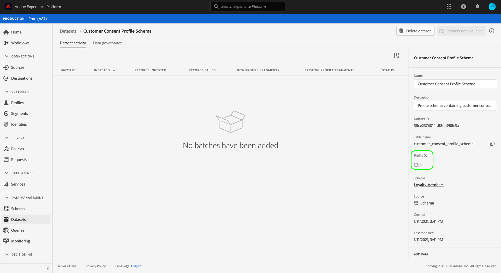

# Configurar um conjunto de dados para capturar dados de consentimento e preferência

Para que o Adobe Experience Platform processe seus dados de consentimento/preferência do cliente, esses dados devem ser enviados para um conjunto de dados cujo esquema contenha campos relacionados a consentimentos e outras permissões. Especificamente, esse conjunto de dados deve se basear no [!DNL XDM Individual Profile] e habilitado para uso em [!DNL Real-time Customer Profile].

Este documento fornece etapas para configurar um conjunto de dados para processar dados de consentimento no Experience Platform. Para obter uma visão geral do fluxo de trabalho completo para processar dados de consentimento/preferência no Platform, consulte [visão geral do processamento de consentimento](./overview.md).

>[!IMPORTANT]
>
>Os exemplos neste guia usam um conjunto padronizado de campos para representar valores de consentimento do cliente, conforme definido pela variável [[!UICONTROL Detalhes de consentimento e preferência] grupo de campos de esquema](../../../../xdm/field-groups/profile/consents.md). A estrutura desses campos tem como objetivo fornecer um modelo de dados eficiente para abranger muitos casos de uso comuns de coleta de consentimento.
>
>No entanto, também é possível definir seus próprios grupos de campos para representar o consentimento de acordo com seus próprios modelos de dados. Consulte sua equipe jurídica para obter aprovação de um modelo de dados de consentimento que atenda às suas necessidades comerciais, com base nas seguintes opções:
>
>* O grupo de campos de consentimento padronizado
>* Um grupo de campos de consentimento personalizado criado pela organização
>* Uma combinação do grupo de campos de consentimento padronizado e campos adicionais fornecidos por um grupo de campos de consentimento personalizado


## Pré-requisitos

Este tutorial requer uma compreensão funcional dos seguintes componentes do Adobe Experience Platform:

* [Experience Data Model (XDM)](../../../../xdm/home.md): O quadro normalizado pelo qual [!DNL Experience Platform] organiza os dados de experiência do cliente.
   * [Noções básicas da composição do schema](../../../../xdm/schema/composition.md): Saiba mais sobre os componentes básicos dos esquemas XDM.
* [Perfil do cliente em tempo real](../../../../profile/home.md): Consolida dados de clientes de fontes diferentes em uma visualização completa e unificada, oferecendo uma conta acionável e com carimbos de data e hora de cada interação com o cliente.

>[!IMPORTANT]
>
>Este tutorial presume que você conheça a variável [!DNL Profile] na plataforma que você deseja usar para capturar informações de atributos do cliente. Independentemente do método usado para coletar dados de consentimento, esse schema deve ser [habilitado para o Perfil do cliente em tempo real](../../../../xdm/ui/resources/schemas.md#profile). Além disso, a identidade primária do esquema não pode ser um campo diretamente identificável que é proibido de usar em publicidade com base em interesses, como um endereço de email. Consulte seu consultor jurídico se não tiver certeza de quais campos são restritos.

## [!UICONTROL Detalhes de consentimento e preferência] estrutura de grupo de campos {#structure}

O [!UICONTROL Detalhes de consentimento e preferência] grupo de campos fornece campos de consentimento padronizados para um schema. No momento, esse grupo de campos é compatível apenas com schemas com base no [!DNL XDM Individual Profile] classe .

O grupo de campos fornece um único campo do tipo objeto, `consents`, cujas subpropriedades capturam um conjunto de campos de consentimento padrão. O JSON a seguir é um exemplo do tipo de dados `consents` espera durante a assimilação de dados:

```json
{
  "consents": {
    "collect": {
      "val": "y",
    },
    "share": {
      "val": "y",
    },
    "personalize": {
      "content": {
        "val": "y"
      }
    },
    "marketing": {
      "preferred": "email",
      "any": {
        "val": "y"
      },
      "push": {
        "val": "n",
        "reason": "Too Frequent",
        "time": "2019-01-01T15:52:25+00:00"
      }
    },
    "idSpecific": {
      "email": {
        "jdoe@example.com": {
          "marketing": {
            "email": {
              "val": "n"
            }
          }
        }
      }
    }
  },
  "metadata": {
    "time": "2019-01-01T15:52:25+00:00"
  }
}
```

>[!NOTE]
>
>Para obter mais informações sobre a estrutura e o significado das subpropriedades em `consents`, consulte a visão geral no [[!UICONTROL Detalhes de consentimento e preferência] grupo de campos](../../../../xdm/field-groups/profile/consents.md).

## Adicione grupos de campos obrigatórios a [!DNL Profile] schema {#add-field-group}

Para coletar dados de consentimento usando o padrão do Adobe, você deve ter um schema ativado para perfil que contenha os dois grupos de campos a seguir:

* [!UICONTROL Detalhes de consentimento e preferência]
* [!UICONTROL IdentityMap] (obrigatório se estiver usando o Platform Web ou Mobile SDK para enviar sinais de consentimento)

Na interface do usuário da plataforma, selecione **[!UICONTROL Esquemas]** na navegação à esquerda, selecione o **[!UICONTROL Procurar]** para exibir uma lista de schemas existentes. Aqui, selecione o nome da variável [!DNL Profile]esquema habilitado para o qual você deseja adicionar campos de consentimento. As capturas de tela desta seção usam o schema &quot;Membros de fidelidade&quot; incorporado no [tutorial de criação de schema](../../../../xdm/tutorials/create-schema-ui.md) como exemplo.


>[!TIP]
>
>Você pode usar os recursos de pesquisa e filtragem do espaço de trabalho para ajudar a encontrar o esquema mais fácil. Consulte o guia sobre [exploração de recursos XDM](../../../../xdm/ui/explore.md) para obter mais informações.

O [!DNL Schema Editor] for exibida, mostrando a estrutura do schema na tela. No lado esquerdo da tela, selecione **[!UICONTROL Adicionar]** nos termos do **[!UICONTROL Grupos de campos]** seção.


O **[!UICONTROL Adicionar grupo de campos]** será exibida. Aqui, selecione **[!UICONTROL Detalhes de consentimento e preferência]** na lista. Como opção, você pode usar a barra de pesquisa para restringir os resultados para localizar o grupo de campos mais facilmente.


Em seguida, encontre a **[!UICONTROL IdentityMap]** grupo de campos na lista e selecione-o também. Depois que ambos os grupos de campos estiverem listados no painel direito, selecione **[!UICONTROL Adicionar grupos de campos]**.


A tela reaparece, mostrando que a variável `consents` e `identityMap` foram adicionados à estrutura do schema. Se você precisar de mais campos de consentimento e preferência não capturados pelo grupo de campos padrão, consulte a seção de apêndice em [adição de consentimento personalizado e campos de preferência ao schema](#custom-consent). Caso contrário, selecione **[!UICONTROL Salvar]** para finalizar as alterações no schema.


>[!IMPORTANT]
>
>Se estiver criando um novo schema ou editando um schema existente que não foi habilitado para o Perfil, você deverá [ativar o esquema para o Perfil](../../../../xdm/ui/resources/schemas.md#profile) antes de salvar.

Se o schema editado for usado pela variável [!UICONTROL Conjunto de dados de perfil] especificado no conjunto de dados do SDK da Web da plataforma, esse conjunto de dados agora incluirá os novos campos de consentimento. Agora você pode retornar ao [guia de processamento de consentimento](./overview.md#merge-policies) para continuar o processo de configuração do Experience Platform para processar dados de consentimento. Se não tiver criado um conjunto de dados para esse esquema, siga as etapas na próxima seção.

## Criar um conjunto de dados com base no esquema de consentimento {#dataset}

Depois de criar um schema com campos de consentimento, você deve criar um conjunto de dados que, em última análise, assimilará os dados de consentimento dos clientes. Esse conjunto de dados deve ser habilitado para [!DNL Real-time Customer Profile].

Para começar, selecione **[!UICONTROL Conjuntos de dados]** na navegação à esquerda, selecione **[!UICONTROL Criar conjunto de dados]** no canto superior direito.


Na próxima página, selecione **[!UICONTROL Criar conjunto de dados a partir do esquema]**.


O **[!UICONTROL Criar conjunto de dados a partir do esquema]** for exibido, começando no **[!UICONTROL Selecionar esquema]** etapa. Na lista fornecida, localize um dos esquemas de consentimento criados anteriormente. Como opção, você pode usar a barra de pesquisa para restringir os resultados e localizar o esquema mais fácil. Selecione o botão de opção ao lado do esquema desejado e selecione **[!UICONTROL Próximo]** para continuar.


O **[!UICONTROL Configurar conjunto de dados]** será exibida. Fornecer um nome e uma descrição exclusivos e facilmente identificáveis para o conjunto de dados antes de selecionar **[!UICONTROL Concluir]**.


A página de detalhes do conjunto de dados recém-criado é exibida. Se o conjunto de dados se basear no esquema da série de tempo, o processo será concluído. Se o conjunto de dados se basear no esquema de registro, a etapa final no processo será habilitar o conjunto de dados para uso em [!DNL Real-time Customer Profile].

No painel direito, selecione o **[!UICONTROL Perfil]** alternar.



Finalmente, selecione **[!UICONTROL Habilitar]** no provedor de confirmação para habilitar o schema de [!DNL Profile].


O conjunto de dados agora é salvo e ativado para uso em [!DNL Profile]. Se você estiver planejando usar o SDK da Web da plataforma para enviar dados de consentimento ao Perfil, deverá selecionar esse conjunto de dados como o [!UICONTROL Conjunto de dados de perfil] ao configurar o [datastream](../../../../edge/datastreams/overview.md).

## Próximas etapas

Ao seguir este tutorial, você adicionou campos de consentimento a um [!DNL Profile]esquema habilitado para , cujo conjunto de dados será usado para assimilar dados de consentimento usando o SDK da Web da plataforma ou a assimilação direta do XDM.

Agora você pode retornar ao [visão geral do processamento de consentimento](./overview.md#merge-policies) para continuar configurando o Experience Platform para processar os dados de consentimento.

## Apêndice

A seção a seguir contém informações adicionais sobre como criar um conjunto de dados para assimilar dados de consentimento e preferência do cliente.

### Adicionar consentimento e campos de preferência personalizados ao esquema {#custom-consent}

Se precisar capturar sinais de consentimento adicionais fora daqueles representados pelo padrão [!UICONTROL Detalhes de consentimento e preferência] grupo de campos, você pode usar componentes XDM personalizados para aprimorar seu esquema de consentimento para atender às suas necessidades comerciais específicas. Esta seção descreve os princípios básicos de como personalizar o esquema de consentimento para assimilar esses sinais no Perfil.

>[!IMPORTANT]
>
>Os SDKs da Web da plataforma e móvel não oferecem suporte a campos personalizados em seus comandos de alteração de consentimento. Atualmente, a única maneira de assimilar campos de consentimento personalizados no Perfil é por meio de [ingestão em lote](../../../../ingestion/batch-ingestion/overview.md) ou [conexão de origem](../../../../sources/home.md).

É altamente recomendável usar a variável [!UICONTROL Detalhes de consentimento e preferência] grupo de campos como uma linha de base para a estrutura dos dados de consentimento e adicione campos adicionais conforme necessário, em vez de tentar criar toda a estrutura do zero.

Para adicionar campos personalizados à estrutura de um grupo de campos padrão, primeiro crie um grupo de campos personalizado. Depois de adicionar o [!UICONTROL Detalhes de consentimento e preferência] para o esquema, selecione o **mais (+)** no ícone na **[!UICONTROL Grupos de campos]** e selecione **[!UICONTROL Criar novo grupo de campos]**. Forneça um nome e uma descrição opcional para o grupo de campos e selecione **[!UICONTROL Adicionar grupo de campos]**.


O [!DNL Schema Editor] será exibido novamente com o novo grupo de campos personalizados selecionado no painel à esquerda. Na tela, são exibidos controles que permitem adicionar campos personalizados à estrutura do esquema. Para adicionar um novo consentimento ou campo de preferência, selecione o **mais (+)** ícone ao lado do `consents` objeto.


Um novo campo é exibido dentro do `consents` objeto. Como você está adicionando um campo personalizado a um objeto XDM padrão, o novo campo é criado em um objeto com namespaco para a ID do locatário.


No painel direito em **[!UICONTROL Propriedades do campo]**, forneça um nome e uma descrição para o campo. Ao selecionar o **[!UICONTROL Tipo]**, você deve usar o tipo de dados padrão apropriado para um consentimento ou campo de preferência personalizado:

* [[!UICONTROL Campo de consentimento genérico]](../../../../xdm/data-types/consent-field.md)
* [[!UICONTROL Campo de Preferência de Marketing Genérico]](../../../../xdm/data-types/marketing-field.md)
* [[!UICONTROL Campo de preferência de marketing genérico com assinaturas]](../../../../xdm/data-types/marketing-field-subscriptions.md)
* [[!UICONTROL Campo de preferência Personalização genérica]](../../../../xdm/data-types/personalization-field.md)

Quando terminar, selecione **[!UICONTROL Aplicar]**.


O campo de consentimento ou preferência é adicionado à estrutura do schema. Observe que a variável [!UICONTROL Caminho] exibido no painel direito contém a variável `_tenantId` namespace. Esse namespace deve ser incluído sempre que você fizer referência ao caminho para esse campo em suas operações de dados.


Siga as etapas acima para continuar adicionando os campos de consentimento e preferência necessários. Quando terminar, selecione **[!UICONTROL Salvar]** para confirmar as alterações.

Se você não tiver criado um conjunto de dados para esse esquema, continue para a seção em [criação de um conjunto de dados](#dataset).
