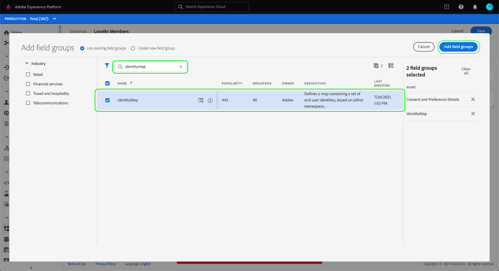

# Configurar um conjunto de dados para capturar dados de consentimento e preferência

Para que o Adobe Experience Platform processe os dados de consentimento/preferência do cliente, esses dados devem ser enviados para um conjunto de dados cujo esquema contém campos relacionados a consentimentos e outras permissões. Especificamente, esse conjunto de dados deve ser baseado na variável [!DNL XDM Individual Profile] e ativada para uso no [!DNL Real-Time Customer Profile].

Este documento fornece etapas para configurar um conjunto de dados para processar dados de consentimento no Experience Platform. Para obter uma visão geral do fluxo de trabalho completo para processar dados de consentimento/preferência na Platform, consulte o [visão geral do processamento de consentimento](./overview.md).

>[!IMPORTANT]
>
>Os exemplos neste guia usam um conjunto padronizado de campos para representar valores de consentimento do cliente, conforme definido pelo [[!UICONTROL Detalhes sobre consentimento e preferência] grupo de campos de esquema](../../../../xdm/field-groups/profile/consents.md). A estrutura desses campos tem como objetivo fornecer um modelo de dados eficiente para abranger muitos casos de uso comuns de coleta de consentimento.
>
>No entanto, você também pode definir seus próprios grupos de campos para representar o consentimento de acordo com seus próprios modelos de dados. Consulte sua equipe jurídica para obter aprovação para um modelo de dados de consentimento que atenda às suas necessidades comerciais, com base nas seguintes opções:
>
>* O grupo de campos de consentimento padronizado
>* Um grupo de campos de consentimento personalizado criado pela sua organização
>* Uma combinação do grupo de campos de consentimento padronizado e campos adicionais fornecidos por um grupo de campos de consentimento personalizado

## Pré-requisitos

Este tutorial requer uma compreensão funcional dos seguintes componentes do Adobe Experience Platform:

* [Experience Data Model (XDM)](../../../../xdm/home.md): o quadro normalizado pelo qual [!DNL Experience Platform] organiza os dados de experiência do cliente.
   * [Noções básicas da composição do esquema](../../../../xdm/schema/composition.md): saiba mais sobre os blocos de construção básicos de esquemas XDM.
* [Perfil do cliente em tempo real](../../../../profile/home.md): consolida os dados do cliente de fontes diferentes em uma visualização completa e unificada, oferecendo uma conta acionável com carimbo de data e hora de cada interação com o cliente.

>[!IMPORTANT]
>
>Este tutorial pressupõe que você conheça a [!DNL Profile] esquema na Platform que você deseja usar para capturar informações de atributos do cliente. Independentemente do método usado para coletar dados de consentimento, esse esquema deve ser [ativado para o Perfil de cliente em tempo real](../../../../xdm/ui/resources/schemas.md#profile). Além disso, a identidade primária do schema não pode ser um campo diretamente identificável que esteja proibido de usar em anúncios baseados em interesses, como um endereço de email. Consulte seu advogado se não tiver certeza de quais campos são restritos.

## [!UICONTROL Detalhes sobre consentimento e preferência] estrutura do grupo de campos {#structure}

A variável [!UICONTROL Detalhes sobre consentimento e preferência] O grupo de campos fornece campos de consentimento padronizados para um esquema. Atualmente, esse grupo de campos é compatível apenas com esquemas baseados no [!DNL XDM Individual Profile] classe.

O grupo de campos fornece um único campo do tipo objeto, `consents`, cujas subpropriedades capturam um conjunto de campos de consentimento padronizados. O JSON a seguir é um exemplo do tipo de dados `consents` espera na assimilação de dados:

```json
{
  "consents": {
    "collect": {
      "val": "y",
    },
    "share": {
      "val": "y",
    },
    "personalize": {
      "content": {
        "val": "y"
      }
    },
    "marketing": {
      "preferred": "email",
      "any": {
        "val": "y"
      },
      "push": {
        "val": "n",
        "reason": "Too Frequent",
        "time": "2019-01-01T15:52:25+00:00"
      }
    },
    "idSpecific": {
      "email": {
        "jdoe@example.com": {
          "marketing": {
            "email": {
              "val": "n"
            }
          }
        }
      }
    }
  },
  "metadata": {
    "time": "2019-01-01T15:52:25+00:00"
  }
}
```

>[!NOTE]
>
>Para obter mais informações sobre a estrutura e o significado das subpropriedades em `consents`, consulte a visão geral na [[!UICONTROL Detalhes sobre consentimento e preferência] grupo de campos](../../../../xdm/field-groups/profile/consents.md).

## Adicione os grupos de campos obrigatórios à [!DNL Profile] schema {#add-field-group}

Para coletar dados de consentimento usando o padrão Adobe, é necessário ter um esquema habilitado para Perfil que contenha os dois grupos de campos a seguir:

* [!UICONTROL Detalhes sobre consentimento e preferência]
* [!UICONTROL IdentityMap] (obrigatório se estiver usando o SDK da Web ou móvel da plataforma para enviar sinais de consentimento)

Na interface do usuário da Platform, selecione **[!UICONTROL Esquemas]** na navegação à esquerda, selecione o **[!UICONTROL Procurar]** para exibir uma lista de schemas existentes. Aqui, selecione o nome do [!DNL Profile]Esquema habilitado para o qual você deseja adicionar campos de consentimento. As capturas de tela nesta seção usam o esquema &quot;Membros de fidelidade&quot; criado no [tutorial de criação de esquema](../../../../xdm/tutorials/create-schema-ui.md) como exemplo.


>[!TIP]
>
>Você pode usar os recursos de pesquisa e filtragem do espaço de trabalho para ajudar a encontrar seu esquema com mais facilidade. Consulte o guia sobre [exploração de recursos XDM](../../../../xdm/ui/explore.md) para obter mais informações.

A variável [!DNL Schema Editor] é exibida, mostrando a estrutura do esquema na tela. No lado esquerdo da tela, selecione **[!UICONTROL Adicionar]** no **[!UICONTROL Grupos de campos]** seção.


A variável **[!UICONTROL Adicionar grupo de campos]** será exibida. Aqui, selecione **[!UICONTROL Detalhes sobre consentimento e preferência]** da lista. Opcionalmente, é possível usar a barra de pesquisa para restringir os resultados e localizar o grupo de campos com mais facilidade.


Em seguida, localize o **[!UICONTROL IdentityMap]** grupo de campos na lista e selecione-o também. Depois que ambos os grupos de campos forem listados no painel direito, selecione **[!UICONTROL Adicionar grupos de campos]**.



A tela será exibida novamente, mostrando que a variável `consents` e `identityMap` Os campos foram adicionados à estrutura do esquema. Se você precisar de campos de consentimento e preferência adicionais não capturados pelo grupo de campos padrão, consulte a seção do apêndice em [adição de campos personalizados de consentimento e preferência ao esquema](#custom-consent). Caso contrário, selecione **[!UICONTROL Salvar]** para finalizar as alterações no esquema.


>[!IMPORTANT]
>
>Se estiver criando um novo esquema ou editando um esquema existente que não foi ativado para o Perfil, você deve [ativar o esquema para o Perfil](../../../../xdm/ui/resources/schemas.md#profile) antes de salvar.

Se o esquema editado for usado pela variável [!UICONTROL Conjunto de dados do perfil] especificado na sequência de dados do SDK da Web da Platform, esse conjunto de dados agora incluirá os novos campos de consentimento. Agora você pode retornar ao [guia de processamento de consentimento](./overview.md#merge-policies) para continuar o processo de configuração do Experience Platform para processar dados de consentimento. Se você não tiver criado um conjunto de dados para esse esquema, siga as etapas na próxima seção.

## Criar um conjunto de dados com base no seu esquema de consentimento {#dataset}

Depois de criar um esquema com campos de consentimento, você deve criar um conjunto de dados que assimilará os dados de consentimento dos clientes. Esse conjunto de dados deve ser habilitado para [!DNL Real-Time Customer Profile].

Para começar, selecione **[!UICONTROL Conjuntos de dados]** na navegação à esquerda, selecione **[!UICONTROL Criar conjunto de dados]** no canto superior direito.


Na próxima página, selecione **[!UICONTROL Criar conjunto de dados a partir do esquema]**.


A variável **[!UICONTROL Criar conjunto de dados a partir do esquema]** workflow aparece, começando no **[!UICONTROL Selecionar esquema]** etapa. Na lista fornecida, localize um dos esquemas de consentimento criados anteriormente. Opcionalmente, é possível usar a barra de pesquisa para restringir os resultados e localizar seu esquema com mais facilidade. Selecione o botão de opção ao lado do esquema desejado e selecione **[!UICONTROL Próxima]** para continuar.


A variável **[!UICONTROL Configurar conjunto de dados]** é exibida. Forneça um nome e uma descrição exclusivos e de fácil identificação para o conjunto de dados antes de selecionar **[!UICONTROL Concluir]**.


A página de detalhes do conjunto de dados recém-criado é exibida. Se o conjunto de dados for baseado no esquema de série temporal, o processo será concluído. Se o conjunto de dados for baseado no esquema de registro, a etapa final do processo será ativar o conjunto de dados para uso no [!DNL Real-Time Customer Profile].

No painel direito, selecione a variável **[!UICONTROL Perfil]** alternar.


Finalmente, selecione **[!UICONTROL Ativar]** no popover de confirmação para ativar o esquema para [!DNL Profile].


Agora, o conjunto de dados é salvo e ativado para uso no [!DNL Profile]. Se você estiver planejando usar o SDK da Web da plataforma para enviar dados de consentimento para o Perfil, selecione esse conjunto de dados como o [!UICONTROL Conjunto de dados do perfil] ao configurar seu [sequência de dados](../../../../datastreams/overview.md).

## Próximas etapas

Ao seguir este tutorial, você adicionou campos de consentimento a um [!DNL Profile]Esquema habilitado para, cujo conjunto de dados será usado para assimilar dados de consentimento usando o SDK da Web da plataforma ou assimilação XDM direta.

Agora você pode retornar ao [visão geral do processamento de consentimento](./overview.md#merge-policies) para continuar configurando o Experience Platform para processar dados de consentimento.

## Apêndice

A seção a seguir contém informações adicionais sobre a criação de um conjunto de dados para assimilar dados de consentimento e preferência do cliente.

### Adicionar campos personalizados de consentimento e preferência ao esquema {#custom-consent}

Se você precisar capturar sinais de consentimento adicionais além daqueles representados pela norma [!UICONTROL Detalhes sobre consentimento e preferência] , você pode usar componentes XDM personalizados para aprimorar seu esquema de consentimento de acordo com suas necessidades comerciais específicas. Esta seção descreve os princípios básicos de como personalizar o esquema de consentimento para assimilar esses sinais no Perfil.

>[!IMPORTANT]
>
>Os SDKs da Web e móvel da Platform não são compatíveis com campos personalizados em seus comandos de alteração de consentimento. Atualmente, a única maneira de assimilar campos de consentimento personalizados no Perfil é por meio de [assimilação em lote](../../../../ingestion/batch-ingestion/overview.md) ou um [conexão de origem](../../../../sources/home.md).

É altamente recomendável que você use o [!UICONTROL Detalhes sobre consentimento e preferência] grupo de campos como uma linha de base para a estrutura dos dados de consentimento e adicione campos adicionais conforme necessário, em vez de tentar criar toda a estrutura do zero.

Para adicionar campos personalizados à estrutura de um grupo de campos padrão, primeiro crie um grupo de campos personalizado. Depois de adicionar o [!UICONTROL Detalhes sobre consentimento e preferência] grupo de campos ao esquema, selecione a variável **mais (+)** ícone no **[!UICONTROL Grupos de campos]** e selecione **[!UICONTROL Criar novo grupo de campos]**. Forneça um nome e uma descrição opcional para o grupo de campos e selecione **[!UICONTROL Adicionar grupo de campos]**.


A variável [!DNL Schema Editor] reaparece com o novo grupo de campos personalizado selecionado no painel esquerdo. Na tela, são exibidos controles que permitem adicionar campos personalizados à estrutura do esquema. Para adicionar um novo campo de consentimento ou preferência, selecione o **mais (+)** ícone ao lado do `consents` objeto.


Um novo campo aparece dentro do campo `consents` objeto. Como você está adicionando um campo personalizado a um objeto XDM padrão, o novo campo é criado em um objeto com namespace para sua ID de locatário.


No painel direito, em **[!UICONTROL Propriedades do campo]**, forneça um nome e uma descrição para o campo. Ao selecionar a propriedade do campo **[!UICONTROL Tipo]**, você deve usar o tipo de dados padrão apropriado para um consentimento ou campo de preferência personalizado:

* [[!UICONTROL Campo de consentimento genérico]](../../../../xdm/data-types/consent-field.md)
* [[!UICONTROL Campo de preferência de marketing genérico]](../../../../xdm/data-types/marketing-field.md)
* [[!UICONTROL Campo de preferência de marketing genérico com assinaturas]](../../../../xdm/data-types/marketing-field-subscriptions.md)
* [[!UICONTROL Campo de preferência de personalização genérico]](../../../../xdm/data-types/personalization-field.md)

Quando terminar, selecione **[!UICONTROL Aplicar]**.


O campo de consentimento ou preferência é adicionado à estrutura do esquema. Observe que [!UICONTROL Caminho] exibido no painel direito contém a variável `_tenantId` namespace. Esse namespace deve ser incluído sempre que você fizer referência ao caminho para esse campo em suas operações de dados.


Siga as etapas acima para continuar adicionando os campos de consentimento e preferência necessários. Quando terminar, selecione **[!UICONTROL Salvar]** para confirmar as alterações.

Se você não criou um conjunto de dados para este esquema, continue para a seção sobre [criação de um conjunto de dados](#dataset).
