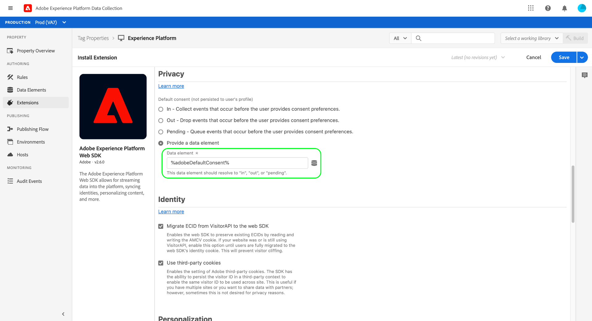

# Integre o SDK da Web da plataforma para processar os dados de consentimento do cliente usando o padrão do Adobe 2.0

O SDK da Web da Adobe Experience Platform permite recuperar sinais de consentimento do cliente gerados pelas CMPs (Consent Management Platforms) e enviá-los para a Adobe Experience Platform sempre que um evento de alteração de consentimento ocorrer.

**O SDK não faz interface com nenhum CMPs pronto para uso**. Cabe a você determinar como integrar o SDK ao seu site, acompanhar as alterações de consentimento no CMP e chamar o comando apropriado. Este documento fornece orientação geral sobre como integrar sua CMP ao SDK da Web da plataforma.

## Pré-requisitos

Este tutorial pressupõe que você já tenha determinado como gerar dados de consentimento dentro da CMP e criou um conjunto de dados contendo campos de consentimento que foi ativado para o Perfil do cliente em tempo real. Para saber mais sobre essas etapas, consulte a visão geral do [processamento de consentimento em Experience Platform](./overview.md) antes de retornar a este guia.

Além disso, este guia requer uma compreensão funcional das extensões do Adobe Experience Platform Launch e como elas são instaladas em aplicativos Web. Consulte a seguinte documentação para obter mais informações:

* [Visão geral do platform launch](https://experienceleague.adobe.com/docs/launch/using/home.html)
* [Manual de início rápido](https://experienceleague.adobe.com/docs/launch/using/get-started/quick-start.html)
* [Visão geral da publicação](https://experienceleague.adobe.com/docs/launch/using/publish/overview.html)

## Configurar uma configuração de borda

Para que o SDK envie dados para o Experience Platform, é necessário ter uma configuração de borda existente para a Plataforma configurada no Adobe Experience Platform Launch. Além disso, o [!UICONTROL Profile Dataset] selecionado para a configuração deve conter campos de consentimento padronizados.

Depois de criar uma nova configuração ou selecionar uma existente para editar, selecione o botão de alternância ao lado de **[!UICONTROL Adobe Experience Platform]**. Em seguida, use os valores listados abaixo para preencher o formulário.


| Campo de configuração da borda | Valor |
| --- | --- |
| [!UICONTROL Sandbox] | O nome da plataforma [sandbox](../../../../sandboxes/home.md) que contém a conexão de transmissão e os conjuntos de dados necessários para configurar a configuração de borda. |
| [!UICONTROL Streaming Inlet] | Uma conexão de transmissão válida para Experience Platform. Consulte o tutorial em [criar uma conexão de transmissão](../../../../ingestion/tutorials/create-streaming-connection-ui.md) se você não tiver uma entrada de transmissão existente. |
| [!UICONTROL Event Dataset] | Um conjunto de dados [!DNL XDM ExperienceEvent] que você planeja enviar dados do evento para o usando o SDK. Embora seja necessário fornecer um conjunto de dados de evento para criar uma configuração de borda da plataforma, observe que o envio de dados de consentimento diretamente por meio de eventos não é compatível no momento. |
| [!UICONTROL Profile Dataset] | O conjunto de dados habilitado para [!DNL Profile] com campos de consentimento do cliente que você criou anteriormente. |

Quando terminar, selecione **[!UICONTROL Save]** na parte inferior da tela e continue seguindo os prompts adicionais para concluir a configuração.


## Instalar e configurar a extensão do SDK da Web da plataforma

Depois de criar uma configuração de borda conforme descrito na seção anterior, você deve configurar a extensão SDK da Web da plataforma que será implantada no site. Se não tiver a extensão SDK instalada na propriedade do Platform launch, selecione **[!UICONTROL Extensions]** na navegação à esquerda, seguida pela guia **[!UICONTROL Catalog]**. Em seguida, selecione **[!UICONTROL Install]** na extensão SDK da plataforma dentro da lista de extensões disponíveis.


Ao configurar o SDK, em **[!UICONTROL Edge Configurations]**, selecione a configuração criada na etapa anterior.


Selecione **[!UICONTROL Save]** para instalar a extensão.

### Criar um elemento de dados para definir o consentimento padrão

Com a extensão SDK instalada, você tem a opção de criar um elemento de dados para representar o valor de consentimento padrão da coleta de dados (`collect.val`) para seus usuários. Isso pode ser útil se você quiser ter valores padrão diferentes dependendo do usuário, como `pending` para usuários da União Europeia e `in` para usuários da América do Norte.

Nesse caso de uso, você pode implementar o seguinte para definir o consentimento padrão com base na região do usuário:

1. Determine a região do usuário no servidor da Web.
1. Antes da tag do script do Platform launch (código incorporado) na página da Web, renderize uma tag de script separada que defina uma variável `adobeDefaultConsent` com base na região do usuário.
1. Configure um elemento de dados que use a variável `adobeDefaultConsent` do JavaScript e use esse elemento de dados como o valor de consentimento padrão para o usuário.

Se a região do usuário for determinada por uma CMP, você poderá usar as seguintes etapas:

1. Manipule o evento &quot;CMP loaded&quot; na página.
1. No manipulador de eventos, defina uma variável `adobeDefaultConsent` com base na região do usuário e carregue o script da biblioteca de Platforms launch usando JavaScript.
1. Configure um elemento de dados que use a variável `adobeDefaultConsent` do JavaScript e use esse elemento de dados como o valor de consentimento padrão para o usuário.

Para criar um elemento de dados na interface do usuário do Platform launch, selecione **[!UICONTROL Data Elements]** na navegação à esquerda e selecione **[!UICONTROL Add Data Element]** para navegar até a caixa de diálogo de criação do elemento de dados.

Aqui, você deve criar um elemento de dados [!UICONTROL JavaScript Variable] com base em `adobeDefaultConsent`. Selecione **[!UICONTROL Save]** quando terminar.


Depois que o elemento de dados é criado, navegue de volta para a página de configuração da extensão do SDK da Web. Na seção [!UICONTROL Privacy], selecione **[!UICONTROL Provided by data element]** e use a caixa de diálogo fornecida para selecionar o elemento de dados de consentimento padrão criado anteriormente.



### Implantar a extensão no site

Quando terminar de configurar a extensão, ela poderá ser integrada ao seu site. Consulte o [guia de publicação](https://experienceleague.adobe.com/docs/launch/using/publish/overview.html) na documentação do Platform launch para obter informações detalhadas sobre como implantar sua build de biblioteca atualizada.

## Comandos de alteração de consentimento

Depois de integrar a extensão SDK ao seu site, você pode começar a usar o comando Plataforma Web SDK `setConsent` para enviar dados de consentimento para a Plataforma.

Há dois cenários em que `setConsent` deve ser chamado no site:

1. Quando o consentimento é carregado na página (em outras palavras, em cada carregamento de página)
1. Como parte de um gancho ou ouvinte de evento da CMP que detecta alterações nas configurações de consentimento

>[!NOTE]
>
>Para obter uma introdução à sintaxe comum para comandos do SDK da plataforma, consulte o documento em [executar comandos](../../../../edge/fundamentals/executing-commands.md).

O comando `setConsent` espera dois argumentos:

1. Uma string que indica o tipo de comando (nesse caso, `"setConsent"`)
1. Um objeto de carga que contém uma única propriedade do tipo matriz: `consent`. A matriz `consent` deve conter pelo menos um objeto que forneça os campos de consentimento necessários para o padrão Adobe.

Os campos de consentimento necessários para o padrão do Adobe são mostrados na seguinte chamada de exemplo `setConsent`:

```js
alloy("setConsent", {
  consent: [{
    standard: "Adobe",
    version: "2.0",
    value: {
      collect: {
        val: "y"
      },
      share: {
        val: "y"
      },
      personalize: {
        content: {
          val: "y"
        }
      },
      metadata: {
        time: "2020-10-12T15:52:25+00:00"
      }
    }
  }]
});
```

| Propriedade da carga útil | Descrição |
| --- | --- |
| `standard` | O padrão de consentimento que está sendo usado. Para o padrão Adobe, esse valor deve ser definido como `Adobe`. |
| `version` | O número da versão do padrão de consentimento indicado em `standard`. Esse valor deve ser definido como `2.0` para processamento de consentimento padrão do Adobe. |
| `value` | As informações de consentimento atualizadas do cliente, fornecidas como um objeto XDM que está em conformidade com a estrutura dos campos de consentimento do conjunto de dados habilitado para perfil. |

>[!NOTE]
>
>Se estiver usando outros padrões de consentimento em conjunto com `Adobe` (como `IAB TCF`), poderá adicionar objetos adicionais à matriz `consent` para cada padrão. Cada objeto deve conter valores apropriados para `standard`, `version` e `value` para o padrão de consentimento que representa.

O JavaScript a seguir fornece um exemplo de uma função que lida com as alterações de preferência de consentimento em um site, que pode ser usado como um retorno de chamada em um ouvinte de evento ou um gancho de CMP:

```js
var setConsent = function () {

  // Retrieve the current consent data.
  var categories = getConsentData();

  // If the script is running on a consent change, generate a new timestamp.
  // If the script is running on page load, set the timestamp to when the consent values last changed.
  var now = new Date();
  var collectedAt = consentChanged ? now.toISOString() : categories.collectedAt;

  //  Map the consent values and timestamp to XDM
  var consentXDM = {
    collect: {
      val: categories.collect !== -1 ? "y" : "n"
    },
    personalize: {
      content: {
        val: categories.personalizeContent !== -1 ? "y" : "n"
      }
    },
    share: {
      val: categories.share !== -1 ? "y" : "n"
    },
    metadata: {
      time: collectedAt
    }
  };

  // Pass the XDM object to the Platform Web SDK
  alloy("setConsent", {
    consent: [{
      standard: "Adobe",
      version: "2.0",
      value: consentXDM
    }]
  });
});
```

## Tratamento de respostas do SDK

Todos os comandos [!DNL Platform SDK] retornam promessas que indicam se a chamada foi bem-sucedida ou falhou. Em seguida, você pode usar essas respostas para obter uma lógica adicional, como exibir mensagens de confirmação para o cliente. Consulte a seção [manuseando o sucesso ou a falha](../../../../edge/fundamentals/executing-commands.md#handling-success-or-failure) no guia sobre a execução de comandos do SDK para obter exemplos específicos.

## Próximas etapas

Ao seguir este guia, você configurou a extensão SDK da Web da plataforma para enviar dados de consentimento ao Experience Platform. Agora você pode retornar à visão geral do processamento de consentimento para obter etapas sobre como [testar sua implementação](./overview.md#test-implementation).