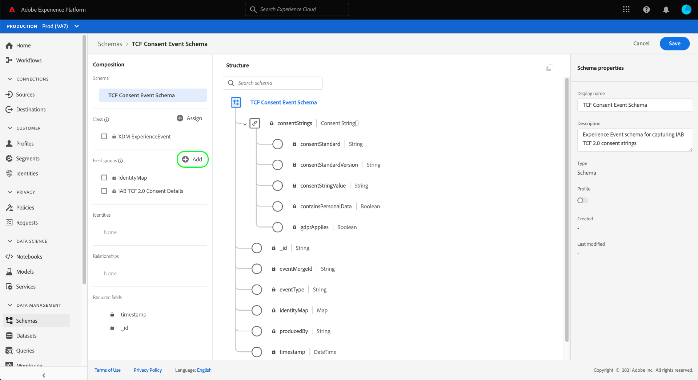

# Criar conjuntos de dados para capturar dados de consentimento do IAB TCF 2.0

Para que o Adobe Experience Platform processe dados de consentimento do cliente de acordo com o IAB [!DNL Transparency & Consent Framework] (TCF) 2.0, esses dados devem ser enviados para conjuntos de dados cujos esquemas contêm campos de consentimento TCF 2.0.

Especificamente, dois conjuntos de dados são necessários para capturar dados de consentimento do TCF 2.0:

* Um conjunto de dados com base na classe [!DNL XDM Individual Profile], habilitado para uso em [!DNL Real-time Customer Profile].
* Um conjunto de dados com base na classe [!DNL XDM ExperienceEvent] .

>[!IMPORTANT]
>
>A Platform aplica somente as cadeias de caracteres TCF coletadas no conjunto de dados Perfil individual . Embora um conjunto de dados ExperienceEvent ainda seja necessário para criar um conjunto de dados como parte desse fluxo de trabalho, é necessário assimilar dados somente no conjunto de dados do perfil. O conjunto de dados ExperienceEvent ainda pode ser usado se você deseja rastrear eventos de alteração de consentimento ao longo do tempo, mas esses valores não são usados em ao impor na ativação do segmento.

Este documento fornece etapas para configurar esses dois conjuntos de dados. Para obter uma visão geral do fluxo de trabalho completo para configurar as operações de dados da plataforma para TCF 2.0, consulte a [Visão geral de conformidade do IAB TCF 2.0](./overview.md).

## Pré-requisitos

Este tutorial requer uma compreensão funcional dos seguintes componentes do Adobe Experience Platform:

* [Modelo de dados de experiência (XDM)](../../../../xdm/home.md): A estrutura padronizada pela qual  [!DNL Experience Platform] organiza os dados de experiência do cliente.
   * [Noções básicas da composição](../../../../xdm/schema/composition.md) do schema: Saiba mais sobre os componentes básicos dos esquemas XDM.
* [Serviço](../../../../identity-service/home.md) de identidade da Adobe Experience Platform: Permite que você conecte identidades de clientes de suas diferentes fontes de dados entre dispositivos e sistemas.
   * [Namespaces](../../../../identity-service/namespaces.md) de identidade: Os dados de identidade do cliente devem ser fornecidos em um namespace de identidade específico reconhecido pelo Serviço de identidade.
* [Perfil](../../../../profile/home.md) do cliente em tempo real: Aproveitamento  [!DNL Identity Service] para permitir que você crie perfis de clientes detalhados a partir de seus conjuntos de dados em tempo real. [!DNL Real-time Customer Profile] extrai dados do Data Lake e mantém perfis de clientes em seu próprio armazenamento de dados separado.

## Grupos de campos TCF 2.0 {#field-groups}

O grupo de campos [!UICONTROL Consentimento IAB TCF 2.0] fornece campos de consentimento do cliente necessários para o suporte TCF 2.0. Há duas versões desse grupo de campos: uma é compatível com a classe [!DNL XDM Individual Profile] e a outra com a classe [!DNL XDM ExperienceEvent].

As seções abaixo explicam a estrutura de cada um desses grupos de campos, incluindo os dados esperados durante a assimilação.

### Grupo de campos de perfil {#profile-field-group}

Para esquemas baseados em [!DNL XDM Individual Profile], o grupo de campos [!UICONTROL Consentimento TCF do IAB 2.0] fornece um único campo do tipo mapa, `identityPrivacyInfo`, que mapeia as identidades do cliente para suas preferências de consentimento TCF. Esse grupo de campos deve ser incluído em um schema baseado em registro habilitado para o Perfil do cliente em tempo real para que a imposição automática ocorra.

Consulte o [guia de referência](../../../../xdm/field-groups/profile/iab.md) desse grupo de campos para saber mais sobre sua estrutura e caso de uso.

### Grupo de campos Evento {#event-field-group}

Se quiser rastrear eventos de alteração de consentimento ao longo do tempo, é possível adicionar o grupo de campos [!UICONTROL Consentimento IAB TCF 2.0] ao esquema [!UICONTROL XDM ExperienceEvent].

Se você não planeja rastrear eventos de alteração de consentimento ao longo do tempo, não é necessário incluir esse grupo de campos no esquema de evento. Ao impor automaticamente valores de consentimento da TCF, o Experience Platform só usa as informações de consentimento mais recentes assimiladas no [grupo de campo de perfil](#profile-field-group). Os valores de consentimento capturados pelos eventos não participam dos workflows de imposição automática.

Consulte o [guia de referência](../../../../xdm/field-groups/event/iab.md) desse grupo de campos para obter mais informações sobre sua estrutura e caso de uso.

## Criar esquemas de consentimento do cliente {#create-schemas}

Para criar conjuntos de dados que capturam dados de consentimento, primeiro crie esquemas XDM para basear esses conjuntos de dados.

Na interface do usuário da plataforma, selecione **[!UICONTROL Schemas]** na navegação à esquerda para abrir o espaço de trabalho [!UICONTROL Schemas]. A partir daqui, siga as etapas nas seções abaixo para criar cada schema necessário.

>[!NOTE]
>
>Se você tiver esquemas XDM existentes que deseja usar para capturar dados de consentimento, edite esses esquemas em vez de criar novos. No entanto, se um esquema existente tiver sido ativado para uso no Perfil do cliente em tempo real, sua identidade primária não poderá ser um campo diretamente identificável que seja proibido de usar em publicidade com base em interesses, como um endereço de email. Consulte seu consultor jurídico se não tiver certeza de quais campos são restritos.
>
>Além disso, ao editar schemas existentes, somente alterações aditivas (ininterruptas) podem ser feitas. Consulte a seção sobre os [princípios da evolução do schema](../../../../xdm/schema/composition.md#evolution) para obter mais informações.

### Criar um esquema de consentimento de perfil {#profile-schema}

Selecione **[!UICONTROL Criar esquema]** e escolha **[!UICONTROL Perfil individual XDM]** no menu suspenso.

A caixa de diálogo **[!UICONTROL Adicionar grupos de campos]** é exibida, permitindo que você comece a adicionar grupos de campos ao esquema imediatamente. Aqui, selecione **[!UICONTROL Consentimento IAB TCF 2.0]** na lista. Como opção, você pode usar a barra de pesquisa para restringir os resultados para localizar o grupo de campos mais facilmente. Depois que o grupo de campos for selecionado, selecione **[!UICONTROL Adicionar grupos de campos]**.

A tela é exibida novamente, mostrando que o campo `identityPrivacyInfo` foi adicionado à estrutura do schema.

Antes de adicionar mais campos ao schema, selecione o campo raiz para revelar **[!UICONTROL Schema properties]** no painel direito, onde é possível fornecer um nome e uma descrição para o schema.

Depois de fornecer um nome e uma descrição, selecione **[!UICONTROL Add]** na seção **[!UICONTROL Field groups]** no lado esquerdo da tela.

A partir daqui, use a caixa de diálogo para adicionar os seguintes grupos de campos adicionais ao esquema:

* [!UICONTROL IdentityMap]
* [!UICONTROL Região de captura de dados para o Perfil]
* [!UICONTROL Detalhes demográficos]
* [!UICONTROL Detalhes de contato pessoal]

Se você estiver editando um esquema existente que já foi ativado para uso em [!DNL Real-time Customer Profile], selecione **[!UICONTROL Salvar]** para confirmar as alterações antes de pular para a seção em [criar um conjunto de dados com base no esquema de consentimento](#dataset). Se estiver criando um novo schema, continue seguindo as etapas descritas na subseção abaixo.

#### Ative o esquema para usar em [!DNL Real-time Customer Profile]

Para que a Platform associe os dados de consentimento que recebe a perfis de clientes específicos, o schema de consentimento deve ser ativado para uso em [!DNL Real-time Customer Profile].

>[!NOTE]
>
>O schema de exemplo mostrado nesta seção usa seu campo `identityMap` como sua identidade primária. Se desejar definir outro campo como uma identidade primária, verifique se você está usando um identificador indireto como uma ID de cookie e não um campo diretamente identificável que é proibido de usar em publicidade com base em interesses, como um endereço de email. Consulte seu consultor jurídico se não tiver certeza de quais campos são restritos.
>
>As etapas sobre como definir um campo de identidade primário para um schema podem ser encontradas no [tutorial de criação de schema](../../../../xdm/tutorials/create-schema-ui.md#identity-field).

Para habilitar o schema para [!DNL Profile], selecione o nome do schema no painel esquerdo para abrir a seção **[!UICONTROL Schema properties]**. Aqui, selecione o botão de alternância **[!UICONTROL Profile]**.

Um provedor é exibido, indicando uma identidade primária ausente. Marque a caixa de seleção para usar uma identidade primária alternativa, pois a identidade primária estará contida no campo `identityMap`.

Finalmente, selecione **[!UICONTROL Save]** para confirmar as alterações.

### Criar um esquema de consentimento de evento {#event-schema}

No espaço de trabalho **[!UICONTROL Schemas]**, selecione **[!UICONTROL Criar esquema]** e escolha **[!UICONTROL XDM ExperienceEvent]** no menu suspenso.

A caixa de diálogo **[!UICONTROL Adicionar grupos de campos]** é exibida. Aqui, selecione **[!UICONTROL Consentimento IAB TCF 2.0]** na lista. Como opção, você pode usar a barra de pesquisa para restringir os resultados para localizar o grupo de campos mais facilmente. Depois de escolher o grupo de campos, selecione **[!UICONTROL Add field groups]**.

>[!NOTE]
>
>A inclusão desse grupo de campos no esquema de evento só é necessária se você estiver planejando rastrear eventos de alteração de consentimento ao longo do tempo. Se não quiser rastrear esses eventos, use um schema de eventos sem esses campos ao configurar o SDK da Web.

A tela é exibida novamente, mostrando que o campo `consentStrings` foi adicionado à estrutura do schema.

Antes de adicionar mais campos ao schema, selecione o campo raiz para revelar **[!UICONTROL Schema properties]** no painel direito, onde é possível fornecer um nome e uma descrição para o schema.

Depois de fornecer um nome e uma descrição, selecione **[!UICONTROL Add]** na seção **[!UICONTROL Field groups]** no lado esquerdo da tela.

A partir daqui, repita as etapas acima para adicionar os seguintes grupos de campos adicionais ao schema:

* [!UICONTROL IdentityMap]
* [!UICONTROL Detalhes do ambiente]
* [!UICONTROL Detalhes da Web]
* [!UICONTROL Detalhes da implementação]

Depois que os grupos de campos tiverem sido adicionados, conclua selecionando **[!UICONTROL Save]**.

## Criar conjuntos de dados com base em seus esquemas de consentimento {#datasets}

Para cada um dos esquemas obrigatórios descritos acima, você deve criar um conjunto de dados que, em última análise, assimilará os dados de consentimento de seus clientes. O conjunto de dados com base no esquema de registro deve ser habilitado para [!DNL Real-time Customer Profile], enquanto o conjunto de dados com base no esquema de série de tempo **não deve** ser [!DNL Profile] habilitado.

Para começar, selecione **[!UICONTROL Datasets]** na navegação à esquerda e selecione **[!UICONTROL Criar conjunto de dados]** no canto superior direito.

Na próxima página, selecione **[!UICONTROL Criar conjunto de dados do schema]**.

O workflow **[!UICONTROL Criar conjunto de dados a partir do schema]** é exibido, começando na etapa **[!UICONTROL Selecionar schema]**. Na lista fornecida, localize um dos esquemas de consentimento criados anteriormente. Como opção, você pode usar a barra de pesquisa para restringir os resultados e localizar o esquema mais fácil. Selecione o botão de opção ao lado do schema desejado e selecione **[!UICONTROL Next]** para continuar.

A etapa **[!UICONTROL Configurar conjunto de dados]** é exibida. Forneça um nome e uma descrição exclusivos e facilmente identificáveis para o conjunto de dados antes de selecionar **[!UICONTROL Finish]**.

A página de detalhes do conjunto de dados recém-criado é exibida. Se o conjunto de dados se basear no esquema da série de tempo, o processo será concluído. Se o conjunto de dados se baseia no esquema de registro, a etapa final no processo é habilitar o conjunto de dados para uso em [!DNL Real-time Customer Profile].

No painel direito, selecione o botão **[!UICONTROL Profile]** e selecione **[!UICONTROL Enable]** no servidor de confirmação para habilitar o esquema para [!DNL Profile].

Siga as etapas acima novamente para criar o outro conjunto de dados necessário para conformidade com o TCF 2.0.

## Próximas etapas

Ao seguir este tutorial, você criou dois conjuntos de dados que agora podem ser usados para coletar dados de consentimento do cliente:

* Um conjunto de dados baseado em registros habilitado para uso no Perfil do cliente em tempo real.
* Um conjunto de dados baseado em séries de tempo que não está habilitado para [!DNL Profile].

Agora você pode retornar à [Visão geral do IAB TCF 2.0](./overview.md#merge-policies) para continuar o processo de configuração da Plataforma para conformidade com o TCF 2.0.
