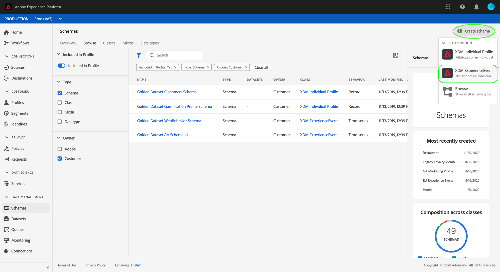

# Criar conjuntos de dados para capturar dados de consentimento do IAB TCF 2.0

Para que a Adobe Experience Platform processe dados de consentimento do cliente de acordo com o IAB [!DNL Transparency & Consent Framework] (TCF) 2.0, esses dados devem ser enviados para conjuntos de dados cujos esquemas contêm campos de consentimento TCF 2.0.

Especificamente, dois conjuntos de dados são necessários para capturar dados de consentimento do TCF 2.0:

* Um conjunto de dados com base na classe [!DNL XDM Individual Profile], habilitado para uso em [!DNL Real-time Customer Profile].
* Um conjunto de dados com base na classe [!DNL XDM ExperienceEvent] .

Este documento fornece etapas para configurar esses dois conjuntos de dados para coletar dados de consentimento do IAB TCF 2.0. Para obter uma visão geral do fluxo de trabalho completo para configurar as operações de dados da plataforma para TCF 2.0, consulte a [Visão geral de conformidade do IAB TCF 2.0](./overview.md).

## Pré-requisitos

Este tutorial requer uma compreensão funcional dos seguintes componentes da Adobe Experience Platform:

* [Modelo de dados de experiência (XDM)](../../../../xdm/home.md): A estrutura padronizada pela qual  [!DNL Experience Platform] organiza os dados de experiência do cliente.
   * [Noções básicas da composição](../../../../xdm/schema/composition.md) do schema: Saiba mais sobre os componentes básicos dos esquemas XDM.
* [Serviço de identidade da Adobe Experience Platform](../../../../identity-service/home.md): Permite que você conecte identidades de clientes de suas diferentes fontes de dados entre dispositivos e sistemas.
   * [Namespaces](../../../../identity-service/namespaces.md) de identidade: Os dados de identidade do cliente devem ser fornecidos em um namespace de identidade específico reconhecido pelo Serviço de identidade.
* [Perfil](../../../../profile/home.md) do cliente em tempo real: Aproveitamento  [!DNL Identity Service] para permitir que você crie perfis de clientes detalhados a partir de seus conjuntos de dados em tempo real. [!DNL Real-time Customer Profile] extrai dados do Data Lake e mantém perfis de clientes em seu próprio armazenamento de dados separado.

## [!UICONTROL Estrutura de ] detalhamento de privacidade  {#structure}

A combinação [!UICONTROL Detalhes de privacidade] fornece campos de consentimento do cliente necessários para o suporte ao TCF 2.0. Há duas versões desse mixin: uma é compatível com a classe [!DNL XDM Individual Profile] e a outra com a classe [!DNL XDM ExperienceEvent].

As seções abaixo explicam a estrutura de cada uma dessas misturas, incluindo os dados que esperam durante a ingestão.

### Mistura de perfil {#profile-mixin}

Para esquemas baseados em [!DNL XDM Individual Profile], a mesclagem [!UICONTROL Detalhes de privacidade] fornece um único campo do tipo mapa, `xdm:identityPrivacyInfo`, que mapeia as identidades do cliente para suas preferências de consentimento TCF. O JSON a seguir é um exemplo do tipo de dados que `xdm:identityPrivacyInfo` espera ao assimilar dados:

```json
{
  "xdm:identityPrivacyInfo": {
      "ECID": {
        "13782522493631189": {
          "xdm:identityIABConsent": {
            "xdm:consentTimestamp": "2020-04-11T05:05:05Z",
            "xdm:consentString": {
              "xdm:consentStandard": "IAB TCF",
              "xdm:consentStandardVersion": "2.0",
              "xdm:consentStringValue": "BObdrPUOevsguAfDqFENCNAAAAAmeAAA.PVAfDObdrA.DqFENCAmeAENCDA",
              "xdm:gdprApplies": true,
              "xdm:containsPersonalData": false
            }
          }
        }
      }
    }
}
```

Como mostra o exemplo, cada chave de nível raiz de `xdm:identityPrivacyInfo` corresponde a um namespace de identidade reconhecido pelo Serviço de identidade. Por sua vez, cada propriedade de namespace deve ter pelo menos uma subpropriedade cuja chave corresponda ao valor de identidade correspondente do cliente para esse namespace. Neste exemplo, o cliente é identificado com um valor da Experience Cloud ID (`ECID`) de `13782522493631189`.

>[!NOTE]
>
>Embora o exemplo acima use um único par de namespace/valor para representar a identidade do cliente, você pode adicionar chaves adicionais para outros namespaces, e cada namespace pode ter vários valores de identidade, cada um com seu próprio conjunto de preferências de consentimento TCF.

No objeto de valor de identidade, há um único campo, `xdm:identityIABConsent`. Esse objeto captura os valores de consentimento da TCF do cliente para o namespace e o valor da identidade especificados. As subpropriedades contidas neste campo são listadas abaixo:

| Propriedade | Descrição |
| --- | --- |
| `xdm:consentTimestamp` | Um carimbo de data e hora [ISO 8601](https://www.ietf.org/rfc/rfc3339.txt) de quando os valores de consentimento da TCF foram alterados. |
| `xdm:consentString` | Um objeto que contém os dados de consentimento atualizados do cliente e outras informações contextuais. Consulte a seção em [propriedades da cadeia de consentimento](#consent-string) para saber mais sobre as subpropriedades necessárias desse objeto. |

### Mistura de eventos {#event-mixin}

Para esquemas baseados em [!DNL XDM ExperienceEvent], a mesclagem [!UICONTROL Detalhes de privacidade] fornece um único campo do tipo matriz: `xdm:consentStrings`. Cada item nessa matriz deve ser um objeto que contenha as propriedades necessárias para uma cadeia de consentimento TCF, semelhante ao campo `xdm:consentString` no mixin do perfil. Para obter mais informações sobre essas subpropriedades, consulte a [próxima seção](#consent-string).

```json
{
  "xdm:consentStrings": [
    {
      "xdm:consentStandard": "IAB TCF",
      "xdm:consentStandardVersion": "2.0",
      "xdm:consentStringValue": "BObdrPUOevsguAfDqFENCNAAAAAmeAAA.PVAfDObdrA.DqFENCAmeAENCDA",
      "xdm:gdprApplies": true,
      "xdm:containsPersonalData": false
    }
  ]
}
```

### Propriedades da sequência de consentimento {#consent-string}

Ambas as versões do mixin [!UICONTROL Detalhes de privacidade] exigem pelo menos um objeto que capture os campos necessários que descrevem a cadeia de consentimento TCF para o cliente. Essas propriedades são explicadas abaixo:

| Propriedade | Descrição |
| --- | --- |
| `xdm:consentStandard` | A estrutura de consentimento à qual os dados se aplicam. Para conformidade com TCF, o valor deve ser `IAB TCF`. |
| `xdm:consentStandardVersion` | O número da versão da estrutura de consentimento indicado por `xdm:consentStandard`. Para conformidade com TCF 2.0, o valor deve ser `2.0`. |
| `xdm:consentStringValue` | A cadeia de consentimento que foi gerada pela plataforma de gerenciamento de consentimento (CMP) com base nas configurações selecionadas do cliente. |
| `xdm:gdprApplies` | Um valor booleano indicando se o GDPR se aplica ou não a este cliente. O valor deve ser definido como `true` para que a aplicação do TCF 2.0 ocorra. O padrão é `true` se não estiver incluído. |
| `xdm:containsPersonalData` | Um valor booleano indicando se a atualização de consentimento contém ou não dados pessoais. O padrão é `false` se não estiver incluído. |

## Criar esquemas de consentimento do cliente {#create-schemas}

Para criar conjuntos de dados que capturam dados de consentimento, primeiro você deve criar esquemas XDM para basear esses conjuntos de dados.

Na interface do usuário da plataforma, selecione **[!UICONTROL Schemas]** na navegação à esquerda para abrir o espaço de trabalho [!UICONTROL Schemas]. A partir daqui, siga as etapas nas seções abaixo para criar cada schema necessário.

>[!NOTE]
>
>Se você tiver esquemas XDM existentes que deseja usar para capturar dados de consentimento, edite esses esquemas em vez de criar novos. No entanto, se um esquema existente tiver sido ativado para uso no Perfil do cliente em tempo real, sua identidade primária não poderá ser um campo diretamente identificável que seja proibido de usar em publicidade com base em interesses, como um endereço de email. Consulte seu consultor jurídico se não tiver certeza de quais campos são restritos.
>
>Além disso, ao editar schemas existentes, somente alterações aditivas (ininterruptas) podem ser feitas. Consulte a seção sobre os [princípios da evolução do schema](../../../../xdm/schema/composition.md#evolution) para obter mais informações.

### Criar um esquema de consentimento baseado em registro {#profile-schema}

Na área de trabalho **[!UICONTROL Schemas]**, selecione **[!UICONTROL Criar esquema]** e escolha **[!UICONTROL Perfil individual XDM]** na lista suspensa.


O [!DNL Schema Editor] é exibido, mostrando a estrutura do schema na tela. Use o painel direito para fornecer um nome e uma descrição para o schema e selecione **[!UICONTROL Adicionar]** na seção **[!UICONTROL Mixins]** no lado esquerdo da tela.


A caixa de diálogo **[!UICONTROL Adicionar mixin]** é exibida. Aqui, selecione **[!UICONTROL Detalhes de privacidade]** na lista. Como opção, você pode usar a barra de pesquisa para restringir os resultados para localizar a mistura mais fácil. Depois que o mixin for selecionado, selecione **[!UICONTROL Add mixin]**.


A tela é exibida novamente, mostrando que o campo `identityPrivacyInfo` foi adicionado à estrutura do schema.


A partir daqui, repita as etapas acima para adicionar as seguintes combinações adicionais ao schema:

* [!UICONTROL IdentityMap]
* [!UICONTROL Região de captura de dados para o Perfil]
* [!UICONTROL Detalhes demográficos]
* [!UICONTROL Detalhes de contato pessoal]


Se você estiver editando um esquema existente que já foi ativado para uso em [!DNL Real-time Customer Profile], selecione **[!UICONTROL Salvar]** para confirmar as alterações antes de pular para a seção em [criar um conjunto de dados com base no esquema de consentimento](#dataset). Se estiver criando um novo schema, continue seguindo as etapas descritas na subseção abaixo.

#### Ative o esquema para usar em [!DNL Real-time Customer Profile]

Para que a Platform associe os dados de consentimento que recebe a perfis de clientes específicos, o schema de consentimento deve ser ativado para uso em [!DNL Real-time Customer Profile].

>[!NOTE]
>
>O schema de exemplo mostrado nesta seção usa seu campo `identityMap` como sua identidade primária. Se desejar definir outro campo como uma identidade primária, verifique se você está usando um identificador indireto como uma ID de cookie e não um campo diretamente identificável que é proibido de usar em publicidade com base em interesses, como um endereço de email. Consulte seu consultor jurídico se não tiver certeza de quais campos são restritos.
>
>As etapas sobre como definir um campo de identidade primário para um schema podem ser encontradas no [tutorial de criação de schema](../../../../xdm/tutorials/create-schema-ui.md#identity-field).

Para ativar o schema para [!DNL Profile], selecione o nome do schema no painel à esquerda para abrir a caixa de diálogo **[!UICONTROL Schema properties]** no painel à direita. Aqui, selecione o botão de alternância **[!UICONTROL Profile]**.


Um provedor é exibido, indicando uma identidade primária ausente. Marque a caixa de seleção para usar uma identidade primária alternativa, pois a identidade primária estará contida no campo `identityMap`.


Finalmente, selecione **[!UICONTROL Save]** para confirmar as alterações.


### Criar um esquema de consentimento baseado em séries de tempo {#event-schema}

No espaço de trabalho **[!UICONTROL Schemas]**, selecione **[!UICONTROL Criar esquema]** e escolha **[!UICONTROL XDM ExperienceEvent]** no menu suspenso.



O [!DNL Schema Editor] é exibido, mostrando a estrutura do schema na tela. Use o painel direito para fornecer um nome e uma descrição para o schema e selecione **[!UICONTROL Adicionar]** na seção **[!UICONTROL Mixins]** no lado esquerdo da tela.


A caixa de diálogo **[!UICONTROL Adicionar mixin]** é exibida. Aqui, selecione **[!UICONTROL Detalhes de privacidade]** na lista. Como opção, você pode usar a barra de pesquisa para restringir os resultados para localizar a mistura mais fácil. Depois de escolher uma mistura, selecione **[!UICONTROL Add mixin]**.


A tela é exibida novamente, mostrando que a matriz `consentStrings` foi adicionada à estrutura do schema.


A partir daqui, repita as etapas acima para adicionar as seguintes combinações adicionais ao schema:

* [!UICONTROL IdentityMap]
* [!UICONTROL Detalhes do ambiente]
* [!UICONTROL Detalhes da Web]
* [!UICONTROL Detalhes da implementação]

Depois que as combinações forem adicionadas, conclua selecionando **[!UICONTROL Save]**.


## Criar conjuntos de dados com base em seus esquemas de consentimento {#datasets}

Para cada um dos esquemas obrigatórios descritos acima, você deve criar um conjunto de dados que, em última análise, assimilará os dados de consentimento de seus clientes. O conjunto de dados com base no esquema de registro deve ser habilitado para [!DNL Real-time Customer Profile], enquanto o conjunto de dados com base no esquema de série de tempo **não deve** ser [!DNL Profile] habilitado.

Para começar, selecione **[!UICONTROL Datasets]** na navegação à esquerda e selecione **[!UICONTROL Criar conjunto de dados]** no canto superior direito.


Na próxima página, selecione **[!UICONTROL Criar conjunto de dados do schema]**.


O workflow **[!UICONTROL Criar conjunto de dados a partir do schema]** é exibido, começando na etapa **[!UICONTROL Selecionar schema]**. Na lista fornecida, localize um dos esquemas de consentimento criados anteriormente. Como opção, você pode usar a barra de pesquisa para restringir os resultados e localizar o esquema mais fácil. Selecione o botão de opção ao lado do schema desejado e selecione **[!UICONTROL Next]** para continuar.


A etapa **[!UICONTROL Configurar conjunto de dados]** é exibida. Forneça um nome e uma descrição exclusivos e facilmente identificáveis para o conjunto de dados antes de selecionar **[!UICONTROL Finish]**.


A página de detalhes do conjunto de dados recém-criado é exibida. Se o conjunto de dados se basear no esquema da série de tempo, o processo será concluído. Se o conjunto de dados se baseia no esquema de registro, a etapa final no processo é habilitar o conjunto de dados para uso em [!DNL Real-time Customer Profile].

No painel direito, selecione o botão **[!UICONTROL Profile]** e selecione **[!UICONTROL Enable]** no provedor de confirmação para habilitar o schema para [!DNL Profile].


Siga as etapas acima novamente para criar o outro conjunto de dados necessário para conformidade com o TCF 2.0.

## Próximas etapas

Ao seguir este tutorial, você criou dois conjuntos de dados que agora podem ser usados para coletar dados de consentimento do cliente:

* Um conjunto de dados baseado em registros habilitado para uso no Perfil do cliente em tempo real.
* Um conjunto de dados baseado em séries de tempo que não está habilitado para [!DNL Profile].

Agora você pode retornar à [Visão geral do IAB TCF 2.0](./overview.md#merge-policies) para continuar o processo de configuração da Plataforma para conformidade com o TCF 2.0.