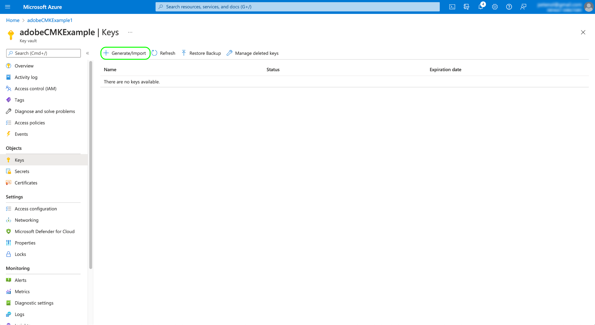

# Chaves gerenciadas pelo cliente no Adobe Experience Platform

Os dados armazenados no Adobe Experience Platform são criptografados em repouso usando chaves de nível de sistema. Se você estiver usando um aplicativo criado na plataforma, poderá optar por usar suas próprias chaves de criptografia, fornecendo maior controle sobre a segurança dos dados.

Este documento aborda o processo de habilitação do recurso CMK (Customer-managed keys, chaves gerenciadas pelo cliente) na plataforma.

## Pré-requisitos

Para ativar o CMK, seu [!DNL Azure] O Cofre de Chaves tem de ser configurado com as seguintes definições:

* [Ativar proteção de limpeza](https://learn.microsoft.com/en-us/azure/key-vault/general/soft-delete-overview#purge-protection)
* [Habilitar exclusão suave](https://learn.microsoft.com/en-us/azure/key-vault/general/soft-delete-overview)
* [Configure o acesso usando [!DNL Azure] controle de acesso baseado em funções](https://learn.microsoft.com/en-us/azure/role-based-access-control/)

## Resumo do processo

A CMK está incluída no Healthcare Shield e nas ofertas do Privacy and Security Shield do Adobe. Depois que sua organização comprar uma licença para uma dessas ofertas, você poderá iniciar um processo único para configurar o recurso.

>[!WARNING]
>
>Após a configuração do CMK, não é possível reverter para chaves gerenciadas pelo sistema. Você é responsável por gerenciar com segurança suas chaves e fornecer acesso ao seu Cofre de chaves, chave e aplicativo CMK em [!DNL Azure] para evitar a perda de acesso aos seus dados.

O processo é o seguinte:

1. [Configure um [!DNL Azure] Cofre de Chaves](#create-key-vault) com base nas políticas de sua organização, [gerar uma chave de criptografia](#generate-a-key) que será compartilhado com o Adobe.
1. Usar chamadas de API para [configurar o aplicativo CMK](#register-app) com seu [!DNL Azure] inquilino.
1. Usar chamadas de API para [enviar a ID da chave de criptografia para o Adobe](#send-to-adobe) e inicie o processo de ativação do recurso.
1. [Verifique o status da configuração](#check-status) para verificar se o CMK foi ativado.

Quando o processo de configuração for concluído, todos os dados integrados na Platform em todas as sandboxes serão criptografados usando o [!DNL Azure] configuração principal. Para usar o CMK, você aproveitará [!DNL Microsoft Azure] que pode fazer parte de sua [programa de visualização pública](https://azure.microsoft.com/en-ca/support/legal/preview-supplemental-terms/).

## Configure um [!DNL Azure] Cofre de Chaves {#create-key-vault}

O CMK só oferece suporte a chaves de um [!DNL Microsoft Azure] Cofre de Chaves. Para começar, você deve trabalhar com [!DNL Azure] para criar uma nova conta corporativa ou usar uma conta corporativa existente e siga as etapas abaixo para criar o Cofre de Chaves.

>[!IMPORTANT]
>
>Somente os níveis de serviço Premium e Standard para [!DNL Azure] O Cofre de Chaves é suportado. [!DNL Azure Managed HSM], [!DNL Azure Dedicated HSM] e [!DNL Azure Payments HSM] não são compatíveis. Consulte a [[!DNL Azure] documentação](https://learn.microsoft.com/en-us/azure/security/fundamentals/key-management#azure-key-management-services) para obter mais informações sobre os serviços de gerenciamento de chaves oferecidos.

>[!NOTE]
>
>A documentação abaixo cobre apenas as etapas básicas para criar o cofre de chaves. Fora dessa orientação, você deve configurar o cofre de chaves de acordo com as políticas de sua organização.

Faça logon no [!DNL Azure] portal e use a barra de pesquisa para localizar **[!DNL Key vaults]** na lista de serviços.


O **[!DNL Key vaults]** será exibida após selecionar o serviço. Aqui, selecione **[!DNL Create]**.


Usando o formulário fornecido, preencha os detalhes básicos do cofre de chaves, incluindo um nome e um grupo de recursos atribuído.

>[!WARNING]
>
>Embora a maioria das opções possa ser deixada como seus valores padrão, **certifique-se de ativar as opções de proteção de exclusão e limpeza de software**. Se não ativar esses recursos, você poderá correr o risco de perder acesso aos seus dados se o cofre de chaves for excluído.
>
>

A partir daqui, continue passando pelo fluxo de trabalho de criação do cofre principal e configure as diferentes opções de acordo com as políticas de sua organização.

Assim que você chegar ao **[!DNL Review + create]** , é possível revisar os detalhes do cofre de chaves enquanto ele passa pela validação. Depois que a validação for aprovada, selecione **[!DNL Create]** para concluir o processo.


### Configurar opções de rede

Se o seu cofre de chaves estiver configurado para restringir o acesso público a determinadas redes virtuais ou desabilitar totalmente o acesso público, você deverá conceder à Microsoft uma exceção de firewall.

Selecionar **[!DNL Networking]** no painel de navegação esquerdo. Em **[!DNL Firewalls and virtual networks]**, marque a caixa de seleção **[!DNL Allow trusted Microsoft services to bypass this firewall]**, em seguida selecione **[!DNL Apply]**.


### Gerar uma chave {#generate-a-key}

Depois de criar um cofre de chaves, você pode gerar uma nova chave. Navegue até o **[!DNL Keys]** e selecione **[!DNL Generate/Import]**.



Use o formulário fornecido para fornecer um nome para a chave e selecione **RSA** para o tipo de chave. No mínimo, a variável **[!DNL RSA key size]** deve ser pelo menos **3072** bits, conforme exigido por [!DNL Cosmos DB]. [!DNL Azure Data Lake Storage] também é compatível com o RSA 3027.

>[!NOTE]
>
>Lembre-se do nome que você fornece para a chave, pois ela será usada em uma etapa posterior ao [enviar a chave para o Adobe](#send-to-adobe).

Use os controles restantes para configurar a chave que deseja gerar ou importar, conforme desejado. Quando terminar, selecione **[!DNL Create]**.


A chave configurada aparece na lista de chaves do cofre.


## Configurar o aplicativo CMK {#register-app}

Depois que o cofre de chaves estiver configurado, a próxima etapa é se registrar no aplicativo CMK que será vinculado ao seu [!DNL Azure] inquilino.

### Introdução

O registro do aplicativo CMK requer que você faça chamadas para APIs da plataforma. Para obter detalhes sobre como coletar os cabeçalhos de autenticação necessários para fazer essas chamadas, consulte o [Guia de autenticação da API da plataforma](../../landing/api-authentication.md).

Embora o guia de autenticação forneça instruções sobre como gerar seu próprio valor exclusivo para o `x-api-key` cabeçalho da solicitação, todas as operações de API neste guia usam o valor estático `acp_provisioning` em vez disso. Você ainda deve fornecer seus próprios valores para `{ACCESS_TOKEN}` e `{ORG_ID}`, no entanto.

Em todas as chamadas de API mostradas neste guia, `platform.adobe.io` é usado como o caminho raiz, que padroniza a região do VA7. Se sua organização usar uma região diferente, `platform` deve ser seguido por um traço e o código de região atribuído à organização: `nld2` para NLD2 ou `aus5` para AUS5 (por exemplo: `platform-aus5.adobe.io`). Se você não souber a região da organização, entre em contato com o administrador do sistema.

### Buscar um URL de autenticação

Para iniciar o processo de registro, faça uma solicitação GET ao endpoint de registro do aplicativo para buscar o URL de autenticação necessário para sua organização.

**Solicitação**

```shell
curl -X GET \
  https://platform.adobe.io/data/infrastructure/manager/byok/app-registration \ 
  -H 'Authorization: Bearer {ACCESS_TOKEN}' \
  -H 'x-api-key: acp_provisioning' \
  -H 'x-gw-ims-org-id: {ORG_ID}'
```

**Resposta**

Uma resposta bem-sucedida retorna um `applicationRedirectUrl` , contendo o URL de autenticação.

```json
{
    "id": "byok",
    "name": "acpebae9422Caepcmkmultitenantapp",
    "applicationUri": "https://adobe.com/acpebae9422Caepcmkmultitenantapp",
    "applicationId": "e463a445-c6ac-4ca2-b36a-b5146fcf6a52",
    "applicationRedirectUrl": "https://login.microsoftonline.com/common/oauth2/authorize?response_type=code&client_id=e463a445-c6ac-4ca2-b36a-b5146fcf6a52&redirect_uri=https://adobe.com/acpebae9422Caepcmkmultitenantapp&scope=user.read"
}
```

Copie e cole o `applicationRedirectUrl` endereço em um navegador para abrir uma caixa de diálogo de autenticação. Selecionar **[!DNL Accept]** para adicionar o principal do serviço de aplicativo CMK ao seu [!DNL Azure] inquilino.


### Atribuir o aplicativo CMK a uma função {#assign-to-role}

Depois de concluir o processo de autenticação, retorne ao [!DNL Azure] Cofre de chaves e selecione **[!DNL Access control]** no painel de navegação esquerdo. Aqui, selecione **[!DNL Add]** seguida de **[!DNL Add role assignment]**.


A próxima tela solicita que você escolha uma função para esta atribuição. Selecionar **[!DNL Key Vault Crypto Service Encryption User]** antes de selecionar **[!DNL Next]** para continuar.


Na próxima tela, escolha **[!DNL Select members]** para abrir uma caixa de diálogo no painel direito. Use a barra de pesquisa para localizar o principal de serviço do aplicativo CMK e selecioná-lo na lista. Quando terminar, selecione **[!DNL Save]**.

>[!NOTE]
>
>Se você não conseguir encontrar seu aplicativo na lista, o principal do serviço não foi aceito no locatário. Trabalhe com seu [!DNL Azure] administrador ou representante para garantir que você tenha os privilégios corretos.

## Ative a configuração da chave de criptografia no Experience Platform {#send-to-adobe}

Depois de instalar o aplicativo CMK em [!DNL Azure], é possível enviar o identificador da chave de criptografia para o Adobe. Selecionar **[!DNL Keys]** no menu de navegação esquerdo, seguido pelo nome da chave que deseja enviar.


Selecione a versão mais recente da chave e sua página de detalhes será exibida. Aqui, você pode, opcionalmente, configurar as operações permitidas para a chave. No mínimo, a chave deve receber a **[!DNL Wrap Key]** e **[!DNL Unwrap Key]** permissões.

O **[!UICONTROL Identificador de Chave]** exibe o identificador de URI da chave. Copie esse valor de URI para uso na próxima etapa.


Depois de obter o URI do cofre de chaves, você pode enviá-lo usando uma solicitação de POST para o endpoint de configuração do CMK.

>[!NOTE]
>
>Somente o cofre de chaves e o nome da chave são armazenados com o Adobe, não a versão da chave.

**Solicitação**

```shell
curl -X POST \
  https://platform.adobe.io/data/infrastructure/manager/customer/config \ 
  -H 'Authorization: Bearer {ACCESS_TOKEN}' \
  -H 'x-api-key: acp_provisioning' \
  -H 'x-gw-ims-org-id: {ORG_ID}' \
  -d '{
        "name": "Config1",
        "type": "BYOK_CONFIG",
        "imsOrgId": "{ORG_ID}",
        "configData": {
          "providerType": "AZURE_KEYVAULT",
          "keyVaultKeyIdentifier": "https://adobecmkexample.vault.azure.net/keys/adobeCMK-key/7c1d50lo28234cc895534c00d7eb4eb4"
        }
      }'
```

| Propriedade | Descrição |
| --- | --- |
| `name` | Um nome para a configuração. Lembre-se desse valor, pois será necessário verificar o status da configuração em um [etapa posterior](#check-status). O valor diferencia maiúsculas de minúsculas. |
| `type` | O tipo de configuração. Deve ser definido como `BYOK_CONFIG`. |
| `imsOrgId` | Sua IMS Organization ID. Esse deve ser o mesmo valor fornecido no `x-gw-ims-org-id` cabeçalho. |
| `configData` | Contém os seguintes detalhes sobre a configuração:<ul><li>`providerType`: Deve ser definido como `AZURE_KEYVAULT`.</li><li>`keyVaultKeyIdentifier`: O URI do cofre de chaves que copiou [before](#send-to-adobe).</li></ul> |

**Resposta**

Uma resposta bem-sucedida retorna os detalhes do trabalho de configuração.

```json
{
  "id": "4df7886b-a122-4391-880b-47888d5c5b92",
  "config": {
    "configData": {
      "keyVaultUri": "https://adobecmkexample.vault.azure.net",
      "keyVaultKeyIdentifier": "https://adobecmkexample.vault.azure.net/keys/adobeCMK-key/7c1d50lo28234cc895534c00d7eb4eb4",
      "keyVersion": "7c1d50lo28234cc895534c00d7eb4eb4",
      "keyName": "Config1",
      "providerType": "AZURE_KEYVAULT"
    },
    "name": "acpcf978863Aaepcmkmultitenantapp",
    "type": "BYOK_CONFIG",
    "imsOrgId": "{IMS_ORG}",
    "status": "NEW"
  },
  "status": "CREATED"
}
```

A tarefa deve concluir o processamento em alguns minutos.

## Verificar o status da configuração {#check-status}

Para verificar o status da solicitação de configuração, você pode fazer uma solicitação de GET.

**Solicitação**

Você deve anexar a variável `name` da configuração que você deseja verificar para o caminho (`config1` no exemplo abaixo) e inclua um `configType` parâmetro de consulta definido como `BYOK_CONFIG`.

```shell
curl -X GET \
  https://platform.adobe.io/data/infrastructure/manager/customer/config/config1?configType=BYOK_CONFIG \ 
  -H 'Authorization: Bearer {ACCESS_TOKEN}' \
  -H 'x-api-key: acp_provisioning' \
  -H 'x-gw-ims-org-id: {ORG_ID}'
```

**Resposta**

Uma resposta bem-sucedida retorna o status da tarefa.

```json
{
  "name": "acpcf978863Aaepcmkmultitenantapp",
  "type": "BYOK_CONFIG",
  "status": "COMPLETED",
  "configData": {
    "keyVaultUri": "https://adobecmkexample.vault.azure.net",
    "keyVaultKeyIdentifier": "https://adobecmkexample.vault.azure.net/keys/adobeCMK-key/7c1d50lo28234cc895534c00d7eb4eb4",
    "keyVersion": "7c1d50lo28234cc895534c00d7eb4eb4",
    "keyName": "Config1",
    "providerType": "AZURE_KEYVAULT"
  },
  "imsOrgId": "{IMS_ORG}",
  "subscriptionId": "cf978863-7325-47b1-8fd9-554b9fdb6c36",
  "id": "4df7886b-a122-4391-880b-47888d5c5b92",
  "rowType": "BYOK_KEY"
}
```

O `status` pode ter um dos quatro valores com os seguintes significados:

1. `RUNNING`: Valida se a Platform tem a capacidade de acessar a chave e o cofre de chaves.
1. `UPDATE_EXISTING_RESOURCES`: O sistema está adicionando o cofre de chaves e o nome da chave aos armazenamentos de dados em todas as sandboxes na organização.
1. `COMPLETED`: O cofre de chaves e o nome da chave foram adicionados aos armazenamentos de dados.
1. `FAILED`: Ocorreu um problema principalmente relacionado à configuração da chave, do cofre de chaves ou do aplicativo de vários locatários.

## Próximas etapas

Ao concluir as etapas acima, você ativou com êxito o CMK para sua organização. Os dados assimilados no Platform agora serão criptografados e descriptografados usando as chaves em seu [!DNL Azure] Cofre de Chaves. Se você quiser revogar o acesso da Platform aos seus dados, poderá remover a função de usuário associada ao aplicativo do cofre de chaves no [!DNL Azure].

Após desabilitar o acesso ao aplicativo, pode levar de alguns minutos a 24 horas para que os dados não estejam mais acessíveis na Platform. O mesmo atraso de tempo se aplica para que os dados fiquem disponíveis novamente ao reativar o acesso ao aplicativo.

>[!WARNING]
>
>Quando o aplicativo Cofre de chaves, Chave ou CMK estiver desativado e os dados não estiverem mais acessíveis na plataforma, nenhuma operação de downstream relacionada a esses dados será mais possível. Certifique-se de entender os impactos downstream da revogação do acesso da Platform aos seus dados antes de fazer alterações na configuração.
