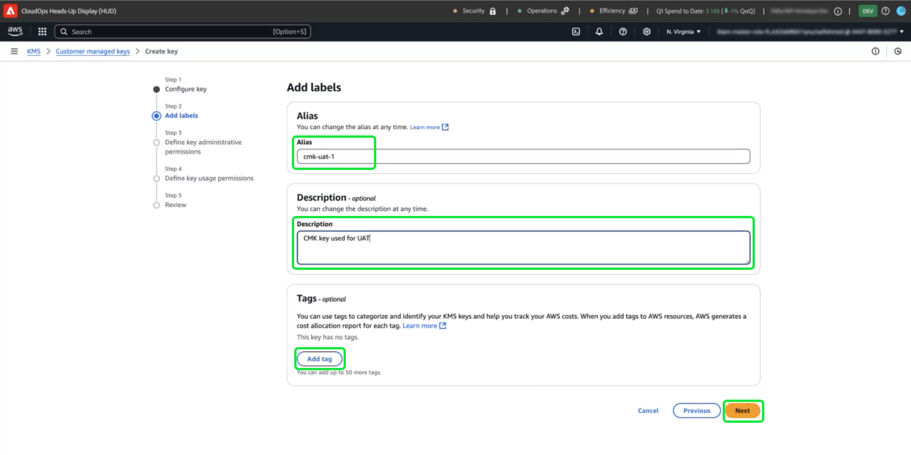

# Configurar o AWS KMS para chaves gerenciadas pelo cliente

>[!AVAILABILITY]
>
>Este documento se aplica às implementações do Experience Platform executadas no Amazon Web Services (AWS). O Experience Platform em execução no AWS está atualmente disponível para um número limitado de clientes. Para saber mais sobre a infraestrutura de Experience Platform compatível, consulte a [visão geral de várias nuvens do Experience Platform](https://experienceleague.adobe.com/en/docs/experience-platform/landing/multi-cloud).
>
>As [Chaves gerenciadas pelo cliente](../overview.md) (CMK) do AWS são compatíveis com o Privacy and Security Shield, mas não estão disponíveis para o Healthcare Shield. O CMK no Azure é compatível com o Privacy Shield e o Security Shield, bem como com o Healthcare Shield.

Use este guia para proteger seus dados com o Serviço de Gerenciamento de Chaves (KMS) do Amazon Web Services (AWS) criando, gerenciando e controlando chaves de criptografia para o Adobe Experience Platform. Essa integração simplifica a conformidade, simplifica as operações por meio da automação e elimina a necessidade de manter sua própria infraestrutura de gerenciamento principal.

Para obter instruções específicas de Customer Journey Analytics, consulte a [documentação CMK de Customer Journey Analytics](https://experienceleague.adobe.com/en/docs/analytics-platform/using/cja-privacy/cmk)

>[!IMPORTANT]
>
>O Adobe Experience Platform criptografa dados em repouso por padrão usando chaves gerenciadas pelo sistema. Ao ativar o CMK (Customer Managed Keys, chaves gerenciadas pelo cliente), você assume o controle total da segurança de dados. No entanto, essa alteração é irreversível. Uma vez habilitado o CMK, você não poderá reverter para chaves gerenciadas pelo sistema. Você é responsável por gerenciar com segurança suas chaves para garantir acesso ininterrupto aos seus dados e evitar uma possível inacessibilidade.

Use o AWS KMS para melhorar a segurança dos dados com o gerenciamento integrado de chaves de criptografia para o Adobe Experience Platform. Siga este guia para criar e gerenciar chaves de criptografia, garantindo que seus dados permaneçam protegidos.

## Pré-requisitos {#prerequisites}

Antes de continuar com este documento, você deve ter uma boa compreensão dos seguintes conceitos e recursos principais:

- **Serviço de Gerenciamento de Chaves (KMS) da AWS**: Entenda os fundamentos do KMS do AWS, incluindo como criar, gerenciar e girar chaves de criptografia. Consulte a [documentação oficial do KMS](https://docs.aws.amazon.com/kms/) para saber mais.
- **Políticas de Gerenciamento de Identidade e Acesso (IAM) no AWS**: o IAM é um serviço que permite gerenciar com segurança o acesso aos serviços e recursos da AWS. Use o IAM para:
   - Defina quais usuários, grupos e funções terão acesso a recursos específicos.
   - Especifique quais ações os usuários têm permissão ou negação para executar.
   - Implemente o controle de acesso refinado atribuindo permissões usando políticas IAM.
Consulte a [documentação oficial de Políticas do IAM para AWS KMS](https://docs.aws.amazon.com/kms/latest/developerguide/iam-policies.html) para obter mais informações.
- **Segurança de dados no Experience Platform**: descubra como a plataforma garante a segurança de dados e se integra a serviços externos, como o AWS KMS, para criptografia. A Platform protege dados com HTTPS TLS v1.2 para trânsito, criptografia de provedor de nuvem em repouso, armazenamento isolado e opções personalizáveis de autenticação e criptografia. Consulte a [visão geral sobre governança, privacidade e segurança](../overview.md) ou o documento sobre a [criptografia de dados na Platform](../../encryption.md) para obter mais informações sobre como manter seus dados seguros.
- **Console de Gerenciamento do AWS**: um hub central onde você pode acessar e gerenciar todos os seus serviços da AWS de um aplicativo baseado na Web. Use a barra de pesquisa para rapidamente encontrar ferramentas, verificar notificações, gerenciar sua conta e faturamento e personalizar suas configurações. Consulte a [documentação oficial do console de gerenciamento do AWS](https://docs.aws.amazon.com/awsconsolehelpdocs/latest/gsg/what-is.html) para obter mais informações.

## Introdução {#get-started}

Este guia requer que você já tenha acesso a uma conta da Amazon Web Services e acesso ao console de gerenciamento. Siga as etapas abaixo para começar:

### Selecione uma região suportada {#select-supported-region}

O AWS KMS está disponível em regiões específicas. Verifique se você está operando em uma região onde o KMS é suportado. Você pode exibir uma lista completa de regiões com suporte na [lista de cotas e pontos de extremidade do AWS KMS](https://aws.amazon.com/about-aws/global-infrastructure/regional-product-services/).

Certifique-se de que a chave de criptografia do AWS KMS esteja na mesma região da instância do Adobe Experience Platform para manter a conformidade com os requisitos de residência de dados, otimizar o desempenho e evitar custos adicionais entre regiões. Regiões desalinhadas podem resultar em falhas de acessibilidade de dados e integração.

### Verificar permissões {#verify-permissions}

Verifique se você tem as permissões necessárias do AWS Identity and Access Management (IAM) para criar, gerenciar e usar chaves de criptografia no KMS. Para verificar suas permissões:

1. Acesse o [Simulador de Políticas do IAM](https://policysim.aws.amazon.com/).
2. Selecione sua conta de usuário ou função.
3. Simular ações do KMS como `kms:CreateKey` ou `kms:Encrypt`.

Se a simulação retornar um erro ou se você não tiver certeza sobre suas permissões, consulte o administrador do AWS para obter assistência.

### Verifique a configuração da sua conta do AWS

Confirme se sua conta do AWS está habilitada para usar os serviços KMS da AWS. A maioria das contas tem acesso ao KMS habilitado por padrão, mas você pode examinar a configuração de sua conta visitando o [Console de Gerenciamento do AWS](https://aws.amazon.com/console/). Para obter mais detalhes, consulte o [Guia do desenvolvedor do AWS Key Management Service](https://docs.aws.amazon.com/kms/latest/developerguide/overview.html).

### Navegue até o AWS KMS para iniciar a configuração da chave

Para começar a configurar e gerenciar sua chave de criptografia, faça logon em sua conta do AWS e navegue até o Serviço de Gerenciamento de Chaves (KMS) da AWS. No Console de Gerenciamento do AWS, selecione **KMS (Key Management Service)** no menu de serviços.

## Criar uma nova chave {#create-a-key}

>[!IMPORTANT]
>
>Garantir o armazenamento, o acesso e a disponibilidade seguros das chaves de criptografia. Você é responsável por gerenciar suas chaves e evitar interrupções nas operações da Platform.

No espaço de trabalho [!DNL Key Management Service (KMS)], selecione **[!DNL Create a key]**.

## Definir configurações de chave {#configure-key}

O fluxo de trabalho [!DNL Configure Key] é exibido. Por padrão, o tipo de chave é definido como **[!DNL Symmetric]**, e o uso da chave é definido como **[!DNL Encrypt and Decrypt]**. Verifique se essas opções estão selecionadas antes de continuar.

Expanda o menu suspenso **[!DNL Advanced options]**. É recomendável usar a opção **[!DNL KMS]**, que permite ao AWS criar e gerenciar o material principal. A opção **[!DNL KMS]** é selecionada por padrão.

>[!NOTE]
>
>Se você já tiver uma chave existente, poderá importar o material da chave externa ou usar o armazenamento de chaves do AWS [!DNL CloudHSM]. Essas opções não estão cobertas pelo escopo deste documento.

Em seguida, selecione a configuração [!DNL Regionality], que especifica o escopo de região da chave. Selecione **[!DNL Single-Region key]**, seguido por **[!DNL Next]** para prosseguir para a etapa dois.

>[!IMPORTANT]
>
>O AWS impõe restrições de região para chaves KMS. Essa restrição de região significa que a chave deve estar na mesma região da conta Adobe. O Adobe só pode acessar chaves KMS localizadas na região da sua conta. Certifique-se de que a região selecionada corresponde à região da sua conta de locatário único do Adobe.

## Rotular e marcar sua chave {#add-labels-and-tags-to-key}

O segundo estágio, [!DNL Add labels], do fluxo de trabalho é exibido. Aqui, você configura os campos [!DNL Alias] e [!DNL Tags] para ajudá-lo a gerenciar e localizar sua chave de criptografia no console KMS do AWS.

Insira um rótulo descritivo para sua chave no campo de entrada **[!DNL Alias]**. O alias atua como um identificador amigável, para localizar rapidamente a chave usando a barra de pesquisa no console KMS do AWS. Para evitar confusão, escolha um nome significativo que reflita a finalidade da chave, como &quot;Adobe-Platform-Key&quot; ou &quot;Customer-Encryption-Key&quot;. Você também pode incluir uma descrição da chave se o alias da chave for insuficiente para descrever sua finalidade.

Finalmente, atribua metadados à sua chave adicionando pares de valores chave na seção [!DNL Tags]. Essa etapa é opcional, mas você deve adicionar tags para categorizar e filtrar recursos do AWS para facilitar o gerenciamento. Por exemplo, se sua organização usar vários recursos relacionados a Adobe, você poderá marcá-los com &quot;Adobe&quot; ou &quot;Experience-Platform&quot;. Essa etapa extra facilita a pesquisa e o gerenciamento de todos os recursos associados no AWS Management Console. Selecione **[!DNL Add tag]** para iniciar o processo.

<!-- I do not have an AWS account with which to document the Add tag process as yet. -->

Quando estiver satisfeito com suas configurações, selecione **[!DNL Next]** para continuar o fluxo de trabalho.

## Definir as principais permissões administrativas {#define-key-admins}

A etapa três do fluxo de trabalho de criação da chave é exibida. Para garantir acesso seguro e controlado, você pode escolher quais usuários e funções do IAM podem gerenciar a chave. Há duas opções neste estágio, [!DNL Key administrators] e [!DNL Key deletion]. Na seção **[!DNL Key administrators]**, marque uma ou mais caixas de seleção ao lado do nome de qualquer usuário ou função a qual você deseja conceder permissões de administrador para essa chave.

>[!NOTE]
>
>Não é possível criar administradores neste estágio do fluxo de trabalho.

Na seção **[!DNL Key deletion]**, habilite a caixa de seleção para permitir que administradores de chaves tenham o direito de excluir essa chave. Se você não marcar a caixa de seleção, os usuários administrativos não poderão executar essa operação.

Selecione **[!DNL Next]** para continuar o fluxo de trabalho.

## Conceder acesso aos principais usuários {#assign-key-users}

Na etapa quatro do fluxo de trabalho, você pode [!DNL Define key usage permissions]. Na lista **[!DNL Key users]**, marque as caixas de seleção de todos os usuários e funções do IAM que você deseja que tenham permissão para usar essa chave.

Nessa exibição, você também pode [!DNL Add another AWS account]; no entanto, não é recomendável adicionar outras contas da AWS. Adicionar outra conta pode apresentar riscos e complicar o gerenciamento de permissões para operações de criptografia e descriptografia. Ao manter a chave associada a uma única conta AWS, o Adobe garante uma integração segura com o AWS KMS, minimizando riscos e garantindo uma operação confiável.

Selecione **[!DNL Next]** para continuar o fluxo de trabalho.

## Revisar configuração principal {#review}

A etapa de revisão da configuração principal é exibida. Verifique os detalhes da chave nas seções [!DNL Key configuration] e [!DNL Alias and description].

>[!NOTE]
>
>Certifique-se de que a região da chave seja a mesma da conta do AWS.

Selecione **[!DNL Confirm]** para concluir o processo. Você retorna ao espaço de trabalho Chaves gerenciadas pelo cliente KMS que lista todas as chaves disponíveis.

## Próximas etapas

Depois que o AWS KMS for configurado, prossiga para configurar a integração usando a [!UICONTROL Configuração de Criptografia de Plataforma] ou a API do Adobe Experience Platform. Para continuar o processo único de configuração do recurso Chaves gerenciadas pelo cliente, continue com o [guia de configuração da interface](./ui-set-up.md).
