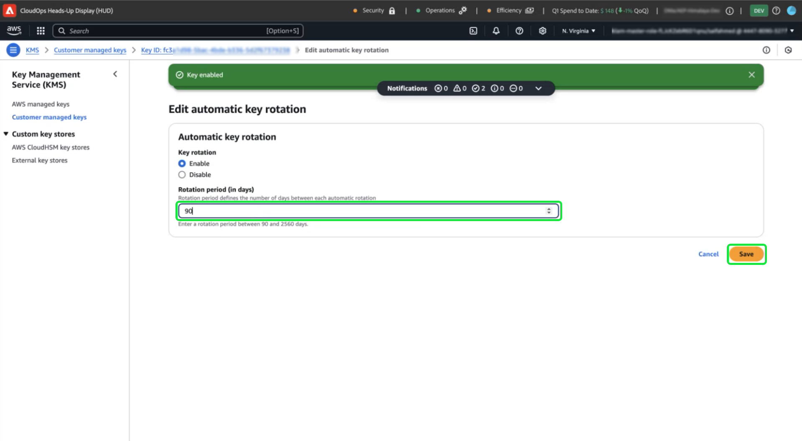

# Definir e configurar chaves gerenciadas pelo cliente com o AWS usando a interface do usuário do Experience Platform

Use este guia para habilitar o CMK (Customer Managed Keys, Chaves gerenciadas pelo cliente) para instâncias do Experience Platform hospedadas no AWS por meio da interface do usuário do Experience Platform.

>[!IMPORTANT]
>
>Antes de continuar com este guia, verifique se você concluiu a configuração detalhada no documento [&#39;Configurar o AWS KMS para CMK&#39;](./configure-kms.md).

## Atualize a política principal do AWS para integrar a chave ao Experience Platform

Para integrar sua chave do AWS ao Experience Platform, edite o JSON na seção **[!DNL Key Policy]** do espaço de trabalho do KMS. Uma política de chave padrão é semelhante ao JSON abaixo.

<!-- The AWS ID below is fake. Q) Can I refer to it simply as AWS_ACCOUNT_ID ? Is that suitable? -->

```JSON
{
  "Id": "key-consolepolicy-3",
  "Version": "2012-10-17",
  "Statement": [
    {
      "Sid": "Enable IAM User Permissions",
      "Effect": "Allow",
      "Principal": {
        "AWS": "arn:aws:iam::123464903283:root" // this is a mock AWS Principal ID, your ID will differ
      },
      "Action": "kms:*",
      "Resource": "*"
    }
  ]
}
```

No exemplo acima, todos os recursos (`"Resource": "*"`) na mesma conta (`Principal.AWS`) podem acessar a chave. Essa política permite que os serviços na conta executem operações de criptografia e descriptografia, restritas à conta especificada. Para conceder acesso a essa chave à sua conta de locatário único do Experience Platform, adicione novas instruções à política padrão do AWS. Você pode obter a política JSON necessária na interface do usuário do Experience Platform e aplicá-la à chave KMS do AWS para estabelecer uma conexão segura com o Adobe Experience Platform.

Na interface do Experience Platform, vá para a seção **[!UICONTROL Administração]** no painel de navegação esquerdo e selecione **[!UICONTROL Criptografia]**. No espaço de trabalho [!UICONTROL Configuração de criptografia], selecione **[!UICONTROL Configurar]** no cartão [!UICONTROL Chaves gerenciadas pelo cliente].


A [!UICONTROL configuração de Chaves gerenciadas pelo cliente] é exibida. Copie o objeto `statement` da política KMS CMK exibida na [!UICONTROL Configuração de Criptografia] das ] [!UICONTROL Chaves Gerenciadas pelo Cliente.

<!-- Select the copy icon () to copy the CMK KMS policy to your clipboard. A green pop-up notification confirms that the policy was copied.  -->

<!-- I cannot add the 'and the copy icon highlighted.' to the alt text below as i do not have access to this UI. -->


<!-- This part of the workflow was in contention at the time of the demo.  -->

Em seguida, retorne ao espaço de trabalho do AWS KMS e atualize a política principal mostrada abaixo.


Adicione à política padrão as quatro instruções do espaço de trabalho [!UICONTROL Configuração de Criptografia de Plataforma], conforme visto abaixo: `Enable IAM User Permissions`, `CJA Flow IAM User Permissions`, `CJA Integrity IAM User Permissions`, `CJA Oberon IAM User Permissions`.

```json
{
    "Version": "2012-10-17",
    "Id": "key-consolepolicy",
    "Statement": [
        {
            "Sid": "Enable IAM User Permissions",
            "Effect": "Allow",
            "Principal": {
                "AWS": "arn:aws:iam::975049898882:root" // this is a mock AWS Principal ID, your ID will differ
            },
            "Action": [
                "kms:Decrypt",
                "kms:Encrypt",
                "kms:ReEncrypt*",
                "kms:GenerateDataKey*",
                "kms:DescribeKey",
                "kms:CreateGrant"
            ],
            "Resource": "*",
            "Condition": {
                "StringEquals": {
                    "aws:PrincipalAccount": "975049898882" // this is a mock AWS Principal ID, your ID will differ
                }
            }
        },
        {
            "Sid": "CJA Flow IAM User Permissions",
            "Effect": "Allow",
            "Principal": {
                "AWS": "arn:aws:iam::767397686373:root"
            },
            "Action": [
                "kms:Decrypt",
                "kms:Encrypt",
                "kms:ReEncrypt*",
                "kms:GenerateDataKey*",
                "kms:DescribeKey",
                "kms:CreateGrant"
            ],
            "Resource": "*",
            "Condition": {
                "StringEquals": {
                    "aws:PrincipalAccount": "767397686373"
                }
            }
        },
        {
            "Sid": "CJA Integrity IAM User Permissions",
            "Effect": "Allow",
            "Principal": {
                "AWS": "arn:aws:iam::730335345392:root"
            },
            "Action": [
                "kms:Decrypt",
                "kms:Encrypt",
                "kms:ReEncrypt*",
                "kms:GenerateDataKey*",
                "kms:DescribeKey",
                "kms:CreateGrant"
            ],
            "Resource": "*",
            "Condition": {
                "StringEquals": {
                    "aws:PrincipalAccount": "730335345392"
                }
            }
        },
        {
            "Sid": "CJA Oberon IAM User Permissions",
            "Effect": "Allow",
            "Principal": {
                "AWS": "arn:aws:iam::891377157113:root"
            },
            "Action": [
                "kms:Decrypt",
                "kms:Encrypt",
                "kms:ReEncrypt*",
                "kms:GenerateDataKey*",
                "kms:DescribeKey",
                "kms:CreateGrant"
            ],
            "Resource": "*",
            "Condition": {
                "StringEquals": {
                    "aws:PrincipalAccount": "891377157113"
                }
            }
        }
    ]
}
```

Selecione **[!DNL Finish]** para confirmar a política atualizada e criar a chave. A configuração agora inclui cinco instruções, permitindo que sua conta da AWS se comunique com a Adobe Experience Platform. As alterações entrarão em vigor imediatamente.

O espaço de trabalho [!DNL Customer Managed Keys] atualizado do AWS [!DNL Key Management Service] é exibido.

### Adicionar detalhes da chave de criptografia do AWS ao Experience Platform

Em seguida, para habilitar a criptografia, adicione o ARN (Nome de Recurso da Amazon) da chave à sua [!UICONTROL configuração de Chaves gerenciadas pelo cliente] do Experience Platform. Na seção [!DNL Customer Managed Keys] do AWS, selecione o alias da nova chave na lista do [!DNL Key Management Service].


Os detalhes da sua chave são exibidos. Tudo no AWS tem um ARN (Amazon Resource Name, nome de recurso da) que
é um identificador exclusivo usado para especificar recursos nos serviços da AWS. O formato é padronizado como: `arn:partition:service:region:account-id:resource`.

Selecione o ícone de cópia para copiar seu ARN. Uma caixa de diálogo de confirmação é exibida.


Agora, volte para a [!UICONTROL configuração de Chaves gerenciadas pelo cliente] da Experience Platform. Na seção **[!UICONTROL Adicionar detalhes da chave de criptografia do AWS]**, adicione um **[!UICONTROL Nome da configuração]** e a **[!UICONTROL chave ARN]** do KMS copiada da interface do usuário do AWS.


Em seguida, selecione **[!UICONTROL SALVAR]** para enviar o nome da configuração, a chave KMS ARN e iniciar a validação da chave.


Você retornou ao espaço de trabalho [!UICONTROL Configurações de Criptografia]. O status da configuração de criptografia é exibido na parte inferior do cartão **[!UICONTROL Chaves gerenciadas pelo cliente]**.


Depois que a chave é validada, os identificadores do cofre de chaves são adicionados aos armazenamentos de dados do data lake e do perfil para todas as sandboxes.

>[!NOTE]
>
>A duração do processo depende do tamanho dos dados. Normalmente, o processo é concluído em menos de 24 horas. Cada sandbox é normalmente atualizada em dois ou três minutos.

## Revogação de chave {#key-revocation}

>[!IMPORTANT]
>
>Entenda as implicações da revogação de chaves em aplicativos downstream antes de revogar qualquer acesso.

Estas são as principais considerações para a revogação de chaves:

- Revogar ou desabilitar a chave tornará os dados do Experience Platform inacessíveis. Essa ação é irreversível e deve ser executada com cuidado.
- Considere os cronogramas de propagação quando o acesso às chaves de criptografia for revogado. Os armazenamentos de dados principais ficam inacessíveis em alguns minutos a 24 horas. Os armazenamentos de dados em cache ou transitórios ficam inacessíveis em sete dias.

Para revogar uma chave, navegue até o espaço de trabalho do AWS KMS. A seção **[!DNL Customer managed keys]** exibe todas as chaves disponíveis para sua conta do AWS. Selecione o alias da chave na lista.


Os detalhes da sua chave são exibidos. Para desabilitar a tecla, selecione **[!DNL Key actions]** e depois **[!DNL Disable]** no menu suspenso.


Uma caixa de diálogo de confirmação é exibida. Selecione **[!DNL Disable key]** para confirmar sua escolha. O impacto de desabilitar a chave deve ser refletido nos aplicativos da Experience Platform e na interface do usuário dentro de aproximadamente cinco minutos.

>[!NOTE]
>
>Depois de desabilitar a chave, você pode habilitá-la novamente usando o mesmo método descrito acima, se necessário. Esta opção está disponível na lista suspensa **[!DNL Key actions]**.


Como alternativa, se a chave for usada em outros serviços, é possível remover o acesso ao Experience Platform diretamente da política de chaves. Selecione **[!UICONTROL Editar]** na seção **[!DNL Key Policy]**.


A página **[!DNL Edit key policy]** é exibida. Realce e exclua a declaração de política, copiada da interface do usuário do Experience Platform, para remover as permissões do aplicativo Chaves gerenciadas pelo cliente. Em seguida, selecione **[!DNL Save changes]** para concluir o processo.


## Rotação de chaves {#key-rotation}

O AWS oferece rotação de chaves automática e sob demanda. Para reduzir o risco de comprometimento da chave ou atender aos requisitos de conformidade de segurança, você pode gerar automaticamente novas chaves de criptografia sob demanda ou em intervalos regulares. Agende a rotação de chaves automática para limitar o tempo de vida de uma chave e garantir que, se ela for comprometida, ficará inutilizável após a rotação. Embora os modernos algoritmos de criptografia sejam altamente seguros, a rotação de chaves é uma importante medida de conformidade de segurança e demonstra adesão às práticas recomendadas de segurança.

### Rotação de chaves automática {#automatic-key-rotation}

A rotação de chaves automática está desativada por padrão. Para agendar a rotação de chaves automática no espaço de trabalho do KMS, selecione a guia **[!DNL Key rotation]**, seguida de **[!DNL Edit]** em **[!DNL Automatic key rotation section]**.


O espaço de trabalho **[!DNL Edit automatic key rotation]** é exibido. Aqui, selecione o botão de opção para ativar ou desativar a rotação de chaves automática. Em seguida, use o campo de entrada de texto ou o menu suspenso para escolher um período para a rotação de chaves. Selecione **[!DNL Save]** para confirmar suas configurações e retornar ao espaço de trabalho de detalhes principais.

>[!NOTE]
>
>O período mínimo de rotação de chaves é de 90 dias e o máximo é de 2560 dias.



### Rotação de chaves sob demanda {#on-demand-key-rotation}

Selecione **[!DNL Rotate Now]** para executar uma rotação de chaves imediata se a chave atual estiver comprometida. O AWS limita esse recurso a 10 rotações. Para manutenção regular, programe rotações de chaves automáticas.


## Próximas etapas

Depois de ler este documento, você aprendeu a criar, configurar e gerenciar chaves de criptografia no AWS KMS para Adobe Experience Platform. Em seguida, analise as políticas de segurança e conformidade de sua organização para implementar as práticas recomendadas, como agendar rotações de chaves e garantir o armazenamento seguro de chaves.
