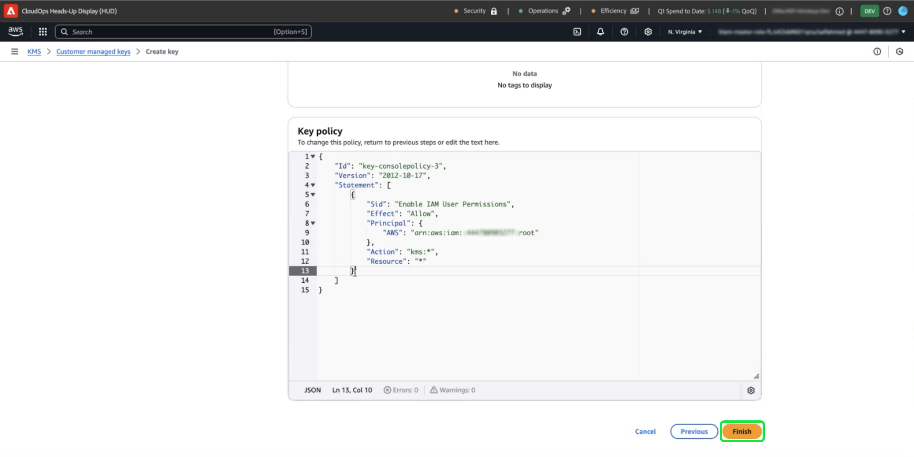

# Como usar o serviço de gerenciamento de chaves da Amazon Web Services para criptografia de dados do Adobe Experience Platform

>[!AVAILABILITY]
>
>Este documento se aplica às implementações do Experience Platform executadas no Amazon Web Services (AWS). O Experience Platform em execução no AWS está atualmente disponível para um número limitado de clientes. Para saber mais sobre a infraestrutura de Experience Platform compatível, consulte a [visão geral de várias nuvens do Experience Platform](https://experienceleague.adobe.com/en/docs/experience-platform/landing/multi-cloud).
>
>As [Chaves gerenciadas pelo cliente](../customer-managed-keys/overview.md) (CMK) do AWS são compatíveis com o Privacy and Security Shield, mas não estão disponíveis para o Healthcare Shield. O CMK no Azure é compatível com o Privacy Shield e o Security Shield, bem como com o Healthcare Shield.

Use este guia para proteger seus dados com o Serviço de Gerenciamento de Chaves (KMS) do Amazon Web Services (AWS) criando, gerenciando e controlando chaves de criptografia para o Adobe Experience Platform. Essa integração simplifica a conformidade, simplifica as operações por meio da automação e elimina a necessidade de manter sua própria infraestrutura de gerenciamento principal.

Para obter instruções específicas de Customer Journey Analytics, consulte a [documentação CMK de Customer Journey Analytics](https://experienceleague.adobe.com/en/docs/analytics-platform/using/cja-privacy/cmk)

>[!IMPORTANT]
>
>O Adobe Experience Platform criptografa dados em repouso por padrão usando chaves gerenciadas pelo sistema. Ao ativar o CMK (Customer Managed Keys, chaves gerenciadas pelo cliente), você assume o controle total da segurança de dados. No entanto, essa alteração é irreversível. Uma vez habilitado o CMK, você não poderá reverter para chaves gerenciadas pelo sistema. Você é responsável por gerenciar com segurança suas chaves para garantir acesso ininterrupto aos seus dados e evitar uma possível inacessibilidade.

Este guia detalha o processo de criação e gerenciamento de chaves de criptografia no AWS KMS para proteger seus dados no Experience Platform.

## Pré-requisitos {#prerequisites}

Antes de continuar com este documento, você deve ter uma boa compreensão dos seguintes conceitos e recursos principais:

- **Serviço de Gerenciamento de Chaves (KMS) da AWS**: Entenda os fundamentos do KMS do AWS, incluindo como criar, gerenciar e girar chaves de criptografia. Consulte a [documentação oficial do KMS](https://docs.aws.amazon.com/kms/) para saber mais.
- **Políticas de Gerenciamento de Identidade e Acesso (IAM) no AWS**: o IAM é um serviço que permite gerenciar com segurança o acesso aos serviços e recursos da AWS. Use o IAM para:
   - Defina quais usuários, grupos e funções terão acesso a recursos específicos.
   - Especifique quais ações os usuários têm permissão ou negação para executar.
   - Implemente o controle de acesso refinado atribuindo permissões usando políticas IAM.
Consulte a [documentação oficial de Políticas do IAM para AWS KMS](https://docs.aws.amazon.com/kms/latest/developerguide/iam-policies.html) para obter mais informações.
- **Segurança de dados no Experience Platform**: descubra como a plataforma garante a segurança de dados e se integra a serviços externos, como o AWS KMS, para criptografia. A Platform protege dados com HTTPS TLS v1.2 para trânsito, criptografia de provedor de nuvem em repouso, armazenamento isolado e opções personalizáveis de autenticação e criptografia. Consulte a [visão geral sobre governança, privacidade e segurança](../overview.md) ou o documento sobre a [criptografia de dados na Platform](../encryption.md) para obter mais informações sobre como manter seus dados seguros.
- **Console de Gerenciamento do AWS**: um hub central onde você pode acessar e gerenciar todos os seus serviços da AWS de um aplicativo baseado na Web. Use a barra de pesquisa para rapidamente encontrar ferramentas, verificar notificações, gerenciar sua conta e faturamento e personalizar suas configurações. Consulte a [documentação oficial do console de gerenciamento do AWS](https://docs.aws.amazon.com/awsconsolehelpdocs/latest/gsg/what-is.html) para obter mais informações.

## Introdução {#get-started}

Este guia requer que você já tenha acesso a uma conta da Amazon Web Services e acesso ao console de gerenciamento. Siga as etapas abaixo para começar:

1. **Verificar permissões**: verifique se você tem as permissões do AWS Identity and Access Management (IAM) necessárias para criar, gerenciar e usar chaves de criptografia no KMS. Para verificar suas permissões:
   1. Acesse o [Simulador de Políticas do IAM](https://policysim.aws.amazon.com/).
   1. Selecione sua conta de usuário ou função.
   1. Simular ações do KMS como `kms:CreateKey` ou `kms:Encrypt`.
Se a simulação retornar um erro ou se você não tiver certeza sobre suas permissões, consulte o administrador do AWS para obter assistência.

1. **Verifique a configuração da conta do AWS**: confirme se a conta do AWS está habilitada para usar os serviços KMS do AWS. A maioria das contas tem acesso ao KMS habilitado por padrão, mas você pode examinar a configuração de sua conta visitando o [Console de Gerenciamento do AWS](https://aws.amazon.com/console/). Para obter mais detalhes, consulte o [Guia do desenvolvedor do AWS Key Management Service](https://docs.aws.amazon.com/kms/latest/developerguide/overview.html).

1. **Selecione uma região com suporte**: o AWS KMS está disponível em regiões específicas. Verifique se você está operando em uma região onde o KMS é suportado. Você pode exibir uma lista completa de regiões com suporte na [lista de cotas e pontos de extremidade do AWS KMS](https://aws.amazon.com/about-aws/global-infrastructure/regional-product-services/).

### Navegue até o AWS KMS para iniciar a configuração da chave

>[!IMPORTANT]
>
>Garantir o armazenamento, o acesso e a disponibilidade seguros das chaves de criptografia. Você é responsável por gerenciar suas chaves e evitar interrupções nas operações da Platform.

Para começar a configurar e gerenciar sua chave de criptografia, faça logon em sua conta do AWS e navegue até o Serviço de Gerenciamento de Chaves (KMS) da AWS. No Console de Gerenciamento do AWS, selecione **KMS (Key Management Service)** no menu de serviços.


## Criar uma nova chave {#create-a-key}

O espaço de trabalho [!DNL Key Management Service (KMS)] é exibido. Selecione **[!DNL Create a key]**.


## Definir configurações de chave {#configure-key}

O fluxo de trabalho [!DNL Configure Key] é exibido. Por padrão, o tipo de chave é definido como **[!DNL Symmetric]**, e o uso da chave é definido como **[!DNL Encrypt and Decrypt]**. Verifique se essas opções estão selecionadas antes de continuar.


Expanda o menu suspenso **[!DNL Advanced options]**. É recomendável usar a opção **[!DNL KMS]**, que permite ao AWS criar e gerenciar o material principal. A opção **[!DNL KMS]** é selecionada por padrão.

>[!NOTE]
>
>Se você já tiver uma chave existente, poderá importar o material da chave externa ou usar o armazenamento de chaves do AWS [!DNL CloudHSM]. Essas opções não estão cobertas pelo escopo deste documento.

Em seguida, selecione a configuração [!DNL Regionality], que especifica o escopo de região da chave. Selecione **[!DNL Single-Region key]**, seguido por **[!DNL Next]** para prosseguir para a etapa dois.

>[!IMPORTANT]
>
>O AWS impõe restrições de região para chaves KMS. Essa restrição de região significa que a chave deve estar na mesma região da conta Adobe. O Adobe só pode acessar chaves KMS localizadas na região da sua conta. Certifique-se de que a região selecionada corresponde à região da sua conta de locatário único do Adobe.


## Rotular e marcar sua chave {#add-labels-and-tags-to-key}

O segundo estágio, [!DNL Add labels], do fluxo de trabalho é exibido. Aqui, você configura os campos [!DNL Alias] e [!DNL Tags] para ajudá-lo a gerenciar e localizar sua chave de criptografia no console KMS do AWS.

Insira um rótulo descritivo para sua chave no campo de entrada **[!DNL Alias]**. O alias atua como um identificador amigável, para localizar rapidamente a chave usando a barra de pesquisa no console KMS do AWS. Para evitar confusão, escolha um nome significativo que reflita a finalidade da chave, como &quot;Adobe-Platform-Key&quot; ou &quot;Customer-Encryption-Key&quot;. Você também pode incluir uma descrição da chave se o alias da chave for insuficiente para descrever sua finalidade.

Finalmente, atribua metadados à sua chave adicionando pares de valores chave na seção [!DNL Tags]. Essa etapa é opcional, mas você deve adicionar tags para categorizar e filtrar recursos do AWS para facilitar o gerenciamento. Por exemplo, se sua organização usar vários recursos relacionados a Adobe, você poderá marcá-los com &quot;Adobe&quot; ou &quot;Experience-Platform&quot;. Essa etapa extra facilita a pesquisa e o gerenciamento de todos os recursos associados no AWS Management Console. Selecione **[!DNL Add tag]** para iniciar o processo.

<!-- I do not have an AWS account with which to document the Add tag process as yet. -->

Quando estiver satisfeito com suas configurações, selecione **[!DNL Next]** para continuar o fluxo de trabalho.


## Definir as principais permissões administrativas {#define-key-admins}

A etapa três do fluxo de trabalho de criação da chave é exibida. Para garantir acesso seguro e controlado, você pode escolher quais usuários e funções do IAM podem gerenciar a chave. Há duas opções neste estágio, [!DNL Key administrators] e [!DNL Key deletion]. Na seção **[!DNL Key administrators]**, marque uma ou mais caixas de seleção ao lado do nome de qualquer usuário ou função a qual você deseja conceder permissões de administrador para essa chave.

>[!NOTE]
>
>Não é possível criar administradores neste estágio do fluxo de trabalho.

Na seção **[!DNL Key deletion]**, habilite a caixa de seleção para permitir que administradores de chaves tenham o direito de excluir essa chave. Se você não marcar a caixa de seleção, os usuários administrativos não poderão executar essa operação.

Selecione **[!DNL Next]** para continuar o fluxo de trabalho.


## Conceder acesso aos principais usuários {#assign-key-users}

Na etapa quatro do fluxo de trabalho, você pode [!DNL Define key usage permissions]. Na lista **[!DNL Key users]**, marque as caixas de seleção de todos os usuários e funções do IAM que você deseja que tenham permissão para usar essa chave.

Nessa exibição, você também pode [!DNL Add another AWS account]; no entanto, não é recomendável adicionar outras contas da AWS. Adicionar outra conta pode apresentar riscos e complicar o gerenciamento de permissões para operações de criptografia e descriptografia. Ao manter a chave associada a uma única conta AWS, o Adobe garante uma integração segura com o AWS KMS, minimizando riscos e garantindo uma operação confiável.

Selecione **[!DNL Next]** para continuar o fluxo de trabalho.


## Revisar configuração principal {#review}

A etapa de revisão da configuração principal é exibida. Verifique os detalhes da chave nas seções [!DNL Key configuration] e [!DNL Alias and description].

>[!NOTE]
>
>Certifique-se de que a região da chave seja a mesma da conta do AWS.


### Atualize a política de chaves para integrar a chave ao Experience Platform

Em seguida, edite o JSON na seção **[!DNL Key Policy]** para integrar a chave ao Experience Platform. Uma política de chave padrão é semelhante ao JSON abaixo.

<!-- The AWS ID below is fake. Q) Can I refer to it simply as AWS_ACCOUNT_ID ? Is that suitable? -->

```JSON
{
  "Id": "key-consolepolicy-3",
  "Version": "2012-10-17",
  "Statement": [
    {
      "Sid": "Enable IAM User Permissions",
      "Effect": "Allow",
      "Principal": {
        "AWS": "arn:aws:iam::123464903283:root" // this is a mock AWS Principal ID, your ID will differ
      },
      "Action": "kms:*",
      "Resource": "*"
    }
  ]
}
```

No exemplo acima, todos os recursos (`"Resource": "*"`) na mesma conta (`Principal.AWS`) podem acessar essa chave. A política permite que outros serviços na mesma conta usem a chave para fazer criptografia e descriptografia. Os serviços só têm permissão para esta conta.

Em seguida, conceda acesso a essa chave à sua conta de locatário único da Platform, adicionando novas declarações a essa política. Você pode obter a política JSON da interface do usuário da Platform e aplicá-la à chave do AWS KMS para vinculá-la à plataforma de forma segura.

Navegue até a interface do usuário da Platform. Na seção **[!UICONTROL Administração]** do painel de navegação esquerdo, selecione **[!UICONTROL Criptografia]**. O espaço de trabalho [!UICONTROL Configuração de Criptografia] é exibido. Em seguida, selecione **[!UICONTROL Configurar]** no cartão [!UICONTROL Chaves gerenciadas pelo cliente].


A [!UICONTROL configuração de Chaves gerenciadas pelo cliente] é exibida. Selecione o ícone de cópia () para copiar a política CMK KMS para a área de transferência. Uma notificação pop-up verde confirma que a política foi copiada.


<!-- This part of the workflow was in contention at the time of the demo.  -->

Em seguida, retorne ao espaço de trabalho do AWS KMS e atualize a política principal mostrada abaixo.



Adicione à política padrão as quatro instruções do espaço de trabalho [!UICONTROL Configuração de Criptografia de Plataforma], conforme visto abaixo: `Enable IAM User Permissions`, `CJA Flow IAM User Permissions`, `CJA Integrity IAM User Permissions`, `CJA Oberon IAM User Permissions`.

```json
{
    "Version": "2012-10-17",
    "Id": "key-consolepolicy",
    "Statement": [
        {
            "Sid": "Enable IAM User Permissions",
            "Effect": "Allow",
            "Principal": {
                "AWS": "arn:aws:iam::975049898882:root" // this is a mock AWS Principal ID, your ID will differ
            },
            "Action": [
                "kms:Decrypt",
                "kms:Encrypt",
                "kms:ReEncrypt*",
                "kms:GenerateDataKey*",
                "kms:DescribeKey",
                "kms:CreateGrant"
            ],
            "Resource": "*",
            "Condition": {
                "StringEquals": {
                    "aws:PrincipalAccount": "975049898882" // this is a mock AWS Principal ID, your ID will differ
                }
            }
        },
        {
            "Sid": "CJA Flow IAM User Permissions",
            "Effect": "Allow",
            "Principal": {
                "AWS": "arn:aws:iam::767397686373:root"
            },
            "Action": [
                "kms:Decrypt",
                "kms:Encrypt",
                "kms:ReEncrypt*",
                "kms:GenerateDataKey*",
                "kms:DescribeKey",
                "kms:CreateGrant"
            ],
            "Resource": "*",
            "Condition": {
                "StringEquals": {
                    "aws:PrincipalAccount": "767397686373"
                }
            }
        },
        {
            "Sid": "CJA Integrity IAM User Permissions",
            "Effect": "Allow",
            "Principal": {
                "AWS": "arn:aws:iam::730335345392:root"
            },
            "Action": [
                "kms:Decrypt",
                "kms:Encrypt",
                "kms:ReEncrypt*",
                "kms:GenerateDataKey*",
                "kms:DescribeKey",
                "kms:CreateGrant"
            ],
            "Resource": "*",
            "Condition": {
                "StringEquals": {
                    "aws:PrincipalAccount": "730335345392"
                }
            }
        },
        {
            "Sid": "CJA Oberon IAM User Permissions",
            "Effect": "Allow",
            "Principal": {
                "AWS": "arn:aws:iam::891377157113:root"
            },
            "Action": [
                "kms:Decrypt",
                "kms:Encrypt",
                "kms:ReEncrypt*",
                "kms:GenerateDataKey*",
                "kms:DescribeKey",
                "kms:CreateGrant"
            ],
            "Resource": "*",
            "Condition": {
                "StringEquals": {
                    "aws:PrincipalAccount": "891377157113"
                }
            }
        }
    ]
}
```


Selecione **[!DNL Finish]** para confirmar os detalhes da chave com a política atualizada e criar a chave. A chave e a política foram configuradas com um total de cinco declarações para permitir que sua conta AWS se comunique com sua conta Experience Platform. O efeito é instantâneo.

O espaço de trabalho [!DNL Customer managed keys] atualizado do AWS [!DNL Key Management Service] é exibido.

### Adicionar detalhes da chave de criptografia do AWS à Platform

Em seguida, para habilitar a criptografia, adicione o ARN (Nome de Recurso de Amazon) da chave à sua [!UICONTROL configuração de Chaves gerenciadas pelo cliente] da Plataforma. Na seção [!DNL Customer Managed Keys] do AWS, selecione o alias da nova chave na lista do [!DNL Key Management Service].


Os detalhes da sua chave são exibidos. Tudo no AWS tem um ARN (Amazon Resource Name, nome de recurso da) que
é um identificador exclusivo usado para especificar recursos nos serviços da AWS. O formato é padronizado como: `arn:partition:service:region:account-id:resource`.

Selecione o ícone de cópia para copiar seu ARN. Uma caixa de diálogo de confirmação é exibida.


Agora, volte para a interface do usuário da Plataforma [!UICONTROL Configuração de chaves gerenciadas pelo cliente]. Na seção **[!UICONTROL Adicionar detalhes da chave de criptografia do AWS]**, adicione um **[!UICONTROL Nome da configuração]** e a **[!UICONTROL chave ARN]** do KMS copiada da interface do usuário do AWS.


Em seguida, selecione **[!UICONTROL SALVAR]** para enviar o nome da configuração, a chave KMS ARN e iniciar a validação da chave.


Você retornou ao espaço de trabalho [!UICONTROL Configurações de Criptografia]. O status da configuração de criptografia é exibido na parte inferior do cartão **[!UICONTROL Chaves gerenciadas pelo cliente]**.


Depois que a chave é validada, os identificadores do cofre de chaves são adicionados aos armazenamentos de dados do data lake e do perfil para todas as sandboxes.

>[!NOTE]
>
>A duração do processo depende do tamanho dos dados. Normalmente, o processo é concluído em menos de 24 horas. Cada sandbox é normalmente atualizada em dois ou três minutos.

## Revogação de chave {#key-revocation}

>[!IMPORTANT]
>
>Entenda as implicações da revogação de chaves em aplicativos downstream antes de revogar qualquer acesso.

Estas são as principais considerações para a revogação de chaves:

- Revogar ou desativar a chave tornará os dados da Platform inacessíveis. Essa ação é irreversível e deve ser executada com cuidado.
- Considere os cronogramas de propagação quando o acesso às chaves de criptografia for revogado. Os armazenamentos de dados principais ficam inacessíveis em alguns minutos a 24 horas. Os armazenamentos de dados em cache ou transitórios ficam inacessíveis em sete dias.

Para revogar uma chave, navegue até o espaço de trabalho do AWS KMS. A seção **[!DNL Customer managed keys]** exibe todas as chaves disponíveis para sua conta do AWS. Selecione o alias da chave na lista.


Os detalhes da sua chave são exibidos. Para desabilitar a tecla, selecione **[!DNL Key actions]** e depois **[!DNL Disable]** no menu suspenso.


Uma caixa de diálogo de confirmação é exibida. Selecione **[!DNL Disable key]** para confirmar sua escolha. O impacto da desativação da chave deve ser refletido nos aplicativos da Platform e na interface do usuário dentro de aproximadamente cinco minutos.

>[!NOTE]
>
>Depois de desabilitar a chave, você pode habilitá-la novamente usando o mesmo método descrito acima, se necessário. Esta opção está disponível na lista suspensa **[!DNL Key actions]**.


Como alternativa, se a chave for usada em outros serviços, é possível remover o acesso ao Experience Platform diretamente da política de chaves. Selecione **[!UICONTROL Editar]** na seção **[!DNL Key Policy]**.


A página **[!DNL Edit key policy]** é exibida. Realce e exclua a declaração de política, copiada da interface do usuário da plataforma, para remover as permissões do aplicativo Chaves gerenciadas pelo cliente. Em seguida, selecione **[!DNL Save changes]** para concluir o processo.


## Rotação de chaves {#key-rotation}

O AWS oferece rotação de chaves automática e sob demanda. Para reduzir o risco de comprometimento da chave ou atender aos requisitos de conformidade de segurança, você pode gerar automaticamente novas chaves de criptografia sob demanda ou em intervalos regulares. Agende a rotação de chaves automática para limitar o tempo de vida de uma chave e garantir que, se ela for comprometida, ficará inutilizável após a rotação. Embora os modernos algoritmos de criptografia sejam altamente seguros, a rotação de chaves é uma importante medida de conformidade de segurança e demonstra adesão às práticas recomendadas de segurança.

### Rotação de chaves automática {#automatic-key-rotation}

A rotação de chaves automática está desativada por padrão. Para agendar a rotação de chaves automática no espaço de trabalho do KMS, selecione a guia **[!DNL Key rotation]**, seguida de **[!DNL Edit]** em **[!DNL Automatic key rotation section]**.


O espaço de trabalho **[!DNL Edit automatic key rotation]** é exibido. Aqui, selecione o botão de opção para ativar ou desativar a rotação de chaves automática. Em seguida, use o campo de entrada de texto ou o menu suspenso para escolher um período para a rotação de chaves. Selecione **[!DNL Save]** para confirmar suas configurações e retornar ao espaço de trabalho de detalhes principais.

>[!NOTE]
>
>O período mínimo de rotação de chaves é de 90 dias e o máximo é de 2560 dias.


### Rotação de chaves sob demanda {#on-demand-key-rotation}

Se a chave atual estiver comprometida, selecione **[!DNL Rotate Now]** para girá-la imediatamente. O AWS permite somente 10 rotações sob demanda. Use uma rotação de chaves programada, a menos que a segurança já tenha sido comprometida.


## Próximas etapas

Depois de ler este documento, você aprendeu a criar, configurar e gerenciar chaves de criptografia no AWS KMS para uso com o Adobe Experience Platform. Como próxima etapa, considere analisar as políticas de segurança e conformidade de sua organização para garantir práticas adequadas de gerenciamento de chaves, como a rotação de chaves programada e o armazenamento de chaves seguro.
