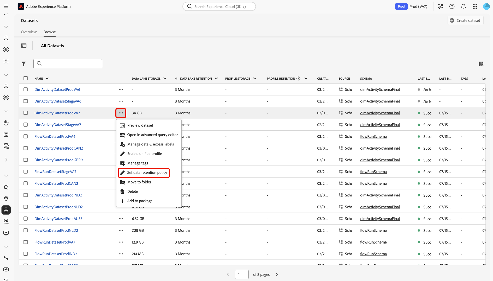

# Práticas recomendadas de direito de licença de gerenciamento de dados

O Adobe Experience Platform é um sistema aberto que transforma seus dados em perfis robustos de clientes, atualizados em tempo real e que usa insights orientados por IA para ajudá-lo a fornecer as experiências certas em cada canal. Você pode assimilar dados de vários tipos, volumes e históricos no Experience Platform usando fontes e, em seguida, atender a esses dados para casos de uso que variam de segmentação e personalização a análise e aprendizado de máquina.

A Experience Platform oferece licenças que estabelecem o número de perfis que você pode criar e a quantidade de dados que você pode trazer. Dada a capacidade de trazer qualquer fonte, volume ou histórico de dados, é possível exceder seus direitos de licenciamento à medida que os volumes de dados crescem.

Leia este guia para conhecer as práticas recomendadas e as ferramentas que você pode usar para gerenciar melhor seus direitos de licença na Experience Platform.

## Resumo dos recursos {#summary-of-features}

Use as práticas recomendadas e as ferramentas descritas neste documento para gerenciar melhor o uso de direitos de licença na Experience Platform. Este documento é atualizado à medida que recursos adicionais são lançados para ajudar a fornecer visibilidade e controle a todos os clientes do Experience Platform.

A tabela a seguir descreve a lista dos recursos disponíveis no momento à sua disposição, para gerenciar melhor seus direitos de uso de licença.

| Recurso | Descrição |
| --- | --- |
| [Interface do usuário do conjunto de dados - Retenção de dados do evento de experiência](../../catalog/datasets/user-guide.md#data-retention-policy) | Configure um período de retenção fixo para dados no data lake e no armazenamento de perfis. Os registros são excluídos quando o período de retenção configurado termina. |
| [Habilitar/Desabilitar Conjuntos de Dados para o Perfil de Cliente em Tempo Real](../../catalog/datasets/user-guide.md) | Ative ou desative a assimilação do conjunto de dados no Perfil do cliente em tempo real. |
| [Expirações do evento de experiência no repositório de perfis](../../profile/event-expirations.md) | Aplique uma hora de expiração para todos os eventos assimilados em um conjunto de dados habilitado para perfil. Entre em contato com a equipe de conta da Adobe ou com o Atendimento ao cliente para ativar esse recurso. |
| [Filtros de Preparação de Dados do Adobe Analytics](../../sources/tutorials/ui/create/adobe-applications/analytics.md#filtering-for-real-time-customer-profile) | Aplicar [!DNL Kafka] filtros para excluir dados desnecessários da assimilação. |
| [Filtros do conector de origem do Adobe Audience Manager](../../sources/tutorials/ui/create/adobe-applications/audience-manager.md) | Aplique filtros de conexão de origem do Audience Manager para excluir dados desnecessários da assimilação. |
| [Filtros de dados do encaminhamento de eventos](../../tags/ui/event-forwarding/overview.md) | Aplicar filtros [!DNL Kafka] do lado do servidor para excluir dados desnecessários da assimilação.  Consulte a documentação sobre [regras de tags](../../tags/ui/managing-resources/rules.md) para obter mais informações. |
| [Interface do Usuário do Painel de Uso da Licença](../../dashboards/guides/license-usage.md#license-usage-dashboard-data) | Monitore o consumo de produtos da Experience Platform por parte de sua organização em relação aos direitos licenciados. Acesse instantâneos de uso diário, tendências preditivas e dados detalhados em nível de sandbox para oferecer suporte ao gerenciamento pró-ativo de licenças. |
| [API do Relatório de Sobreposição de Conjunto de Dados](../../profile/tutorials/dataset-overlap-report.md) | Gera os conjuntos de dados que mais contribuem para o Público-alvo endereçável. |
| [API do Relatório de Sobreposição de Identidade](../../profile/api/preview-sample-status.md#generate-the-identity-namespace-overlap-report) | Gera os namespaces de identidade que mais contribuem para o Público-alvo endereçável. |
| [Expirações de dados de perfil pseudônimo](../../profile/pseudonymous-profiles.md) | Configure os tempos de expiração de dados para perfis pseudônimos e remova automaticamente os dados do armazenamento de Perfil. |

{style="table-layout:auto"}

## Noções básicas sobre o armazenamento de dados do Experience Platform

O Experience Platform é composto principalmente de dois repositórios de dados: o data lake e o Armazenamento de perfis.

O Data Lake serve principalmente às seguintes finalidades:

* Atua como a área de preparo para integrar dados no Experience Platform;
* Atua como o armazenamento de dados de longo prazo para todos os dados do Experience Platform;
* Permite casos de uso como análise de dados e ciência de dados.

O **Repositório de perfis** é onde os perfis de clientes são criados e serve principalmente às seguintes finalidades:

* Atua como um armazenamento de dados para perfis usados para suportar experiências em tempo real;
* Permite casos de uso como segmentação, ativação e personalização.

>[!NOTE]
>
>Seu acesso ao [!DNL data lake] pode depender do SKU do produto que você comprou. Para obter mais informações sobre SKUs de produtos, fale com o representante da Adobe.

## Uso da licença {#license-usage}

Ao licenciar o Experience Platform, você recebe direitos de uso de licença que variam de acordo com a SKU:

**[!DNL Addressable Audience]**: o número total de perfis de clientes permitidos por contrato no Experience Platform, incluindo perfis conhecidos e com pseudônimos.

**[!DNL Total Data Volume]**: a quantidade total de dados disponíveis para o Perfil de cliente em tempo real usar em fluxos de trabalho de envolvimento.

A disponibilidade dessas métricas e a definição específica de cada uma delas variam de acordo com o licenciamento adquirido pela sua organização.

## Painel de uso da licença

A interface do usuário do Adobe Experience Platform fornece um painel por meio do qual você pode visualizar um instantâneo dos dados de licença da sua organização para o Experience Platform. Os dados no painel são exibidos exatamente como são exibidos no momento específico em que o instantâneo foi tirado. O instantâneo não é uma aproximação nem uma amostra de dados, e o painel não é atualizado em tempo real.

Para obter mais informações, consulte o guia em [usando o painel de uso de licença na interface do Experience Platform](../../dashboards/guides/license-usage.md#license-usage-dashboard-data).

## Práticas recomendadas de gerenciamento de dados

As seções a seguir descrevem as práticas recomendadas a serem seguidas para gerenciar melhor seus dados.

### Noções básicas sobre seus dados

Nem todos os dados são os mesmos no Adobe Experience Platform. Alguns dados podem ser densos, mas de valor baixo, enquanto outros podem ser esparsos, mas de valor alto. Alguns dados podem perder valor assim que são gerados, enquanto outros podem ser valiosos por meses, se não anos.

Há três dimensões a serem consideradas para entender o valor de seus dados:

| Dimensão | Descrição | Exemplo |
| --- | --- | --- |
| Volume | Representa a quantidade e a totalidade de dados assimilados. | Cliques na Web - alto volume e moderado em fidelidade. O valor pode diminuir rapidamente. |
| Período | Representa o período em que os dados assimilados continuam sendo valiosos. | Compras offline - moderadas em volume e fidelidade, mas podem ser valiosas por longos períodos. |
| Fidelidade | Representa a riqueza dos dados com as informações. | Contas do cliente: baixo volume, mas alto em fidelidade. Pode ser valioso além da vida útil de um cliente. |

### Ferramentas de gerenciamento de dados {#data-management-tools}

Há dois cenários centrais a serem considerados ao garantir que o uso de dados permaneça dentro dos limites de direito de licença:

### Quais dados trazer para o Experience Platform?

Os dados podem ser assimilados em um ou vários sistemas no Experience Platform, ou seja, o [!DNL data lake] e/ou o repositório de perfis. Isso significa que dados diferentes podem existir em ambos os sistemas para uma variedade de casos de uso diferentes. Por exemplo, talvez você queira manter os dados históricos no [!DNL data lake], mas não no armazenamento de Perfil. Você pode selecionar quais dados enviar para o armazenamento de Perfil ativando um conjunto de dados para assimilação de Perfil.

>[!NOTE]
>
>Seu acesso ao [!DNL data lake] pode depender do SKU do produto que você comprou. Para obter mais informações sobre SKUs de produtos, fale com o representante da Adobe.

### Quais dados manter?

Você pode aplicar filtros de assimilação de dados e regras de expiração para remover dados que se tornaram obsoletos para seus casos de uso. Normalmente, os dados comportamentais (como dados do Analytics) consomem muito mais armazenamento do que os dados de registro (como dados do CRM). Por exemplo, muitos usuários do Experience Platform têm até 90% de perfis preenchidos apenas por dados comportamentais, em comparação aos dados de registro. Portanto, gerenciar os dados comportamentais é essencial para garantir a conformidade com os direitos de licença.

Há várias ferramentas que você pode usar para manter os direitos de uso de licença:

* [Filtros de assimilação](#ingestion-filters)
* [Loja de perfis](#profile-service)

### Serviço de identidade e público endereçável {#identity-service}

Os gráficos de identidade não contam para o direito total de público endereçável, pois o público endereçável se refere à contagem total de perfis de clientes.

No entanto, os limites do gráfico de identidade podem afetar seu público-alvo endereçável devido à divisão de identidades. Por exemplo, se a ECID mais antiga for removida do gráfico, a ECID continuará a existir no Perfil do cliente em tempo real como um perfil com pseudônimo. Você pode definir [expirações de dados de perfil pseudônimo](../../profile/pseudonymous-profiles.md) para contornar esse comportamento. Para obter mais informações, leia as [medidas de proteção para os dados do Serviço de Identidade](../../identity-service/guardrails.md).

### Filtros de assimilação {#ingestion-filters}

Os filtros de assimilação permitem trazer apenas os dados necessários para os casos de uso e filtrar todos os eventos não necessários.

| Filtro de assimilação | Descrição |
| --- | --- |
| Filtragem de origem do Adobe Audience Manager | Ao criar uma conexão de origem do Adobe Audience Manager, você pode escolher quais segmentos e características trazer para o [!DNL data lake] e o Perfil do cliente em tempo real, em vez de assimilar os dados do Audience Manager na íntegra. Consulte o manual sobre [criação de uma conexão de origem do Audience Manager](../../sources/tutorials/ui/create/adobe-applications/audience-manager.md) para obter mais informações. |
| Preparação de dados do Adobe Analytics | Você pode usar as funcionalidades do [!DNL Data Prep] ao criar uma conexão de origem do Analytics para filtrar dados que não são necessários para seus casos de uso. Por meio do [!DNL Data Prep], você pode definir quais atributos/colunas precisam ser publicados no Perfil. Você também pode fornecer declarações condicionais para informar à Experience Platform se espera que os dados sejam publicados no Perfil ou apenas para [!DNL data lake]. Consulte o manual sobre [criação de uma conexão de origem do Analytics](../../sources/tutorials/ui/create/adobe-applications/analytics.md) para obter mais informações. |
| Suporte para ativar/desativar conjuntos de dados para Perfil | Para assimilar dados no Perfil do cliente em tempo real, você deve habilitar um conjunto de dados para uso na loja de Perfis. Ao fazer isso, você adiciona aos seus direitos de [!DNL Addressable Audience] e [!DNL Total Data Volume]. Assim que um conjunto de dados não for mais necessário para casos de uso de perfil do cliente, você poderá desativar a integração desse conjunto de dados com o Perfil para garantir que seus dados permaneçam em conformidade com a licença. Consulte o guia em [habilitar e desabilitar conjuntos de dados para o Perfil](../../catalog/datasets/enable-for-profile.md) para obter mais informações. |
| Exclusão de dados do Web SDK e do Mobile SDK | Há dois tipos de dados coletados pela Web e pelo Mobile SDK: dados coletados automaticamente e dados coletados explicitamente pelo desenvolvedor. Para gerenciar melhor a conformidade com a licença, você pode desativar a coleta automática de dados na configuração do SDK por meio da configuração de contexto. Os dados personalizados também podem ser removidos ou não definidos pelo desenvolvedor. |
| Exclusão de dados do encaminhamento pelo lado do servidor | Se estiver enviando dados para o Experience Platform usando o encaminhamento pelo lado do servidor, você poderá excluir quais dados são enviados removendo o mapeamento em uma ação de regra para excluí-los em todos os eventos ou adicionando condições à regra para que os dados só sejam acionados para determinados eventos. Consulte a documentação sobre [eventos e condições](/help/tags/ui/managing-resources/rules.md#events-and-conditions-if) para obter mais informações. |
| Filtrar dados no nível da origem | Você pode usar operadores lógicos e de comparação para filtrar dados em nível de linha de suas fontes antes de criar uma conexão e assimilar dados na Experience Platform. Para obter mais informações, leia o manual sobre [filtragem de dados de nível de linha para uma origem usando a [!DNL Flow Service] API](../../sources/tutorials/api/filter.md). |

{style="table-layout:auto"}

### Loja de perfis {#profile-service}

A Loja de perfis é composta pelos seguintes componentes:

| Componente da loja de perfis | Descrição |
| --- | --- |
| Fragmentos de perfil | Cada perfil de cliente é composto por vários **fragmentos de perfil** que foram mesclados para formar uma única visualização desse cliente. Por exemplo, se um cliente interagir com sua marca em vários canais, sua organização terá vários **fragmentos de perfil** relacionados a esse único cliente que aparecem em vários conjuntos de dados. Quando esses fragmentos são assimilados na Experience Platform, eles são agrupados usando o gráfico de identidade para criar um único perfil para esse cliente. **Os fragmentos de perfil** consistem em um namespace de identidade como o identificador, com dados de registro associados e/ou dados de série temporal. |
| Registrar dados (Atributos) | Um perfil é uma representação de um assunto, uma organização ou um indivíduo, composto por muitos **Atributos** (também conhecidos como **dados de registro**). Por exemplo, o perfil de um produto pode incluir uma SKU e uma descrição, enquanto o perfil de uma pessoa contém informações como nome, sobrenome e endereço de email. **Os dados de registro** geralmente são baixos/moderados em volume, mas valiosos por longos períodos. |
| Dados de série temporal (Comportamento) | **Dados de série temporal** fornecem informações sobre um comportamento de usuário. Representados pela classe de esquema padrão Experience Data Model (XDM) [!DNL ExperienceEvent], os dados de série temporal podem descrever eventos como itens adicionados a um carrinho, links clicados e vídeos visualizados. O valor do comportamento pode diminuir com o tempo. |
| Namespace de identidade (identidades) | À medida que os dados do cliente se unem, eles são mesclados em um único perfil por meio do uso dos **namespaces de identidade**, e a capacidade de unir essas identidades à medida que mais informações são conhecidas sobre o usuário. Consulte a [visão geral dos namespaces de identidade](../../identity-service/features/namespaces.md) para obter mais informações. |

{style="table-layout:auto"}

### Relatórios de composição da loja de perfis

Há vários relatórios disponíveis para ajudá-lo a entender a composição do armazenamento de Perfis. Esses relatórios ajudam você a tomar decisões embasadas sobre como e onde definir as expirações do evento de experiência para otimizar o uso da sua licença:

* **API do Relatório de sobreposição do conjunto de dados**: expõe os conjuntos de dados que mais contribuem para o Público-alvo endereçável. Você pode usar este relatório para identificar para quais [!DNL ExperienceEvent] conjuntos de dados uma expiração deve ser definida. Consulte o tutorial em [gerando o relatório de sobreposição do conjunto de dados](../../profile/tutorials/dataset-overlap-report.md) para obter mais informações.
* **API do Relatório de Sobreposição de Identidade**: expõe os namespaces de identidade que mais contribuem para o Público-alvo endereçável. Consulte o tutorial em [gerando o relatório de sobreposição de identidade](../../profile/api/preview-sample-status.md#generate-the-identity-namespace-overlap-report) para obter mais informações.
<!-- * **Unknown Profiles Report API**: Exposes the impact of applying pseudonymous expirations for different time thresholds. You can use this report to identify which pseudonymous expirations threshold to apply. See the tutorial on [generating the unknown profiles report](../../profile/api/preview-sample-status.md#generate-the-unknown-profiles-report) for more information.
-->

### Expirações de dados do perfil de pseudônimo {#pseudonymous-profile-expirations}

Use o recurso de expiração de dados de perfis pseudônimos para remover automaticamente dados do que não são mais válidos ou úteis para seus casos de uso do Armazenamento de perfis. A expiração de dados do perfil pseudônimo remove os registros de evento e perfil. Como resultado, essa configuração reduzirá os volumes de Público-alvo endereçável. Para obter mais informações sobre este recurso, leia a [Visão geral da expiração de dados do perfil pseudônimo](../../profile/pseudonymous-profiles.md).

### Interface do usuário do conjunto de dados - Retenção do conjunto de dados do evento de experiência {#data-retention}

Defina as configurações de expiração e retenção do conjunto de dados para aplicar um período de retenção fixo para seus dados no data lake e no armazenamento de perfis. Quando o período de retenção terminar, os dados serão excluídos. A expiração dos dados do Evento de experiência remove apenas eventos e não remove os dados da classe de perfil, o que reduzirá o [volume de dados total](total-data-volume.md) nas métricas de uso de licença. Para obter mais informações, leia o guia em [definindo a política de retenção de dados](../../catalog/datasets/user-guide.md#data-retention-policy).

### Expirações de evento de experiência de perfil {#event-expirations}

Configure os tempos de expiração para remover automaticamente os dados comportamentais do conjunto de dados habilitado para perfil depois que eles não forem mais valiosos para seus casos de uso. Leia a visão geral em [Expirações do evento de experiência](../../profile/event-expirations.md) para obter mais informações.

## Resumo das práticas recomendadas para conformidade com o uso de licenças {#best-practices}

Esta é uma lista de algumas práticas recomendadas que você pode seguir para garantir uma melhor adesão aos direitos de uso de licença:

* Use o [painel de uso de licença](../../dashboards/guides/license-usage.md) para rastrear e monitorar as tendências de uso dos clientes. Isso permite que você se antecipe a possíveis excedentes que possam ocorrer.
* Configure os [filtros de assimilação](#ingestion-filters) identificando os eventos necessários para seus casos de uso de segmentação e personalização. Isso permite enviar somente eventos importantes necessários para seus casos de uso.
* Verifique se você tem apenas [conjuntos de dados habilitados para o perfil](#ingestion-filters) que sejam necessários para seus casos de uso de segmentação e personalização.
* Configure as [Expirações do evento de experiência](../../catalog/datasets/user-guide.md#data-retention-policy) e as [Expirações de dados do perfil pseudônimo](../../profile/pseudonymous-profiles.md) para dados de alta frequência, como dados da Web.
* Configure [políticas de retenção de TTL (Time-to-Live) para conjuntos de dados de eventos de experiência](../../catalog/datasets/experience-event-dataset-retention-ttl-guide.md) no data lake para remover automaticamente registros desatualizados e otimizar o uso do armazenamento de acordo com seus direitos de licença.
* Verifique periodicamente os [Relatórios de Composição de Perfil](#profile-store-composition-reports) para entender sua composição no repositório de perfis. Isso permite compreender as fontes de dados que mais contribuem para o consumo de licença.

## Caso de uso: Conformidade com o uso de licenças

### Por que considerar este caso de uso

Ao garantir sua conformidade com as **provisões de uso de licença** para o armazenamento do data lake e do Perfil, você pode evitar sobreposições com confiança, otimizar custos e alinhar suas políticas de retenção de dados aos requisitos da sua empresa.

### Pré-requisitos e planejamento

Considere os seguintes pré-requisitos no processo de planejamento:

* **Acesso e permissões**:
   * Verifique se você tem a permissão **Gerenciar conjuntos de dados** para usar o Experience Event TTL.
   * Verifique se você tem as **Configurações de Gerenciamento de Perfil** para usar o TTL de Perfil Pseudônimo.
* **Noções básicas sobre a política de retenção de dados**:
   * Políticas organizacionais relacionadas à retenção e à conformidade de dados
   * Necessidades dos negócios para janelas de análise de dados e retrospectiva de segmentação

### Funcionalidade da interface do usuário, componentes do Experience Platform e produtos da Experience Cloud que você usará

Para implementar com êxito esse caso de uso, você deve usar várias áreas do Adobe Experience Platform. Verifique se você tem as permissões de controle de acesso baseadas em atributos necessárias para todas essas áreas ou peça ao administrador do sistema para concedê-las.

* Painel de uso da licença - visualize seu uso de direitos atual no nível da sandbox.
* Gerenciamento de conjuntos de dados - monitore e gerencie políticas de retenção em nível de conjunto de dados.
* Públicos (Perfil do cliente em tempo real) - garanta que a janela de retrospectiva das regras de segmentação esteja alinhada às janelas de retenção de dados.
* Monitoramento e alertas - controle atualizações e receba insights sobre operações de retenção de conjuntos de dados.

### Como atingir o caso de uso: instruções passo a passo

Leia as seções abaixo, que incluem links para documentação adicional, para concluir cada uma das etapas da visão geral de alto nível acima.

**Verifique o uso da sua licença atual**

Primeiro, navegue até o **painel de uso de licença** e revise seu uso de direito no nível da sandbox.

>[!BEGINTABS]

>[!TAB Sandbox de produção]

Use a interface [!UICONTROL Metrics] para exibir suas métricas de uso de licença. A interface exibe informações para sua sandbox de produção por padrão.

>[!TAB Sandbox de desenvolvimento]

Selecione [!UICONTROL Development] para exibir as métricas de uso de licença relacionadas às suas sandboxes de desenvolvimento.

>[!ENDTABS]

Para obter mais informações, leia a documentação sobre [usando o painel de uso de licença](../../dashboards/guides/license-usage.md).

**Analisar uso de armazenamento no nível do conjunto de dados**

Use a **Exibição de navegação do conjunto de dados** para revisar as métricas de uso do conjunto de dados para o data lake e o Perfil do cliente em tempo real. Selecione os cabeçalhos de coluna para **[!UICONTROL Data Lake Storage]** ou **[!UICONTROL Profile Storage]** e selecione **[!UICONTROL Sort Descending]** no painel pop-up.

>[!BEGINTABS]

>[!TAB Armazenamento do data lake]

Seus conjuntos de dados no data lake são classificados por tamanho de armazenamento. Use esse recurso para identificar os maiores consumidores de armazenamento no data lake.

>[!TAB Armazenamento de perfil]

Seus conjuntos de dados no Perfil são classificados por tamanho de armazenamento. Use esse recurso para identificar os maiores consumidores de armazenamento no Perfil.

>[!ENDTABS]

**Avaliar e configurar a regra de retenção**

Em seguida, determine se seus conjuntos de dados têm as políticas de retenção apropriadas com base nos limites de licença e nos requisitos de negócios para o Analytics e a Segmentação. Para exibir a política de retenção de um conjunto de dados, selecione as reticências (`...`) ao lado do conjunto de dados e selecione **[!UICONTROL Set data retention policy]**.

A interface *[!UICONTROL Set dataset retention]* é exibida. Use essa interface para configurar uma política de retenção para seu conjunto de dados. Você também pode usá-lo para visualizar quanto espaço de armazenamento seu conjunto de dados está consumindo no data lake ou no Perfil.

Você pode analisar ainda mais o impacto da retenção do conjunto de dados usando o forecaster de impacto. Selecione **[!UICONTROL View ExperienceEvent data distribution]** para exibir um gráfico que mostre sua janela de retenção e a porcentagem total de armazenamento definida para expirar.

Quando terminar, selecione **[!UICONTROL Save]**

**Validar alterações de retenção**

Depois de aplicar suas políticas de retenção, você poderá usar as seguintes ferramentas para validar suas alterações:

* [Métricas de uso do conjunto de dados](../../catalog/datasets/user-guide.md#enhanced-visibility-of-retention-periods-and-storage-metrics) na exibição de navegação do conjunto de dados.
* O [painel de monitoramento](../../dataflows/ui/monitor.md) para exibir e analisar o impacto da retenção.
* O [painel de uso de licença](../../dashboards/guides/license-usage.md) para exibir instantâneos diários, tendências preditivas e insights em nível de sandbox.
