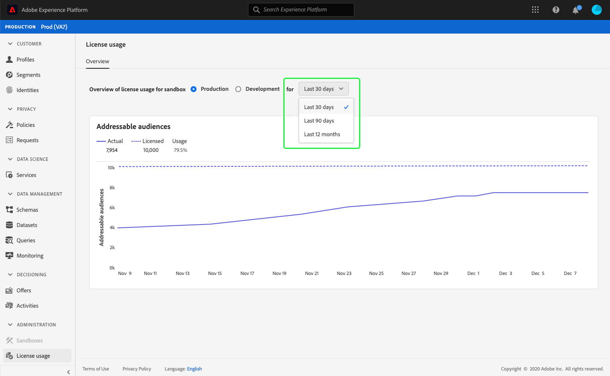

# (Alfa) painel de uso  da licença {#license-usage-dashboard}

>[!IMPORTANT]
>
>A funcionalidade do painel descrita neste documento está atualmente em alfa e não está disponível para todos os usuários. A documentação e a funcionalidade estão sujeitas a alterações.

A interface do usuário do Adobe Experience Platform (UI) fornece um painel através do qual você pode visualização informações importantes sobre o uso de licenças de sua organização, conforme capturado durante um instantâneo diário. Este guia descreve como acessar e trabalhar com o painel de uso de licença na interface do usuário e fornece mais informações sobre as visualizações exibidas no painel.

Para obter uma visão geral da interface do usuário da plataforma, visite o guia [da interface do usuário do](ui-guide.md)Experience Platform.

## Dados do painel de uso da licença

O painel de uso da licença exibe um instantâneo dos dados relacionados à licença da sua organização para o Experience Platform. Os dados no painel são exibidos exatamente como aparecem no momento específico em que o instantâneo foi realizado. Em outras palavras, o instantâneo não é uma aproximação ou amostra dos dados e o painel não está sendo atualizado em tempo real.

>[!NOTE]
>
>Quaisquer alterações ou atualizações feitas nos dados desde que o instantâneo foi realizado não serão refletidas no painel até que o próximo instantâneo seja realizado.

## Explorar o painel de uso de licença

Para navegar até o painel de uso de licença na interface do usuário da plataforma, selecione Uso **[!UICONTROL da]** licença no painel esquerdo. Isso é aberto com a guia **[!UICONTROL Visão geral]** que exibe o painel.

### Selecionar uma caixa de proteção

Para escolher uma caixa de proteção para visualização no painel, selecione [!UICONTROL Produção] ou [!UICONTROL Desenvolvimento]. A caixa de proteção selecionada é indicada pelo botão de opção ao lado do nome da caixa de proteção.

>[!NOTE]
>
>O relatórios de consumo para caixas de proteção é cumulativo para todas as caixas de proteção do mesmo tipo. Em outras palavras, selecionar [!UICONTROL Produção] ou [!UICONTROL Desenvolvimento] relatará todas as caixas de proteção de produção ou desenvolvimento, respectivamente.

### Selecionar um intervalo de datas

Depois de selecionar uma caixa de proteção, você pode usar o intervalo de datas suspenso para selecionar o período de tempo a ser exibido no painel. Há três opções disponíveis: [!UICONTROL Últimos 30 dias], [!UICONTROL Últimos 90 dias]e [!UICONTROL Últimos 12 meses]. Os últimos 30 dias são selecionados por padrão.

### Widgets e métricas

O painel de uso da licença é composto de widgets, que exibem métricas somente leitura, fornecendo informações importantes sobre o uso da licença de sua organização. Para saber mais sobre esses widgets, consulte a seção de widgets disponíveis neste guia.

## Widgets disponíveis {#available-widgets}

Atualmente, o Experience Platform fornece um widget que você pode usar para visualizar o uso de licenças, com mais widgets sendo lançados em breve.

### [!UICONTROL Audiências endereçáveis] {#addressable-audiences}

O **[!UICONTROL widget audiências]** endereçáveis mede o número total de audiências que existem na loja de Perfis, após aplicar uma política de mesclagem gerada pelo sistema para combinar todos os conjuntos de dados presentes usando um algoritmo de gráfico determinístico (privado). A política de mesclagem usada para calcular essa métrica é gerada pela Plataforma e não pode ser editada, nem uma política de mesclagem diferente pode ser selecionada.

## Painéis adicionais

A interface do usuário da plataforma fornece painéis adicionais para visualizar instantâneos de seus dados no Experience Platform. Esses painéis incluem Perfil do cliente em tempo real e segmentos. Para obter mais informações sobre esses painéis, selecione um dos seguintes links:

* [[!DNL Profile] painel](../profile/ui/profile-dashboard.md)
* [Painel do segmento](../segmentation/ui/segment-dashboard.md)

## Próximas etapas

Ao seguir este documento, você deve agora ser capaz de localizar o painel de uso de licença e selecionar uma caixa de proteção para visualização. Você também deve entender as métricas exibidas nos widgets disponíveis. Para saber mais sobre a interface do usuário do Experience Platform, consulte o guia [da interface do usuário da](ui-guide.md)plataforma.