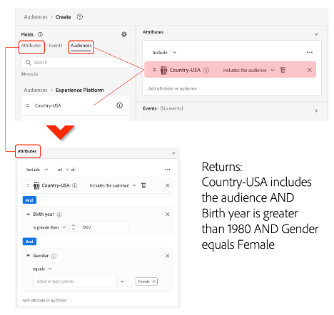
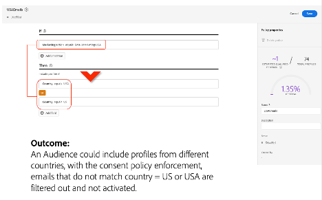

# Adobe Experience Platform para empresas de várias regiões e marcas

## Introdução

A Adobe Experience Platform está na vanguarda de soluções transformadoras, permitindo que você aproveite todo o potencial dos dados e do conteúdo de seus clientes. Com o Experience Platform, você pode centralizar e padronizar dados de diversos sistemas e aplicar o poder da ciência de dados e do aprendizado de máquina. O resultado é a criação e a entrega aprimoradas de experiências personalizadas que repercutem junto aos seus consumidores.

O Experience Platform permite que você represente a estrutura e controle os dados de sua empresa para implementações escaláveis e flexíveis. A implementação de aplicativos da Platform é uma jornada importante que requer planejamento estratégico e considerações cuidadosas, especialmente se você opera em domínios globais, regionais e específicos da marca ou em uma combinação de todos esses aspectos.

Este informe oficial serve como referência, oferecendo um ponto de vista do produto e um conjunto de diretrizes. Seu objetivo principal é capacitar você e suas equipes de implementação com as ferramentas e os insights necessários para navegar pelas complexidades do Experience Platform de maneira eficaz. Ao fornecer uma estrutura estruturada para avaliar seus requisitos específicos, suas considerações e casos de uso reais, ele fornece o conhecimento necessário para liberar todo o potencial dos aplicativos baseados em Experience Platform e plataforma. Ao ler as seções a seguir, você encontrará insights e recomendações valiosos para simplificar o processo de implementação e elevar a capacidade de sua organização de fornecer experiências excepcionais para seu público-alvo, enquanto fornece a governança e os controles para manter a privacidade e a conformidade.


## Compreensão da empresa de várias marcas e várias regiões

Se você opera uma empresa com várias marcas e várias regiões, provavelmente tem requisitos exclusivos de gerenciamento de dados para o Experience Platform. Entender seus requisitos distintos é fundamental para adaptar a implementação do Experience Platform de acordo com suas necessidades específicas.

Ao explorar opções de implantação, é necessário entender e considerar os perfis que interagirão com o Experience Platform e os aplicativos baseados em plataforma. Projetar a experiência com base em suas funções e interesses garante uma implementação bem-sucedida. Estas são três personalidades importantes que você deve considerar ao explorar as opções:

**Mary, a profissional de marketing:**

- Foco: aquisição do cliente e personalização da experiência em escala.
- Metas: criar perfis abrangentes, melhorar a eficiência da mídia.

**Ted, o tecnólogo**

- Foco: gerenciamento de dados organizacional.
- Metas: garantia de conformidade, gerenciamento de silos de dados e atendimento a várias linhas de negócios.

**Dan, o arquiteto de dados**

- Foco: precisão e qualidade dos dados.
- Metas: garantir a privacidade e a confiança dos dados, projetar esquemas e modelos de dados e gerenciar fontes de dados.

### &#x200B;1. Uma empresa que opera com isolamento de dados limitado

Um princípio fundamental de arquitetura no Experience Platform é aquele em que os dados do cliente são restritos a uma sandbox de produção específica com base em políticas e requisitos de governança.

Se sua organização precisar de um ambiente de dados único para operar sua experiência de marketing em escala, você poderá preferir consolidar todos os seus dados em uma única sandbox da Experience Platform com requisitos mínimos de isolamento de dados. Nessa configuração, os dados são assimilados em uma sandbox e todas as identidades relacionadas são representadas como um único perfil unificado, seja identificado por um pseudônimo ou uma identidade conhecida. Isso significa que os profissionais de marketing podem acessar todos os atributos de perfil e experimentar dados de evento na Experience Platform em toda a empresa. Eles podem usar esses dados com aplicativos baseados em plataforma para criar públicos-alvo e jornadas com a mínima necessidade de restringir o uso de todos os dados pelos profissionais de marketing, independentemente da marca ou região. Essa abordagem facilita a segmentação contínua e a ativação de público-alvo para os destinos compatíveis com os aplicativos da Experience Platform. Essa estratégia funciona bem se você quiser aproveitar toda a sua base de clientes, independentemente das diferenças regionais ou específicas da marca, para iniciativas de marketing unificadas e coesas.


#### Como isso funciona

Vamos começar planejando sua implementação e configurando seu ambiente de nível superior. Em seguida, você decidirá o número de sandboxes, funções e permissões necessárias para operar os aplicativos baseados em Experience Platform e plataforma de maneira ideal para sua empresa.

##### Configuração geral para sua implementação

- Configure sandboxes para permitir a criação de perfis unificados de clientes.
- Configure funções e controles de acesso para administrar sandboxes e acesso à funcionalidade para cada persona.
- Gerencie o ciclo de vida de desenvolvimento com uma sandbox de desenvolvimento e uma ferramenta de sandbox.

**Sandboxes**

As sandboxes são partições virtuais em uma única instância do Experience Platform, o que permite uma integração perfeita com o processo de desenvolvimento de seus aplicativos de experiência digital. Todo o conteúdo e as ações realizadas em uma sandbox estão confinados a essa sandbox e não afetam nenhuma outra sandbox, incluindo dados e acesso aos dados. Há dois tipos de sandboxes compatíveis com o Experience Platform:

- **Sandbox de produção**: uma sandbox de produção deve ser usada com perfis em seu ambiente de produção. O Experience Platform permite criar várias sandboxes de produção para fornecer a funcionalidade de dados correta, mantendo o isolamento operacional.

- **Sandbox de desenvolvimento**: uma sandbox de desenvolvimento pode ser usada exclusivamente para desenvolvimento e testes com perfis de não produção.

É possível criar várias sandboxes de qualquer tipo e, para esse tipo de empresa, usaremos uma sandbox de produção e uma de desenvolvimento para ilustrar como executar e operar esse tipo de empresa.


Na sandbox de produção, esperamos que você assimile seu perfil de produção e os dados do evento de experiência para criar um perfil unificado para suas atividades de marketing. Para obter mais detalhes sobre como combinar dados conhecidos e anônimos de várias fontes corporativas para criar perfis de clientes que possam ser usados para fornecer experiências personalizadas em todos os canais e dispositivos em tempo real, consulte a [documentação do Adobe Real-Time Customer Data Platform](https://experienceleague.adobe.com/pt-br/docs/experience-platform/rtcdp/home).

**Controles de acesso**

Você pode definir controles de acesso com funções e permissões para controlar o acesso aos recursos do aplicativo, dependendo da persona e de sua funcionalidade necessária. Além disso, você tem a opção de limitar o acesso a campos específicos dos dados do perfil. Você deve considerar essa etapa em profundidade para melhor administrar o uso do Experience Platform, de aplicativos baseados em plataforma e dos dados de clientes.

Considere um engenheiro de dados que pode não precisar de acesso a todas as funcionalidades do Experience Platform e de aplicativos baseados em plataforma. Normalmente, eles são responsáveis por criar definições de dados (esquemas), configurar fontes de dados para assimilar dados e criar conjuntos de dados. No entanto, eles podem não ser a mesma persona que cria e ativa públicos para experiências personalizadas do cliente. Para esta persona, crie uma função, adicione as permissões apropriadas e conceda acesso somente à funcionalidade necessária. Por outro lado, uma persona do profissional de marketing não criaria esquemas e assimilaria dados, mas sim se concentraria na criação e ativação de públicos para permitir experiências personalizadas do cliente.

Se desejar, considere adicionar controles de acesso granulares para limitar o acesso a campos específicos no perfil unificado do cliente com controle de acesso baseado em atributo/recurso de controle de acesso em nível de campo. Esses são mecanismos de governança no Experience Platform que permitem restringir o acesso a atributos de dados com base em rótulos predefinidos. Com o controle de acesso em nível de campo, os dados de identificação pessoal podem ser controlados e o acesso é restrito em todos os workflows de aplicativos e do Experience Platform. Para obter mais detalhes sobre os recursos de controle de acesso, consulte a [documentação de controle de acesso](https://experienceleague.adobe.com/en/docs/experience-platform/access-control/home).


**Ciclo de vida de desenvolvimento com sandboxes de desenvolvimento**

Uma sandbox de desenvolvimento se comporta da mesma forma que uma sandbox de produção em todos os aspectos funcionais. É diferente porque ele terá algumas medidas de proteção contratuais para mantê-lo dentro dos limites da sua licença. Ele foi projetado exclusivamente para desenvolvimento e teste com perfis não relacionados à produção, compatíveis com até 10% do compromisso do seu perfil licenciado (medido cumulativamente em todas as sandboxes de desenvolvimento autorizadas). Para obter detalhes adicionais e medidas de proteção, consulte a [documentação de visão geral das sandboxes](https://experienceleague.adobe.com/pt-br/docs/experience-platform/sandbox/home) e a [página de descrições do produto](https://helpx.adobe.com/legal/product-descriptions.html?lang=pt-BR) para obter detalhes sobre os direitos.

Você pode ter várias sandboxes de desenvolvimento (até quatro neste exemplo corporativo, já que estamos usando uma sandbox de produção) para o ciclo de vida de desenvolvimento e teste.

**Exportação e importação de pacotes com ferramentas de sandbox**

O recurso de ferramenta de sandbox permite que os usuários com permissões apropriadas criem pacotes de trabalhos a partir de uma sandbox de desenvolvimento e os exportem para um repositório. Esse repositório pode ser acessado por outros usuários, que podem importar esses pacotes para as sandboxes designadas. Esse recurso garante configurações consistentes em sandboxes, facilitando processos de exportação e importação perfeitos.

Usar ferramentas de sandbox melhora significativamente a precisão da configuração e reduz o tempo necessário para a implementação. Ele permite a movimentação eficiente de configurações bem-sucedidas em diferentes sandboxes.

Com o recurso de ferramenta sandbox, é possível selecionar vários objetos e exportá-los para um pacote. Um pacote pode incluir um único objeto ou vários objetos, mas todos os objetos devem se originar da mesma sandbox.

**Automação de sandbox via APIs**

Você tem a opção de usar APIs do Experience Platform para automatizar implantações de sandbox e tarefas de configuração. As APIs permitem o controle programável de tarefas repetitivas, como exportar, importar ou modificar configurações de sandbox, fornecendo flexibilidade se você preferir workflows automatizados.

Para obter detalhes adicionais sobre as ferramentas de sandbox, consulte a [documentação sobre as ferramentas de sandbox](https://experienceleague.adobe.com/en/docs/experience-platform/sandbox/ui/sandbox-tooling).

|  |  |
| --- | --- |

### &#x200B;2. Isolamento de dados específico da região ou da marca

Se você precisar de isolamento total (por exemplo, regional ou baseado em marca), poderá operar sob políticas estritas de acesso a dados ou requisitos legais que restringem o acesso de suas equipes de marca a dados específicos para suas respectivas regiões ou marcas. Você define padrões de acesso com base em dados específicos da região ou da marca, garantindo a conformidade com protocolos internos, normativos e de governança de dados. Essa abordagem é essencial se você opera em setores altamente regulamentados (por exemplo, manuseio de dados PII) ou precisa manter dados distintos e segmentados para diferentes regiões geográficas ou identidades de marca.


#### Como isso funciona

Vamos começar planejando sua implementação, configurando seu ambiente de nível superior e decidindo o número de sandboxes, funções e permissões necessárias para operar os aplicativos baseados em Experience Platform e plataforma de maneira ideal para sua empresa.

##### Configuração geral para sua implementação de várias sandboxes

- Configure várias sandboxes de produção para permitir a criação dos perfis unificados do cliente em cada sandbox.

- Configure funções e controles de acesso para administrar sandboxes e acesso à funcionalidade para cada persona.

- Gerencie o ciclo de vida de desenvolvimento com ferramentas de sandbox.

- Relatórios e ativação globais (agregação de dados de várias sandboxes para insights interorganizacionais com o Customer Journey Analytics).

**Sandboxes**

Ao contrário de uma configuração com uma única sandbox de produção, você pode exigir uma abordagem mais complexa se precisar de isolamento completo de dados e fluxos de trabalho. É aqui que várias sandboxes de produção entram em ação, cada uma representando uma unidade de isolamento personalizada para suas necessidades específicas.

Como mencionado, cada sandbox é uma partição virtual em uma única instância da plataforma. Essas sandboxes permitem gerenciar dados, fluxos de trabalho e processos em um ambiente controlado que não interfere em outras sandboxes. Embora as sandboxes de desenvolvimento sejam destinadas a atividades de teste e desenvolvimento com perfis de não produção, as sandboxes de produção são a espinha dorsal das operações em tempo real, permitindo a assimilação de dados reais de produção para atividades de marketing em tempo real.

Principais benefícios do isolamento limpo em sandboxes de produção:

1. **Governança e conformidade de dados:** se você opera em setores regulamentados ou regiões com leis rigorosas de privacidade de dados, é necessário garantir que os dados de uma região ou marca permaneçam isolados. Várias sandboxes de produção permitem que você esteja em conformidade com requisitos de governança ou padrões específicos do setor, garantindo que os dados só estejam acessíveis na sandbox apropriada.

2. **Eficiência operacional:** ao isolar dados e fluxos de trabalho, você pode gerenciar suas operações com mais eficiência. Suas equipes responsáveis por diferentes regiões ou marcas podem trabalhar de forma independente em suas sandboxes dedicadas sem se preocupar com vazamentos de dados acidentais ou acesso não autorizado.

3. **Fluxos de trabalho personalizados:** você pode adaptar cada sandbox de produção às necessidades específicas da sua região ou à marca que ela representa. Isso permite implementar fluxos de trabalho personalizados, modelos de dados e estratégias de marketing otimizadas para esse segmento.

4. **Escalabilidade:** à medida que você cresce, pode criar sandboxes de produção adicionais com facilidade para acomodar novas regiões ou marcas. Essa escalabilidade garante que a plataforma possa se adaptar às suas necessidades em evolução sem comprometer a integridade ou o desempenho dos dados.

5. **Controle aprimorado:** com várias sandboxes de produção, os administradores têm controle refinado sobre permissões de acesso, assimilação de dados e execução de fluxo de trabalho. Isso permite que você adote uma abordagem mais segura e organizada para gerenciar operações complexas em sua empresa global.

**Controles de acesso**

No contexto de várias sandboxes de produção, os controles de acesso permanecem como um componente essencial do gerenciamento de dados e fluxos de trabalho no Experience Platform. No entanto, a complexidade aumenta, pois os administradores devem garantir que os usuários possam acessar somente as sandboxes relevantes para suas funções, permitindo operações entre sandboxes para usuários que precisam delas, como suas equipes de marketing que abrangem várias regiões ou engenheiros de dados responsáveis pela assimilação e modelagem de dados globais.

**Definindo funções e permissões em sandboxes:**

Assim como no cenário de sandbox de produção única, você pode definir políticas de controle de acesso com funções e permissões personalizadas para as necessidades de diferentes perfis. No entanto, você deve considerar como essas funções se estendem por diferentes sandboxes em um ambiente de várias sandboxes.

Por exemplo:

- **Profissionais de marketing regionais**: se seus profissionais de marketing operam em várias regiões, suas funções podem precisar expandir mais de uma sandbox. Você pode conceder a eles as permissões necessárias para acessar recursos em várias sandboxes, garantindo que o acesso ainda esteja limitado aos dados e workflows apropriados em cada sandbox.

- **Engenheiros de dados:** Os engenheiros de dados responsáveis por criar modelos de dados, definir esquemas e gerenciar a assimilação de dados podem precisar acessar todas as sandboxes. Você pode projetar suas funções para permitir que operem em toda a plataforma e, ao mesmo tempo, limitar o acesso às funcionalidades e aos dados relevantes para as tarefas. Por exemplo, seu engenheiro de dados que trabalha em modelos de dados para a Europa e a América do Norte poderia acessar as sandboxes de produção para essas regiões com permissão para modificar esquemas e assimilar dados. No entanto, eles não teriam a capacidade de acessar funções de marketing, como criar e ativar públicos.

**Considerações sobre o controle de acesso granular:**

Em um ambiente com várias sandboxes, o controle de acesso granular se torna ainda mais essencial. O controle de acesso baseado em atributos (controle de acesso em nível de campo/controle de acesso em nível de objeto) permite restringir ainda mais o acesso a campos de dados específicos em perfis ou determinados públicos, garantindo que informações confidenciais ou de identificação pessoal (PII) sejam protegidas em todas as sandboxes. Por exemplo:

- Você pode restringir o acesso a determinados campos de dados em uma sandbox somente a usuários nessa região. Isso garante que as PII ou os dados confidenciais só sejam visíveis para quem precisa delas, alinhados às regulamentações de privacidade e às políticas internas de controle.

- Para usuários com acesso entre sandboxes, o controle de acesso baseado em atributos garante que, mesmo que tenham acesso a várias sandboxes, sua visibilidade de dados confidenciais seja limitada por sua função e por uma base de necessidade de saber.

Benefícios dos controles de acesso com base em funções e em atributos:

1. Ao controlar o acesso com base em funções e atributos, você pode reduzir significativamente o risco de acesso não autorizado aos dados, garantindo que somente aqueles com as permissões apropriadas possam visualizar ou manipular informações confidenciais.

2. Funções e permissões claras e bem definidas simplificam as operações, já que cada pessoa tem acesso à funcionalidade e aos dados de que precisa sem desordem ou risco desnecessário. Essa clareza favorece fluxos de trabalho eficientes e reduz o atrito.

3. À medida que sua empresa cresce e evolui, os controles de acesso podem ser ajustados para acomodar novas regiões, marcas ou funções. A flexibilidade para modificar o acesso sem interromper os workflows existentes é crucial para dimensionar suas operações.

4. Os administradores podem manter o controle centralizado de todas as sandboxes, garantindo a consistência na forma como os controles de acesso são aplicados em sua empresa e permitindo a personalização de diferentes regiões ou marcas.

**Ciclo de vida de desenvolvimento com sandboxes de desenvolvimento**

O gerenciamento do ciclo de vida do desenvolvimento em várias regiões e marcas no Experience Platform exige uma abordagem robusta que garanta consistência, eficiência e escalabilidade. As sandboxes de desenvolvimento oferecem suporte ao ciclo de vida de desenvolvimento em um ambiente complexo com várias sandboxes de produção. Eles são aprimorados pelo recurso de ferramenta sandbox, que permite o compartilhamento e a implantação ininterruptos da configuração em diferentes ambientes.

As sandboxes de desenvolvimento desempenham um papel crucial no ciclo de vida do desenvolvimento. Essas sandboxes fornecem um ambiente isolado em que desenvolvedores e engenheiros de dados podem criar, testar e iterar em configurações sem afetar os dados de produção. Embora funcionalmente semelhantes às sandboxes de produção, as sandboxes de desenvolvimento são diferentes porque se destinam a testes com perfis de não produção e são regidas por limites contratuais, como oferecer suporte a até 10% do compromisso de perfil licenciado em todas as sandboxes de desenvolvimento autorizadas.

Você pode criar várias sandboxes de desenvolvimento para oferecer suporte a diferentes equipes ou regiões. Isso permite que cada uma de suas equipes experimente workflows específicos para sua região ou marca, garantindo que os ambientes de produção permaneçam estáveis e seguros durante o desenvolvimento. Se você tiver muitas sandboxes de produção, recomendamos usar um pool de sandboxes de desenvolvimento para oferecer suporte a várias regiões/marcas.

**Exportação e importação de pacotes com ferramentas de sandbox**

O recurso de ferramenta de sandbox é uma ferramenta poderosa se você estiver gerenciando várias sandboxes. Ela permite que desenvolvedores, engenheiros de dados e profissionais de marketing criem pacotes de trabalho em uma sandbox de desenvolvimento, incluindo esquemas, modelos de dados e outras configurações, e depois os exporte para um repositório. A partir daí, outros usuários podem acessar e importar esses pacotes para suas sandboxes designadas, facilitando o compartilhamento e a implantação ininterruptos de configurações bem-sucedidas em toda a empresa.

Por exemplo, seu engenheiro de dados que trabalha em uma sandbox de desenvolvimento para a região da América do Norte pode criar um esquema e empacotá-lo com todas as suas dependências. Outro engenheiro de dados em uma região diferente, como na Europa, pode acessar esse pacote e importá-lo para a sandbox regional. Esse processo garante a consistência na modelagem e configuração de dados em toda a empresa, reduzindo o risco de erros e melhorando a eficiência operacional.

Benefícios da ferramenta de sandbox em um ambiente com várias sandboxes:

1. As ferramentas de sandbox simplificam o ciclo de vida do desenvolvimento, permitindo que configurações bem-sucedidas sejam compartilhadas facilmente em várias sandboxes. Isso reduz a duplicação de esforços e garante que as práticas recomendadas sejam implementadas de forma consistente em todas as regiões ou marcas.

2. A capacidade de exportar e importar pacotes em diferentes sandboxes melhora a interoperabilidade na empresa. Equipes em diferentes regiões podem colaborar com mais eficiência, garantindo que suas configurações se alinhem às metas gerais da empresa e, ao mesmo tempo, acomodem requisitos regionais ou específicos da marca.

3. À medida que as empresas crescem e adicionam mais sandboxes para acomodar novas regiões ou marcas, as ferramentas de sandbox fornecem a escalabilidade necessária para gerenciar esses ambientes com eficiência. As novas sandboxes podem ser configuradas rapidamente usando os pacotes existentes, acelerando o processo de integração e reduzindo o tempo necessário para entrar em funcionamento.

4. Ao empacotar configurações e dependências em uma sandbox de desenvolvimento e, em seguida, implantá-las em sandboxes de produção, as empresas podem garantir que suas configurações sejam precisas e consistentes em todos os segmentos. Isso reduz a probabilidade de erros e melhora a confiabilidade geral da plataforma.

5. Com as ferramentas de sandbox, a transição do desenvolvimento para a produção é suave e controlada. Depois que as configurações forem testadas e validadas em uma sandbox de desenvolvimento, elas poderão ser exportadas e importadas para uma sandbox de produção com certeza de que funcionarão conforme esperado.

**Relatório e ativação globais**

Isso envolve a agregação de dados de várias sandboxes para insights interorganizacionais, o que geralmente requer uma sandbox de relatórios dedicada para integração com o Customer Journey Analytics.

Embora a abordagem de várias sandboxes de produção forneça claramente benefícios de isolamento para operações regionais e específicas da marca, ela também apresenta desafios que exigem soluções criativas. Um desafio importante é a capacidade de analisar dados em sandboxes para fins de relatório global e campanha global. As empresas geralmente precisam entender a jornada do cliente em nível global, o que envolve a integração de dados de várias sandboxes e a ativação de esforços de marketing entre sandboxes. Abaixo, descrevemos abordagens para enfrentar esses desafios.

**Relatórios globais em sandboxes**

Quando uma empresa opera com várias sandboxes de produção, cada uma representando uma região ou marca, a análise dos dados do cliente em todas as sandboxes se torna complexa. Por exemplo, criar uma visualização unificada da jornada do cliente em diferentes marcas requer a consolidação dos dados desses ambientes isolados.

**Sandbox global dedicada**


Essa sandbox atua como um repositório central onde os dados de sandboxes individuais regionais ou específicas da marca são consolidados. Uma solução comum é usar o Serviço de consulta em cada sandbox para extrair dados relevantes do cliente. Isso pode incluir perfis e eventos de experiência que precisam ser analisados em diferentes regiões ou marcas. Depois que os dados são preparados de cada sandbox, eles são assimilados na sandbox de relatórios globais para análise e criação de público-alvo.

Use o Customer Journey Analytics para realizar análises entre mercados e marcas em dados agregados na sandbox global para obter uma visão abrangente das interações do cliente em todas as marcas e regiões. Isso permite gerar insights valiosos, como identificar clientes que interagem com várias marcas e criam públicos entre marcas ou entre regiões. Esses insights podem ser usados para vários propósitos, incluindo ativar estratégias de marketing, personalizar experiências do cliente e impulsionar o crescimento da empresa.

**Compartilhamento de público-alvo**

A sandbox global também permite que equipes de marketing globais definam e gerenciem públicos em uma escala mais ampla. Usando ferramentas de sandbox, esses públicos-alvo globais (somente definições, não dados) podem ser exportados da sandbox global para sandboxes individuais ou regionais, permitindo que as equipes de marketing locais os avaliem e ativem seus respectivos mercados.

Além disso, você pode utilizar a Correspondência de segmentos do Experience Platform, um recurso na Platform que permite o compartilhamento de segmentos entre sandboxes (público qualificado) entre diferentes unidades organizacionais ou entidades de negócios.

Esse serviço de compartilhamento de segmentos permite que dois ou mais usuários troquem dados de segmento de maneira segura, controlada e compatível com a privacidade.

Para obter detalhes adicionais sobre o recurso de Correspondência de segmentos, consulte a [documentação sobre Correspondência de segmentos](https://experienceleague.adobe.com/en/docs/experience-platform/segmentation/ui/segment-match/overview).

### 3. Uma combinação de abordagens para operações globais, regionais e específicas da marca

Muitas empresas de várias marcas operam em uma escala global e, como tal, geralmente buscam uma combinação de abordagens de gerenciamento de dados unificados e isolados. Nesse cenário, eles buscam separar dados de várias regiões ou países. As marcas na organização podem esperar operar exclusivamente nos dados associados a sua marca específica, tudo dentro dos mesmos limites de dados de uma geografia ou país. Essa abordagem permite o gerenciamento centralizado de dados regionais ou de países, facilitando ainda as operações de marketing e de dados específicas da marca. É um modelo que combina as vantagens do gerenciamento unificado de dados com a necessidade de isolamento específico da marca e da região.

Reconhecendo esses requisitos variáveis, a Experience Platform pode ser configurada para fornecer a você uma solução de gerenciamento de dados altamente adaptável e flexível, garantindo que empresas de várias marcas e várias regiões possam representar efetivamente seus negócios na plataforma. Independentemente de a meta ser maximizar os dados coletivos do cliente, manter o isolamento rigoroso dos dados ou alcançar um equilíbrio entre os dois, a Experience Platform está equipada para atender às diversas necessidades de sua empresa.


#### Como isso funciona

Vamos começar planejando sua implementação, configurando seu ambiente de nível superior e decidindo o número de sandboxes, funções e permissões necessárias para operar os aplicativos baseados em Experience Platform e plataforma de maneira ideal para esta empresa.

##### Configuração geral para esta empresa

- Configure várias sandboxes de produção para permitir a criação de perfis unificados do cliente.

- Configure funções e controles de acesso para administrar sandboxes e acesso à funcionalidade para cada persona.

- Configurar controle de acesso baseado em atributos: controle de acesso em nível de campo/controle de acesso em nível de objeto para controles granulares sobre atributos de perfil e públicos.

- Gerencie o ciclo de vida de desenvolvimento com sandboxes de desenvolvimento e ferramentas de sandbox.

- Relatórios globais.

**Sandboxes**

Configurar uma sandbox por marca/região. Consulte as seções acima para criar várias sandboxes de produção.

**Controles de acesso**

Funções e permissões de usuário:

- Crie a função &quot;**Profissional de marketing—Global**&quot; e conceda permissão para criar, exibir e gerenciar públicos. Além disso, essa função obterá permissão para exibir todos os dados do cliente.

- Crie funções e conceda acesso apenas a determinados recursos para a pessoa correta. Por exemplo, as funções de usuário &quot;**Profissional de marketing—Alemanha**&quot; e &quot;**Profissional de marketing—França**&quot; só obteriam permissão para criar, exibir e gerenciar públicos nos dados do país habilitados por uma combinação de controle de acesso em nível de campo, controle de acesso em nível de objeto e públicos padrão.

- Crie a função &quot;**Tecnólogo — Global**&quot; e conceda as permissões certas para criar e gerenciar esquemas, conjuntos de dados, políticas, fontes e assim por diante. Essa função será responsável por toda a administração e configurações necessárias.

###### Design de esquema e controle de acesso baseado em atributo: controle de acesso em nível de campo

**Modelo de dados de experiência (XDM)**

Um esquema de dados padronizado na Experience Platform que garante a estrutura de dados consistente e a interoperabilidade em todos os aplicativos baseados em plataforma.

**Controle de acesso baseado em atributos: controle de acesso em nível de campo e opção de modelagem de dados:**

- Crie um modelo de dados para incluir campos XDM (PII) específicos do locatário que devem ser restritos para cada país.

- Crie e aplique rótulos de país a campos XDM. Etiquetas = Alemanha, França, Irlanda, Países Baixos, etc.

- Adicione rótulos à função apropriada. Por exemplo, adicione o rótulo Alemanha à função &quot;Profissional de marketing — Alemanha&quot;.

Esquema de perfil individual XDM:

```
\- PII
\- Germany
    \- name --> Label: "Germany"
    \- email --> Label: "Germany"
    \- birthdate --> Label: "Germany"

\- France
    \- name --> Label: "France"
    \- email --> Label: "France"
    \- birthdate --> Label: "France"

\- Netherland
    \- name --> Label: "Netherland", "Germany"
    \- email --> Label: "Netherland", "Germany"
    \- birthdate --> Label: "Netherland", "Germany"

\- Loyalty
    \- member
    \- registrationDate
```

###### Públicos: use o controle de acesso baseado em atributos: Controle de acesso no nível do objeto para controlar o acesso a públicos específicos da marca/país

**Controle de acesso baseado em atributo: Controle de acesso em nível de objeto para públicos-alvo:**

- Crie públicos-alvo e controle quem pode visualizá-los.

- Crie e aplique rótulos de país a públicos. Rótulos = Alemanha, França, Irlanda, Países Baixos e assim por diante.

- Adicione rótulos à função apropriada. Por exemplo, adicione o rótulo &quot;Alemanha&quot; à função &quot;Profissional de marketing — Alemanha&quot;.


###### Inclua um público-alvo padrão ao criar públicos-alvo específicos da marca/país

**Público-alvo padrão: Alternativa ao Controle de Acesso em Nível de Linha:**

- Atualmente, o construtor de público-alvo permite incluir públicos-alvo existentes como blocos de construção no seu processo de criação de público-alvo.

- O resultado seria derivado do público-alvo, seguido por atributos e eventos.

- Não há um mecanismo para adicionar automaticamente um ou mais públicos-alvo no momento da composição.



###### Filtragem de perfis de ativação e nível de marca/país

**Opção de política de consentimento personalizada:**

Isso permite controlar ou filtrar perfis no momento da ativação:

- Criar ação de marketing.

- Crie um destino e associe a ação de marketing.

- Criar uma política de consentimento personalizada.

>[!NOTE]
>
> O SKU do Shield de Privacidade e Segurança é necessário para criar políticas de consentimento.



Complexidade da política de consentimento e ativação de várias marcas:

O gerenciamento da ativação de público-alvo em várias marcas exige uma governança detalhada das políticas de consentimento, garantindo que os requisitos exclusivos de cada marca sejam atendidos. Além disso, o Adobe Privacy and Security Shield (um recurso de conformidade no Experience Platform que aplica políticas de proteção de dados e garante o alinhamento regulamentar em vários canais de ativação) pode impor limitações específicas sobre como as políticas de consentimento são aplicadas em diferentes canais de ativação. Você deve avaliar essas considerações cuidadosamente e implementar estruturas de governança para manter a conformidade e a eficiência operacional.

Você também deve navegar com cuidado pelas complexidades em torno das configurações de política de consentimento e ativações específicas de canal. Definir explicitamente políticas de consentimento para cada região ou marca e gerenciar de forma consistente essas configurações é fundamental para a conformidade e a eficiência operacional.

## Considerações gerais

Em alguns cenários, você pode optar por implantar aplicativos baseados em Experience Platform e plataforma em várias IDs de organização, em vez de usar uma única ID de organização com muitas sandboxes. Essa abordagem pode oferecer benefícios em termos de residência, segurança e administração de dados, mas também introduz complexidade. Estas são as principais considerações para determinar quando uma abordagem de várias organizações pode ser apropriada.

### O que é uma ID de organização

- Uma ID de organização é a implementação do Federated ID e do protocolo OAuth 2.0 pela Adobe.

- Uma ID de organização é uma coleção de todos os aplicativos, usuários e permissões aos quais uma organização tem direitos nos termos contratuais da Adobe.

- As contas de usuário e permissões são gerenciadas por meio da Admin Console de cada organização.

- As IDs de organização também controlam como as soluções da Adobe interagem entre si. As soluções da mesma organização podem ter interoperabilidade.

- Em geral, uma ID de organização é implantada em uma única região geográfica.


**Várias IDs de organização: Benefícios e considerações&#x200B;**

| Benefícios | Considerações |
| -------- | -------------- |
| Veja a seguir uma lista dos benefícios de ter várias IDs de organização: <ul><li>Flexibilidade para armazenar dados em regiões globais específicas.</li><li>&#x200B;Logons de usuário separados por instância, ou seja, o Wholefoods não pode fazer logon no Audible.&#x200B;</li><li>Terminais de API dedicados que dão a cada Mercado/BU a capacidade de criar conexões personalizadas conforme necessário em seu próprio ambiente&#x200B;.</li><li>Cada unidade de negócios teria suas próprias chaves gerenciadas pelo cliente&#x200B;.</li><li>As solicitações do GDPR podem ser feitas por unidade de negócios&#x200B;.</li><li>Armazenamento e computação completamente isolados entre unidades de negócios&#x200B;.</li><li>Atenua alguns limites/medidas de proteção de desempenho no nível da organização&#x200B;.</li><li>Mais flexibilidade com provisionamento e combinação de SKUs entre unidades de negócios. Por exemplo, uma organização pode ter uma SKU diferente do Adobe Journey Optimizer em relação a outra organização.</li></ul> | A seguir, há itens a serem considerados ao ter várias IDs de organização: <ul><li>Várias IDs de organização para gerenciar, em vez de uma.&#x200B;</li><li>Várias instâncias/ambientes separados para gerenciar (integrações, carregamentos de dados etc.).</li><li>&#x200B;As ECIDs serão exclusivas por organização, dificultando a correspondência de dados entre unidades de negócios&#x200B;.</li><li>Precisaria migrar/reimplementar o Analytics e o Target por organização - perder a acumulação global (se estiver em uso no momento).&#x200B;</li><li>É necessária mais orquestração para fazer solicitações de GDPR em unidades de negócios&#x200B;.</li><li>Algumas integrações de aplicativos baseadas no Experience Platform armazenam metadados no nível da organização. Nem tudo é &quot;sandbox&quot; por sandboxes&#x200B;</li><li>A ID da organização está fixada a uma região. No momento, o local de hospedagem do Adobe AWS é somente nos EUA. A Adobe não oferece suporte à migração de uma região de hospedagem para outra.&#x200B;</li><li>O Edge não reconhece sandboxes (para encaminhamento de eventos).</li></ul> |

**ID de organização única: benefícios e considerações**


| Benefícios | Considerações |
| -------- | -------------- |
| Veja a seguir uma lista dos benefícios de ter uma única ID de organização: <ul><li>Provisione sandboxes individuais para criar uma separação lógica entre unidades de negócios em uma região implantada</li><li>ID de organização única para gerenciamento de TI para usuários, provisionamento etc.</li><li>Nenhuma migração de Tags da Adobe, Target, Analytics e muito mais, se estiver na mesma ID da organização.</li><li>Nenhuma redefinição necessária para ECIDs existentes - impede o &quot;cliffing&quot; nos dados do Adobe Analytics.</li><li>Logon único para recursos de marketing global.</li><li>Direitos de acesso do usuário para controlar quem tem acesso a quais sandboxes, com níveis apropriados de controle de acesso com base em função.</li><li>Aproveite as instâncias do Global Analytics e do Target e os dados do conjunto de relatórios.</li></ul> | A seguir, há itens a serem considerados ao ter uma única ID de organização: <ul><li>Os dados serão armazenados em uma única região.</li><li>Necessidade potencial de consolidar dados em uma única ID de organização.</li><li>Todas as unidades de negócios compartilhariam a mesma infraestrutura entre os aplicativos (Experience Platform principal, Real-Time CDP, Adobe Journey Optimizer, Customer Journey Analytics).</li><li>Medidas de proteção: algumas são globais por organização, como a segmentação por transmissão, que é de 1,5 mil RPS.</li><li>As solicitações do GDPR operam no nível da organização e não podem ser direcionadas para sandboxes específicas.</li><li>As chaves gerenciadas pelo cliente são definidas no nível da ID da organização - todas as sandboxes de unidades de negócios compartilhariam a mesma chave de criptografia com essa abordagem.</li><li>Exigirá clareza no licenciamento corporativo em DX e CC para garantir que os aplicativos sejam provisionados nas IDs corretas da organização.</ul></li> |

**Benefícios e considerações**

Várias IDs de organização controlam o acesso do usuário, os direitos e a segregação de dados em um nível organizacional em comparação a uma única ID de organização, que controla no nível da sandbox.

| Cenário/Requisito | Várias IDs de organização | Várias sandboxes (ID de organização única) |
| ----------------------------------- | --------------------------------------------------- | ----------------------------------------------- |
| Residência de dados | IDs de organização específicas de região e isolamento completo | Implantação em uma única região |
| Governança e isolamento de dados | Separação e isolamento completos | Isolamento operacional, ID de organização compartilhada |
| Gerenciamento de conformidade (por exemplo, GDPR) | Solicitações separadas por ID de organização | Uma única solicitação se aplica a sandboxes |
| Custo e licenciamento da infraestrutura | Possivelmente maior devido à configuração duplicada | Normalmente menor com administração centralizada |
| Relatório e ativação globais | Desafio devido a ambientes isolados | Facilidade de criação de relatórios e ativação entre regiões |
| Complexidade administrativa | Maior devido a várias IDs de organização isoladas | Administração centralizada e inferior |

## Conclusão resumida

A Experience Platform fornece às empresas uma estrutura robusta para centralizar, administrar e ativar dados do cliente em modelos de negócios de várias marcas e várias regiões. Este informe oficial explorou as principais estratégias de implantação, modelos de governança e práticas recomendadas para otimizar a implementação do Experience Platform em organizações com diferentes necessidades operacionais e de isolamento de dados.

## Principais pontos

1. **Modelos de implantação flexíveis**

   - As empresas podem escolher entre **abordagens de sandbox única, de várias sandboxes ou híbridas** com base em seus requisitos operacionais, de conformidade e de governança.

   - **As organizações globais** podem exigir várias sandboxes de produção para atender aos requisitos de governança e, ao mesmo tempo, manter a eficiência operacional.

2. **Governança de dados e controle de acesso**

   - **O controle de acesso baseado em atributos, o controle de acesso em nível de campo e o controle de acesso em nível de objeto** habilitam a governança precisa sobre o acesso aos dados.

   - Você deve definir **limpar funções e permissões** para diferentes personalidades (por exemplo, profissionais de marketing, arquitetos de dados e equipes de TI) para garantir o uso adequado dos dados.

3. **Automação e ferramentas de sandbox**

   - **As ferramentas de sandbox** simplificam o gerenciamento de configurações, permitindo que as equipes exportem e importem configurações com eficiência.

   - A **automação baseada em API** é uma opção disponível para empresas que desejam simplificar as implantações de sandbox e a governança em escala.

4. **Estratégias globais de relatórios e ativação**

   - As empresas que usam o **Customer Journey Analytics** devem considerar a sincronização de dados e as implicações comerciais ao consolidar os relatórios globais.

   - A **Correspondência de segmentos** fornece um mecanismo de conformidade com a privacidade para o compartilhamento de público entre sandboxes, garantindo ativações de marketing perfeitas.

5. **IDs com várias organizações vs. considerações sobre várias sandboxes**

   - Você deve avaliar cuidadosamente se deve implantar **várias IDs de organização ou várias sandboxes** com base na residência dos dados, na conformidade e nas necessidades operacionais.

   - As **IDs de organização** oferecem isolamento completo**, enquanto as configurações de várias sandboxes fornecem flexibilidade operacional em uma estrutura de governança compartilhada**.

## Pensamentos finais

À medida que as empresas dimensionam seus recursos de experiência digital, o Experience Platform serve como uma plataforma fundamental para impulsionar o marketing orientado por dados, a inteligência do cliente e as ativações entre canais. Uma implementação bem-sucedida requer um planejamento cuidadoso da **governança da sandbox, das políticas de conformidade e dos fluxos de trabalho operacionais** para garantir a eficiência e a escalabilidade a longo prazo.

Ao utilizar as práticas recomendadas descritas neste informe oficial, você pode **otimizar o Experience Platform para operações de várias marcas e várias regiões**, garantindo um gerenciamento de dados, conformidade e experiências personalizadas em escala.

## Confirmação

Este informe oficial foi desenvolvido com insights e feedback de especialistas no assunto em várias equipes, garantindo precisão, clareza e orientação prática. Agradecemos a todos os colegas por sua valiosa contribuição e revisão. Sua experiência ajudou a refinar este documento para atender melhor às empresas que implementam o Adobe Experience Platform em ambientes de várias marcas e várias regiões.
