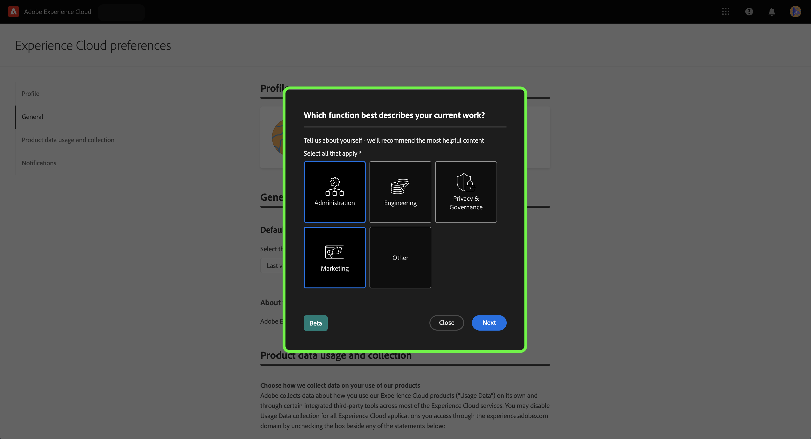

# Use a pesquisa de autoidentificação para criar seu perfil pessoal da Experience Platform

>[!NOTE]
>
>A pesquisa de autoidentificação está na versão beta. Seus recursos e documentação estão sujeitos a alterações.

A pesquisa de autoidentificação é um pequeno questionário apresentado na página inicial da interface da Adobe Experience Platform. Você pode preencher a pesquisa para fornecer informações sobre suas funções de trabalho e objetivos gerais. Essas informações são usadas para alinhar melhor os guias no produto e, eventualmente, fornecer conteúdo mais relevante para seus objetivos.

Este documento fornece informações sobre como usar a pesquisa de autoidentificação na interface do usuário do Experience Platform para receber conteúdo relevante com base em suas metas e tarefas, bem como sobre como reconfigurar os atributos de perfil pessoal usando a interface do usuário.

Para saber mais sobre o Adobe Experience Platform, leia a [visão geral do Experience Platform](home.md).

## Pesquisa de autoidentificação na interface do usuário do Experience Platform

O prompt da pesquisa de autoidentificação é exibido na parte inferior direita da página inicial da interface do usuário do Experience Platform ao fazer logon.

Para iniciar a pesquisa, selecione **[!UICONTROL Iniciar]**.

Para a primeira pergunta da pesquisa, selecione a função que melhor descreve seu trabalho.

As opções disponíveis são:

* Administração
* Engenharia
* Privacidade e governança
* Marketing
* Outras

>[!NOTE]
>
>É possível selecionar mais de uma função na lista de opções. Se você selecionar [!UICONTROL Outros], será solicitado a fornecer detalhes sobre o seu objetivo.

Para continuar, selecione as funções que melhor descrevem seu trabalho atual e selecione **[!UICONTROL Avançar]**.

Em seguida, selecione os objetivos específicos que melhor se aplicam ao seu trabalho.

A lista de objetivos disponíveis inclui:

* Criar e gerenciar usuários
* Atribuir funções, permissões e perfis de produto
* Gerenciar uso de licença, sandboxes e alertas
* Configurar o sistema para assimilação de dados
* Modelar a estrutura de dados da minha organização
* Consultar, filtrar e otimizar dados para gerar insights
* Configurar políticas de dados e consentimento
* Governança de dados e conformidade com a privacidade
* Desenvolver estratégias de marketing
* Criar, gerenciar e segmentar públicos-alvo
* Configurar painéis para analisar o impacto nos negócios
* Ativar dados para destinos de direcionamento downstream

Quando terminar, selecione **[!UICONTROL Enviar]**.

Com a pesquisa de autoidentificação concluída, selecione **[!UICONTROL Concluído]**.

>[!NOTE]
>
>Os objetivos e as recomendações (se presentes) serão alterados com base nas funções de trabalho selecionadas.

## Atualize suas respostas de pesquisa

Atualize suas funções de trabalho e objetos usando o menu de preferências do Experience Cloud. Para acessar o menu de preferências, selecione o ícone de perfil na navegação superior e selecione **[!UICONTROL Preferências]**.

Em seguida, na seção [!UICONTROL Geral] do menu de preferências de perfil, selecione **[!UICONTROL Atualizar suas funções de trabalho e objetivos]**.

A pesquisa de autoidentificação é exibida, permitindo reconfigurar as respostas e atualizar o perfil.

## Próximas etapas

Ao ler este documento, você agora envia e atualiza informações sobre suas funções de trabalho e objetivos para receber conteúdo mais relevante ao usar a interface do Experience Platform. Para obter mais informações sobre a interface do Experience Platform, leia a [visão geral do Experience Platform](home.md).
