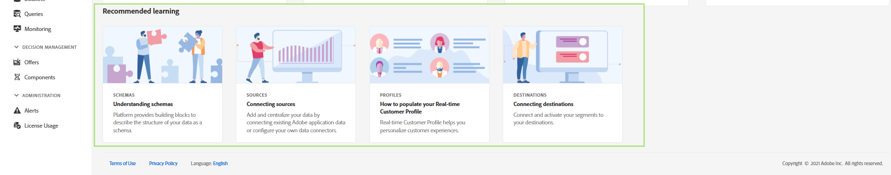

# Guia da interface do usuário do Adobe Experience Platform

Este guia serve como uma introdução ao uso da interface do usuário do Adobe Experience Platform (UI), explicando para que os vários componentes são usados e fornecendo links para mais documentação para obter mais informações.

Para saber mais sobre o Adobe Experience Platform, leia o [Visão geral do Experience Platform](home.md).

## Tela inicial

Depois de fazer logon no Adobe Experience Platform, você está na [!UICONTROL Início] que é composta pela página [painel de métricas](#metrics), [dados recentes](#recent-data)e [aprendizagem recomendada](#recommended-learning) seções.

### Métricas

O painel de métricas fornece cartões que fornecem informações sobre conjuntos de dados, perfis, segmentos e destinos em sua organização.

O **[!UICONTROL Conjuntos de dados]** mostra o número de conjuntos de dados na organização IMS. Esse número é atualizado quando um novo conjunto de dados é criado. Mais informações sobre conjuntos de dados podem ser encontradas no [visão geral dos conjuntos de dados](../catalog/datasets/overview.md).

O **[!UICONTROL Perfis]** mostra o número total de pessoas com perfis em sua Organização IMS, excluindo fragmentos de perfil. Esse número total de pessoas representa o público-alvo total endereçável e é atualizado uma vez a cada 24 horas. Mais informações sobre perfis podem ser encontradas no [Visão geral do perfil do cliente em tempo real](../profile/home.md).

O **[!UICONTROL Segmentos]** mostra o número total de segmentos criados na Organização IMS. Esse número é atualizado quando um novo segmento é criado. Mais informações sobre segmentos podem ser encontradas na seção [Visão geral do serviço de segmentação](../segmentation/home.md).

O **[!UICONTROL Destinos]** mostra o número total de destinos criados para a Organização IMS. Esse número é atualizado quando um novo destino é criado. Mais informações sobre destinos podem ser encontradas na seção [visão geral dos destinos](../destinations/home.md).

### Dados recentes

O painel de dados recente fornece informações sobre conjuntos de dados, fontes, segmentos e destinos criados recentemente.

O **[!UICONTROL Conjuntos de dados recentes]** lista os cinco conjuntos de dados criados mais recentemente na organização IMS. Essa lista é atualizada sempre que um novo conjunto de dados é criado. Você pode selecionar um conjunto de dados na lista para exibir mais informações sobre o conjunto de dados especificado ou selecionar **[!UICONTROL Exibir tudo]** para ver uma lista de todos os conjuntos de dados criados. Mais informações sobre conjuntos de dados podem ser encontradas no [visão geral dos conjuntos de dados](../catalog/datasets/overview.md).

O **[!UICONTROL Fontes recentes]** lista os cinco conectores de origem criados mais recentemente na organização IMS. Essa lista é atualizada sempre que um novo conector de origem é criado. Você pode selecionar uma conexão de origem na lista para exibir mais informações sobre o conector especificado ou selecionar **[!UICONTROL Exibir tudo]** para ver uma lista de todas as conexões de origem criadas. Mais informações sobre fontes podem ser encontradas no [visão geral das fontes](../sources/home.md).

O **[!UICONTROL Segmentos recentes]** lista as cinco definições de segmento criadas mais recentemente na organização IMS. Essa lista é atualizada sempre que uma nova definição de segmento é criada. Você pode selecionar uma definição de segmento na lista para exibir mais informações sobre a definição de segmento especificada ou selecionar **[!UICONTROL Exibir tudo]** para ver uma lista de todas as definições de segmento criadas. Mais informações sobre segmentos podem ser encontradas na seção [Visão geral do serviço de segmentação](../segmentation/home.md).

O **[!UICONTROL Destinos recentes]** lista os cinco destinos criados mais recentemente na organização IMS. Essa lista é atualizada sempre que um novo destino é criado. Você pode selecionar um destino na lista para exibir mais informações sobre o destino especificado ou selecionar **[!UICONTROL Exibir tudo]** para ver uma lista de todos os destinos criados. Mais informações sobre destinos podem ser encontradas na seção [visão geral dos destinos](../destinations/home.md).

### Aprendizagem recomendada

O **[!UICONTROL Aprendizagem recomendada]** A seção fornece links para a documentação útil para começar a usar o Adobe Experience Platform.

## Barra de navegação superior

A barra de navegação superior na interface do usuário da plataforma exibe a Organização IMS na qual você está conectado no momento e fornece vários controles importantes.

No lado esquerdo da barra de navegação, há o logotipo do Adobe Experience Platform. Selecionar esse logotipo a qualquer momento o traz de volta à tela inicial da interface do usuário da plataforma.

### Seletor da Organização IMS

O primeiro item no lado direito da barra de navegação superior é o **Seletor da Organização IMS**.

Selecionar o alternador abre um menu suspenso de Organizações IMS às quais você tem acesso, se houver algum disponível. Para alternar para outra Organização IMS, selecione uma opção listada.

### Aplicativos de switch

O próximo item no lado direito da navegação superior é o **alternador de aplicativos**, representado pelo  ícone . Ao selecionar esse ícone, você pode alternar entre aplicativos do Adobe aos quais a sua Organização IMS tem acesso, como Experience Platform, Analytics, Assets e outros.

### Ajuda

À direita do alternador de aplicativos, há o **menu de ajuda e suporte**, que é representado pelo  ícone . Ao selecionar esse ícone, um menu pop-up é exibido, contendo vários recursos de ajuda e suporte. O **[!UICONTROL Ajuda]** mostra uma lista da documentação relevante para a página em que você está no momento. O **[!UICONTROL Suporte]** permite criar um tíquete de suporte com a equipe de suporte do Adobe. O **[!UICONTROL Feedback]** permite enviar feedback sobre a Platform para o Adobe.

### Notificações e anúncios

No **seção notificações**, que é representado pelo  ícone . O **[!UICONTROL Notificações]** mostra informações importantes sobre o produto e outras atualizações relevantes, enquanto a guia **[!UICONTROL Anúncios]** mostra informações sobre manutenção de serviço.

### Perfil de usuário

O item final na barra de navegação superior é o **configurações do usuário**, representado pelo  ícone . Selecione esse ícone para editar suas preferências ou sair.

Você pode alternar entre o tema claro e escuro da interface da plataforma com o switch localizado logo abaixo do seu nome e email. Selecione o tema preferido.

### Sandboxes

Imediatamente abaixo da barra de navegação superior está a barra de sandbox. Esta barra mostra qual sandbox você está usando atualmente para a plataforma. Mais informações sobre sandboxes podem ser encontradas no [visão geral das sandboxes](../sandboxes/home.md).

## Navegação à esquerda {#left-nav}

A navegação no lado esquerdo da tela lista todos os diferentes serviços compatíveis com a interface do usuário da plataforma.

Clique no ícone de menu para mostrar ou ocultar o painel de navegação esquerdo.

Você pode bloquear a navegação na posição de abertura clicando novamente depois de mostrar o painel.

>[!IMPORTANT]
>
>A barra de navegação esquerda mostra apenas os recursos que você pode acessar. Em versões anteriores do Adobe Experience Platform, os itens indisponíveis eram desativados. Se você acha que deve ter acesso a uma seção que não é exibida, entre em contato com o administrador do sistema.

O **[!UICONTROL Início]** permite retornar à página inicial da interface do usuário da plataforma.

O **[!UICONTROL Fluxos de trabalho]** mostra uma lista de fluxos de trabalho de várias etapas para executar operações no Platform. Mais informações sobre workflows podem ser encontradas na seção [visão geral dos fluxos de trabalho](./workflows.md).

### [!UICONTROL Conexões]

O **[!UICONTROL Fontes]** permite criar, atualizar e excluir conexões de origem, permitindo assimilar dados de fontes externas na Platform. Mais informações sobre fontes podem ser encontradas no [visão geral das fontes](../sources/home.md).

O **[!UICONTROL Destinos]** A seção permite criar, atualizar e excluir destinos, permitindo exportar dados da Platform para muitos destinos externos. Mais informações sobre destinos podem ser encontradas na seção [visão geral dos destinos](../destinations/home.md).

### [!UICONTROL Cliente]

O **[!UICONTROL Perfis]** A seção permite navegar pelos perfis do cliente, exibir métricas de perfil, criar e gerenciar políticas de mesclagem e visualizar schemas de união. Para saber mais sobre como usar o [!UICONTROL Perfis] leia a seção [[!DNL Profile] guia do usuário](../profile/ui/user-guide.md). Mais informações sobre o Perfil do cliente em tempo real podem ser encontradas na seção [Visão geral do perfil do cliente em tempo real](../profile/home.md).

O **[!UICONTROL Segmentos]** permite criar e gerenciar definições de segmento. Para saber mais sobre como usar o [!UICONTROL Segmentos] leia a seção [guia do usuário de segmentação](../segmentation/ui/overview.md). Mais informações sobre o Serviço de segmentação podem ser encontradas no [Visão geral do serviço de segmentação](../segmentation/home.md).

O **[!UICONTROL Identidades]** permite criar e gerenciar namespaces de identidade. Para obter mais informações sobre o [!UICONTROL Identidades] , incluindo informações sobre namespaces de identidade e como usar identidades na interface do usuário da plataforma, consulte [visão geral do namespace de identidade](../identity-service/namespaces.md).

### [!UICONTROL Privacidade]

O **[!UICONTROL Políticas]** permite criar e gerenciar políticas de uso de dados. Para saber mais sobre como usar a seção Políticas, leia o [guia do usuário de políticas de uso de dados](../data-governance/policies/user-guide.md). Mais informações sobre as políticas de uso de dados podem ser encontradas no [visão geral das políticas de uso de dados](../data-governance/policies/overview.md).

O **[!UICONTROL Solicitações]** permite criar e gerenciar solicitações de privacidade. Observe que você deve ser incluir na lista de permissões para ter acesso à interface do usuário do Privacy Service. Para saber mais sobre como usar a seção Solicitações , leia a [Guia do usuário do Privacy Service](../privacy-service/ui/user-guide.md). Mais informações sobre o Privacy Service podem ser encontradas na seção [Visão geral do Privacy Service](../privacy-service/home.md).

### [!UICONTROL Ciência de dados]

O **[!UICONTROL Notebooks]** A seção fornece acesso ao JupyterLab, um ambiente de desenvolvimento interativo que permite explorar, analisar e modelar seus dados. Para saber mais sobre como usar a seção Notebooks, leia o [Guia do usuário do JupyterLab](../data-science-workspace/jupyterlab/overview.md). Mais informações sobre a Data Science Workspace podem ser encontradas no [Visão geral do Data Science Workspace](../data-science-workspace/home.md)

O **[!UICONTROL Modelos]** permite usar o aprendizado de máquina e a inteligência artificial para criar, desenvolver, treinar e ajustar modelos para fazer previsões. Mais informações sobre a seção Modelos podem ser encontradas no tutorial em [treinamento e avaliação de um modelo](../data-science-workspace/models-recipes/train-evaluate-model-ui.md).

O **[!UICONTROL Serviços]** A seção permite que você gerencie modelos publicados para a pontuação de treinamento programado ou use o Adobe Intelligent Services, um conjunto de serviços de IA que fornecem experiências personalizadas e em tempo real do cliente. Mais informações sobre a seção Services podem ser encontradas no [Tutorial de publicação de um modelo como um serviço](../data-science-workspace/models-recipes/publish-model-service-ui.md).

### [!UICONTROL Gerenciamento de dados]

O **[!UICONTROL Esquemas]** permite criar e gerenciar esquemas do Experience Data Model (XDM). Para saber mais sobre schemas, leia o tutorial em [criação de um schema](../xdm/tutorials/create-schema-ui.md). Mais informações sobre o XDM podem ser encontradas no [Visão geral do sistema XDM](../xdm/home.md).

O **[!UICONTROL Conjuntos de dados]** permite criar e gerenciar conjuntos de dados. Mais informações sobre conjuntos de dados podem ser encontradas no [guia do usuário de conjuntos de dados](../catalog/datasets/user-guide.md).

O **[!UICONTROL Queries]** A seção permite criar e gerenciar queries, registrar consultas SQL feitas pelo Adobe Experience Platform Query Service e exibir suas credenciais PostgreSQL. Mais informações sobre queries podem ser encontradas no [Guia do usuário do Serviço de query](../query-service/ui/overview.md).

O **[!UICONTROL Monitoramento]** permite monitorar a assimilação de lote e streaming. Mais informações sobre o monitoramento podem ser encontradas no [guia do usuário de assimilação de dados de monitoramento](../ingestion/quality/monitor-data-ingestion.md).

### [!UICONTROL Decisão]

O Offer Decisioning é um serviço de aplicativos integrado à Adobe Experience Platform. Ele permite usar o Experience Platform para oferecer a melhor oferta e experiência aos clientes em todos os pontos de contato na hora certa. Para saber mais sobre o Offer Decisioning, incluindo trabalhar com [!UICONTROL Ofertas] e [!UICONTROL Atividades] visite o [Documentação do offer decisioning](https://experienceleague.adobe.com/docs/offer-decisioning.html).

### [!UICONTROL Administração]

A interface do usuário da Platform (UI) fornece um painel através do qual você pode visualizar informações importantes sobre o uso de licenças da organização, conforme capturado durante um instantâneo diário. Acesse este painel selecionando **[!UICONTROL Uso da licença]** na navegação. Para saber mais sobre o painel de uso da licença, visite o [guia do painel de uso de licenças](license-usage-dashboard.md).

>[!IMPORTANT]
>
>A funcionalidade do painel de uso de licença está atualmente em alfa e não está disponível para todos os usuários. A documentação e a funcionalidade estão sujeitas a alterações.

## Próximas etapas

Ao ler este guia, você foi apresentado agora à página inicial e aos principais elementos de navegação da interface do usuário da plataforma. Para obter informações mais detalhadas sobre como trabalhar na interface do usuário, consulte a documentação de cada serviço individual da Platform. Os links para esta documentação são fornecidos no [navegação à esquerda](#left-nav) seção encontrada anteriormente neste documento.
