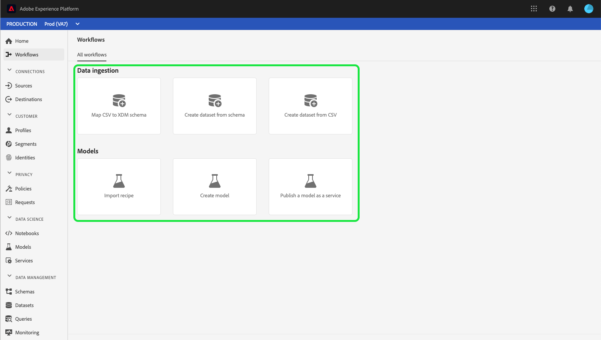

# [!UICONTROL Workflows] Guia da interface do usuário

A seção **[!UICONTROL Workflows]** na interface do usuário do Adobe Experience Platform mostra uma lista de fluxos de trabalho de várias etapas para executar operações no Platform. Esses fluxos de trabalho abrangem áreas incluindo a assimilação de dados e a ciência de dados.

## [!UICONTROL Data ingestion]

O workflow **[!UICONTROL Map CSV to XDM schema]** permite carregar e converter um arquivo CSV em um esquema do Experience Data Model (XDM). Mais informações sobre esse workflow podem ser encontradas no tutorial em [mapear um arquivo CSV para um esquema XDM](../ingestion/tutorials/map-a-csv-file.md).

O workflow **[!UICONTROL Create dataset from schema]** permite criar um novo conjunto de dados a partir de um esquema XDM existente. Mais informações sobre esse workflow podem ser encontradas no [guia do usuário dos conjuntos de dados](../catalog/datasets/user-guide.md#schema).

O workflow **[!UICONTROL Create dataset from CSV]** permite criar um novo conjunto de dados carregando um arquivo CSV. Mais informações sobre esse workflow podem ser encontradas no [guia do usuário dos conjuntos de dados](../catalog/datasets/user-guide.md#csv).

## [!UICONTROL Models]

O workflow **[!UICONTROL Import recipe]** permite importar e configurar fórmulas. Mais informações sobre esse workflow podem ser encontradas no tutorial em [importar uma receita empacotada](../data-science-workspace/models-recipes/import-packaged-recipe-ui.md).

O workflow **[!UICONTROL Create model]** permite criar um modelo de aprendizado de máquina. Mais informações sobre esse workflow podem ser encontradas no [tutorial de treinamento e avaliação do modelo](../data-science-workspace/models-recipes/train-evaluate-model-ui.md).

O workflow **[!UICONTROL Publish a model as a service]** permite publicar um modelo criado como um serviço que pode ser classificado. Mais informações sobre esse workflow podem ser encontradas no tutorial em [publicar um modelo como um serviço](../data-science-workspace/models-recipes/publish-model-service-ui.md).

## Próximas etapas

Ao ler este guia, você foi apresentado ao [!UICONTROL Workflows] disponível na interface do usuário do Experience Platform. Para obter mais informações sobre recursos e funcionalidades da interface do usuário da plataforma, leia o [Guia da interface do usuário do Adobe Experience Platform](ui-guide.md).
