# Integração do Slack para alertas voltados para o cliente

O Adobe Experience Platform permite usar um proxy de webhook no [Adobe App Builder](https://developer.adobe.com/app-builder/docs/get_started/app_builder_get_started/first-app) para receber o [Adobe I/O Events](https://developer.adobe.com/events/docs/guides/) no [!DNL Slack]. O proxy lida com o handshake de verificação do Adobe e transforma cargas de evento em [!DNL Slack] mensagens, para que você possa receber alertas voltados para o cliente no seu espaço de trabalho.

## Pré-requisitos {#prerequisites}

Antes de iniciar, verifique se você tem o seguinte:

* **Acesso ao Adobe Developer Console**: uma função de Administrador do Sistema ou de Desenvolvedor em uma organização com o App Builder habilitado.
* **Node.js e npm**: Node.js (LTS recomendado), que inclui npm para instalar a CLI do Adobe e dependências de projeto. Para obter mais informações, consulte o [Guia de Introdução de Download Node.js](https://nodejs.org/) e [npm](https://docs.npmjs.com/getting-started).
* **Adobe I/O CLI**: instale o Adobe I/O CLI do terminal: `npm install -g @adobe/aio-cli`.
* **Aplicativo Slack com Webhook de Entrada**: um aplicativo Slack em seu espaço de trabalho com um **Webhook de Entrada** habilitado. Consulte [Criar um aplicativo Slack](https://api.slack.com/apps) e o [guia de Webhooks de Entrada do Slack](https://api.slack.com/messaging/webhooks) para criar o aplicativo e obter a URL do webhook (formato: `https://hooks.slack.com/...`).

## Configurar um projeto modelo {#templated-project}

Para configurar um projeto com modelo, faça logon no Adobe Developer Console e selecione **[!UICONTROL Create project from template]** na guia **[!UICONTROL Home]**.

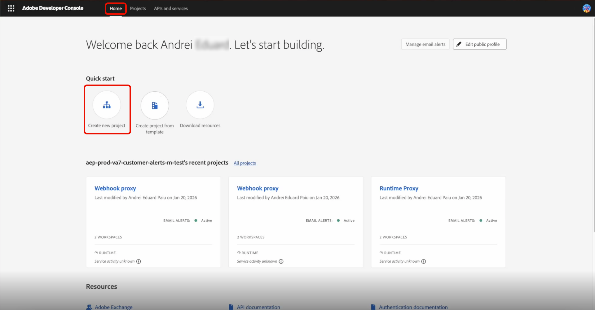

Selecione o modelo **[!UICONTROL App Builder]**, insira um **[!UICONTROL Project Title]** e selecione **[!UICONTROL Add workspace]**. Finalmente, selecione **[!UICONTROL Save]**.

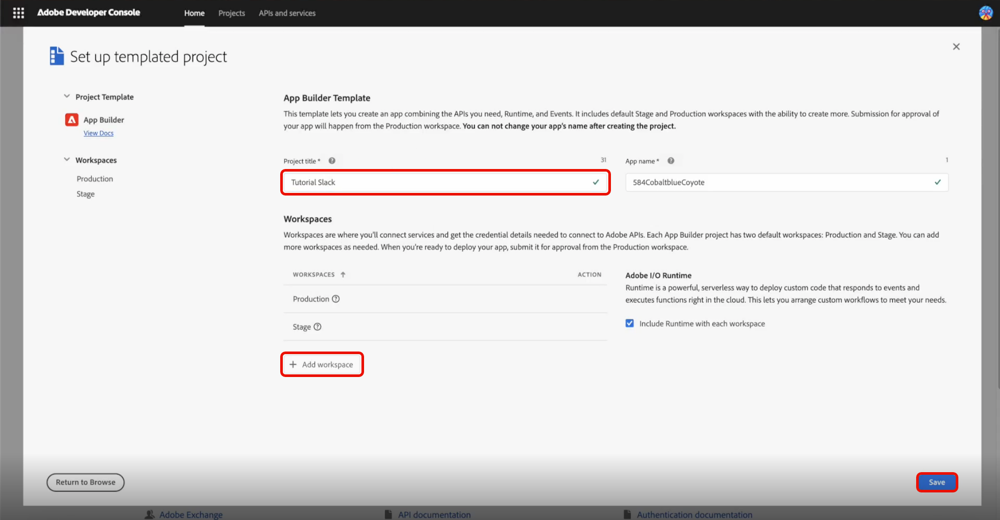

Você receberá uma confirmação de que seu projeto foi criado e será direcionado para a guia **[!UICONTROL Project overview]**. Aqui você pode adicionar um **[!UICONTROL Project description]**.

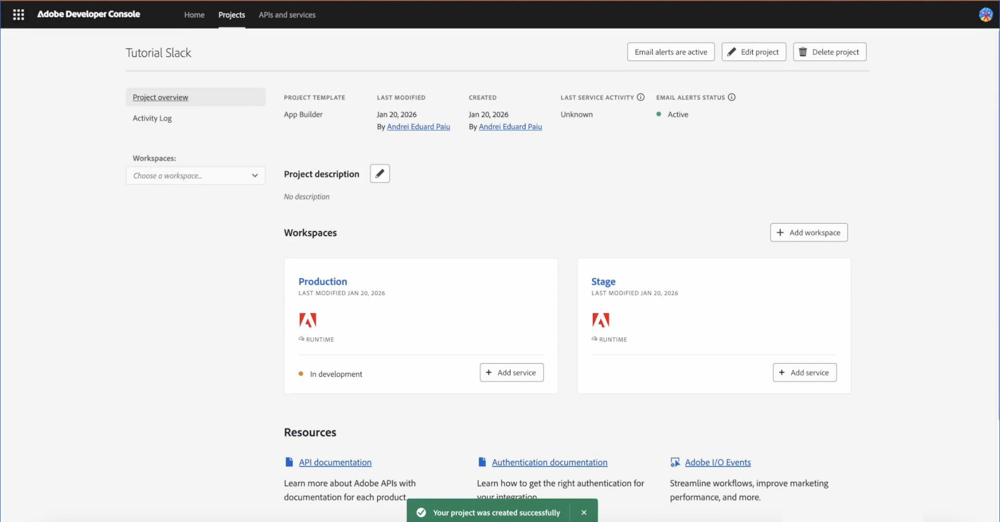

## Inicializar projeto {#initialize-project}

Depois de configurar o projeto modelo, inicialize o projeto.

1. Abra o terminal e digite o seguinte comando para fazer logon no Adobe I/O.

   ```bash
   aio login
   ```

1. Inicialize o aplicativo e forneça um nome.

   ```bash
   aio app init slack-webhook-proxy
   ```

1. Selecione o `Organization` usando as teclas de seta e o `Project` criado anteriormente no Developer Console. Selecione `Only Templates Supported By My Org` para os modelos a serem pesquisados. Em seguida, pressione **Enter** para ignorar modelos e instalar um aplicativo autônomo.

   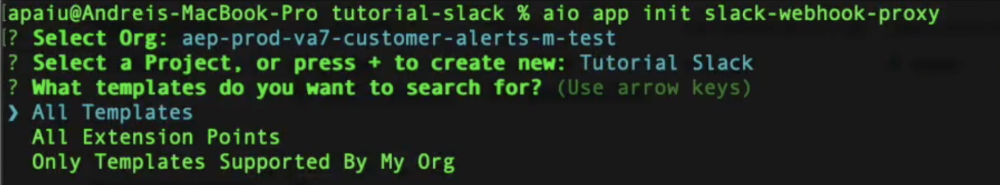

1. Especifique os recursos do aplicativo Adobe I/O que deseja habilitar para este projeto. Use as teclas de seta para rolar e selecionar `Actions: Deploy Runtime actions`.

   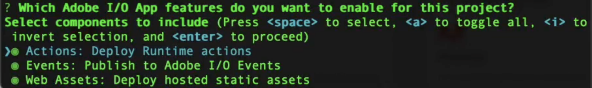

1. Use as teclas de seta para rolar e selecionar `Adobe Experience Platform: Realtime Customer Profile` para o tipo de ações de exemplo que deseja criar.

   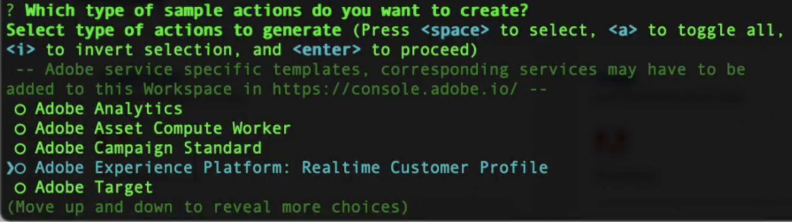

1. Role a tela e selecione `Pure HTML/JS` para a interface do usuário que você deseja adicionar ao seu modelo. Pressione **Enter** para deixar as ações de exemplo como padrão, em seguida, pressione **Enter** novamente para deixar o nome como padrão.

   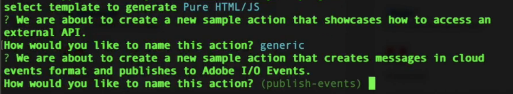

   Você recebe a confirmação de que a inicialização do aplicativo foi concluída.

1. Navegue até o diretório do projeto.

   ```bash
   cd slack-webhook-proxy
   ```

1. Adicionar a ação da Web.

   ```bash
   aio app add action
   ```

1. Selecione `Only Action Templates Supported By My Org`. Uma lista de modelos é exibida.

   

1. Selecione o modelo pressionando a barra de espaço e navegue até `@adobe/generator-add-publish-events` usando as setas **Para cima** e **Para baixo**. Finalmente, selecione o modelo pressionando a **Barra de Espaços** e pressione **Enter**.

   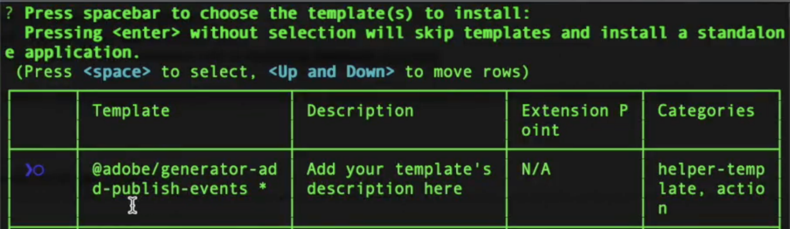

   Uma confirmação de que o `npm package @adobe/generator-add-publish-events` foi instalado é exibida.

1. Nomeie a ação `webhook-proxy`.

   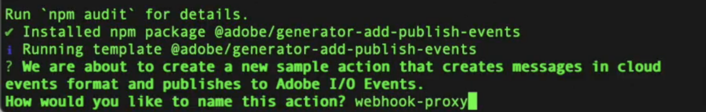

   Uma confirmação de que o modelo foi instalado é exibida.

## Criar as ações de arquivo e implantar {#create-file-actions}

Adicione o código proxy, defina variáveis de ambiente e implante. A ação estará disponível na Developer Console para registro.

### Implementar o proxy de tempo de execução {#runtime-proxy}

>[!NOTE]
>
>A verificação de assinatura e o tratamento de desafio são automáticos ao usar o registro de Ação em tempo de execução.

Navegue até a pasta do projeto e abra o arquivo `actions/webhook-proxy/index.js`. Exclua o conteúdo e substitua pelo seguinte:

```
const fetch = require("node-fetch");
const { Core } = require("@adobe/aio-sdk");
 
/**
 * Adobe I/O Events to Slack Runtime Proxy
 *
 * Receives events from Adobe I/O Events and forwards them to Slack.
 * Signature verification and challenge handling are automatic when
 * using Runtime Action registration (non-web action).
 */
async function main(params) {
  const logger = Core.Logger("runtime-proxy", { level: params.LOG_LEVEL || "info" });
 
  try {
    logger.info(`Event received: ${JSON.stringify(params)}`);
 
    // Forward to Slack
    return forwardToSlack(params, params.SLACK_WEBHOOK_URL, logger);
 
  } catch (error) {
    logger.error(`Error: ${error.message}`);
    return { statusCode: 500, body: { error: "Internal server error" } };
  }
}
 
/**
 * Forwards the event payload to Slack
 */
async function forwardToSlack(payload, webhookUrl, logger) {
  if (!webhookUrl) {
    logger.error("SLACK_WEBHOOK_URL not configured");
    return { statusCode: 500, body: { error: "Server configuration error" } };
  }
 
  // Extract Adobe headers passed to runtime action
  const headers = {
    "x-adobe-event-code": payload["x-adobe-event-code"],
    "x-adobe-event-id": payload["x-adobe-event-id"],
    "x-adobe-provider": payload["x-adobe-provider"]
  };
 
  const slackMessage = buildSlackMessage(payload, headers);
 
  const response = await fetch(webhookUrl, {
    method: "POST",
    headers: { "Content-Type": "application/json" },
    body: JSON.stringify(slackMessage)
  });
 
  if (!response.ok) {
    const errorText = await response.text();
    logger.error(`Slack API error: ${response.status} - ${errorText}`);
    return { statusCode: response.status, body: { error: errorText } };
  }
 
  logger.info("Event forwarded to Slack");
  return { statusCode: 200, body: { success: true } };
}
 
/**
 * Builds a Slack Block Kit message from the event payload
 */
function buildSlackMessage(payload, headers) {
  // Adobe passes event code as x-adobe-event-code header (available in params for runtime actions)
  const eventType = headers["x-adobe-event-code"] ||
                    payload["x-adobe-event-code"] ||
                    payload.event_code ||
                    payload.type ||
                    payload.event_type ||
                    "Adobe Event";
  const eventId = headers["x-adobe-event-id"] || payload["x-adobe-event-id"] || payload.event_id || payload.id || "N/A";
  const eventData = payload.data || payload.event || payload;
 
  return {
    blocks: [
      {
        type: "header",
        text: { type: "plain_text", text: `Event: ${eventType}`, emoji: true }
      },
      {
        type: "section",
        fields: formatDataFields(eventData)
      },
      { type: "divider" },
      {
        type: "context",
        elements: [{
          type: "mrkdwn",
          text: `*Event ID:* ${eventId}  |  *Time:* ${new Date().toISOString()}`
        }]
      }
    ]
  };
}
 
/**
 * Formats event data as Slack mrkdwn fields
 */
function formatDataFields(data, maxFields = 10) {
  if (typeof data !== "object" || data === null) {
    return [{ type: "mrkdwn", text: `*Payload:*\n${String(data)}` }];
  }
 
  const entries = Object.entries(data);
  if (entries.length === 0) {
    return [{ type: "mrkdwn", text: "_No data provided_" }];
  }
 
  return entries.slice(0, maxFields).map(([key, value]) => ({
    type: "mrkdwn",
    text: `*${key}:*\n${typeof value === "object" ? `\`\`\`${JSON.stringify(value)}\`\`\`` : value}`
  }));
}
 
exports.main = main;
```

### Configurar a ação no app.config.yaml {#app-config}

>[!IMPORTANT]
>
>A configuração da ação em `app.config.yaml` é crítica. Você deve usar `web: no` para criar uma ação que não seja da Web que possa ser registrada como uma Ação em Tempo de Execução na Developer Console.

Navegue até a pasta do projeto e abra `app.config.yaml`. Substitua o conteúdo pelo seguinte:

```
application:
  runtimeManifest:
    packages:
      slack-webhook-proxy:
        license: Apache-2.0
        actions:
          webhook-proxy:
            function: actions/webhook-proxy/index.js
            web: no
            runtime: nodejs:22
            inputs:
              LOG_LEVEL: info
              SLACK_WEBHOOK_URL: $SLACK_WEBHOOK_URL
            annotations:
              require-adobe-auth: false
              final: true
```

### Variáveis de ambiente {#environment-variables}

>[!IMPORTANT]
>
>O aplicativo não será executado sem um arquivo .env configurado corretamente.

Para gerenciar credenciais com segurança, use variáveis de ambiente. Modifique o arquivo `.env` na raiz do seu projeto e adicione:

```
SLACK_WEBHOOK_URL=https://hooks.slack.com/services/YOUR/WEBHOOK/URL
```

### Implantar a ação {#deploy-action}

Depois que as variáveis de ambiente forem definidas, implante a ação. Verifique se você está na raiz do seu projeto (`slack-webhook-proxy`) ao executar este comando no terminal:

```bash
aio app deploy
```

Uma confirmação de que a implantação foi bem-sucedida é exibida.

>[!IMPORTANT]
>
>Sua ação é implantada no Adobe I/O Runtime. A ação agora estará disponível no Developer Console para registro.

## Registrar a ação com o Adobe I/O Events {#register-events}

Depois que a ação for implantada, registre-a como destino do Adobe I/O Events.

Na Developer Console, abra o projeto do App Builder e selecione **[!UICONTROL Workspace]**.

Na página de visão geral do Workspace, selecione **[!UICONTROL Add service]** e **[!UICONTROL Event]**.

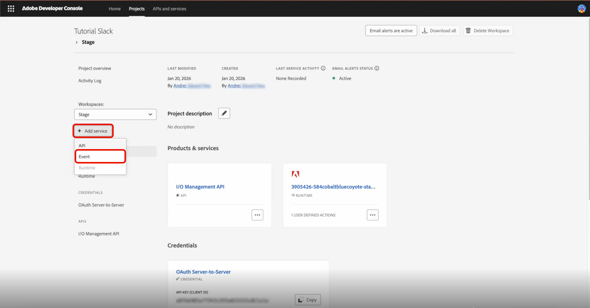

Na página Adicionar eventos, selecione **[!UICONTROL Experience Platform]** e **[!UICONTROL Platform notifications]**, em seguida **[!UICONTROL Next]**.

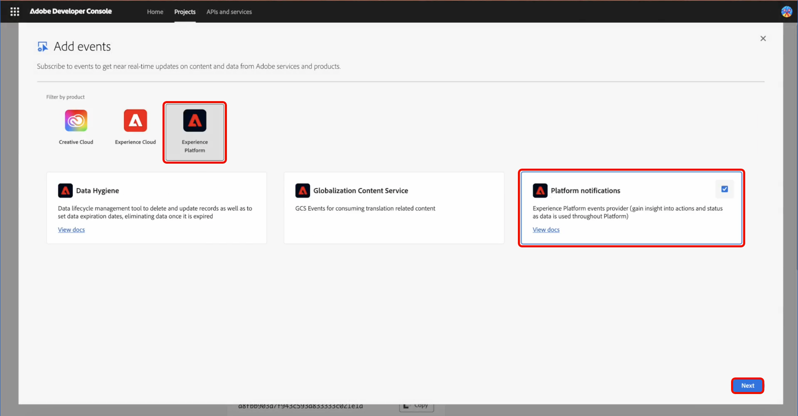

Selecione os eventos para os quais você deseja receber notificações e selecione **[!UICONTROL Next]**.

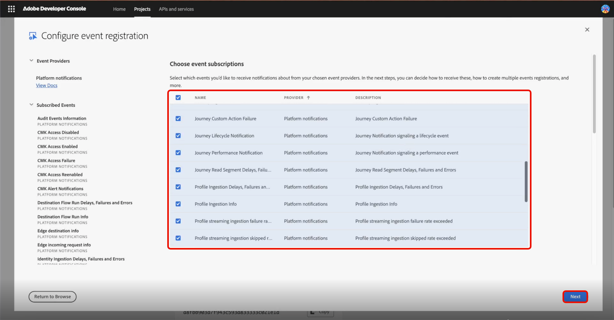

Selecione a credencial de autenticação de servidor para servidor e selecione **[!UICONTROL Next]**.

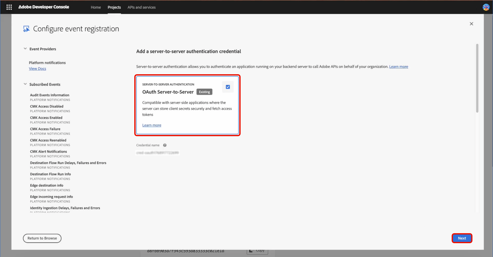

Insira um **[!UICONTROL Event registration name]** e uma **[!UICONTROL Event registration description]** limpa para o registro e selecione **[!UICONTROL Next]**.

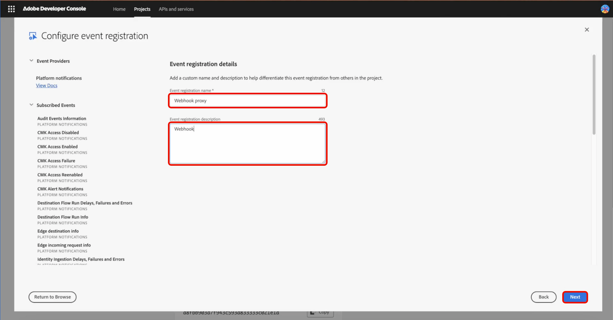

Selecione **[!UICONTROL Runtime Action]** como o método de entrega e a ação `slack-webhook-proxy/runtime-proxy` que você criou e selecione **[!UICONTROL Save configured events]**.

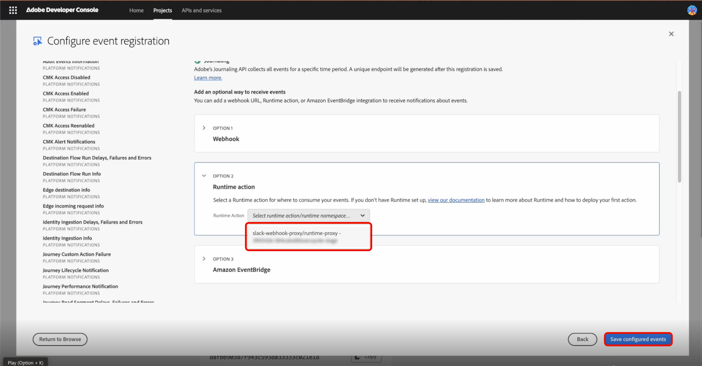

O proxy do webhook está configurado. Você retorna à página de proxy do Webhook. Você pode testar todo o fluxo de ponta a ponta selecionando o ícone **[!UICONTROL Send sample event]** ao lado de qualquer evento configurado.

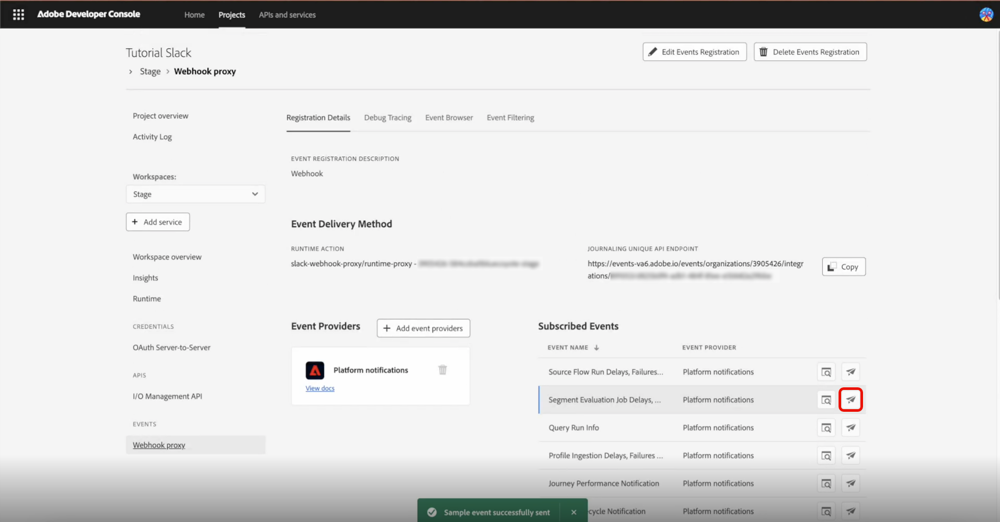
