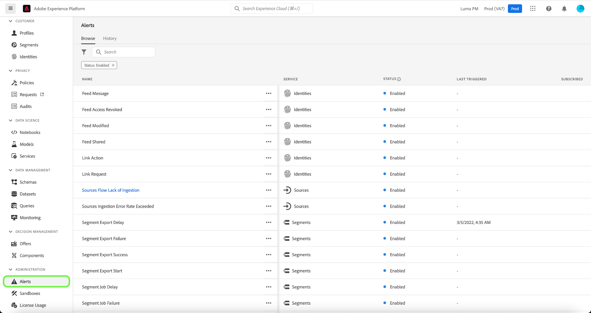

# Guia da interface de usuário de alertas

A interface do usuário do Adobe Experience Platform permite visualizar um histórico de alertas recebidos com base em métricas reveladas pelo Adobe Experience Platform Observability Insights. A interface do usuário também permite exibir, ativar, desativar e assinar as regras de alerta disponíveis.

>[!NOTE]
>
>Para obter uma introdução aos alertas no Experience Platform, consulte o [visão geral dos alertas](./overview.md).

Para começar, selecione **[!UICONTROL Alertas]** no painel de navegação esquerdo.

## Gerenciar regras de alerta

O **[!UICONTROL Procurar]** lista as regras disponíveis que podem acionar um alerta.

Selecione uma regra na lista para exibir sua descrição e seus parâmetros de configuração no painel direito, incluindo limite e gravidade.

Selecione as reticências (**...**) ao lado do nome de uma regra, e uma lista suspensa exibe controles para ativar ou desativar o alerta (dependendo de seu status atual) e para assinar ou cancelar a assinatura de notificações por email para o alerta.

## Ativar alertas de email

As notificações de alerta podem ser enviadas diretamente para o seu email.

Selecione o ícone de sino () localizado na faixa superior à direita para exibir notificações e anúncios. Na lista suspensa exibida, selecione o ícone de engrenagem () para acessar a página de preferências do Experience Cloud.

O **Perfil** será exibida. Selecione o **[!UICONTROL Notificações]** na navegação à esquerda para acessar as preferências de alertas de email.

Role para **Emails** na parte inferior da página e selecione **[!UICONTROL Notificações instantâneas]**

Todos os alertas que você assinou agora serão enviados para o endereço de email conectado à sua conta da Adobe ID.

## Exibir histórico de alertas

O **[!UICONTROL Histórico]** mostra o histórico de alertas recebidos para sua organização, incluindo a regra que acionou o alerta, a data acionada e a data resolvida (se aplicável).

Selecione um alerta listado e mais detalhes serão exibidos no painel direito, incluindo um breve resumo do evento que acionou o alerta.

## Próximas etapas

Este documento forneceu uma visão geral de como visualizar e gerenciar alertas na interface do usuário da plataforma. Consulte a visão geral em [Insights da capacidade de observação](../home.md) para obter mais informações sobre os recursos do serviço.
