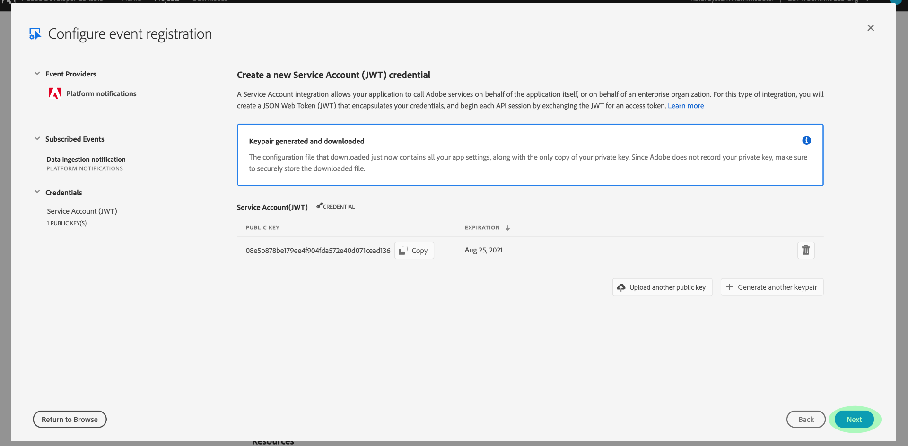

# Assinar notificações do Evento Adobe I/O

[!DNL Observability Insights] permite que você assine notificações de Eventos Adobe I/O relacionadas ao Adobe Experience Platform atividade. Esses eventos são enviados para um webhook configurado para facilitar a automação eficiente do monitoramento de atividades.

Este documento fornece etapas sobre como assinar notificações de evento Adobe I/O para serviços Adobe Experience Platform. Informações de referência sobre tipos de evento disponíveis também são fornecidas, juntamente com links para documentação adicional sobre como interpretar os dados de evento retornados para cada serviço [!DNL Platform] aplicável.

## Introdução

Este documento requer um entendimento prático dos webhooks e como conectar um webhook de um aplicativo a outro. Consulte a [[!DNL I/O Events] documentação](https://www.adobe.io/apis/experienceplatform/events/docs.html#!adobedocs/adobeio-events/master/intro/webhook_docs_intro.md) para obter uma introdução aos webhooks.

## Criar um webhook

Para receber notificações [!DNL I/O Event], você deve registrar um webhook especificando um URL exclusivo do webhook como parte dos detalhes de registro do evento.

Você pode configurar seu webhook usando o cliente de sua escolha. Para que um endereço de webhook temporário seja usado como parte deste tutorial, visite [Webhook.site](https://webhook.site/) e copie o URL exclusivo fornecido.

Durante o processo de validação inicial, [!DNL I/O Events] envia um parâmetro de query `challenge` em uma solicitação de GET para o webhook. Você deve configurar seu webhook para retornar o valor desse parâmetro na carga de resposta. Se você estiver usando Webhook.site, selecione **[!DNL Edit]** no canto superior direito e digite `$request.query.challenge$` em **[!DNL Response body]** antes de selecionar **[!DNL Save]**.

## Criar um novo projeto no Console do desenvolvedor do Adobe

Vá para [Console do desenvolvedor do Adobe](https://www.adobe.com/go/devs_console_ui) e faça logon com seu Adobe ID. Em seguida, siga as etapas descritas no tutorial em [criar um projeto vazio](https://www.adobe.io/apis/experienceplatform/console/docs.html#!AdobeDocs/adobeio-console/master/projects-empty.md) na documentação do Console do desenvolvedor do Adobe.

## Inscrever-se em eventos

Depois de criar um novo projeto, navegue até a tela de visão geral do projeto. Aqui, selecione **[!UICONTROL Adicionar evento]**.

Uma caixa de diálogo é exibida permitindo que você adicione um provedor de eventos ao seu projeto:

* Se você estiver se inscrevendo em [!DNL Experience Platform] notificações, selecione **[!UICONTROL Notificações da plataforma]**
* Se você estiver assinando notificações [!DNL Privacy Service] do Adobe Experience Platform, selecione **[!UICONTROL Eventos Privacy Service]**

Depois de escolher um provedor de eventos, selecione **[!UICONTROL Next]**.

A tela seguinte exibe uma lista de tipos de evento para assinar. Selecione os eventos que deseja assinar e, em seguida, selecione **[!UICONTROL Next]**.

>[!NOTE]
>
>Se você não tiver certeza sobre quais eventos assinar para o serviço que está trabalhando, consulte a documentação de notificação específica do serviço:
>
>* [[!DNL Privacy Service] notificações](../../privacy-service/privacy-events.md)
>* [[!DNL Data Ingestion] notificações](../../ingestion/quality/subscribe-events.md)
>* [[!DNL Flow Service (sources)] notificações](../../sources/notifications.md)

A tela seguinte solicita que você crie um JSON Web Token (JWT). Você tem a opção de gerar automaticamente um par de chaves ou fazer upload de sua própria chave pública gerada no terminal.

Para os fins deste tutorial, a primeira opção é seguida. Selecione a caixa de opção para **[!UICONTROL Gerar um par de teclas]** e selecione o botão **[!UICONTROL Gerar par de teclas]** no canto inferior direito.

Quando o par de chaves é gerado, ele é baixado automaticamente pelo navegador. Você mesmo deve armazenar esse arquivo, pois ele não é persistente no Developer Console.

A próxima tela permite que você analise os detalhes do par de chaves recém-gerado. Selecione **[!UICONTROL Próximo]** para continuar.

Na tela seguinte, forneça um nome e uma descrição para o registro do evento na seção [!UICONTROL Detalhes de registro do Evento]. A prática recomendada é criar um nome exclusivo e facilmente identificável para ajudar a diferenciar esse registro de eventos de outros no mesmo projeto.

Mais adiante na mesma tela, na seção [!UICONTROL Como receber eventos], você pode, opcionalmente, configurar como receber eventos. **[!UICONTROL O]** Webhookpermite que você forneça um endereço de webhook personalizado para receber eventos, enquanto a ação  **[!UICONTROL Runtime]** permite que você faça o mesmo usando o  [Adobe I/O Runtime](https://www.adobe.io/apis/experienceplatform/runtime/docs.html).

Para este tutorial, selecione **[!UICONTROL Webhook]** e forneça o URL do webhook criado anteriormente. Quando terminar, selecione **[!UICONTROL Salvar eventos configurados]** para concluir o registro do evento.

A página de detalhes do registro de eventos recém-criado é exibida, onde você pode editar sua configuração, revisar eventos recebidos, executar o rastreamento de depuração e adicionar novos provedores de eventos.

## Próximas etapas

Ao seguir este tutorial, você registrou um webhook para receber notificações [!DNL I/O Event] para [!DNL Experience Platform] e/ou [!DNL Privacy Service]. Para obter detalhes sobre os eventos disponíveis e como interpretar as cargas de notificação para cada serviço, consulte a seguinte documentação:

* [[!DNL Privacy Service] notificações](../../privacy-service/privacy-events.md)
* [[!DNL Data Ingestion] notificações](../../ingestion/quality/subscribe-events.md)
* [[!DNL Flow Service (sources)] notificações](../../sources/notifications.md)

Consulte a [[!DNL Observability Insights] visão geral](../home.md) para obter mais informações sobre como você pode monitorar suas atividades em [!DNL Experience Platform] e [!DNL Privacy Service].