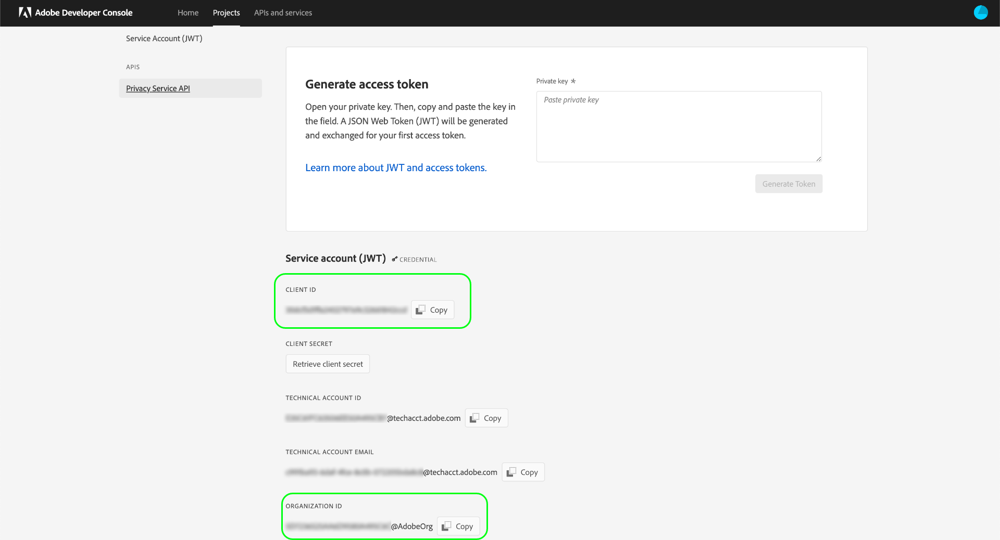

# Introdução à API do Privacy Service

Este guia fornece uma introdução aos conceitos principais que você precisa saber antes de tentar fazer chamadas para a API do Privacy Service.

## Pré-requisitos

Este guia requer um entendimento prático dos seguintes recursos:

* [Adobe Experience Platform Privacy Service](../home.md): Fornece uma RESTful API e interface do usuário que permitem gerenciar solicitações de acesso e exclusão de titulares de dados (clientes) em aplicativos Adobe Experience Cloud.

## Coletar valores para cabeçalhos necessários

Para fazer chamadas para a API do Privacy Service, primeiro você deve coletar suas credenciais de acesso para serem usadas nos cabeçalhos necessários:

* `Authorization: Bearer {ACCESS_TOKEN}`
* `x-api-key: {API_KEY}`
* `x-gw-ims-org-id: {ORG_ID}`

Isso envolve obter permissões de desenvolvedor para Adobe Experience Platform no Adobe Admin Console e gerar as credenciais no Adobe Developer Console.

### Obter acesso de desenvolvedor à Experience Platform

Para obter acesso do desenvolvedor ao [!DNL Platform]siga as etapas iniciais em [Tutorial de autenticação de Experience Platform](https://www.adobe.com/go/platform-api-authentication-en). Depois de chegar à etapa &quot;Gerar credenciais de acesso no Adobe Developer Console&quot;, retorne a este tutorial para gerar as credenciais específicas do Privacy Service.

### Gerar credenciais de acesso

Usando o Adobe Developer Console, você deve gerar as três credenciais de acesso descritas a seguir:

* `{ORG_ID}`
* `{API_KEY}`
* `{ACCESS_TOKEN}`

Seu `{ORG_ID}` e `{API_KEY}` só precisam ser geradas uma vez e podem ser reutilizadas em chamadas de API futuras. No entanto, a variável `{ACCESS_TOKEN}` é temporária e deve ser regenerada a cada 24 horas.

As etapas de geração desses valores são descritas em detalhes abaixo.

#### Configuração única

Acesse o [Adobe Developer Console](https://www.adobe.com/go/devs_console_ui) e faça logon com seu Adobe ID. Em seguida, siga as etapas descritas no tutorial em [criação de um projeto vazio](https://www.adobe.io/apis/experienceplatform/console/docs.html#!AdobeDocs/adobeio-console/master/projects-empty.md) na documentação do Console do desenvolvedor do Adobe.

Depois de criar um novo projeto, selecione **[!UICONTROL Adicionar API]** no **[!UICONTROL Visão geral do projeto]** tela.

A tela **[!UICONTROL Adicionar uma API]** é exibida. Selecionar **[!UICONTROL API Privacy Service]** na lista de APIs disponíveis antes de selecionar **[!UICONTROL Próximo]**.

O **[!UICONTROL Configurar API]** será exibida. Selecione a opção para **[!UICONTROL Gerar um par de chaves]**, em seguida selecione **[!UICONTROL Gerar par de chaves]** no canto inferior direito.

O par de chaves é gerado automaticamente e um arquivo ZIP contendo uma chave privada e um certificado público é baixado no computador local (para ser usado em uma etapa posterior). Selecionar **[!UICONTROL Salvar API configurada]** para concluir a configuração.

Depois que a API for adicionada ao projeto, a página do projeto será exibida novamente no **Visão geral da API do Privacy Service** página. A partir daqui, role para baixo até o **[!UICONTROL Conta de serviço (JWT)]** seção , que fornece as seguintes credenciais de acesso que são necessárias em todas as chamadas para a API do Privacy Service:

* **[!UICONTROL ID DO CLIENTE]**: A ID do cliente é a `{API_KEY}` para isso deve ser fornecido no cabeçalho x-api-key .
* **[!UICONTROL ID DA ORGANIZAÇÃO]**: A ID da organização é a variável `{ORG_ID}` valor que deve ser usado no cabeçalho x-gw-ims-org-id.

#### Autenticação para cada sessão

A credencial final necessária que você deve coletar é a `{ACCESS_TOKEN}`, que é usada no cabeçalho da Autorização. Diferente dos valores de `{API_KEY}` e `{ORG_ID}`, um novo token deve ser gerado a cada 24 horas para continuar usando [!DNL Platform] APIs.

Para gerar um novo `{ACCESS_TOKEN}`, abra a chave privada baixada anteriormente e cole seu conteúdo na caixa de texto ao lado de **[!UICONTROL Gerar token de acesso]** antes de selecionar **[!UICONTROL Gerar token]**.

É gerado um novo token de acesso, e é fornecido um botão para copiá-lo para a área de transferência. Esse valor é usado para o cabeçalho de Autorização necessário e deve ser fornecido no formato `Bearer {ACCESS_TOKEN}`.

## Lendo exemplos de chamadas de API

Este tutorial fornece exemplos de chamadas de API para demonstrar como formatar suas solicitações do . Isso inclui caminhos, cabeçalhos necessários e cargas de solicitação formatadas corretamente. O JSON de exemplo retornado nas respostas da API também é fornecido. Para obter informações sobre as convenções usadas na documentação para chamadas de API de exemplo, consulte a seção sobre [como ler exemplos de chamadas de API](../../landing/api-guide.md#sample-api) no guia de introdução para APIs da plataforma.

## Próximas etapas

Agora que você sabe quais cabeçalhos usar, está pronto para começar a fazer chamadas para a API do Privacy Service. Selecione um dos guias de ponto de extremidade para começar:

* [Trabalhos de privacidade](./privacy-jobs.md)
* [Consentimento](./consent.md)
