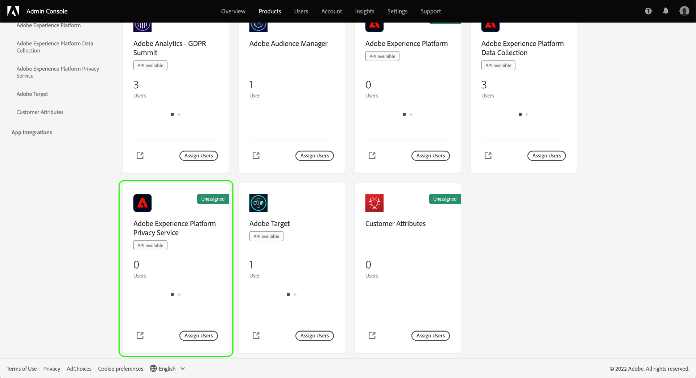
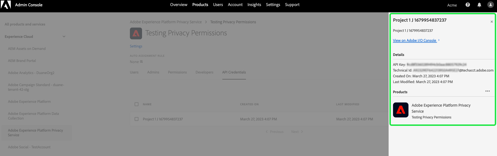

# Gerenciamento de permissões do Privacy Service

O acesso ao [Adobe Experience Platform Privacy Service](./home.md) é controlado por meio de permissões granulares baseadas em funções no Adobe Admin Console. Ao criar perfis de produto que atribuem permissões a grupos de usuários, é possível determinar quem tem acesso a quais recursos na [interface](./ui/overview.md) e na [API](./api/overview.md) do Privacy Service.

>[!NOTE]
>
>Ao criar uma integração para a API do Privacy Service, é necessário selecionar um perfil de produto já existente para determinar para quais recursos ou ações essa integração tem permissões. Consulte o manual sobre a [introdução à API do Privacy Service](./api/getting-started.md) para obter mais informações.

Este manual mostra como gerenciar permissões para o Privacy Service.

## Introdução

Para configurar o controle de acesso para o Privacy Service, é necessário ter privilégios de administrador de uma organização que tenha uma integração de produto com o Adobe Experience Platform Privacy Service. A função mínima que pode conceder ou suspender permissões é a de **administrador de perfil de produto**. Outras funções de administrador que podem gerenciar permissões são **administradores de produtos** (pode gerenciar todos os perfis em um produto) e **administradores de sistema** (sem restrições). Consulte o artigo sobre [funções administrativas](https://helpx.adobe.com/br/enterprise/using/admin-roles.html), no manual de administração do Adobe Enterprise, para obter mais informações.

Este manual supõe que você já esteja familiarizado com conceitos básicos do Admin Console, como perfis de produtos, e como eles concedem permissões de produto a usuários individuais e grupos. Para obter mais informações, consulte o [Manual do usuário do Admin Console](https://helpx.adobe.com/br/enterprise/using/admin-console.html).

## Permissões disponíveis

A tabela a seguir descreve as permissões disponíveis para o Privacy Service, com descrições dos recursos específicos aos quais elas concedem acesso:

>[!NOTE]
>
>Todas as permissões do Privacy Service e de [!UICONTROL Recusa de venda] são distintas e separadas umas das outras, sem nenhuma sobreposição de funções. Isso é possível, pois a API do Privacy Service é considerada idempotente.

| Categoria | Permissão | Descrição |
| --- | --- | --- |
| [!UICONTROL Permissões do Privacy Service] | [!UICONTROL Permissão de leitura de privacidade] | Determina se o usuário pode visualizar as solicitações de acesso e de exclusão já existentes, juntamente com seus detalhes. |
| [!UICONTROL Permissões do Privacy Service] | [!UICONTROL Permissão de gravação de privacidade] | Determina se um usuário pode criar novas solicitações de acesso e de exclusão. |
| [!UICONTROL Permissões do Privacy Service] | [!UICONTROL Permissão de entrega de conteúdo de leitura (acesso)] | Quando uma solicitação de acesso é processada pelo Privacy Service, um arquivo ZIP, contendo os dados do cliente, é enviado a esse cliente. Quando pesquisar os detalhes de uma solicitação de acesso, essa permissão determina se você pode acessar o link de download para o arquivo ZIP da solicitação. |
| [!UICONTROL Permissões de Recusa de venda] | [!UICONTROL Permissão de leitura - Recusa de venda] | Determina se o usuário pode visualizar solicitações de opt-out-of-sale existentes, juntamente com seus detalhes. |
| [!UICONTROL Permissões de recusa de venda] | [!UICONTROL Permissão de gravação - Recusa de venda] | Determina se um usuário pode criar novas solicitações de opt-out-of-sale. |

{style="table-layout:auto"}

## Gerenciar permissões {#manage}

Para gerenciar permissões do Privacy Service, faça logon no [Admin Console](https://adminconsole.adobe.com/) e selecione **[!UICONTROL Produtos]** no painel de navegação superior. Então selecione **[!UICONTROL Adobe Experience Platform Privacy Service]**.

### Selecionar ou criar um perfil de produto

A próxima tela mostra uma lista de perfis de produto disponíveis do Privacy Service na sua organização. Se não houver nenhum perfil de produto, clique em **[!UICONTROL Novo perfil]** para criar um. Se possuir várias funções ou grupos de usuários em sua organização que precisam de diferentes níveis de acesso, crie um perfil de produto separado para cada um deles.

Após selecionar um perfil de produto, é possível usar a guia **[!UICONTROL Permissões]** para começar a [editar as permissões](#edit-permissions) para o perfil ou selecionar a guia **[!UICONTROL Usuários]** para [atribuir usuários](#assign-users) ao perfil.

### Editar permissões para o perfil {#edit-permissions}

Na guia **[!UICONTROL Permissões]**, selecione qualquer uma das categorias de permissão exibidas para acessar a visualização de edição de permissão.

Ao editar as permissões de um perfil, as permissões disponíveis são listadas na coluna à esquerda e as permissões incluídas no perfil são listadas na coluna à direita. Selecione as permissões listadas para movê-las entre as duas colunas.

As permissões são organizadas em categorias. Para alternar entre categorias, selecione a categoria desejada na painel de navegação à esquerda.

![A variável [!UICONTROL Recusar a venda] seção em permissões.](./images/permissions/switch-category.png)

Clique em **[!UICONTROL Salvar]** quando terminar de configurar as permissões.

A visualização do perfil de produto será exibida novamente com as permissões adicionadas.

### Atribuir usuários ao perfil {#assign-users}

Para atribuir usuários ao perfil de produto (e conceder a eles as permissões configuradas nele), selecione a guia **[!UICONTROL Usuários]** e, em seguida, **[!UICONTROL Adicionar usuário]**.

Para obter mais informações sobre como gerenciar usuários em um perfil de produto, consulte a [Documentação do Admin Console](https://helpx.adobe.com/br/enterprise/using/manage-product-profiles.html).

### Migrar credenciais de API herdadas para o perfil {#migrate-tech-accounts}

>[!NOTE]
>
>Esta seção se aplica somente às credenciais de API já existentes que foram criadas antes que as permissões do Privacy Service fossem integradas ao Adobe Admin Console. Para novas credenciais, os perfis de produto (e suas permissões) são atribuídos por meio dos [projetos do Adobe Developer Console](https://developer.adobe.com/developer-console/docs/guides/projects/).  Consulte a seção sobre [atribuição de perfis de produto a um projeto](./api/getting-started.md#product-profiles) no guia de introdução à API do Privacy Service para obter mais informações.

Anteriormente, as contas técnicas não exigiam um perfil de produto para integração e permissões. No entanto, devido a melhorias recentes nas permissões do Privacy Service, agora é necessário migrar as credenciais de API herdadas para o perfil de produto. Essa atualização permite que permissões granulares sejam concedidas a titulares de contas técnicas. Siga as etapas fornecidas abaixo para atualizar as permissões das contas técnicas do Privacy Service.

#### Atualizar as permissões das contas técnicas {#update-tech-account-permissions}

A primeira etapa na atribuição de um conjunto de permissões para sua conta técnica é navegar até o [Adobe Admin Console](https://adminconsole.adobe.com/) e criar um novo perfil de produto para o Privacy Service.

Na interface do Admin Console, selecione **Produtos** na barra de navegação, seguido por **[!UICONTROL Experience Cloud]** e **[!UICONTROL Adobe Experience Platform Privacy Service]** na barra lateral esquerda. A guia [!UICONTROL Perfis de produto] será exibida. Selecione **Novo perfil** para criar um novo perfil de produto para o Privacy Service.

A caixa de diálogo [!UICONTROL Criar um novo perfil de produto] será exibida. Instruções completas sobre como criar um perfil de produto podem ser encontradas no [Guia da interface para criar perfis](../access-control/ui/create-profile.md).

Depois de salvar o novo perfil de produto, navegue até o [Adobe Developer Console](https://developer.adobe.com/console/home) e faça logon nesse produto ou projeto. Selecione **[!UICONTROL Projetos]** no painel de navegação superior, seguido pelo cartão do projeto.

>[!NOTE]
>
>Talvez seja necessário limpar o cache e/ou aguardar algum tempo para que o novo projeto apareça na lista de projetos do Developer Console.

Depois de fazer logon no projeto, selecione a integração da **[!UICONTROL API do Privacy Service]** na barra lateral esquerda.

O painel de integração da API do Privacy Service será exibido. Nesse painel, é possível editar o perfil de produto associado a esse projeto. Selecione **[!UICONTROL Editar perfis de produto]** para iniciar o processo. A caixa de diálogo [!UICONTROL Configurar API] será exibida.

A caixa de diálogo [!UICONTROL Configurar API] mostra os perfis de produto disponíveis que existem atualmente no serviço. Eles se correlacionam aos perfis de produto criados no Admin Console. Na lista de perfis de produto disponíveis, marque a caixa de seleção do novo perfil de produto criado para a conta técnica no Admin Console. Isso associa automaticamente essa conta técnica às permissões no perfil de produto selecionado. Clique em **[!UICONTROL Salvar API configurada]** para confirmar as configurações.

>[!NOTE]
>
>Se uma conta técnica já estiver associada a um perfil de produto, uma das caixas de seleção da lista de perfis de produto disponíveis já estará marcada.

#### Confirme se suas configurações foram aplicadas {#confirm-applied-settings}

Para confirmar se as configurações foram aplicadas à conta. Retorne para o [Admin Console](https://adminconsole.adobe.com/) e navegue até o perfil de produto recém-criado. Selecione a guia **[!UICONTROL Credenciais de API]** para ver uma lista de projetos associados. O projeto usado no Developer Console, onde você atribuiu o perfil de produto à conta técnica, é exibido na lista de credenciais. O nome de cada credencial de API é composto pelo nome do projeto com um número gerado aleatoriamente como sufixo no final. Selecione uma credencial para abrir o painel [!UICONTROL Detalhes].

O painel [!UICONTROL Detalhes] contém informações sobre a credencial de API, incluindo a ID técnica associada, a chave da API, a data de criação e de última modificação, bem como os produtos da Adobe associados.

## Próximas etapas

Este manual abordou as permissões disponíveis no Privacy Service e como gerenciá-las no Admin Console.

Para conferir as etapas sobre como criar uma nova integração de API após configurar perfis de produto, consulte o [guia de introdução à API do Privacy Service](./api/getting-started.md). Para obter mais informações sobre como gerenciar as permissões para outros recursos da Adobe Experience Platform, consulte a [documentação de controle de acesso](../access-control/home.md).
