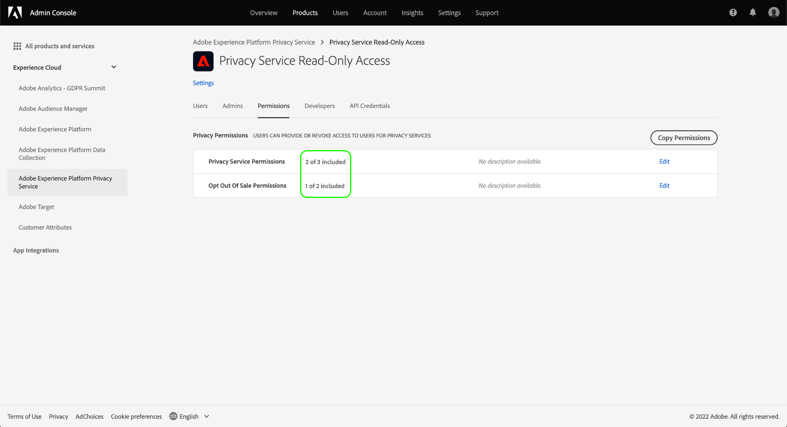

# Gerenciar permissões do Privacy Service

>[!IMPORTANT]
>
>As permissões do Adobe Experience Platform Privacy Service foram aprimoradas para aumentar o nível de granularidade. Essas alterações permitem que os administradores da organização concedam mais usuários acesso com a função e o nível de permissão desejados. Os usuários da conta técnica devem atualizar suas permissões de Privacy Service, pois essa atualização iminente constitui uma alteração de quebra para eles. A imposição dessa alteração de permissões ocorrerá em **13 de abril de 2023**. Consulte a documentação em [migração de credenciais da API herdada](#migrate-tech-accounts) para obter orientação sobre como resolver esse problema.
>
>As contas técnicas estão disponíveis para clientes empresariais e são criadas por meio do Console de desenvolvedores do Adobe. A Adobe ID de um titular de conta técnica termina em `@techacct.adobe.com`. Se não tiver certeza se é um titular de conta técnica, entre em contato com o administrador da organização.

Acesso ao [Adobe Experience Platform Privacy Service](./home.md) O é controlado por meio de permissões granulares baseadas em funções no Adobe Admin Console. Ao criar perfis de produto que atribuem permissões a grupos de usuários, é possível determinar quem tem acesso a quais recursos no Privacy Service [interface](./ui/overview.md) e [API](./api/overview.md).

>[!NOTE]
>
>Ao criar uma integração para a API do Privacy Service, você deve selecionar um perfil de produto existente para determinar quais recursos ou ações essa integração tem permissões. Consulte o guia sobre [introdução à API do Privacy Service](./api/getting-started.md) para obter mais informações.

Este guia mostra como gerenciar permissões para o Privacy Service.

## Introdução

Para configurar o controle de acesso para o Privacy Service, você deve ter privilégios de administrador para uma organização que tenha uma integração de produto com o Adobe Experience Platform Privacy Service. A função mínima que pode conceder ou retirar permissões é uma **administrador de perfil de produto**. Outras funções de administrador que podem gerenciar permissões são **administradores de produtos** (pode gerenciar todos os perfis em um produto) e **administradores de sistema** (sem restrições). Veja o artigo sobre [funções administrativas](https://helpx.adobe.com/enterprise/using/admin-roles.html) no guia de administração do Adobe Enterprise para obter mais informações.

Este guia pressupõe que você esteja familiarizado com os conceitos básicos do Admin Console, como perfis de produtos e como eles concedem permissões de produto a usuários e grupos individuais. Para obter mais informações, consulte o [Guia do usuário do Admin Console](https://helpx.adobe.com/br/enterprise/using/admin-console.html).

## Permissões disponíveis

A tabela a seguir descreve as permissões disponíveis para o Privacy Service com descrições dos recursos específicos aos quais ele concede acesso:

>[!NOTE]
>
>Todos os Privacy Service e [!UICONTROL Recusar venda] as permissões do são distintas e separadas umas das outras, sem sobreposição funcional. Isso é possível, pois a API do Privacy Service é considerada idempotente.

| Categoria | Permissão | Descrição |
| --- | --- | --- |
| [!UICONTROL Permissões de Privacy Service] | [!UICONTROL Permissão de leitura de privacidade] | Determina se o usuário pode exibir solicitações de acesso e exclusão existentes, juntamente com seus detalhes. |
| [!UICONTROL Permissões de Privacy Service] | [!UICONTROL Permissão de gravação de privacidade] | Determina se um usuário pode criar novas solicitações de acesso e exclusão. |
| [!UICONTROL Permissões de Privacy Service] | [!UICONTROL Permissão para entrega de conteúdo de leitura (acesso)] | Quando uma solicitação de acesso é processada pelo Privacy Service, um arquivo ZIP contendo os dados do cliente é enviado para esse cliente. Ao pesquisar os detalhes de uma solicitação de acesso, essa permissão determina se o usuário pode acessar o link de download do arquivo ZIP da solicitação. |
| [!UICONTROL Permissões de cancelamento da venda] | [!UICONTROL Permissão de leitura - Recusar venda] | Determina se o usuário pode visualizar solicitações de não participação na venda, juntamente com seus detalhes. |
| [!UICONTROL Permissões de cancelamento da venda] | [!UICONTROL Permissão de gravação - Recusar a venda] | Determina se um usuário pode criar novas solicitações de recusa de venda. |

{style="table-layout:auto"}

## Gerenciar permissões {#manage}

Para gerenciar permissões do Privacy Service, faça logon no [Admin Console](https://adminconsole.adobe.com/) e selecione **[!UICONTROL Produtos]** no início da navegação. Aqui, selecione **[!UICONTROL Adobe Experience Platform Privacy Service]**.

### Selecionar ou criar um perfil de produto

A próxima tela mostra uma lista de perfis de produto disponíveis para o Privacy Service em sua organização. Se não houver perfis de produto, selecione **[!UICONTROL Novo perfil]** para criar um. Se você tiver várias funções ou grupos de usuários em sua organização que exigem diferentes níveis de acesso, deverá criar um perfil de produto separado para cada um deles.

Após selecionar um perfil de produto, você pode usar a variável **[!UICONTROL Permissões]** guia para iniciar [edição de permissões](#edit-permissions) para o perfil, ou selecione o **[!UICONTROL Usuários]** guia para iniciar [atribuição de usuários](#assign-users) ao perfil.

### Editar permissões para o perfil {#edit-permissions}

No **[!UICONTROL Permissões]** selecione qualquer uma das categorias de permissão exibidas para acessar a exibição de edição de permissões.

Ao editar permissões para um perfil, as permissões disponíveis são listadas na coluna da esquerda, enquanto as permissões incluídas no perfil são listadas na coluna da direita. Selecione as permissões listadas para movê-las entre qualquer uma das colunas.

As permissões são organizadas em categorias. Para alternar entre categorias, selecione a categoria desejada no painel de navegação esquerdo.

![Imagem que mostra o [!UICONTROL Recusar venda] seção em permissões](./images/permissions/switch-category.png)

Selecionar **[!UICONTROL Salvar]** após concluir a configuração das permissões.

A exibição do perfil do produto é exibida novamente com as permissões adicionadas refletidas.

### Atribuir usuários ao perfil {#assign-users}

Para atribuir usuários ao perfil do produto (e conceder a eles as permissões configuradas do perfil), selecione o **[!UICONTROL Usuários]** , seguido por **[!UICONTROL Adicionar usuário]**.

Para obter mais informações sobre como gerenciar usuários para um perfil de produto, consulte [Documentação do Admin Console](https://helpx.adobe.com/br/enterprise/using/manage-product-profiles.html).

### Migrar credenciais da API herdada para o perfil {#migrate-tech-accounts}

>[!NOTE]
>
>Esta seção se aplica somente às credenciais de API existentes que foram criadas antes de as permissões do Privacy Service serem integradas ao Adobe Admin Console. Para novas credenciais, os perfis de produto (e suas permissões) são atribuídos por meio de [Projetos do Adobe Developer Console](https://developer.adobe.com/developer-console/docs/guides/projects/) em vez disso.  Consulte a seção sobre [atribuição de perfis de produto a um projeto](./api/getting-started.md#product-profiles) no guia de introdução à API do Privacy Service para obter mais informações.

Anteriormente, as contas técnicas não exigiam um perfil de produto para integração e permissões. No entanto, devido a aprimoramentos recentes nas permissões do Privacy Service, agora é necessário migrar as credenciais da API herdada para o perfil do produto. Essa atualização permite que permissões granulares sejam concedidas aos titulares de contas técnicas. Siga as etapas fornecidas abaixo para atualizar as permissões de conta técnica do Privacy Service.

#### Atualizar permissões da conta técnica {#update-tech-account-permissions}

A primeira etapa na atribuição de um conjunto de permissões para sua conta técnica é navegar até a variável [Adobe Admin Console](https://adminconsole.adobe.com/) e criar um novo perfil de produto para o Privacy Service.

Na interface do usuário do Admin Console, selecione **Produtos** na barra de navegação, seguida por **[!UICONTROL Experience Cloud]** e **[!UICONTROL Adobe Experience Platform Privacy Service]** na barra lateral esquerda. O [!UICONTROL Perfis de produto] será exibida. Selecionar **Novo perfil** para criar um novo perfil de produto para o Privacy Service.

O [!UICONTROL Criar um novo perfil de produto] será exibida. Instruções completas sobre como criar um perfil de produto podem ser encontradas no [Guia de interface do usuário para criar perfis](../access-control/ui/create-profile.md).

Depois de salvar seu novo perfil de produto, navegue até o [Console do Adobe Developer](https://developer.adobe.com/console/home) e faça logon nesse produto ou projeto. Selecionar **[!UICONTROL Projetos]** no início da navegação, seguido pelo cartão do seu projeto.

>[!NOTE]
>
>Talvez seja necessário limpar o cache e/ou aguardar algum tempo até que o novo projeto apareça em sua lista de projetos do Console do desenvolvedor.

Depois de fazer logon no projeto, selecione a variável **[!UICONTROL API Privacy Service]** integração da barra lateral esquerda.

O painel de integração da API do Privacy Service é exibido. Neste painel, você pode editar o perfil de produto associado a esse projeto. Selecionar **[!UICONTROL Editar perfis de produto]** para iniciar o processo. O [!UICONTROL Configurar API] será exibida.

O [!UICONTROL Configurar API] mostra os perfis de produto disponíveis no momento no serviço. Elas se correlacionam aos perfis de produto criados no Admin Console. Na lista de perfis de produto disponíveis, marque a caixa de seleção do novo perfil de produto que você criou para a conta técnica no Admin Console. Isso associa automaticamente essa conta técnica às permissões no perfil de produto selecionado. Selecionar **[!UICONTROL Salvar API configurada]** para confirmar as configurações.

>[!NOTE]
>
>Se uma conta técnica já estiver associada a um perfil de produto, uma das caixas de seleção da lista de perfis de produto disponíveis já estará selecionada.

#### Confirmar se as configurações foram aplicadas {#confirm-applied-settings}

Para confirmar que suas configurações foram aplicadas à conta. Retorne ao [Admin Console](https://adminconsole.adobe.com/) e navegue até o perfil de produto recém-criado. Selecione o **[!UICONTROL Credenciais da API]** para ver uma lista de projetos associados. O projeto usado no Console do desenvolvedor, onde você atribuiu o perfil de produto à conta técnica, é exibido na lista de credenciais. O nome de cada credencial de API é composto pelo nome do projeto com um número gerado aleatoriamente com sufixo até o fim. Selecione uma credencial para abrir o [!UICONTROL Detalhes] painel.

O [!UICONTROL Detalhes] O painel contém informações sobre a credencial da API, incluindo a ID técnica associada, a chave da API, a data de criação e da última modificação, bem como os Produtos de Adobe associados.

## Próximas etapas

Este guia cobriu as permissões disponíveis para o Privacy Service e como gerenciá-las por meio do Admin Console.

Para obter etapas sobre como criar uma nova integração de API após configurar perfis de produto, consulte [guia de introdução à API do Privacy Service](./api/getting-started.md). Para obter mais informações sobre gerenciamento de permissões para outros recursos do Adobe Experience Platform, consulte [documentação de controle de acesso](../access-control/home.md).
