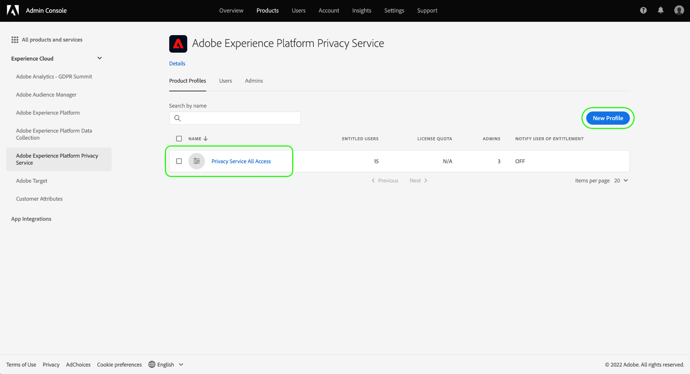

# Gerenciar permissões do Privacy Service

Acesso a [Adobe Experience Platform Privacy Service](./home.md) O é controlado por meio de permissões granulares baseadas em funções no Adobe Admin Console. Ao criar perfis de produto que atribuem permissões a grupos de usuários, é possível determinar quem tem acesso a quais recursos no Privacy Service [IU](./ui/overview.md) e [API](./api/overview.md).

>[!NOTE]
>
>Ao criar uma integração para a API Privacy Service, é necessário selecionar um perfil de produto existente para determinar para quais recursos ou ações essa integração tem permissões. Consulte o guia sobre [introdução à API Privacy Service](./api/getting-started.md) para obter mais informações.

Este guia mostra como gerenciar permissões para o Privacy Service.

## Introdução

Para configurar o controle de acesso para o Privacy Service, é necessário ter privilégios de administrador para uma organização que tenha uma integração de produto com o Adobe Experience Platform Privacy Service. A função mínima que pode conceder ou retirar permissões é uma **administrador do perfil do produto**. Outras funções de administrador que podem gerenciar permissões são **administradores de produtos** (O pode gerenciar todos os perfis em um produto) e **administradores de sistema** (sem restrições). Consulte o artigo sobre [funções administrativas](https://helpx.adobe.com/enterprise/using/admin-roles.html) no guia de administração do Adobe Enterprise para obter mais informações.

Este guia supõe que você esteja familiarizado com conceitos básicos de Admin Console, como perfis de produtos, e como eles concedem permissões de produto a usuários e grupos individuais. Para obter mais informações, consulte [guia do usuário do Admin Console](https://helpx.adobe.com/br/enterprise/using/admin-console.html).

## Permissões disponíveis

A tabela a seguir descreve as permissões disponíveis para o Privacy Service com descrições dos recursos específicos aos quais eles concedem acesso:

| Categoria | Permissão | Descrição |
| --- | --- | --- |
| [!UICONTROL Permissões Privacy Service] | [!UICONTROL Permissão de leitura de privacidade] | Determina se o usuário pode visualizar solicitações de acesso e exclusão existentes, juntamente com seus detalhes. |
| [!UICONTROL Permissões Privacy Service] | [!UICONTROL Permissão de gravação de privacidade] | Determina se um usuário pode criar novas solicitações de acesso e exclusão. |
| [!UICONTROL Permissões Privacy Service] | [!UICONTROL Permissão de entrega de conteúdo de leitura (acesso)] | Quando uma solicitação de acesso é processada pelo Privacy Service, um arquivo ZIP contendo os dados do cliente é enviado a esse cliente. Quando você pesquisa os detalhes de uma solicitação de acesso, essa permissão determina se o usuário pode acessar o link de download para o arquivo ZIP da solicitação. |
| [!UICONTROL Permissões de cancelamento de venda] | [!UICONTROL Permissão de leitura - Recusar a venda] | Determina se o usuário pode visualizar solicitações de cancelamento de venda existentes, juntamente com seus detalhes. |
| [!UICONTROL Permissões de cancelamento de venda] | [!UICONTROL Permissão de gravação - Recusar a venda] | Determina se um usuário pode criar novas solicitações de não participação na venda. |

{style="table-layout:auto"}

## Gerenciar permissões {#manage}

Para gerenciar permissões de Privacy Service, faça logon no [Admin Console](https://adminconsole.adobe.com/) e selecione **[!UICONTROL Produtos]** no início da navegação. Aqui, selecione **[!UICONTROL Adobe Experience Platform Privacy Service]**.

### Selecionar ou criar um perfil de produto

A próxima tela mostra uma lista de perfis de produto disponíveis para o Privacy Service na sua organização. Se nenhum perfil de produto existir, selecione **[!UICONTROL Novo perfil]** para criar um. Se você tiver várias funções ou grupos de usuários em sua organização que exigem diferentes níveis de acesso, crie um perfil de produto separado para cada um deles.

Após selecionar um perfil de produto, você pode usar o **[!UICONTROL Permissões]** guia para iniciar [editar permissões](#edit-permissions) para o perfil, ou selecione o **[!UICONTROL Usuários]** guia para iniciar [atribuição de usuários](#assign-users) ao perfil.

### Editar permissões para o perfil {#edit-permissions}

No **[!UICONTROL Permissões]** selecione qualquer uma das categorias de permissão exibidas para acessar a visualização de edição de permissão.

Ao editar permissões para um perfil, as permissões disponíveis são listadas na coluna à esquerda, enquanto as incluídas no perfil são listadas na coluna à direita. Selecione as permissões listadas para movê-las entre as duas colunas.

As permissões são organizadas em categorias. Para alternar entre categorias, selecione a categoria desejada na navegação à esquerda.

![Imagem mostrando o [!UICONTROL Recusar a venda] seção em permissões](./images/permissions/switch-category.png)

Selecionar **[!UICONTROL Salvar]** quando terminar de configurar as permissões.

A visualização do perfil de produto será exibida novamente com as permissões adicionadas refletidas.

### Atribuir usuários ao perfil {#assign-users}

Para atribuir usuários ao perfil de produto (e conceder a eles as permissões configuradas do perfil), selecione o **[!UICONTROL Usuários]** , seguido por **[!UICONTROL Adicionar usuário]**.

Para obter mais informações sobre como gerenciar usuários para um perfil de produto, consulte [Documentação do Admin Console](https://helpx.adobe.com/br/enterprise/using/manage-product-profiles.html).

### Migrar credenciais de API herdadas para o perfil {#migrate-tech-accounts}

>[!NOTE]
>
>Essa seção se aplica somente às credenciais de API existentes que foram criadas antes que as permissões de Privacy Service fossem integradas ao Adobe Admin Console. Para novas credenciais, os perfis de produto (e suas permissões) são atribuídos por meio do [Projetos do console do Adobe Developer](https://developer.adobe.com/developer-console/docs/guides/projects/) em vez disso.  Consulte a seção sobre [atribuição de perfis de produto a um projeto](./api/getting-started.md#product-profiles) no guia de introdução à API de Privacy Service para obter mais informações.

Para migrar credenciais de API herdadas para o perfil do produto, selecione **[!UICONTROL Credenciais da API]**, seguido por **[!UICONTROL Adicionar credenciais de API]**.

![[!UICONTROL Adicionar credenciais de API] sendo selecionado no Admin Console, sob o [!UICONTROL Credenciais da API] para um perfil de produto](./images/permissions/api-credentials.png)

Escolha os projetos desejados do Developer Console na lista e selecione **[!UICONTROL Salvar]** para adicioná-los ao perfil do produto. Todas as chamadas de API que usam as credenciais desses projetos herdarão as permissões granulares concedidas pelo perfil do produto.

## Próximas etapas

Este guia abordou as permissões disponíveis para o Privacy Service e como gerenciá-las no Admin Console.

Para obter etapas sobre como criar uma nova integração de API após a configuração de perfis de produto, consulte o [guia de introdução à API do Privacy Service](./api/getting-started.md). Para obter mais informações sobre como gerenciar permissões para outros recursos do Adobe Experience Platform, consulte a [documentação de controle de acesso](../access-control/home.md).
