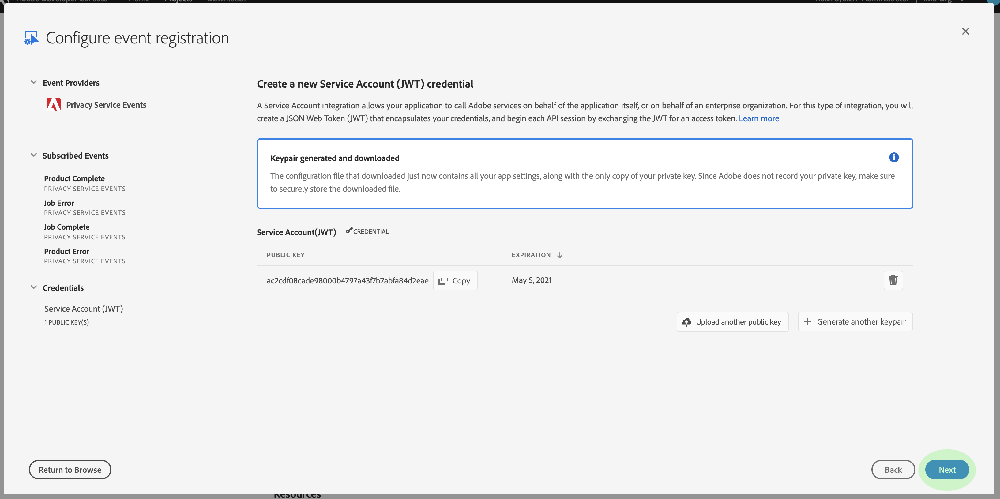

# Inscrever-se em [!DNL Privacy Events]

[!DNL Privacy Events] são mensagens fornecidas pelo Adobe Experience Platform [!DNL Privacy Service], que aproveitam Eventos de E/S da Adobe enviados para um webhook configurado para facilitar a automação eficiente de solicitações de trabalhos. Eles reduzem ou eliminam a necessidade de pesquisar a [!DNL Privacy Service] API para verificar se um trabalho foi concluído ou se um determinado marco em um fluxo de trabalho foi atingido.

Existem atualmente quatro tipos de notificações relacionadas ao ciclo de vida da solicitação de trabalho de privacidade:

| Tipo | Descrição |
--- | ---
| Tarefa concluída | Todas as [!DNL Experience Cloud] soluções reportaram e o status geral ou global do trabalho foi marcado como concluído. |
| Erro de trabalho | Uma ou mais soluções relataram um erro ao processar a solicitação. |
| Produto concluído | Uma das soluções associadas a esse trabalho concluiu seu trabalho. |
| Erro do produto | Uma das soluções relatou um erro ao processar a solicitação. |

Este documento fornece etapas para configurar uma integração para [!DNL Privacy Service] notificações dentro da E/S da Adobe. Para obter uma visão geral de alto nível sobre [!DNL Privacy Service] e seus recursos, consulte a visão geral [do](home.md)Privacy Service.

## Introdução

Este tutorial usa o **ngrok**, um produto de software que expõe os servidores locais à Internet pública através de túneis seguros. Instale o [ngrok](https://ngrok.com/download) antes de iniciar este tutorial para acompanhar e criar um webhook para a sua máquina local. Este guia também exige que você tenha um repositório GIT baixado que contenha um servidor simples [Node.js](https://nodejs.org/) .

## Criar um servidor local

Seu servidor Node.js deve retornar um `challenge` parâmetro enviado por uma solicitação para o terminal raiz (`/`). Configure seu `index.js` arquivo com o seguinte JavaScript para fazer isso:

```js
var express = require('express')
var app = express()

app.set('port', (process.env.PORT || 3000))
app.use(express.static(__dirname + '/public'))

app.get('/', function(request, response) {
  response.send(request.originalUrl.split('?challenge=')[1]);
})

app.listen(app.get('port'), function() {
  console.log("Node app is running at localhost:" + app.get('port'))
})
```

Usando a linha de comando, navegue até o diretório raiz do servidor Node.js. Em seguida, digite os seguintes comandos:

1. `npm install`
1. `npm start`

Esses comandos instalam todas as dependências e inicializam o servidor. Se bem-sucedido, você poderá encontrar seu servidor em execução em http://localhost:3000/.

## Criar um webhook usando o ngrok

Abra uma nova janela de linha de comando e navegue até o diretório onde você instalou o bloco anteriormente. Aqui, digite o seguinte comando:

```shell
./ngrok http -bind-tls=true 3000
```

Uma saída bem-sucedida é semelhante ao seguinte:


Anote o `Forwarding` URL (`https://212d6cd2.ngrok.io`), pois ele será usado para identificar seu webhook na próxima etapa.

## Criar um novo projeto no Adobe Developer Console

Vá para o [Adobe Developer Console](https://www.adobe.com/go/devs_console_ui) e faça logon com seu Adobe ID. Em seguida, siga as etapas descritas no tutorial sobre como [criar um projeto](https://www.adobe.io/apis/experienceplatform/console/docs.html#!AdobeDocs/adobeio-console/master/projects-empty.md) vazio na documentação do Adobe Developer Console.

## Adicionar Eventos de privacidade ao projeto

Depois de terminar de criar um novo projeto no console, clique em **[!UICONTROL Adicionar evento]** na tela Visão geral _do_ projeto.


A caixa de diálogo _Adicionar eventos_ é exibida. Selecione **[!UICONTROL Experience Cloud]** para filtrar a lista de tipos de evento disponíveis e selecione Eventos **** Privacy Service antes de clicar em **[!UICONTROL Avançar]**.


A caixa de diálogo _Configurar registro_ de eventos é exibida. Selecione os eventos que deseja receber marcando as caixas de seleção correspondentes. Os Eventos selecionados são exibidos em Eventos _[!UICONTROL Assinados]_na coluna esquerda. Quando terminar, clique em**[!UICONTROL  Avançar ]**.


A tela seguinte solicita que você forneça uma chave pública para o registro do evento. Você tem a opção de gerar automaticamente um par de chaves ou fazer upload de sua própria chave pública gerada no terminal.

Para os fins deste tutorial, a primeira opção é seguida. Clique na caixa de opção para **[!UICONTROL Gerar um par]** de teclas e clique no botão **[!UICONTROL Gerar par]** de teclas no canto inferior direito.


Quando o par de chaves é gerado, ele é baixado automaticamente pelo navegador. Você mesmo deve armazenar esse arquivo, pois ele não é persistente no Developer Console.

A próxima tela permite que você analise os detalhes do par de chaves recém-gerado. Clique em **[!UICONTROL Avançar]** para continuar.



Na tela seguinte, forneça um nome e uma descrição para o registro do evento. A prática recomendada é criar um nome exclusivo e facilmente identificável para ajudar a diferenciar esse registro de eventos de outros no mesmo projeto.


Mais adiante na mesma tela, você recebe duas opções para configurar como receber eventos. Selecione **[!UICONTROL Webhook]** e forneça o `Forwarding` URL do webhook do grupo criado anteriormente em URL _[!UICONTROL do]_Webhook. Em seguida, selecione o estilo de delivery preferido (único ou lote) antes de clicar em**[!UICONTROL  Salvar eventos ]**configurados para concluir o registro do evento.


A página de detalhes do seu projeto é exibida novamente, com [!DNL Privacy Events] Eventos _[!UICONTROL aparecendo em]_na navegação à esquerda.

## Dados do evento Visualização

Depois de se registrar [!DNL Privacy Events] no projeto e os trabalhos de privacidade terem sido processados, você poderá visualização as notificações recebidas para esse registro. Na guia **[!UICONTROL Projetos]** no Developer Console, selecione seu projeto na lista para abrir a página de visão geral _do_ produto. Aqui, selecione Eventos **[!UICONTROL de]** privacidade no painel de navegação esquerdo.


A guia Detalhes _do_ registro é exibida, permitindo que você visualização mais informações sobre o registro, edite sua configuração ou visualização os eventos reais recebidos desde a ativação do webhook.


Clique na guia Rastreamento de **[!UICONTROL depuração]** para visualização de uma lista de eventos recebidos. Clique em um evento listado para visualização de seus detalhes.


A seção _[!UICONTROL Carga]_fornece detalhes sobre o evento selecionado, incluindo seu tipo de evento (`com.adobe.platform.gdpr.productcomplete`), como destacado no exemplo acima.

## Próximas etapas

Você pode repetir as etapas acima para adicionar novas integrações para diferentes endereços de webhook, conforme necessário.