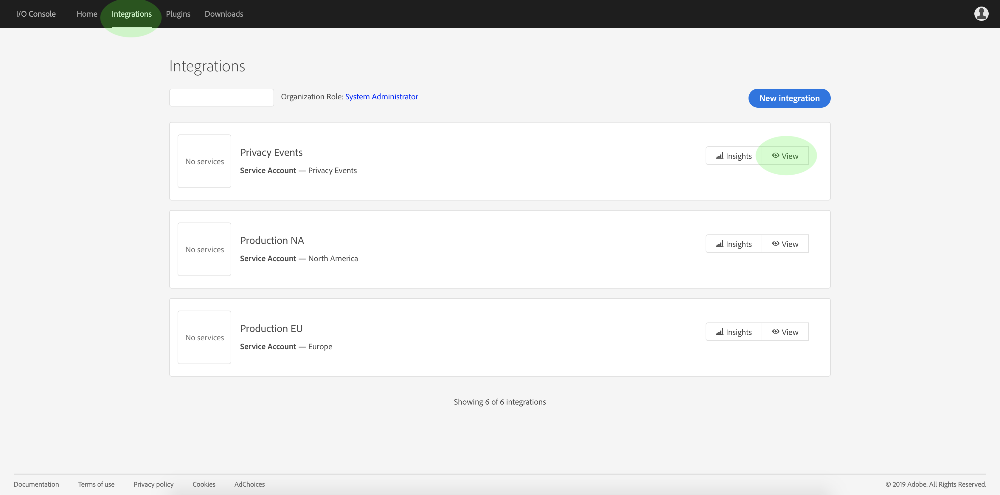

# Inscrever-se em Eventos de privacidade

Os Eventos de privacidade são mensagens fornecidas pelo Adobe Experience Platform Privacy Service, que aproveitam Eventos de E/S da Adobe enviados para um webhook configurado para facilitar a automação eficiente de solicitações de trabalho. Eles reduzem ou eliminam a necessidade de pesquisar a API do Privacy Service para verificar se um trabalho foi concluído ou se um determinado marco em um fluxo de trabalho foi atingido.

Existem atualmente quatro tipos de notificações relacionadas ao ciclo de vida da solicitação de trabalho de privacidade:

| Tipo | Descrição |
--- | ---
| Tarefa concluída | Todas as soluções da Experience Cloud foram reportadas e o status geral ou global do trabalho foi marcado como concluído. |
| Erro de trabalho | Uma ou mais soluções relataram um erro ao processar a solicitação. |
| Produto concluído | Uma das soluções associadas a esse trabalho concluiu seu trabalho. |
| Erro do produto | Uma das soluções relatou um erro ao processar a solicitação. |

Este documento fornece etapas para configurar uma integração para notificações do Privacy Service dentro da E/S da Adobe. Para obter uma visão geral de alto nível do Privacy Service e seus recursos, consulte a visão geral [](home.md)do Privacy Service.

## Introdução

Este tutorial usa o **ngrok**, um produto de software que expõe os servidores locais à Internet pública através de túneis seguros. Instale o [ngrok](https://ngrok.com/download) antes de iniciar este tutorial para acompanhar e criar um webhook para a sua máquina local. Este guia também exige que você tenha um repositório GIT baixado que contenha um servidor simples gravado em [Node.js](https://nodejs.org/).

## Criar um servidor local

Seu servidor Node.js deve retornar um `challenge` parâmetro enviado por uma solicitação para o terminal raiz (`/`). Configure seu `index.js` arquivo com o seguinte JavaScript para fazer isso:

```js
var express = require('express')
var app = express()

app.set('port', (process.env.PORT || 3000))
app.use(express.static(__dirname + '/public'))

app.get('/', function(request, response) {
  response.send(request.originalUrl.split('?challenge=')[1]);
})

app.listen(app.get('port'), function() {
  console.log("Node app is running at localhost:" + app.get('port'))
})
```

Usando a linha de comando, navegue até o diretório raiz do servidor Node.js. Em seguida, digite os seguintes comandos:

1. `npm install`
1. `npm start`

Esses comandos instalam todas as dependências e inicializam o servidor. Se bem-sucedido, você poderá encontrar seu servidor em execução em http://localhost:3000/.

## Criar um webhook usando o ngrok

No mesmo diretório e em uma nova janela de linha de comando, digite o seguinte comando:

```shell
ngrok http -bind-tls=true 3000
```

Uma saída bem-sucedida é semelhante ao seguinte:


Anote o `Forwarding` URL (`https://e142b577.ngrok.io`), pois ele será usado para identificar seu webhook na próxima etapa.

## Criar uma nova integração usando o Console de E/S da Adobe

Faça logon no Console [de E/S da](https://console.adobe.io) Adobe e clique na guia **Integrações** . A janela _Integrações_ é exibida. Aqui, clique em **Nova integração**.


A janela *Criar uma nova integração* é exibida. Selecione **Receber quase-eventos em tempo real** e clique em **Continuar**.


A próxima tela fornece opções para criar integrações com diferentes eventos, produtos e serviços disponíveis para sua organização com base em suas subscrições, direitos e permissões. Para essa integração, selecione Eventos **do Privacy Service e clique em** Continuar ****.


O formulário Detalhes *da* integração é exibido, exigindo que você forneça um nome e uma descrição para a integração, bem como um certificado de chave pública.


Se você não tiver um certificado público, poderá gerar um usando o seguinte comando terminal:

```shell
openssl req -x509 -sha256 -nodes -days 365 -newkey rsa:2048 -keyout private.key -out certificate_pub
```

Depois de gerar um certificado, arraste e solte o arquivo na caixa Certificados **de chaves** públicas ou clique em **Selecionar um arquivo** para navegar pelo diretório de arquivos e selecionar o certificado diretamente.

Após adicionar o certificado, a opção Registro *do* Evento é exibida. Clique em **Adicionar registro** de Evento.


A caixa de diálogo é expandida para mostrar controles adicionais. Aqui você pode selecionar seus tipos de evento desejados e registrar seu webhook. Insira um nome para o registro do evento, o URL do webhook (o `Forwarding` endereço retornado quando você [criou o webhook](#create-a-webhook-using-ngrok)), bem como uma breve descrição. Por fim, selecione os tipos de evento que deseja assinar e clique em **Salvar**.


Quando o formulário de inscrição no Evento for preenchido, clique em **Criar integração** e a integração de E/S será concluída.


## Dados do evento Visualização

Depois que você tiver criado a integração de E/S e os trabalhos de privacidade tiverem sido processados, poderá visualização as notificações recebidas para essa integração. Na guia **Integrações** no Console de E/S, navegue até sua integração e clique em **Visualização**.



A página de detalhes da integração é exibida. Clique em **Eventos** para visualização dos registros do evento para a integração. Localize o registro de Eventos de privacidade e clique em **Visualização**.


A janela Detalhes *do* Evento é exibida, permitindo que você visualização mais informações sobre o registro, edite sua configuração ou visualização os eventos reais recebidos desde a ativação do webhook. Você pode visualização os detalhes do evento, bem como navegar até a opção Rastreamento de **depuração** .


A seção **Carga** fornece detalhes sobre o evento selecionado, incluindo seu tipo de evento (`"com.adobe.platform.gdpr.productcomplete"`), como destacado no exemplo acima.

## Próximas etapas

Você pode repetir as etapas acima para adicionar novas integrações para diferentes endereços de webhook, conforme necessário.