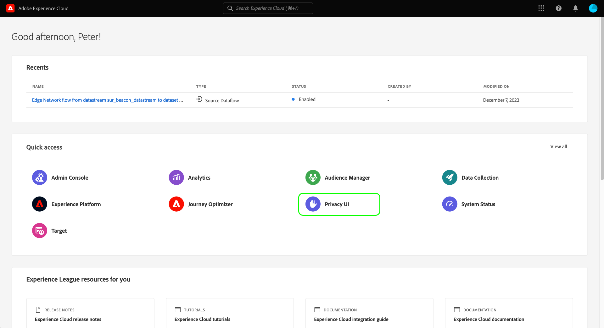
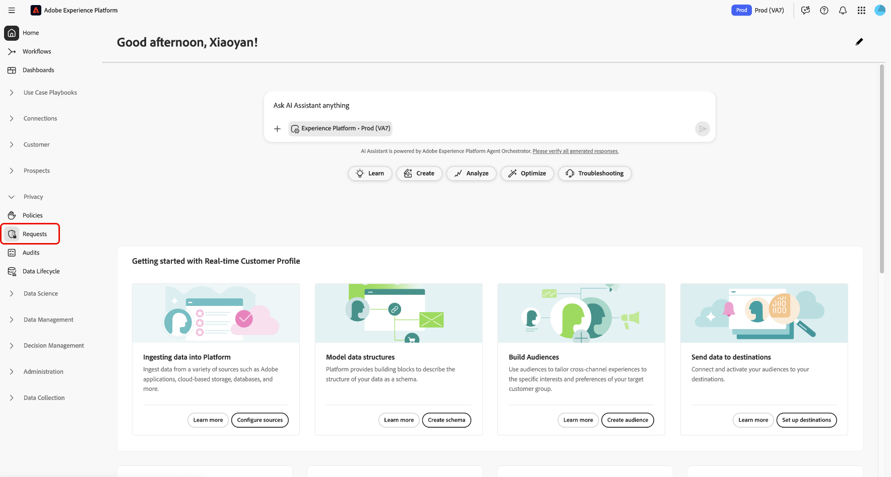

# [!DNL Privacy Service] Visão geral da interface do usuário

O Adobe Experience Platform [!DNL Privacy Service] fornece uma API RESTful e a interface do usuário que permitem coordenar solicitações de privacidade e conformidade em várias soluções. Este documento explora a interface [!DNL Privacy Service]. Para obter informações sobre como usar a API, consulte o [Guia do desenvolvedor do Privacy Service](../api/getting-started.md).

## Faça logon na interface do usuário [!DNL Privacy Service]

>[!IMPORTANT]
>
>Você deve ter uma Adobe ID para autenticar na interface do usuário [!DNL Privacy Service]. Além disso, você deve ter privilégios de Administrador do Sistema em sua Organização IMS.

Selecione **[!UICONTROL Fazer logon com uma Adobe ID]** e insira suas credenciais do Adobe ID quando solicitado.

Depois de fazer logon, selecione **[!UICONTROL Interface do usuário de privacidade]**.

### Efetuar logon a partir de [!DNL Experience Platform]

Se você tiver acesso à interface do usuário do Adobe Experience Platform, também poderá acessar a interface do usuário [!DNL Privacy Service] por meio da guia **[!UICONTROL Requests]** no painel de navegação esquerdo.

## Próximas etapas

Agora que você fez logon com êxito, consulte o [guia do usuário](user-guide.md) para obter etapas sobre como executar várias operações usando a interface [!DNL Privacy Service].
