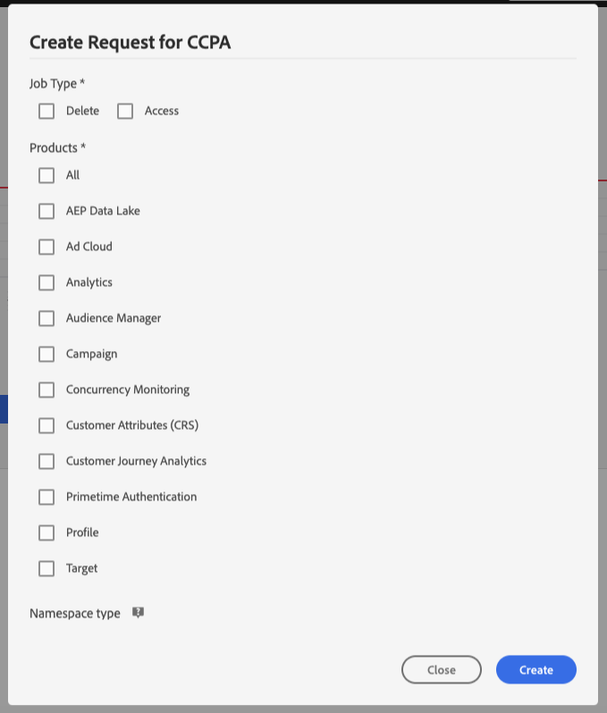

# Gerenciar tarefas de privacidade na interface do usuário do Privacy Service

Este documento fornece etapas para criar e gerenciar solicitações de privacidade usando a interface do usuário [!DNL Privacy Service].

## Navegue pelo painel da interface do usuário [!DNL Privacy Service]

O painel da interface [!DNL Privacy Service] fornece dois widgets que permitem visualizar o status dos trabalhos de privacidade: &quot;[!UICONTROL Status Report]&quot; e &quot;[!UICONTROL Job Requests]&quot;. O painel também exibe o regulamento selecionado atual para as tarefas exibidas.

### Tipo de regulamento

[!DNL Privacy Service] O suporta solicitações de trabalho para várias regras de privacidade:

* As seleções de menu [!DNL California Consumer Privacy Act] ([!UICONTROL CCPA])
* O [!DNL General Data Protection Regulation] da União Europeia ([!UICONTROL GDPR])
* Tailândia [!DNL Personal Data Protection Act] ([!UICONTROL PDPA_THA])
* O Brasil [!DNL Lei Geral de Proteção de Dados] ([!UICONTROL LGPD_BRA])
* A Nova Zelândia [!DNL Privacy Act] ([!UICONTROL NZPA_NZL])

As tarefas para cada tipo de regulamento são rastreadas separadamente. Para alternar entre tipos de regulamento, selecione o menu suspenso **[!UICONTROL Regulation Type]** e selecione o regulamento desejado na lista.

Ao alterar o tipo de regulamento, o painel é atualizado para mostrar todas as operações, filtros, widgets e caixas de diálogo de criação de emprego que se aplicam ao regulamento selecionado.

### Relatório de status

O gráfico no lado esquerdo do widget Relatório de status rastreia os trabalhos enviados em relação a quaisquer trabalhos que possam ter relatado com erros. O gráfico no lado direito rastreia trabalhos próximos ao final da janela de conformidade de 30 dias.

Selecione um dos dois botões de alternância acima do gráfico para mostrar ou ocultar suas respectivas métricas.

Você pode visualizar o número exato de tarefas associadas a qualquer ponto de dados nos gráficos ao passar o mouse sobre o ponto de dados em questão.

Para exibir mais detalhes sobre um determinado ponto de dados, selecione o ponto de dados em questão para exibir os trabalhos associados no widget Solicitações de trabalho . Anote o filtro que é aplicado logo acima da lista de tarefas.

>[!NOTE]
>
>Quando um filtro tiver sido aplicado ao widget Solicitações de trabalho , você poderá remover o filtro selecionando o **X** no pílula de filtro. Solicitações de trabalho e retornar à lista de rastreamento padrão.

### Solicitações de trabalho

O widget Solicitações de trabalho lista todas as solicitações de trabalho disponíveis em sua organização, incluindo detalhes como tipo de solicitação, status atual, data de vencimento e email do solicitante.

>[!NOTE]
>
>Os dados para trabalhos criados anteriormente só podem ser acessados por 30 dias após a data de conclusão.

Você pode filtrar a lista digitando palavras-chave na barra de pesquisa abaixo do título Solicitações de trabalho . A lista filtra automaticamente à medida que você digita, mostrando solicitações que contêm valores que correspondem aos seus termos de pesquisa. Você também pode usar o menu suspenso **[!UICONTROL Requested on]** para selecionar um intervalo de tempo para os trabalhos listados.

Para exibir os detalhes de uma determinada solicitação de trabalho, selecione a ID de trabalho da solicitação na lista para abrir a página **[!UICONTROL Job Details]**.

Esta caixa de diálogo contém informações de status sobre cada [!DNL Experience Cloud] solução e seu estado atual em relação ao trabalho geral. Como cada trabalho de privacidade é assíncrono, a página exibe a data e a hora de comunicação mais recentes (GMT) de cada solução, pois algumas exigem mais tempo do que outras para processar a solicitação.

Se uma solução tiver fornecido dados adicionais, ela poderá ser visualizada nessa caixa de diálogo. É possível visualizar esses dados selecionando linhas de produto individuais.

Para baixar os dados completos do trabalho como um arquivo CSV, selecione **[!UICONTROL Export to CSV]** na parte superior direita da caixa de diálogo.

## Criar uma nova solicitação de trabalho de privacidade

>[!NOTE]
>
>Para criar uma solicitação de trabalho de privacidade, você deve fornecer informações de identidade para os clientes específicos cujos dados devem ser acessados ou excluídos. Revise o documento em [dados de identidade para solicitações de privacidade](../identity-data.md) antes de continuar com esta seção.

A interface [!DNL Privacy Service] fornece dois métodos para criar novas solicitações de trabalho:

* [Usar o Construtor de solicitações](#request-builder)
* [Fazer upload de um arquivo JSON](#json)

As etapas para usar cada um desses métodos são fornecidas nas seções a seguir.

### Usar o Construtor de solicitações {#request-builder}

Usando o Construtor de solicitações, você pode criar manualmente uma nova solicitação de trabalho de privacidade na interface do usuário. O Construtor de solicitações é melhor usado para conjuntos mais simples e menores de solicitações, pois o Construtor de solicitações limita as solicitações a ter somente o tipo de ID por usuário. Para solicitações mais complicadas, talvez seja melhor [carregar um arquivo JSON](#json).

Para começar a usar o Construtor de solicitações, selecione **[!UICONTROL Create Request]** abaixo do widget Relatório de status no lado direito da tela.

A caixa de diálogo **[!UICONTROL Create Request]** é aberta, exibindo as opções disponíveis para enviar uma solicitação de trabalho de privacidade para o tipo de regulamento atualmente selecionado.

 

Selecione o **[!UICONTROL Job Type]** da solicitação (&quot;Excluir&quot; ou &quot;Acesso&quot;) e um ou mais produtos disponíveis na lista.

 

Em **[!UICONTROL Namespace type]**, selecione o tipo de namespace apropriado para as IDs do cliente que estão sendo enviadas para [!DNL Privacy Service].

 

Ao usar o tipo de namespace padrão, selecione um namespace no menu suspenso (email, ECID ou AAID) e, em seguida, digite os valores de ID na caixa de texto à direita, pressionando **\&lt;enter>** para cada ID para adicioná-la à lista.

 

Ao usar o tipo de namespace personalizado, você deve digitar manualmente no namespace antes de fornecer os valores de ID abaixo.

 

Quando terminar, selecione **[!UICONTROL Create]**.

 

A caixa de diálogo desaparece e o novo trabalho (ou trabalhos) é listado no widget Solicitações de trabalho junto com seu status de processamento atual.

### Fazer upload de um arquivo JSON {#json}

Ao criar solicitações mais complicadas, como aquelas que usam vários tipos de ID para cada titular de dados processado, é possível criar uma solicitação carregando um arquivo JSON.

Selecione a seta ao lado de **[!UICONTROL Create Request]**, abaixo do widget Relatório de status no lado direito da tela. Na lista de opções exibidas, selecione **[!UICONTROL Upload JSON]**.

A caixa de diálogo **[!UICONTROL Upload JSON]** é exibida, fornecendo uma janela para que você arraste e solte seu arquivo JSON no.

 

Se não tiver um arquivo JSON para fazer upload, selecione **[!UICONTROL Download Adobe-GDPR-Request.json]** para baixar um modelo que pode ser preenchido de acordo com os valores coletados dos titulares de dados.

 

Localize o arquivo JSON em seu computador e arraste-o para a janela de diálogo. Se o upload for bem-sucedido, o nome do arquivo será exibido na caixa de diálogo. Você pode continuar a adicionar mais arquivos JSON, conforme necessário, arrastando e soltando-os na caixa de diálogo.

Quando terminar, selecione **[!UICONTROL Create]**. A caixa de diálogo desaparece e o novo trabalho (ou trabalhos) é listado no widget Solicitações de trabalho junto com seu status de processamento atual.

### Próximas etapas

Ao ler este documento, você aprendeu a usar a interface do usuário [!DNL Privacy Service] para criar um trabalho de privacidade, visualizar os detalhes de um trabalho e monitorar seu status de processamento e baixar os resultados após sua conclusão.

Para obter etapas sobre como executar essas operações programaticamente usando a API [!DNL Privacy Service], consulte o [guia do desenvolvedor](../api/getting-started.md).
