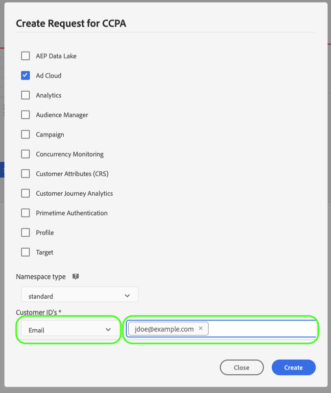

# Gerenciar processos de privacidade na interface do Privacy Service {#user-guide}

>[!CONTEXTUALHELP]
>id="platform_privacyConsole_requests_description"
>title="Respeitar solicitações de privacidade do titular de dados"
>abstract="<h2>Descrição</h2>
O Serviço de Privacidade da Adobe Experience Platform permite criar e gerenciar solicitações de privacidade em nome de clientes que desejam acessar ou excluir seus dados pessoais de acordo com as normas legais de privacidade.
"

Este documento fornece etapas para criar e gerenciar solicitações de privacidade usando o [!DNL Privacy Service] interface do usuário.

>[!IMPORTANT]
>
>O Privacy Service se destina apenas a solicitações de titulares de dados e de direitos do consumidor. Qualquer outro uso do Privacy Service para limpeza ou manutenção de dados não é suportado ou permitido. A Adobe tem a obrigação legal de os cumprir em tempo útil. Dessa forma, o teste de carga no Privacy Service não é permitido, pois é um ambiente somente de produção e cria um backlog desnecessário de solicitações de privacidade válidas.
>
>Um limite rígido de upload diário está em vigor para ajudar a evitar o abuso do serviço. Os usuários que abusam do sistema terão o acesso ao serviço desativado. Uma reunião subsequente será realizada com eles para abordar suas ações e discutir o uso aceitável do Privacy Service.

## Navegue pelo [!DNL Privacy Service] Painel da interface do usuário

O painel para a [!DNL Privacy Service] A interface do usuário fornece dois widgets que permitem visualizar o status dos seus trabalhos de privacidade: &quot;[!UICONTROL Relatório de Status]&quot; e &quot;[!UICONTROL Solicitações de tarefa]&quot;. O painel também exibe o regulamento selecionado atual para os trabalhos exibidos.

### Tipo de regulamento

[!DNL Privacy Service] O oferece suporte a solicitações de trabalho para vários regulamentos de privacidade. A tabela a seguir lista os regulamentos compatíveis e seus rótulos correspondentes, conforme representados na interface do usuário:

| Rótulo da interface | Regulação |
| --- | --- |
| [!UICONTROL APA_AUS] | As seleções de menu [!DNL Australia Privacy Act (Privacy Act)] |
| [!UICONTROL CPA] | As seleções de menu [!DNL Colorado Privacy Act] |
| [!UICONTROL CCPA] | As seleções de menu [!DNL California Consumer Privacy Act] |
| [!UICONTROL CPRA_EUA] | As seleções de menu [!DNL California Consumer Privacy Rights Act (CPRA)] |
| [!UICONTROL CTDPA] | As seleções de menu [!DNL Connecticut Data Privacy Act] |
| [!UICONTROL GDPR] | A política da União Europeia [!DNL General Data Protection Regulation] |
| [!UICONTROL HIPAA_AUS] | As seleções de menu [!DNL Health Insurance Portability and Accountability Act] |
| [!UICONTROL LGPD_BRA] | O do Brasil [!DNL Lei Geral de Proteção de Dados] |
| [!UICONTROL NZPA_NZL] | Nova Zelândia [!DNL Privacy Act] |
| [!UICONTROL PDPA_THA] | da Tailândia [!DNL Personal Data Protection Act] |
| [!UICONTROL UCPA] | As seleções de menu [!DNL Utah Consumer Privacy Act] |
| [!UICONTROL VCDPA_USA] | As seleções de menu [!DNL Virginia Consumer Data Protection Act] |

{style="table-layout:auto"}

>[!NOTE]
>
>Consulte a visão geral em [regulamentos de privacidade compatíveis](../regulations/overview.md) para obter mais informações sobre o contexto jurídico de cada regulamento.

As ordens de produção para cada tipo de regulamento são rastreadas separadamente. Para alternar entre tipos de regulamentos, selecione o **[!UICONTROL Tipo de regulamento]** e selecione a regulação desejada na lista.

Ao alterar o tipo de regulamento, o painel é atualizado para mostrar todas as operações, filtros, widgets e caixas de diálogo de criação de trabalho que se aplicam ao regulamento selecionado.

### Relatório de Status

O gráfico no lado esquerdo do widget Relatório de status rastreia as tarefas enviadas em relação às tarefas que foram relatadas com erros. O gráfico no lado direito rastreia os trabalhos próximos ao final da janela de conformidade de 30 dias.

Selecione um dos dois botões de alternância acima do gráfico para mostrar ou ocultar suas respectivas métricas.

Você pode visualizar o número exato de tarefas associadas a qualquer ponto de dados nos gráficos, passando o mouse sobre o ponto de dados em questão.

Para exibir mais detalhes sobre determinado ponto de dados, selecione o ponto de dados em questão para exibir as tarefas associadas no widget Solicitações de trabalho. Anote o filtro que é aplicado logo acima da lista de tarefas.

>[!NOTE]
>
>Quando um filtro é aplicado ao widget Solicitações de tarefa, é possível removê-lo selecionando o **X** na pílula de filtro. As solicitações de tarefa retornam à lista de rastreamento padrão.

### Solicitações de tarefa

O widget Solicitações de trabalho lista todas as solicitações de trabalho disponíveis em sua organização, incluindo detalhes como tipo de solicitação, status atual, data de vencimento e email do solicitante.

>[!NOTE]
>
>Os dados de trabalhos criados anteriormente só podem ser acessados por 30 dias após a data de conclusão.

Você pode filtrar a lista digitando palavras-chave na barra de pesquisa abaixo do título Solicitações de tarefa. A lista filtra automaticamente à medida que você digita, mostrando solicitações que contêm valores correspondentes aos termos da pesquisa. Você também pode usar a variável **[!UICONTROL Solicitado em]** para selecionar um intervalo de tempo para os trabalhos listados.

Para exibir os detalhes de uma solicitação de trabalho específica, selecione a ID do trabalho da solicitação na lista para abrir a **[!UICONTROL Detalhes do trabalho]** página.

Esta caixa de diálogo contém informações de status sobre cada [!DNL Experience Cloud] e seu estado atual em relação ao trabalho geral. Como cada trabalho de privacidade é assíncrono, a página exibe a data e a hora da comunicação mais recente (GMT) de cada solução, pois algumas exigem mais tempo do que outras para processar a solicitação.

Se uma solução tiver fornecido dados adicionais, ela será exibida nessa caixa de diálogo. Você pode visualizar esses dados selecionando linhas de produto individuais.

Para baixar os dados completos do processo como um arquivo CSV, selecione **[!UICONTROL Exportar para CSV]** na parte superior direita da caixa de diálogo.

## Criar uma nova solicitação de trabalho de privacidade {#create-a-new-privacy-job-request}

>[!CONTEXTUALHELP]
>id="platform_privacyConsole_requests_instructions"
>title="Instruções"
>abstract="<ul><li>Selecione <a href="https://experienceleague.adobe.com/docs/experience-platform/privacy/ui/overview.html#logging-in-from-experience-platform">Solicitações</a> na navegação à esquerda para abrir a Interface de privacidade e, em seguida, selecione <b>Criar solicitação</b>.</li><li>Aqui, você pode usar o construtor de solicitações ou fazer upload de um arquivo JSON de titulares de dados.</li><li>Se estiver usando o construtor de solicitações, selecione o tipo de tarefa (acesso e/ou exclusão) e escolha o tipo de identidade que você está fornecendo (email, ECID ou AAID) ou insira um namespace de identidade personalizado. Insira os valores de identidade apropriados para os clientes e selecione <b>Criar</b> quando terminar.</li><li>Se estiver carregando um arquivo JSON, selecione a seta ao lado de Criar solicitação. Na lista de opções, selecione <b>Upload de JSON</b> e faça upload do arquivo. Se não tiver um arquivo JSON para fazer upload, selecione <b>Baixar Adobe-GDPR-Request.json</b> para baixar um modelo que pode ser preenchido. Faça upload do JSON e selecione <b>Criar</b> quando terminar.</li><li>Para obter mais ajuda com esse recurso, consulte o <a href="https://experienceleague.adobe.com/docs/experience-platform/privacy/ui/user-guide.html?lang=pt-BR">Guia do usuário do Serviço de Privacidade</a> na Experience League.</li></ul>"

>[!NOTE]
>
>Para criar uma solicitação de acesso a dados pessoais, você deve fornecer informações de identidade para os clientes específicos cujos dados devem ser acessados ou excluídos. Revise o documento em [dados de identidade para solicitações de privacidade](../identity-data.md) antes de continuar com esta seção.

A variável [!DNL Privacy Service] A interface do usuário do fornece dois métodos para criar novas solicitações de trabalho:

* [Usar o Criador de solicitações](#request-builder)
* [Fazer upload de um arquivo JSON](#json)

As etapas para usar cada um desses métodos são fornecidas nas seções a seguir.

### Usar o Criador de solicitações {#request-builder}

Usando o Construtor de solicitações, você pode criar manualmente uma nova solicitação de trabalho de privacidade na interface do usuário. O Construtor de solicitações é mais adequado para conjuntos de solicitações mais simples e menores, pois o Construtor de solicitações limita as solicitações a terem somente o tipo de ID por usuário. Para solicitações mais complicadas, talvez seja melhor [carregar um arquivo JSON](#json) em vez disso.

Para começar a usar o construtor de solicitações, selecione **[!UICONTROL Criar solicitação]** abaixo do widget Relatório de status no lado direito da tela.

A variável **[!UICONTROL Criar solicitação]** será aberta, exibindo as opções disponíveis para enviar uma solicitação de job de privacidade para o tipo de regulamento selecionado no momento.

 

Selecione o **[!UICONTROL Tipo de tarefa]** (&quot;Excluir&quot; ou &quot;Acessar&quot;) e um ou mais produtos disponíveis na lista.

 

Em **[!UICONTROL Tipo de namespace]**, selecione o tipo de namespace apropriado para as IDs do cliente que estão sendo enviadas [!DNL Privacy Service].

 

Ao usar o tipo de namespace padrão, selecione um namespace no menu suspenso (email, ECID ou AAID) e digite os valores de ID na caixa de texto à direita, pressionando **\&lt;enter>** para cada ID para adicioná-la à lista.

 

Ao usar o tipo de namespace personalizado, você deve digitar manualmente o namespace antes de fornecer os valores de ID abaixo.

 

Quando terminar, selecione **[!UICONTROL Criar]**.

 

A caixa de diálogo desaparece e a nova tarefa (ou tarefas) é listada no widget Solicitações de tarefa junto com seu status de processamento atual.

### Fazer upload de um arquivo JSON {#json}

Ao criar solicitações mais complicadas, como as que usam vários tipos de ID para cada titular de dados que está sendo processado, é possível criar uma solicitação carregando um arquivo JSON.

Selecione a seta ao lado de **[!UICONTROL Criar solicitação]**, abaixo do widget Relatório de status no lado direito da tela. Na lista de opções exibida, selecione **[!UICONTROL Fazer upload de JSON]**.

A variável **[!UICONTROL Fazer upload de JSON]** será exibida, fornecendo uma janela para que você arraste e solte o arquivo JSON.

 

Se não tiver um arquivo JSON para fazer upload, selecione **[!UICONTROL Baixar Adobe-GDPR-Request.json]** para baixar um modelo que pode ser preenchido de acordo com os valores coletados dos titulares de dados.

 

Localize o arquivo JSON no computador e arraste-o para a janela de diálogo. Se o upload for bem-sucedido, o nome do arquivo aparecerá na caixa de diálogo. Você pode continuar a adicionar mais arquivos JSON, conforme necessário, arrastando-os e soltando-os na caixa de diálogo.

Quando terminar, selecione **[!UICONTROL Criar]**. A caixa de diálogo desaparece e a nova tarefa (ou tarefas) é listada no widget Solicitações de tarefa junto com seu status de processamento atual.

### Próximas etapas

Ao ler este documento, você aprendeu a usar o [!DNL Privacy Service] Interface para criar um trabalho de privacidade, exibir os detalhes de um trabalho e monitorar o status do processamento, além de baixar os resultados após a conclusão.

Para obter etapas sobre como executar essas operações de forma programática usando o [!DNL Privacy Service] API, consulte a [Guia da API](../api/overview.md).
