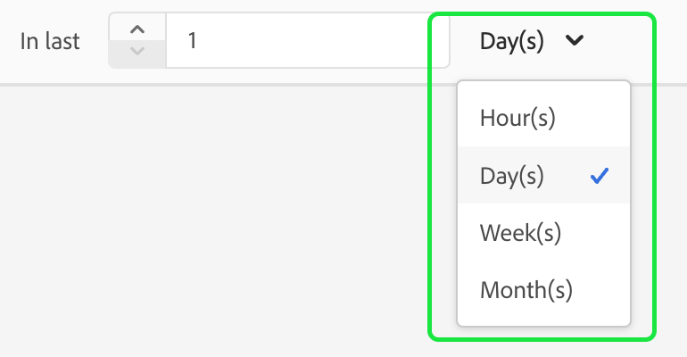

# Guia da interface de atributos computados

>[!NOTE]
>
>Para obter acesso a atributos computados, você precisará ter as permissões apropriadas (**Exibir atributos computados** e **Gerenciar atributos computados**). Para obter mais informações sobre as permissões necessárias, leia a [documentação sobre controle de acesso](../../access-control/home.md). Para saber como aplicar essas permissões, leia o [guia de gerenciamento de permissões](../../access-control/ui/permissions.md).

No Adobe Experience Platform, os atributos computados são funções usadas para agregar dados no nível do evento em atributos no nível do perfil. Essas funções são computadas automaticamente para que possam ser usadas na segmentação, ativação e personalização.

Este documento fornece um guia sobre como criar e atualizar atributos calculados usando a interface do usuário do Adobe Experience Platform.

## Introdução

Este guia de interface do usuário requer uma compreensão dos vários serviços do [!DNL Experience Platform] envolvidos no gerenciamento do [!DNL Real-Time Customer Profiles]. Antes de ler este guia ou trabalhar na interface do usuário, consulte a documentação dos seguintes serviços:

- [[!DNL Real-Time Customer Profile]](../home.md): Fornece um perfil de consumidor unificado em tempo real com base em dados agregados de várias fontes.
- [[!DNL Experience Data Model (XDM) System]](../../xdm/home.md): a estrutura padronizada pela qual o [!DNL Experience Platform] organiza os dados de experiência do cliente.

## Exibir atributos calculados {#view}

Na interface do usuário do Experience Platform, selecione **[!UICONTROL Profiles]** na navegação à esquerda, seguido por **[!UICONTROL Computed attributes]** para ver uma lista dos atributos computados disponíveis para sua organização. Isso inclui informações sobre o nome do atributo calculado, a descrição, a data da última avaliação e o status da última avaliação.

![A seção [!UICONTROL Profile] e as guias [!UICONTROL Computed attributes] são destacadas, mostrando aos usuários como acessar a página de navegação de atributos computados.](./images/ui/browse.png)

Para selecionar quais campos estão visíveis, você pode selecionar  para adicionar ou remover os campos que deseja exibir.

| Campo | Descrição |
| ----- | ----------- |
| [!UICONTROL Name] | O nome de exibição do atributo calculado. |
| [!UICONTROL Description] | A descrição do atributo calculado. |
| [!UICONTROL Evaluation method] | O método de avaliação do atributo calculado. No momento, há suporte apenas para **lote**. |
| [!UICONTROL Last evaluated] | Esse carimbo de data e hora representa a última execução de avaliação bem-sucedida. Somente eventos que ocorreram **antes** deste carimbo de data/hora são considerados na última avaliação bem-sucedida. |
| [!UICONTROL Last evaluation status] | O status que indica se o atributo calculado foi ou não calculado com êxito na última execução de avaliação. Os valores possíveis incluem **[!UICONTROL Success]** ou **[!UICONTROL Failed]**. |
| [!UICONTROL Refresh frequency] | Uma indicação da frequência com que o atributo calculado deve ser atualizado. Os valores possíveis incluem por hora, dia, semana ou mês. |
| [!UICONTROL Fast refresh] | Um valor que mostra se a atualização rápida está ou não ativada para este atributo de computação. Se a atualização rápida estiver ativada, o atributo calculado poderá ser atualizado diariamente, em vez de semanalmente, quinzenalmente ou mensalmente. Esse valor só é aplicável para atributos calculados com um período de retrospectiva maior que uma semana. |
| [!UICONTROL Lifecycle status] | O status atual do atributo calculado. Há três status possíveis: <ul><li>**[!UICONTROL Draft]:** O atributo computado **não** tem um campo criado no esquema ainda. Nesse estado, o atributo calculado pode ser editado. </li><li>**[!UICONTROL Published]:** O atributo computado tem um campo criado no esquema e está pronto para ser usado. Neste estado, o atributo computado **não pode** ser editado.</li><li>**[!UICONTROL Inactive]:** O atributo computado está desabilitado. Para obter mais informações sobre o status inativo, leia a [página de Perguntas frequentes](./faq.md#inactive-status). </li> |
| [!UICONTROL Created] | Um carimbo de data e hora que mostra a data e a hora em que o atributo calculado foi criado. |
| [!UICONTROL Last modified] | Um carimbo de data e hora que mostra a data e a hora em que o atributo calculado foi modificado pela última vez. |

Você também pode filtrar os atributos calculados exibidos com base no status do ciclo de vida. Selecione o ícone .

Agora você pode optar por filtrar os atributos computados por status ([!UICONTROL Draft], [!UICONTROL Published] e [!UICONTROL Inactive]).

![As opções pelas quais você pode filtrar os atributos computados são realçadas. Estas opções incluem [!UICONTROL Draft], [!UICONTROL Published] e [!UICONTROL Inactive].](./images/ui/view-filters.png)

Além disso, você pode selecionar um atributo calculado para ver informações mais detalhadas sobre ele. Para obter mais informações sobre a página de detalhes dos atributos computados, leia a [seção de detalhes dos atributos computados](#view-details).

## Criar um atributo calculado {#create}

Para criar um novo atributo calculado, selecione **[!UICONTROL Create computed attribute]** para inserir o novo fluxo de trabalho de atributo calculado.

![O botão [!UICONTROL Create computed attributes] está realçado, mostrando aos usuários como acessar a página de criação de atributos computados.](./images/ui/create.png)

A página **[!UICONTROL Create computed attribute]** é exibida. Nesta página, você pode adicionar as informações básicas para o atributo calculado que deseja criar.

| Campo | Descrição |
| ----- | ----------- |
| [!UICONTROL Display name] | O nome pelo qual o atributo calculado será conhecido. Você deve manter esse nome de exibição exclusivo para cada atributo calculado. Como prática recomendada, esse nome de exibição deve conter identificadores relacionados ao atributo calculado. Por exemplo, &quot;Soma das compras de sapatos nos últimos 7 dias&quot;. |
| [!UICONTROL Field name] | Um nome usado para fazer referência ao atributo calculado em outros serviços downstream. Esse nome é automaticamente derivado do nome de exibição e é gravado em camelCase. |
| [!UICONTROL Description] | Uma descrição do atributo calculado que você está tentando criar. |

![A seção [!UICONTROL Basic information] da página [!UICONTROL Create computed attribute] está realçada.](./images/ui/basic-information.png)

Depois de adicionar os detalhes do atributo calculado, você pode começar a definir suas regras.

### Especificar condições de filtragem de eventos

Para criar uma regra, selecione primeiro os atributos da seção **[!UICONTROL Events]** para filtrar os eventos nos quais deseja agregar. No momento, somente atributos de evento do tipo não array são compatíveis.

![A seção [!UICONTROL Events] está realçada.](./images/ui/events.png)

Após selecionar o atributo a ser usado na definição de atributo calculado, você pode escolher a que esse valor será comparado.

### Aplicar função de agregação

Agora, você pode aplicar uma função ao campo da saída condicional. Primeiro, selecione o tipo de função de agregação. As opções disponíveis incluem [!UICONTROL Sum], [!UICONTROL Min], [!UICONTROL Max], [!UICONTROL Count] e [!UICONTROL Most Recent]. Mais informações sobre essas funções podem ser encontradas na [seção de funções](./overview.md#functions) da visão geral de atributos computados.

Após escolher uma função, você pode escolher o campo no qual agregar. Os campos elegíveis a serem escolhidos dependem da função selecionada.

### Duração da pesquisa

Depois de aplicar a função de agregação, será necessário definir o período de lookback do atributo calculado. Esse período de pesquisa especifica o período no qual você deseja agregar eventos. Essa duração da pesquisa pode ser especificada em termos de horas, dias, semanas ou meses.

### Atualização rápida {#fast-refresh}

>[!CONTEXTUALHELP]
>id="platform_profile_computedAttributes_fastRefresh"
>title="Atualização rápida"
>abstract="A atualização rápida permite manter seus atributos atualizados. Habilitar essa opção possibilita atualizar os atributos calculados diariamente, mesmo para períodos de retrospectiva mais longos, permitindo reagir rapidamente às atividades do usuário ou usuária. Esse valor só é aplicável para atributos calculados com um período de retrospectiva maior que uma semana."

Ao aplicar a função de agregação, você poderá ativar a atualização rápida se o período de lookback for maior que uma semana.

![A caixa de seleção [!UICONTROL Fast Refresh] está realçada.](./images/ui/enable-fast-refresh.png)

A atualização rápida permite manter seus atributos atualizados. Ativar essa opção permite atualizar os atributos calculados diariamente, mesmo por períodos de lookback mais longos, permitindo que você reaja rapidamente às atividades do usuário.

Para obter mais informações sobre atualização rápida, leia a [seção atualização rápida](./overview.md#fast-refresh) da visão geral dos atributos computados.

Com essas etapas concluídas, agora é possível optar por salvar esse atributo calculado como rascunho ou publicá-lo imediatamente.

![Os botões [!UICONTROL Save as draft] e [!UICONTROL Publish] estão realçados.](./images/ui/draft-or-publish.png)

## Exibir detalhes de um atributo calculado {#view-details}

Para exibir os detalhes de um atributo computado, selecione o atributo computado sobre o qual você deseja ver detalhes na página [!UICONTROL **Procurar**].

O conteúdo da página é diferente, dependendo se o atributo computado é **[!UICONTROL Published]** ou em **[!UICONTROL Draft]**.

### Atributo calculado publicado {#published}

Ao selecionar um atributo calculado publicado, a página de detalhes dos atributos calculados é exibida.

Esta página exibe um resumo dos detalhes do atributo calculado, bem como um gráfico mostrando a distribuição do valor e perfis de amostra que se qualificam para o atributo calculado.

>[!NOTE]
>
>A distribuição de valores reflete a distribuição de valores de atributos para perfis no momento do trabalho de amostragem. O valor do atributo calculado no perfil de amostra reflete o valor do perfil mesclado mais recente para alguns perfis de amostra.

### Rascunho do atributo calculado {#draft}

Ao selecionar um atributo calculado de rascunho, a página **[!UICONTROL Edit computed attributes]** é exibida. Esta página, semelhante à página [!UICONTROL Create computed attributes], permite editar as informações básicas do atributo calculado, bem como sua definição, antes de permitir a atualização do rascunho ou a publicação.

![A página [!UICONTROL Edit computed attributes] é exibida.](./images/ui/edit.png)

## Uso de atributos computados {#usage}

>[!IMPORTANT]
>
>Se você estiver usando um atributo computado com a função **Mais recente** em uma definição de segmento, você **deve** incluir **ambos** o valor e o valor do carimbo de data/hora no objeto de atributo computado.
>
>Por exemplo, se estiver criando uma definição de segmento que esteja procurando &quot;Todos os perfis que têm um endereço de email válido&quot;, onde o campo de endereço de email é preenchido por um atributo computado com a função mais recente, você **deve** incluir o valor do endereço de email existe **e** o carimbo de data/hora do endereço de email existe.

Depois de criar um atributo computado, você pode usar atributos computados **publicados** em outros serviços downstream. Como os atributos calculados são campos de atributo de perfil criados no esquema de união de perfis, você pode pesquisar valores de atributo calculados para um Perfil de cliente em tempo real, usá-los em um público-alvo, ativá-los para um destino ou usá-los para personalização no jornada na Adobe Journey Optimizer.

>[!NOTE]
>
>Os atributos computados **não podem** ser usados em **composições** de público-alvo.

## Próximas etapas

Para saber mais sobre atributos computados, leia a [visão geral sobre atributos computados](./overview.md). Para obter informações sobre como criar e configurar atributos computados usando a API, leia o [guia do desenvolvedor de atributos computados](./api.md).
