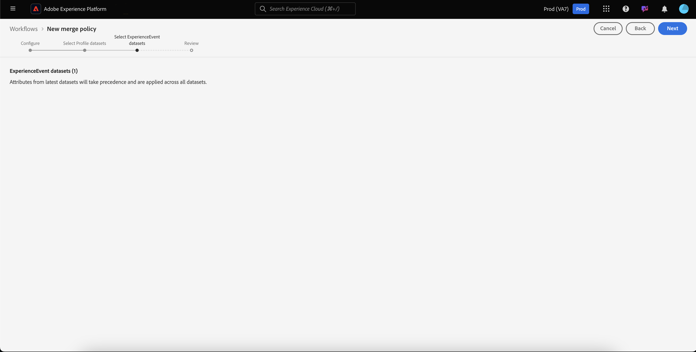
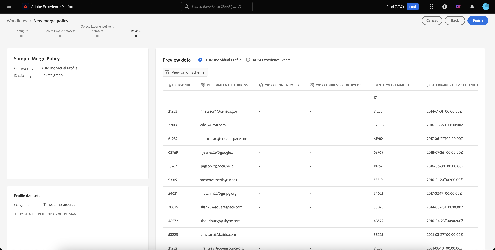
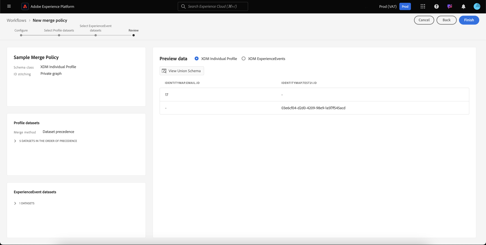

# Guia da interface do usuário de políticas de mesclagem

O Adobe Experience Platform permite reunir fragmentos de dados de várias fontes e combiná-los para ver uma visualização completa de cada um dos clientes individuais. Ao reunir esses dados, as políticas de mesclagem são as regras que [!DNL Platform] usa para determinar como os dados serão priorizados e quais dados serão combinados para criar uma exibição unificada.

Por exemplo, se um cliente interagir com sua marca em vários canais, sua organização terá vários fragmentos de perfil relacionados a esse único cliente que aparece em vários conjuntos de dados. Quando esses fragmentos são assimilados na Platform, eles são mesclados para criar um único perfil para esse cliente. Quando os dados de várias fontes estão em conflito (por exemplo, um fragmento lista o cliente como &quot;único&quot; enquanto o outro lista o cliente como &quot;casado&quot;), a política de mesclagem determina quais informações devem ser incluídas no perfil do indivíduo.

Usando RESTful APIs ou a interface do usuário, você pode criar novas políticas de mesclagem, gerenciar políticas existentes e definir uma política de mesclagem padrão para sua organização. Este guia fornece instruções passo a passo para trabalhar com políticas de mesclagem usando a interface do usuário do Adobe Experience Platform (UI).

Se preferir trabalhar com políticas de mesclagem usando a API [!DNL Real-time Customer Profile], siga as instruções descritas no [guia da API de políticas de mesclagem](../api/merge-policies.md).

## Introdução

Este guia requer uma compreensão funcional de vários recursos [!DNL Experience Platform] importantes. Antes de seguir este guia ou usar as APIs de perfil, revise a documentação dos seguintes serviços:

* [Perfil](../home.md) do cliente em tempo real: Fornece um perfil de consumidor unificado e em tempo real com base em dados agregados de várias fontes.
* [Serviço](../../identity-service/home.md) de identidade da Adobe Experience Platform: Habilita o Perfil do cliente em tempo real, unindo identidades de diferentes fontes de dados que estão sendo assimiladas no  [!DNL Platform].
* [Modelo de dados de experiência (XDM)](../../xdm/home.md): A estrutura padronizada pela qual  [!DNL Platform] organiza os dados de experiência do cliente.

## Mesclar métodos {#merge-methods}

Cada fragmento de perfil contém informações para apenas uma identidade do número total de identidades que podem existir para um indivíduo. Ao mesclar esses dados para formar um perfil de cliente, há a possibilidade de essas informações entrarem em conflito e a prioridade deve ser especificada. Selecionar um método de mesclagem permite especificar quais atributos de conjunto de dados priorizar se ocorrer um conflito de mesclagem entre conjuntos de dados.

Há dois métodos de mesclagem possíveis disponíveis para políticas de mesclagem. Cada um desses métodos é resumido abaixo com detalhes adicionais fornecidos nas seções a seguir:

* **[!UICONTROL Timestamp ordered]:** no caso de um conflito, a prioridade é dada ao fragmento de perfil que foi atualizado mais recentemente.
   * **Carimbos de data e hora personalizados:** [!UICONTROL Timestamp ordered] também oferece suporte a carimbos de data e hora personalizados, que têm prioridade sobre os carimbos de data e hora do sistema ao mesclar dados no mesmo conjunto de dados (várias identidades) ou em vários conjuntos de dados. Para saber mais, consulte a seção sobre [uso de carimbos de data e hora personalizados](#custom-timestamps).
* **[!UICONTROL Dataset precedence]:** Em caso de conflito, dê prioridade aos fragmentos de perfil com base no conjunto de dados de onde eles vieram. Ao selecionar essa opção, você deve escolher os conjuntos de dados relacionados e sua ordem de prioridade.

### Carimbo de data e hora ordenado {#timestamp-ordered}

À medida que os registros de perfil são assimilados no Experience Platform, um carimbo de data e hora do sistema é obtido no momento da assimilação e adicionado ao registro. Quando **[!UICONTROL Timestamp ordered]** é selecionado como o método de mesclagem para uma política de mesclagem, os perfis são mesclados com base no carimbo de data e hora do sistema. Em outras palavras, a mesclagem é feita com base no carimbo de data e hora de quando o registro foi assimilado na Platform.

#### Uso de carimbos de data e hora personalizados {#custom-timestamps}

Ocasionalmente, pode haver casos de uso em que seja necessário fornecer um carimbo de data e hora personalizado e fazer com que a política de mesclagem honre o carimbo de data e hora personalizado em vez do carimbo de data e hora do sistema. Exemplos disso incluem o preenchimento retroativo de dados ou a garantia da ordem correta dos eventos se os registros forem assimilados fora de ordem.

Para usar um carimbo de data e hora personalizado, o **[!UICONTROL External Source System Audit Details Mixin]** deve ser adicionado ao esquema Perfil. Depois de adicionado, o carimbo de data e hora personalizado pode ser preenchido usando o campo `lastUpdatedDate` . Quando um registro é assimilado com o campo `lastUpdatedDate` preenchido, o Experience Platform usará esse campo para unir registros em conjuntos de dados. Se `lastUpdatedDate` não estiver presente ou não estiver preenchida, a Platform continuará a usar o carimbo de data e hora do sistema.

>[!NOTE]
>
>Você deve garantir que o carimbo de data e hora `lastUpdatedDate` seja preenchido ao assimilar uma atualização no mesmo registro.

A captura de tela a seguir exibe os campos no [!UICONTROL External Source System Audit Details Mixin]. Para obter instruções passo a passo sobre como trabalhar com esquemas usando a interface do usuário da plataforma, incluindo como adicionar mixins a esquemas, visite o [tutorial para criar um esquema usando a interface do usuário](../../xdm/tutorials/create-schema-ui.md).

Para trabalhar com carimbos de data e hora personalizados usando a API, consulte a seção [guia do ponto de extremidade de políticas de mesclagem sobre o uso de carimbos de data e hora personalizados](../api/merge-policies.md#custom-timestamps).

### Precedência do conjunto de dados {#dataset-precedence}

Quando **[!UICONTROL Dataset precedence]** é selecionado como o método de mesclagem para uma política de mesclagem, é possível dar prioridade aos fragmentos de perfil com base no conjunto de dados de onde eles vieram. Um exemplo de uso seria se sua organização tivesse informações presentes em um conjunto de dados preferido ou confiável sobre os dados em outro conjunto de dados.

Para criar uma política de mesclagem usando **[!UICONTROL Dataset precedence]**, você deve selecionar os conjuntos de dados Perfil e ExperienceEvent incluídos e, em seguida, pode ordenar manualmente os conjuntos de dados do Perfil para precedência. Depois que os conjuntos de dados forem selecionados e ordenados, o conjunto de dados principal terá a prioridade mais alta, o segundo conjunto de dados será o segundo mais alto e assim por diante.

## [!UICONTROL ID stitching] {#id-stitching}

A identificação de fragmentos de dados ([!UICONTROL ID stitching]) é o processo de identificação de fragmentos de dados e sua combinação para formar um registro de perfil completo. Para ajudar a ilustrar os diferentes comportamentos de costura, considere um único cliente que interage com uma marca usando dois endereços de email diferentes.

* **[!UICONTROL None]:** Quando essa opção é selecionada, as IDs não serão compiladas. Quando a segmentação ocorrer, as identidades que podem pertencer à mesma pessoa não serão unidas e a segmentação considerará apenas os atributos anexados a cada ID individual ao determinar se um cliente se qualifica para associação de segmento. Isso pode resultar em um único cliente com vários perfis e cada perfil pode se qualificar para segmentos diferentes, resultando no envio de várias mensagens de marketing para o mesmo cliente.
* **[!UICONTROL Private graph]:** quando o gráfico privado é selecionado, várias identidades relacionadas ao mesmo indivíduo são unidas. Isso resulta no cliente ter um único perfil e permite que a segmentação considere vários atributos de várias identidades relacionadas ao determinar a qualificação de segmento. Nesse cenário, o cliente provavelmente terá um único perfil, se qualificará para um segmento com base na combinação de atributos entre identidades e receberá apenas uma mensagem de marketing.

Para saber mais sobre identidades e sua função na geração de perfis e segmentos, comece lendo a [Visão geral do Serviço de identidade](../../identity-service/home.md).

## Política de mesclagem padrão {#default-merge-policy}

Uma organização pode criar uma política de mesclagem padrão para a organização usar ao mesclar fragmentos de perfil. Isso permite que os usuários selecionem facilmente a política padrão ao executar ações no Experience Platform, como visualizar perfis de clientes ou criar segmentos. Na maioria dos casos, a menos que outra política de mesclagem seja especificada, a política de mesclagem padrão será usada.

Cada organização pode criar várias políticas de mesclagem relacionadas a uma única classe de esquema XDM, no entanto, só pode ter uma política de mesclagem padrão declarada para cada classe. Por exemplo, sua organização pode ter uma política de mesclagem padrão relacionada à classe [!DNL XDM Individual Profile] e uma política de mesclagem padrão diferente para uma classe de Inventário de Produto criada personalizada.

Se você criar uma nova política de mesclagem e configurá-la como padrão, a política de mesclagem padrão anterior será atualizada automaticamente pelo sistema para não ser mais o padrão.

>[!WARNING]
>
>As contagens de perfil e os segmentos com uma política de mesclagem padrão existente associada podem ser afetados. Qualquer segmento que tenha uma política de mesclagem padrão aplicada será atualizado para a nova política de mesclagem padrão.

## Exibir políticas de mesclagem {#view-merge-policies}

Na interface [!DNL Experience Platform], você pode começar a trabalhar com políticas de mesclagem selecionando **[!UICONTROL Profiles]** na navegação à esquerda e selecionando a guia **[!UICONTROL Merge Policies]**. Esta guia inclui uma lista de todas as políticas de mesclagem existentes para sua organização, bem como detalhes de cada política de mesclagem, incluindo o nome da política, se a política de mesclagem é ou não a política de mesclagem padrão e a classe de schema à qual a política de mesclagem está relacionada.

Para selecionar quais detalhes estão visíveis ou para adicionar outras colunas à exibição, selecione **[!UICONTROL Configure columns]** e clique em um nome de coluna para adicioná-los ou removê-los da exibição.

## Criar uma política de mesclagem {#create-a-merge-policy}

Para criar uma nova política de mesclagem, selecione **[!UICONTROL Create merge policy]** na guia de políticas de mesclagem.

Na tela **[!UICONTROL New merge policy]** do fluxo de trabalho, você pode fornecer informações importantes para sua nova política de mesclagem por meio de uma série de etapas guiadas.

### [!UICONTROL Configure] {#configure}

A primeira etapa do fluxo de trabalho permite configurar a política de mesclagem fornecendo informações básicas. Essas informações incluem:

* **[!UICONTROL Name]**: O nome da sua política de mesclagem deve ser descritivo, mas conciso.
* **[!UICONTROL Schema class]**: A classe de esquema XDM associada à política de mesclagem. Especifica a classe de schema para a qual essa política de mesclagem é criada. As organizações podem criar várias políticas de mesclagem por classe de esquema. Atualmente, somente a classe [!UICONTROL XDM Individual Profile] está disponível na interface do usuário. Você pode visualizar o schema de união para a classe de schema selecionando **[!UICONTROL View Union Schema]**. Para obter mais informações, consulte a seção sobre [visualizar o schema de união](#view-union-schema) que se segue.
* **[!UICONTROL ID stitching]**: Este campo define como determinar as identidades relacionadas de um cliente. Consulte a seção [Compilação de ID](#id-stitching) anterior neste guia para saber mais. Há dois valores possíveis:
   * **[!UICONTROL None]**: Não execute nenhum agrupamento de identidade.
   * **[!UICONTROL Private Graph]**: Realize a identificação com base no gráfico de identidade privado.
* **[!UICONTROL Default merge policy]**: Um botão de alternância que permite selecionar se essa política de mesclagem será ou não o padrão para sua organização. Se o seletor estiver ligado, será exibido um aviso solicitando que você confirme que deseja alterar a política de mesclagem padrão da sua organização. Consulte a seção sobre [políticas de mesclagem padrão](#default-merge-policy) anteriormente neste guia para saber mais.
   

Depois que os campos obrigatórios forem preenchidos, você poderá selecionar **[!UICONTROL Next]** para continuar com o workflow.

#### [!UICONTROL View Union Schema] {#view-union-schema}

Ao criar ou editar uma política de mesclagem, você pode exibir o schema de união para a classe de schema escolhida selecionando **[!UICONTROL View Union Schema]**.

Isso abre a caixa de diálogo [!UICONTROL View Union Schema], mostrando todos os esquemas, identidades e relações de contribuição associados ao esquema de união. Você pode usar a caixa de diálogo para explorar o schema de união da mesma maneira que faria acessando a guia [!UICONTROL Union Schema] na seção [!UICONTROL Profiles] da interface do usuário da plataforma.

Para obter informações detalhadas sobre schemas de união, incluindo como interagir com eles na guia [!UICONTROL Union Schema] ou na caixa de diálogo [!UICONTROL View Union Schema] mostrada no workflow de políticas de mesclagem, visite o [guia da interface do usuário do schema de união](union-schema.md).

### [!UICONTROL Select Profile datasets] {#select-profile-datasets}

Na tela **[!UICONTROL Select Profile datasets]**, você deve selecionar o **[!UICONTROL Merge method]** que deseja usar para sua política de mesclagem. Também exibido na tela é o número total de [!UICONTROL Profile datasets] em sua organização que está relacionado à classe de schema selecionada na tela anterior.

Dependendo do método de mesclagem escolhido, todos os conjuntos de dados do Perfil serão mesclados pela ordem em que foram atualizados pela última vez (carimbo de data e hora solicitado) ou será necessário selecionar quais conjuntos de dados do Perfil serão incluídos na política de mesclagem e na ordem em que serão mesclados (precedência do conjunto de dados). Para obter mais informações sobre métodos de mesclagem, reveja a seção [métodos de mesclagem](#merge-methods) fornecida anteriormente neste documento.

#### Carimbo de data e hora ordenado {#timestamp-ordered-profile}

Selecionar **[!UICONTROL Timestamp ordered]** como método de mesclagem significa que os atributos dos conjuntos de dados atualizados mais recentemente terão prioridade. Isso se aplica a todos os conjuntos de dados do Perfil.

#### Precedência do conjunto de dados {#dataset-precedence-profile}

Selecionar **[!UICONTROL Dataset precedence]** como método de mesclagem requer que você selecione Conjuntos de dados de Perfil e os priorize manualmente. Cada conjunto de dados listado também inclui o status do último lote assimilado ou exibe um aviso de que nenhum lote foi assimilado nesse conjunto de dados.

É possível selecionar até 50 conjuntos de dados na lista de conjuntos de dados para incluir na política de mesclagem. À medida que os conjuntos de dados são selecionados, eles são adicionados à seção **[!UICONTROL Select datasets]** , permitindo que você arraste e solte os conjuntos de dados e os ordene de acordo com a precedência desejada. Conforme os conjuntos de dados são ajustados na lista, o ordinal (1, 2, 3, etc) ao lado do conjunto de dados será atualizado, exibindo a prioridade (1 sendo atribuída a prioridade mais alta, depois 2 e depois).

Selecionar um conjunto de dados também atualiza a seção **[!UICONTROL Union schema]**, mostrando os campos no esquema de união para os quais cada conjunto de dados contribui com dados. Para obter mais informações sobre schemas de união, incluindo como interagir com as visualizações na interface do usuário, consulte o [guia da interface do usuário do schema de união](union-schema.md)

### [!UICONTROL Select ExperienceEvent datasets] {#select-experienceevent-datasets}

A próxima etapa do fluxo de trabalho requer a seleção de conjuntos de dados do ExperienceEvent . Essa tela é influenciada pelo método de mesclagem selecionado na tela [[!UICONTROL Select Profile datasets]](#select-profile-datasets).

Também exibido nessa tela é o número total de **[!UICONTROL ExperienceEvent datasets]** criado pela organização relacionado à classe de esquema selecionada na tela de configuração da política de mesclagem.

#### Carimbo de data e hora ordenado {#timestamp-ordered-experienceevent}

Se você selecionou **[!UICONTROL Timestamp ordered]** como método de mesclagem para conjuntos de dados de Perfil, os atributos dos conjuntos de dados ExperienceEvent atualizados mais recentemente também terão prioridade aqui.

#### Precedência do conjunto de dados {#dataset-precedence-experienceevent}

Se você selecionou **[!UICONTROL Dataset precedence]** como o método de mesclagem para conjuntos de dados de Perfil, será necessário selecionar os conjuntos de dados do ExperienceEvent para incluir. Você pode selecionar até 50 conjuntos de dados do ExperienceEvent na lista de conjuntos de dados. À medida que os conjuntos de dados são selecionados, eles são exibidos na seção [!UICONTROL Select datasets] .

Os conjuntos de dados do ExperienceEvent não podem ser ordenados manualmente, em vez disso, os atributos nos conjuntos de dados do ExperienceEvent são anexados aos conjuntos de dados do Perfil se fizerem parte do mesmo fragmento de perfil.

Semelhante à seleção de conjuntos de dados de Perfil, selecionar um conjunto de dados ExperienceEvent também atualiza a seção **[!UICONTROL Union schema]**, mostrando os campos no esquema de união para o qual cada conjunto de dados contribui com dados. Para obter mais informações sobre schemas de união, incluindo como interagir com as visualizações na interface do usuário, consulte o [guia da interface do usuário do schema de união](union-schema.md)

### [!UICONTROL Review] {#review}

A etapa final do fluxo de trabalho é revisar sua política de mesclagem. A tela **[!UICONTROL Review]** exibe o nome da nova política de mesclagem, a classe de esquema na qual se baseia, a opção [!UICONTROL ID stitching] selecionada, bem como o método de mesclagem e os conjuntos de dados incluídos na política de mesclagem. Para exibir todos os conjuntos de dados do Perfil ou ExperienceEvent incluídos, selecione o número de conjuntos de dados para expandir a lista suspensa.

Certifique-se de revisar sua política de mesclagem cuidadosamente antes de selecionar **[!UICONTROL Finish]** para concluir o fluxo de trabalho de criação.

#### Carimbo de data e hora ordenado {#timestamp-ordered-review}

Se você selecionou **[!UICONTROL Timestamp ordered]** como método de mesclagem para sua política de mesclagem, a lista de conjuntos de dados do Perfil inclui todos os conjuntos de dados que foram criados por sua organização relacionados à classe de esquema, na ordem do carimbo de data e hora. A lista de conjuntos de dados do ExperienceEvent inclui todos os conjuntos de dados que sua organização criou para a classe de esquema escolhida e será anexada aos conjuntos de dados do Perfil.

#### Precedência do conjunto de dados {#dataset-precedence-review}

Se você selecionou **[!UICONTROL Dataset precedence]** como método de mesclagem para sua política de mesclagem, as listas de conjuntos de dados de Perfil e ExperienceEvent incluirão apenas os conjuntos de dados de Perfil e ExperienceEvent selecionados durante o fluxo de trabalho de criação, respectivamente. A ordem dos conjuntos de dados do Perfil deve corresponder à precedência especificada durante a criação. Caso contrário, use o botão [!UICONTROL Back] para retornar às etapas anteriores do fluxo de trabalho e ajustar a prioridade.

### Atualização da lista de políticas de mesclagem {#updated-list}

Após concluir o workflow para criar uma nova política de mesclagem, você retorna à guia **[!UICONTROL Merge Policies]**. A lista de políticas de mesclagem para sua organização agora deve incluir a política de mesclagem que você acabou de criar.

## Editar uma política de mesclagem

Na guia [!UICONTROL Merge Policies], é possível modificar uma política de mesclagem existente criada para a classe [!DNL XDM Individual Profile] selecionando **[!UICONTROL Policy name]** para a política de mesclagem que deseja editar.

Quando a tela **[!UICONTROL Edit merge policy]** for exibida, você poderá fazer alterações no nome e [!UICONTROL ID stitching], bem como alterar se essa política é ou não a política de mesclagem padrão da sua organização.

Selecione **[!UICONTROL Next]** para continuar pelo fluxo de trabalho da política de mesclagem para atualizar o método de mesclagem e os conjuntos de dados incluídos na política de mesclagem.

Depois de fazer as alterações necessárias, revise a política de mesclagem e selecione **[!UICONTROL Finish]** para retornar à guia **[!UICONTROL Merge policies]**.

>[!WARNING]
>
>Alterar uma política de mesclagem pode afetar a segmentação e os resultados do perfil, pois alterará a maneira como os conflitos de dados são resolvidos.

## Violações da política de governança de dados

Ao criar ou atualizar uma política de mesclagem, é feita uma verificação para determinar se a política de mesclagem viola qualquer uma das políticas de uso de dados definidas pela organização. As políticas de uso de dados fazem parte do Adobe Experience Platform [!DNL Data Governance] e são regras que descrevem os tipos de ações de marketing às quais você tem permissão ou é restrito, executando em dados específicos [!DNL Platform]. Por exemplo, se uma política de mesclagem foi usada para criar um segmento que foi ativado para um destino de terceiros e sua organização tinha uma política de uso de dados que impedia a exportação de dados específicos para terceiros, você receberia uma notificação **[!UICONTROL Data governance policy violation detected]** ao tentar salvar sua política de mesclagem.

Esta notificação inclui uma lista de políticas de uso de dados que foram violadas e permite visualizar os detalhes da violação selecionando uma política na lista. Ao selecionar uma política violada, a guia **[!UICONTROL Data lineage]** fornece o motivo da violação e das ativações afetadas, cada uma fornecendo mais detalhes sobre como a política de uso de dados foi violada.

Para saber mais sobre como o controle de dados é executado no Adobe Experience Platform, comece lendo a [Visão geral da governança de dados](../../data-governance/home.md).

## Próximas etapas

Depois de criar e configurar políticas de mesclagem para sua organização, você pode usá-las para ajustar a exibição dos perfis do cliente no Platform e criar segmentos de público-alvo a partir dos dados do Perfil. Consulte a [Visão geral da segmentação](../../segmentation/home.md) para obter mais informações sobre como criar e trabalhar com segmentos usando a interface do usuário e as APIs [!DNL Experience Platform].
