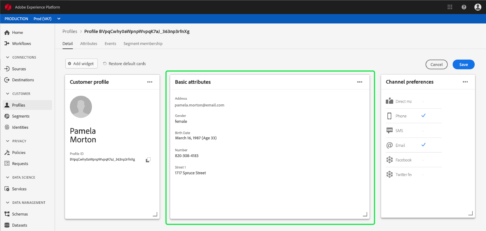

# [!DNL Real-time Customer Profile] personalização detalhada  {#profile-detail-customization}

Na interface do usuário do Adobe Experience Platform, é possível visualizar e interagir com [!DNL Real-time Customer Profile] dados no formato de perfis de clientes. As informações de perfil exibidas na interface do usuário foram unidas de vários fragmentos de perfil para formar uma única visualização de cada cliente individual. Isso inclui detalhes como atributos básicos, identidades vinculadas e preferências de canal. Os campos padrão mostrados em perfis também podem ser alterados em um nível organizacional para exibir atributos preferenciais [!DNL Profile]. Este guia fornece instruções passo a passo para personalizar a maneira como os dados [!DNL Profile] são exibidos na interface do usuário da plataforma.

Para obter um guia completo da interface do usuário de perfis, visite o [Guia da interface do usuário de perfil](user-guide.md).

## Reordenar e redimensionar cartões {#reorder-and-resize-cards}

Na guia **[!UICONTROL Detail]** do perfil do cliente, é possível selecionar **[!UICONTROL Modify dashboard]** para redimensionar e reordenar os cartões existentes.

Depois de escolher modificar o painel, você pode reorganizar os cartões selecionando o título do cartão e arrastando e soltando os cartões na ordem desejada. Você também pode redimensionar um cartão selecionando o símbolo de ângulo no canto inferior direito do cartão (`⌟`) e arrastando o cartão para o tamanho desejado. Neste exemplo, o cartão **[!UICONTROL Basic attributes]** está sendo redimensionado.

O cartão selecionado se ajusta ao tamanho desejado e as placas ao redor são reposicionadas dinamicamente. Isso pode fazer com que alguns cartões sejam movidos para linhas adicionais, o que exige a rolagem para baixo para visualizar todas as placas. Por exemplo, quando o cartão &quot;[!UICONTROL Basic attributes]&quot; é redimensionado, o cartão &quot;[!UICONTROL Linked identities]&quot; não fica mais visível na linha superior e agora aparece em uma nova segunda linha no perfil (não exibido). Para retornar o cartão &quot;[!UICONTROL Linked identities]&quot; para a linha superior, você pode arrastá-lo e soltá-lo na posição atual do cartão &quot;[!UICONTROL Channel preferences]&quot;.

## Editar e remover cartões

Além de redimensionar e reorganizar cartões, você pode editar o conteúdo de determinados cartões e remover alguns cartões totalmente do painel. Selecione os elipses (`...`) no canto superior direito do cartão para editá-lo ou removê-lo. Isso abre uma lista suspensa com opções para editar ou remover o cartão, dependendo das propriedades do cartão selecionado.

>[!NOTE]
>
>Nem todas as placas podem ser editadas ou removidas. Isso ocorre porque alguns cartões contêm informações somente leitura ou obrigatórias. Se um cartão não tiver um elipses no canto superior direito, ele conterá informações somente leitura E obrigatórias e não poderá ser editado nem removido. Se um cartão tiver elipses no canto e selecioná-lo mostrar apenas uma opção para remover o cartão, as informações do cartão serão somente leitura e não poderão ser editadas.

Selecione **[!UICONTROL Edit]** na lista suspensa para abrir o espaço de trabalho **[!UICONTROL Edit widget]**, onde você pode atualizar o título do cartão, reordenar ou remover os atributos visíveis ou adicionar atributos adicionais usando o botão **[!UICONTROL Add attributes]**.

## Adicionar atributos {#add-attributes}

Na tela **[!UICONTROL Edit widget]**, selecione **[!UICONTROL Add attributes]** no canto superior direito do cartão para começar a adicionar atributos a esse cartão.

Quando a caixa de diálogo **[!UICONTROL Select union schema field]** é aberta, o lado esquerdo da caixa de diálogo mostra o esquema de união [!UICONTROL XDM Individual Profile] completo, com campos aninhados abaixo. Para obter mais informações sobre schemas de união, consulte a seção [schemas de união do [!DNL Profile] guia do usuário](user-guide.md#union-schema).

A seção **[!UICONTROL Selected Attributes]** no lado direito da caixa de diálogo mostra os atributos incluídos atualmente no cartão que você está editando. Também é possível remover e reordenar atributos aqui. O número total de atributos selecionados é exibido, bem como o número máximo de atributos (20) que podem ser adicionados a um único cartão.

Você pode selecionar qualquer um dos campos de esquema de união disponíveis para personalizar os atributos no cartão que você está editando. Os campos selecionados são mostrados com uma marca de seleção ao lado deles e são automaticamente adicionados à lista de atributos selecionados. Depois de adicionar todos os atributos que você gostaria que fossem exibidos no cartão, escolha **[!UICONTROL Select]** para retornar à tela **[!UICONTROL Edit widget]**.

Quando você retorna à tela **[!UICONTROL Edit widget]**, a lista de atributos no cartão agora deve ser atualizada para refletir suas opções. Você ainda pode remover ou reordenar os atributos do cartão ou editar o título do cartão, conforme necessário. Depois que as edições forem concluídas, selecione **[!UICONTROL Save]** para salvar as alterações.

Depois de salvar, você volta à guia **[!UICONTROL Detail]**, onde o cartão e os atributos atualizados ficam visíveis.

## Adicionar um novo cartão {#add-a-new-card}

Para personalizar ainda mais a aparência dos perfis no Experience Platform, é possível optar por adicionar novos cartões ao painel e selecionar os atributos que deseja exibir nesses cartões. Para começar, selecione **[!UICONTROL Modify dashboard]** na guia **[!UICONTROL Detail]**.

Em seguida, selecione **[!UICONTROL Add widget]** no canto superior esquerdo do painel.

Escolher adicionar um novo cartão abre a tela **[!UICONTROL Edit widget]** onde você pode fornecer um título para o novo cartão e escolher os atributos que deseja que o cartão exiba. Para começar a adicionar atributos ao cartão, selecione **[!UICONTROL Add attributes]**.

Quando a caixa de diálogo **[!UICONTROL Select union schema field]** é aberta, o lado esquerdo da caixa de diálogo mostra o esquema de união [!UICONTROL XDM Individual Profile] completo e a seção **[!UICONTROL Selected Attributes]** no lado direito da caixa de diálogo mostra os atributos selecionados para o cartão. Para obter mais informações sobre como adicionar atributos, consulte a seção [sobre como adicionar atributos](#add-attributes) que aparece anteriormente neste documento.

O número total de atributos selecionados é exibido, bem como o número máximo de atributos (20) que podem ser adicionados a um único cartão. Também é possível remover e reordenar os atributos selecionados nessa tela. Depois de adicionar todos os atributos que deseja exibir no cartão, escolha **[!UICONTROL Select]** para retornar à tela **[!UICONTROL Edit widget]**.

Quando você retorna à tela **[!UICONTROL Edit widget]**, a lista de atributos no cartão deve refletir suas opções na tela anterior. Você também pode reordenar e remover atributos do cartão, conforme necessário.

Para salvar seu novo cartão, primeiro você deve fornecer um **[!UICONTROL Card title]**, depois você poderá selecionar **[!UICONTROL Save]** e concluir o processo de criação do cartão.

Depois de salvar, você volta à guia **[!UICONTROL Detail]**, onde o novo cartão e atributos ficam visíveis.

## Restaurar cartões padrão

Se, a qualquer momento, você decidir que deseja restaurar os cartões padrão que foram removidos, você terá a capacidade de fazer isso rápida e facilmente. Primeiro, selecione **[!UICONTROL Modify dashboard]** e depois selecione **[!UICONTROL Restore default cards]**. Quando os cartões padrão estiverem visíveis, você poderá selecionar **[!UICONTROL Save]** para salvar suas alterações ou selecionar **[!UICONTROL Cancel]** se não quiser restaurar os cartões padrão.

## Próximas etapas

Ao seguir este documento, você agora deve ser capaz de atualizar a visualização do perfil de sua organização, incluindo adicionar e remover cartões, editar detalhes e atributos do cartão, além de reorganizar e redimensionar cartões. Para saber mais sobre como trabalhar com dados [!DNL Profile] na interface do usuário do Experience Platform, consulte o [[!DNL Profile] guia do usuário](user-guide.md).
