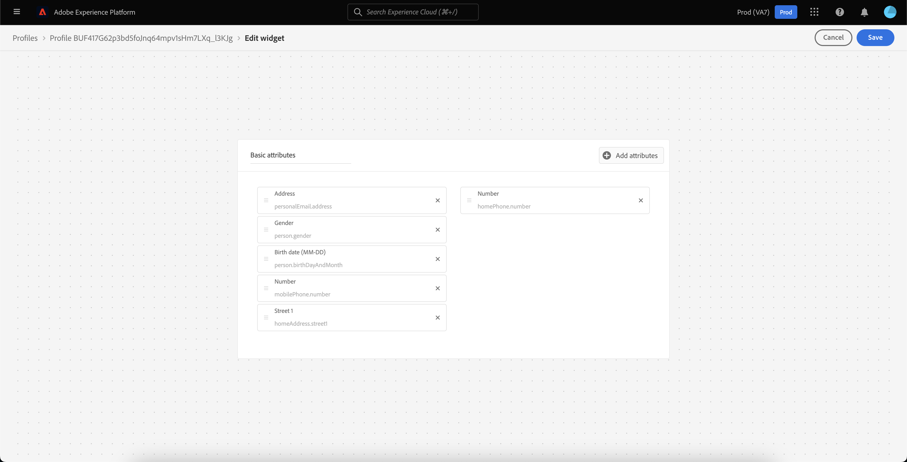
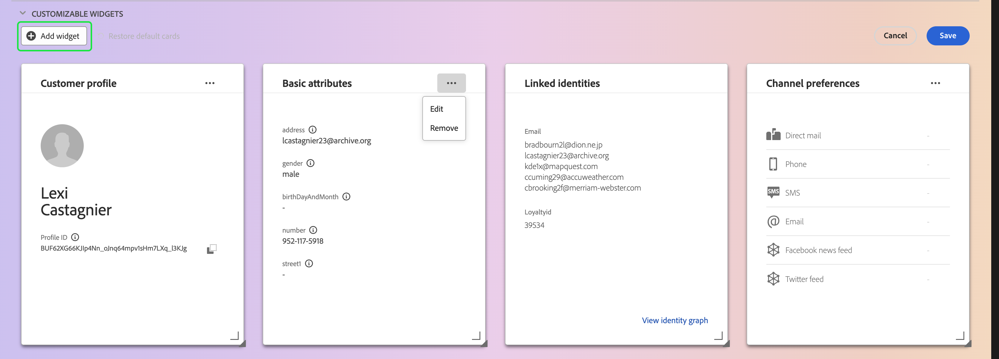

# Personalização de detalhes de [!DNL Real-Time Customer Profile] {#profile-detail-customization}

Na interface do usuário do Adobe Experience Platform, você pode visualizar e interagir com os dados do [!DNL Real-Time Customer Profile] na forma de perfis de clientes. As informações de perfil exibidas na interface do usuário foram mescladas de vários fragmentos de perfil para formar uma única visualização de cada cliente individual. Isso inclui detalhes como atributos básicos, identidades vinculadas e preferências de canal. Os campos padrão mostrados em perfis também podem ser alterados em um nível organizacional para exibir atributos [!DNL Profile] preferenciais. Este guia fornece instruções passo a passo para personalizar a forma como os dados do [!DNL Profile] são exibidos na interface do Experience Platform.

Para obter um guia completo sobre a interface do usuário de perfis, visite o [Guia da interface do usuário de perfis](user-guide.md).

## Reordenar e redimensionar cartões {#reorder-and-resize-cards}

Na guia **[!UICONTROL Detail]** do perfil do cliente, você pode selecionar **[!UICONTROL Personalizar detalhes do perfil]** para redimensionar e reordenar cartões existentes.

Depois de optar por modificar o painel, é possível reordenar os cartões selecionando o título do cartão e arrastando e soltando os cartões na ordem desejada. Você também pode redimensionar um cartão selecionando o símbolo de ângulo no canto inferior direito do cartão (`⌟`) e arrastando o cartão para o tamanho desejado. Neste exemplo, o cartão **[!UICONTROL Atributos básicos]** está sendo redimensionado.

A placa selecionada se ajusta ao tamanho desejado e as placas ao redor são reposicionadas dinamicamente. Isso pode fazer com que alguns cartões sejam movidos para linhas adicionais, exigindo que você role para baixo para ver todos os cartões. Por exemplo, quando o cartão &quot;[!UICONTROL Atributos básicos]&quot; é redimensionado, o cartão &quot;[!UICONTROL Identidades vinculadas]&quot; não fica mais visível na linha superior e agora aparece em uma nova segunda linha do perfil (não exibido). Para retornar o cartão &quot;[!UICONTROL Identidades vinculadas]&quot; para a linha superior, você pode arrastá-lo e soltá-lo na posição atual do cartão &quot;[!UICONTROL Preferências de canal]&quot;.

## Editar e remover cartões

Além de redimensionar e reordenar cartões, você pode editar o conteúdo de determinados cartões e remover alguns cartões totalmente do painel. Selecione as reticências (`...`) no canto superior direito do cartão para editá-lo ou removê-lo. Isso abre uma lista suspensa com opções para editar ou remover o cartão, dependendo das propriedades do cartão selecionado.

>[!NOTE]
>
>Nem todos os cartões podem ser editados ou removidos. Isso ocorre porque alguns cartões contêm informações somente leitura ou obrigatórias. Se um cartão não tiver elipses no canto superior direito, ele conterá informações somente leitura E necessárias e não poderá ser editado nem removido. Se um cartão tiver elipses no canto e selecioná-lo mostrar apenas uma opção para remover o cartão, as informações do cartão serão somente leitura e não poderão ser editadas.

Selecione **[!UICONTROL Editar]** na lista suspensa para abrir o espaço de trabalho **[!UICONTROL Editar widget]**, no qual você pode atualizar o título do cartão, reordenar ou remover os atributos visíveis ou adicionar outros atributos usando o botão **[!UICONTROL Adicionar atributos]**.

## Adicionar atributos {#add-attributes}

Na tela **[!UICONTROL Editar widget]**, selecione **[!UICONTROL Adicionar atributos]** no canto superior direito do cartão para começar a adicionar atributos a ele.

Quando a caixa de diálogo **[!UICONTROL Selecionar campo de esquema de união]** for aberta, o lado esquerdo da caixa de diálogo mostrará o esquema de união completo do [!UICONTROL Perfil individual XDM], com campos aninhados abaixo. Para obter mais informações sobre esquemas de união, consulte a [seção esquemas de união do [!DNL Profile] guia do usuário](user-guide.md#union-schema).

A seção **[!UICONTROL Atributos Selecionados]** no lado direito da caixa de diálogo mostra os atributos incluídos atualmente no cartão que você está editando. Também é possível remover e reordenar atributos aqui. O número total de atributos selecionados é exibido, bem como o número máximo de atributos (20) que podem ser adicionados a um único cartão.

Selecione qualquer um dos campos de esquema de união disponíveis para personalizar os atributos no cartão que você está editando. Ao selecionar os campos, você pode optar por ver o nome do caminho do arquivo ou o nome de exibição. Para alternar entre essas duas exibições, selecione a opção **[!UICONTROL Mostrar nomes para exibição]**.

![A opção [!UICONTROL Mostrar nomes para exibição] está realçada na página Detalhes do perfil.](../images/profile-customization/show-display-names.png)

Os campos selecionados são mostrados com uma marca de seleção ao lado deles e são adicionados automaticamente à lista de atributos selecionados. Depois de adicionar todos os atributos que você gostaria que fossem exibidos no cartão, escolha **[!UICONTROL Selecionar]** para retornar à tela **[!UICONTROL Editar widget]**.

Ao retornar para a tela **[!UICONTROL Editar widget]**, a lista de atributos no cartão agora deve ser atualizada para refletir suas escolhas. Você ainda pode remover ou reordenar os atributos do cartão ou editar o título do cartão, conforme necessário. Quando as edições forem concluídas, selecione **[!UICONTROL Salvar]** para salvar as alterações.

Depois de salvar, você retornará à guia **[!UICONTROL Detalhes]**, onde o cartão atualizado e os atributos ficam visíveis.

## Adicionar um novo cartão {#add-a-new-card}

Para personalizar ainda mais a aparência dos perfis no Experience Platform, você pode optar por adicionar novos cartões ao painel e selecionar os atributos que deseja exibir nesses cartões. Para começar, selecione **[!UICONTROL Modificar painel]** na guia **[!UICONTROL Detalhes]**.

Em seguida, selecione **[!UICONTROL Adicionar widget]** no canto superior esquerdo do painel.

Escolher adicionar um novo cartão abre a tela **[!UICONTROL Editar widget]**, onde você pode fornecer um título para o novo cartão e escolher os atributos que deseja que o cartão exiba. Para começar a adicionar atributos ao cartão, selecione **[!UICONTROL Adicionar atributos]**.

Quando a caixa de diálogo **[!UICONTROL Selecionar campo de esquema de união]** for aberta, o lado esquerdo da caixa de diálogo mostrará o esquema de união completo do [!UICONTROL Perfil individual XDM] e a seção **[!UICONTROL Atributos selecionados]** no lado direito da caixa de diálogo mostrará os atributos selecionados para o cartão. Para obter mais informações sobre como adicionar atributos, consulte a [seção sobre como adicionar atributos](#add-attributes), exibida anteriormente neste documento.

O número total de atributos selecionados é exibido, bem como o número máximo de atributos (20) que podem ser adicionados a um único cartão. Você também pode remover e reordenar os atributos selecionados nesta tela. Depois de ter adicionado todos os atributos que gostaria de exibir no cartão, escolha **[!UICONTROL Selecionar]** para retornar à tela **[!UICONTROL Editar widget]**.

Quando você retornar à tela **[!UICONTROL Editar widget]**, a lista de atributos no cartão deverá refletir suas escolhas da tela anterior. Também é possível reordenar e remover atributos do cartão, conforme necessário.

Para salvar seu novo cartão, primeiro forneça um **[!UICONTROL título do cartão]**, depois selecione **[!UICONTROL Salvar]** e conclua o processo de criação do cartão.

Depois de salvar, você retornará à guia **[!UICONTROL Detalhes]**, onde o novo cartão e os novos atributos estarão visíveis.

## Restaurar cartões padrão

Se, a qualquer momento, você decidir que deseja restaurar os cartões padrão que foram removidos desde então, poderá fazê-lo de forma rápida e fácil. Primeiro, selecione **[!UICONTROL Modificar painel]** e, em seguida, selecione **[!UICONTROL Restaurar cartões padrão]**. Quando os cartões padrão estiverem visíveis, você poderá selecionar **[!UICONTROL Salvar]** para salvar suas alterações ou selecionar **[!UICONTROL Cancelar]** se não quiser restaurar os cartões padrão.

## Próximas etapas

Ao seguir esse documento, agora você pode atualizar a visualização de perfil da sua organização, incluindo adicionar e remover cartões, editar detalhes e atributos do cartão e reordenar e redimensionar cartões. Para saber mais sobre como trabalhar com dados do [!DNL Profile] na interface do Experience Platform, consulte o [[!DNL Profile] guia do usuário](user-guide.md).
