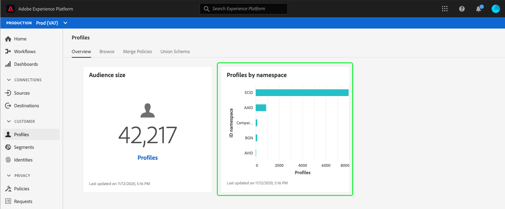

# (Alfa) [!DNL Real-time Customer Profile] painel {#profile-dashboard}

>[!IMPORTANT]
>
>A funcionalidade do painel descrita neste documento está atualmente em alfa e não está disponível para todos os usuários. A documentação e a funcionalidade estão sujeitas a alterações.

A interface do usuário do Adobe Experience Platform (UI) fornece um painel através do qual você pode visualização informações importantes sobre seus dados [!DNL Real-time Customer Profile], conforme capturados durante um instantâneo diário. Este guia descreve como acessar e trabalhar com o painel [!DNL Profile] na interface do usuário e fornece mais informações sobre as métricas exibidas no painel.

Para obter uma visão geral de todos os recursos do Perfil na interface do usuário do Experience Platform, visite o [Guia da interface do usuário do Perfil do cliente em tempo real](user-guide.md).

## Dados do painel do perfil

O painel do Perfil exibe um instantâneo dos dados do atributo (registro) que sua organização tem dentro da loja do Perfil no Experience Platform. O instantâneo não inclui nenhum dado de evento (série cronológica).

Os dados do atributo no instantâneo mostram os dados exatamente como aparecem no momento específico em que o instantâneo foi realizado. Em outras palavras, o instantâneo não é uma aproximação ou amostra dos dados, e o painel do Perfil não está sendo atualizado em tempo real.

>[!NOTE]
>
>Quaisquer alterações ou atualizações feitas nos dados desde que o instantâneo foi realizado não serão refletidas no painel até que o próximo instantâneo seja realizado.

As métricas exibidas no painel do Perfil têm por base a política de mesclagem padrão da sua organização. Para obter mais informações sobre políticas de mesclagem e como selecionar ou alterar sua política de mesclagem padrão, visite o [guia da interface do usuário das políticas de mesclagem](merge-policies.md).

## Como explorar o painel do Perfil

Para navegar até o painel do Perfil na interface do usuário da plataforma, selecione **[!UICONTROL Perfis]** no painel esquerdo, em seguida, selecione a guia **[!UICONTROL Visão geral]** para exibir o painel.

### Widgets e métricas

O painel é composto de widgets, que são métricas somente leitura que fornecem informações importantes sobre os dados do Perfil. A data e a hora &quot;última atualização&quot; no widget mostram quando o último instantâneo dos dados foi realizado.

## Widgets disponíveis

O Experience Platform fornece vários widgets que você pode usar para visualizar diferentes métricas relacionadas aos dados do Perfil. Selecione o nome de um widget abaixo para saber mais:

* [[!UICONTROL tamanho da audiência]](#audience-size)
* [[!UICONTROL Perfis por namespace]](#profiles-by-namespace)

### [!UICONTROL tamanho da audiência] {#audience-size}

O widget **[!UICONTROL Audiência size]** exibe o número total de perfis unidos no armazenamento de dados do Perfil no momento em que o snapshot foi realizado. Esse número é o resultado da aplicação da política de mesclagem padrão da sua organização aos dados do Perfil para unir os fragmentos do perfil e formar um único perfil para cada indivíduo.

Para obter mais informações sobre fragmentos e perfis mesclados, comece lendo a seção *fragmentos de Perfil vs perfis mesclados* da [visão geral do Perfil](../home.md).

>[!NOTE]
>
>A política de mesclagem usada para calcular essa métrica não é a mesma que a política de mesclagem gerada pelo sistema usada para calcular [!UICONTROL audiências endereçáveis] no painel [!UICONTROL Uso da licença], portanto, a contagem de audiências nos painéis [!DNL Profile] e [!UICONTROL Uso da licença] não é exatamente a mesma.

### [!UICONTROL Perfis por namespace] {#profiles-by-namespace}

O widget **[!UICONTROL Perfis por namespace]** exibe o detalhamento das namespaces em todos os perfis mesclados em sua loja de Perfis. O número total de perfis por [!UICONTROL namespace de ID] (em outras palavras, adicionar os valores mostrados para cada namespace) sempre será maior que o número total de perfis de mesclagem, pois um perfil pode ter várias namespaces associadas a ele. Por exemplo, se um cliente interagir com sua marca em mais de um canal, várias namespaces serão associadas a esse cliente individual.

Para saber mais sobre namespaces de identidade, visite a [documentação do Adobe Experience Platform Identity Service](../../identity-service/home.md).

## Painéis adicionais

A interface do usuário da plataforma fornece painéis adicionais para visualizar instantâneos de seus dados no Experience Platform. Esses painéis incluem segmentação e uso de licença. Para obter mais informações sobre esses painéis adicionais, selecione um dos seguintes links:

* [Painel do segmento](../../segmentation/ui/segment-dashboard.md)
* [Painel de uso de licença](../../landing/license-usage-dashboard.md)

## Próximas etapas

Ao seguir este documento, você deve agora ser capaz de localizar o painel do Perfil e entender as métricas exibidas nos widgets disponíveis. Para saber mais sobre como trabalhar com [!DNL Profile] dados na interface do usuário do Experience Platform, consulte o [[!DNL Profile] guia da interface do usuário](user-guide.md).