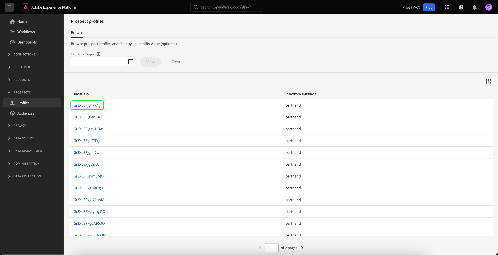

# Perfis de cliente potencial

A Adobe Experience Platform permite gerar experiências coordenadas, consistentes e relevantes para seus clientes, independentemente de onde ou quando eles interagem com sua marca.

Os perfis de cliente potencial são usados para representar pessoas que ainda não se envolveram com a sua empresa, mas que você deseja contatar. Com perfis de prospecto, você pode complementar seus perfis de clientes com atributos de parceiros de terceiros confiáveis.

## Navegar {#browse}

Para acessar perfis de cliente potencial, selecione **[!UICONTROL Perfis]** no **[!UICONTROL Clientes potenciais]** seção.

A variável **[!UICONTROL Procurar]** é exibida. Uma lista de todos os perfis de cliente potencial da sua organização é exibida.

![A variável [!UICONTROL Perfis] for realçado, exibindo a variável [!UICONTROL Procurar] página para perfis de cliente potencial.](../images/prospect-profile/browse-profiles.png)

>[!IMPORTANT]
>
>Embora a maior parte da funcionalidade de navegação entre perfis de clientes e perfis de clientes potenciais seja a mesma, você **não é possível** procurar perfis de cliente potencial por política de mesclagem. Isso ocorre porque os perfis de clientes potenciais são regidos automaticamente por uma política de mesclagem baseada no tempo projetada pelo sistema. Mais informações sobre políticas de mesclagem podem ser encontradas no [visão geral da política de mesclagem](../merge-policies/overview.md).

Para obter mais informações sobre perfis de navegação, leia a [seção procurar do guia do usuário Perfil](./user-guide.md#browse-identity).

## Detalhes do perfil de cliente potencial {#profile-details}

>[!IMPORTANT]
>
>Um perfil de cliente potencial expirará automaticamente após 25 dias de residência no Adobe Experience Platform.

Para exibir mais informações sobre um perfil de cliente potencial específico, selecione um perfil na [!UICONTROL Procurar] página.

São exibidas informações sobre o perfil de cliente potencial, incluindo os atributos associados ao perfil e à associação de público-alvo.

Para obter mais informações sobre essas guias, leia a [exibir a seção Detalhes do perfil do guia do usuário Perfil](./user-guide.md#profile-detail).

Você também pode ver todos os atributos no formato JSON selecionando **[!UICONTROL Exibir JSON]**.

![A variável [!UICONTROL Exibir JSON] O botão é realçado na página de detalhes do perfil do cliente potencial.](../images/prospect-profile/profile-select-view-json.png)

A variável [!UICONTROL Exibir JSON] será exibida. Os atributos do perfil do cliente potencial agora são exibidos no formulário JSON.

## Casos de uso sugeridos {#use-cases}

Para saber como você pode usar a funcionalidade de perfis de cliente potencial no Experience Platform em combinação com outra funcionalidade da Platform, leia a documentação do caso de uso a seguir:

- [Envolver e adquirir novos clientes por meio da funcionalidade de prospecção](../../rtcdp/partner-data/prospecting.md)

## Próximas etapas

Depois de ler este guia, você entenderá como os perfis de cliente potencial podem ser usados no Adobe Experience Platform. Para saber como esses perfis de cliente potencial podem ser usados em públicos-alvo, leia o [guia de públicos-alvo de clientes potenciais](../../segmentation/ui/prospect-audience.md).
