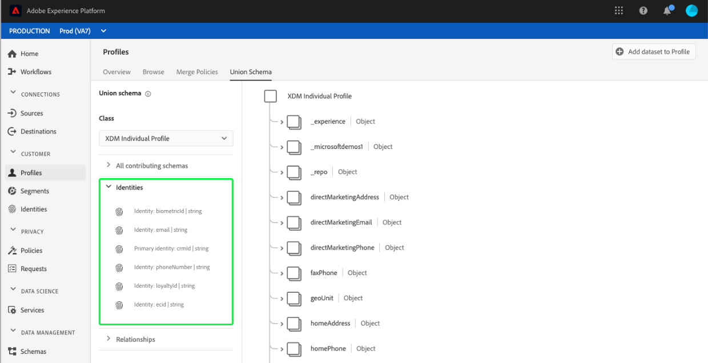

# [!UICONTROL Union schema] Guia da interface do usuário

Na interface do usuário do Adobe Experience Platform (UI), é possível visualizar facilmente qualquer esquema de união em sua organização e visualizar os campos, identidades, relacionamentos e esquemas de contribuição de uma classe específica. Este guia fornece informações detalhadas sobre como visualizar e explorar schemas de união usando a interface do usuário da plataforma.

## Introdução

Este guia da interface do usuário requer uma compreensão dos vários serviços [!DNL Experience Platform] envolvidos no gerenciamento de dados do Perfil do cliente em tempo real. Antes de ler este guia ou trabalhar na interface do usuário, revise a documentação dos seguintes serviços:

* [[!DNL Real-time Customer Profile]](../home.md): Fornece um perfil de consumidor unificado e em tempo real com base em dados agregados de várias fontes.
* [[!DNL Identity Service]](../../identity-service/home.md): Permite  [!DNL Real-time Customer Profile] por meio da ligação de identidades de diferentes fontes de dados, à medida que são assimiladas no  [!DNL Platform].
* [[!DNL Experience Data Model (XDM)]](../../xdm/home.md): A estrutura padronizada pela qual  [!DNL Platform] organiza os dados de experiência do cliente.

## Noções básicas sobre schemas de união

O Perfil do cliente em tempo real permite criar perfis robustos e centralizados contendo atributos do cliente e eventos com carimbos de data e hora para cada interação do cliente em sistemas integrados com o Adobe Experience Platform. O formato e a estrutura desses dados são fornecidos pelos esquemas do Experience Data Model (XDM), com cada schema sendo baseado em uma classe XDM e contendo campos compatíveis com essa classe.

Os esquemas podem ser criados para vários casos de uso, fazendo referência à mesma classe, mas contendo campos específicos para seu uso. Quando um schema é ativado para Perfil, ele se torna parte de um schema de união. Em outras palavras, os esquemas de união são compostos de vários esquemas que compartilham a mesma classe e foram habilitados para o Perfil. O schema union permite ver uma combinação de todos os campos contidos em schemas que compartilham a mesma classe. O Perfil do cliente em tempo real usa o schema de união para criar uma visualização holística de cada cliente individual.

Trabalhar com schemas de união requer uma compreensão profunda dos esquemas XDM. Para obter mais informações, comece lendo as [noções básicas da composição do schema](../../xdm/schema/composition.md).

## Exibir esquemas de união

Para navegar até esquemas de união na interface do usuário da plataforma, selecione **[!UICONTROL Profiles]** na navegação à esquerda e selecione a guia **[!UICONTROL Union Schema]**. A guia [!UICONTROL Union Schema] é aberta para exibir o schema de união para a classe selecionada no momento.

## Selecionar uma classe

Para exibir o schema de união para uma classe XDM específica, selecione a classe na lista suspensa **[!UICONTROL Class]**. Devido ao fato de nem todas as classes terem esquemas de união, somente as classes com esquemas de união (ou seja, classes com esquemas que foram habilitados para Perfil) estão disponíveis na lista suspensa.

Depois que uma classe é selecionada, o schema exibido é atualizado para refletir o schema de união para a classe selecionada. Por exemplo, você pode selecionar **[!UICONTROL XDM Individual Profile]** para exibir o schema de união para essa classe.

## Explorar schemas de união

Você pode explorar o schema de união rolando para cima e para baixo para visualizar a estrutura completa do schema e selecionando um colchete de ângulo direito (`>`) para expandir campos aninhados.

Selecione qualquer campo para exibir seus detalhes, incluindo nome de exibição, tipo de dados, descrição, caminho, data criada e data da última modificação. Também é possível exibir uma lista de schemas de contribuição contendo o campo selecionado.

Selecionar o nome de um schema de contribuição revela os nomes dos conjuntos de dados relacionados a esse schema que estão assimilando dados no campo selecionado. Cada nome do conjunto de dados é exibido como um link. Selecionar um nome de conjunto de dados abre a guia atividade para esse conjunto de dados em uma nova janela.

Para obter mais informações sobre conjuntos de dados, incluindo a visualização da atividade do conjunto de dados e a visualização dos dados do conjunto de dados na interface do usuário, visite o [guia da interface do usuário dos conjuntos de dados](../../catalog/datasets/user-guide.md).

## Exibir esquemas de contribuição

Você também pode visualizar quais schemas específicos estão contribuindo para o schema de união selecionando **[!UICONTROL All contributing schemas]** para expandir a lista de schemas. Dependendo da classe selecionada e do número de schemas que sua organização criou no Platform, pode ser uma lista curta contendo um único schema ou uma lista longa contendo muitos schemas.

Selecionar o nome de um schema específico destaca os campos dentro do schema de união que fazem parte do schema selecionado. Depois que um schema é selecionado, o schema de união aparece esmaecido com barras pretas, indicando os campos que fazem parte do schema de contribuição.

## Exibir identidades

Por meio da interface do usuário, é possível visualizar uma lista de identidades incluídas no schema da união selecionando **[!UICONTROL Identities]** para expandir a lista.

Selecionar uma identidade individual na lista faz com que o schema exibido seja atualizado automaticamente conforme necessário para exibir o campo de identidade. Isso pode incluir a expansão de vários campos se o campo de identidade estiver aninhado.

O campo de identidade é realçado no schema da união e os detalhes da identidade são exibidos no lado direito da tela. Os detalhes incluem uma lista de esquemas de contribuição que contêm o campo de identidade e você pode fazer drill-down para localizar links para os conjuntos de dados relacionados a esse esquema que estão assimilando dados no campo de identidade selecionado.

## Exibir relacionamentos

A interface do usuário do schema de união também permite ver relacionamentos que foram definidos para esquemas com base na classe de esquema selecionada. Definir um relacionamento é uma maneira de conectar dois schemas pertencentes a classes diferentes para obter insights mais complexos sobre os dados do cliente.

Se os relacionamentos tiverem sido estabelecidos para a classe selecionada, selecionar **[!UICONTROL Relationships]** exibe uma lista de campos usados para criar relacionamentos. Nem todos os schemas usam ou precisam de relacionamentos definidos, portanto, é comum que a seção de relacionamentos não contenha nenhum campo.

Para saber mais sobre relações de esquema, incluindo como defini-las usando a interface do usuário, visite [este documento sobre relações de esquema](../../xdm/tutorials/relationship-ui.md).

Selecionar um campo de relacionamento na lista faz com que o schema exibido seja atualizado conforme necessário para exibir o campo de relacionamento destacado. Isso pode incluir a expansão de vários campos se o campo de relacionamento estiver aninhado.

## Próximas etapas

Ao ler este guia, agora você sabe como visualizar e navegar pelos esquemas de união usando a interface [!DNL Experience Platform]. Para obter mais informações sobre schemas, incluindo como eles são usados em toda a plataforma, comece lendo a [Visão geral do sistema XDM](../../xdm/home.md).
